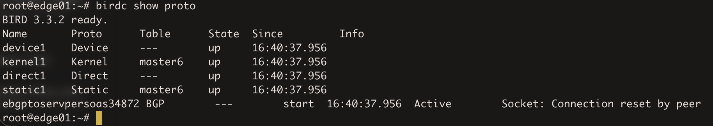
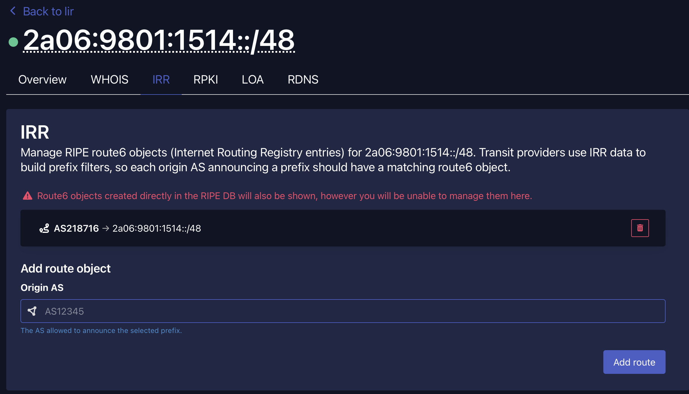
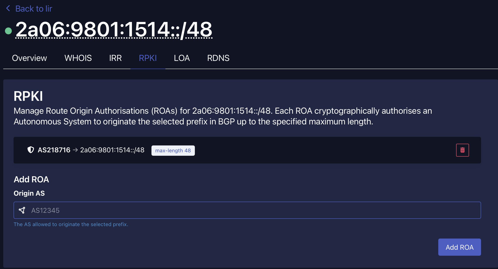

### Basically I wanted to set up a sample config on the Dusseldorf VPS to see if the BGP session establishes.   

I wrote a basic BIRD config, started BIRD on the VPS and saw that the status of the BGP protocol was `Socket: Connection reset by peer`.   

    

But in short it turns out everything was set up correctly and the issue is the lack of route6 object in RIPE DB, so I though that I would show here just how simple that is.   

I already sent a ticket to Servperso to inquire about this issue as I just wanted to clarify if everything on my side is correct.   

Since my sponsoring LIR is Lagrange Cloud, I have to do this via their panel, as the creation of a new route6 object in RIPE DB returns an error `Authorisation for [inet6num] 2a06:9801:1514::/48 failed using "mnt-by:" not authenticated by: LAGRANGE-AUTO-MNT`.   

In Lagrange Cloud's panel I had to go to LIR Resources > Your IPs > 2a06:9801:1514::/48 > View > IRR and there just add my AS as the one allowed to originate that prefix:   

    

And also I added a ROA for RPKI:   

    

So at the time of writing this, I just have to wait for Servperso's BGP manager to catch the newly created route6 object.    
