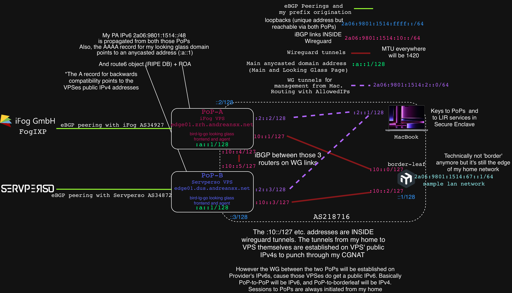

# Notes directly regarding the AS  

|resource |status|
|:-|:-|
|ASN|Pending|
|Sponsoring LIR|Pending|
|PoP-A|pending|
|PoP-B|activated|

I would like to add PTR records for my PoPs, so I would use `edge01.zrh.andreansx.net` for PoP-A, and `edge01.dus.andreansx.net`.   
Looking glass will be at `lg.andreansx.net`    

I'll place security notes in here rather than in [projects](../projects/).   

## Diagram 

   

As of now, Servperso VPS is activated, iFog VPS is pending.   

Servperso VPS is a Basic tier with 2 vCores, 2GB RAM, 15GB SSD, 500Mbps with IPv4 and IPv6 public IPs for 28,66 EUR quarterly.   
iFog VPS is a Switzerland Ryzen G2 with 2 AMD Ryzen Shared Cores, 2GB RAM, 50GB NVMe SSD and also a public IPv4 and IPv6 and up to 8TB traffic monthly at up to 10Gbps for 10 CHF a month.   

## Docs

* [Why not Vultr or BGPTunnel and Oracle Always-Free VPS](./00-vultr-bgptunnel-oci.md)   
* [Decisions on the sponsoring LIR](./01-LIR.md)   
* [Why 2GB of RAM on iFog VPS because of comfort and FogIXP](./02-vps-memory-bgp-full-table.md)    
* [Why not HTTP-01 and why DNS-01 and acme.sh/lego due to anycast](./03-anycast-dns01-acmesh-lego.md)    

