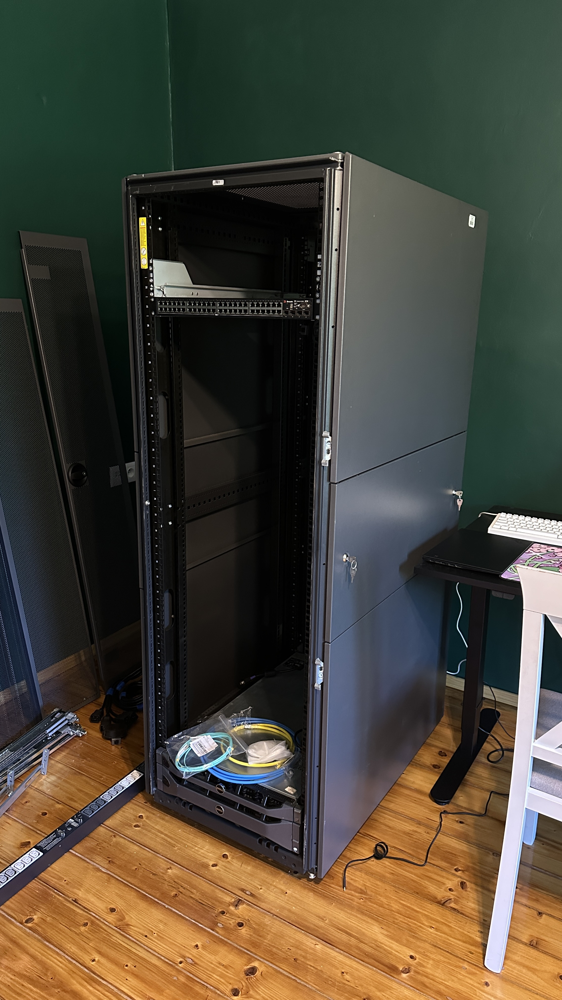

<h1>  Networking Lab - Centre   </h1>

<h4>Welcome to my networking lab centre. This is a repository dedicated to be a main overview of my lab. All specific scenarios, deployments etc. will be placed in their own repositories and links to them will be available here</h4>
<h4>I am building this repository because I want to document everything I do on my path to study network engineering, server administration and cloud infrastructure. That is what I am aiming to do at work in the future</h4>
<h3>Tools and Technologies</h3>

<h3>What you will find here:</h3>

- Latest **'stable'** configuration files of devices
- Images
- Manual installations
- Links to external repositories with specific projects

<h2>Manual installations</h2>

Here you can find the list of links to manual installs in my lab.

 **[Server rack install](./installs/installation-rack/)**  
 **[Copper and keystones install](./installs/installation-keystones/)**

<h2>Featured external related repositories</h2>
Here are links to related projects that happen in this environment.   

**[Unbound DNS Resolver](https://github.com/andreansx/unbound-homelab)**  
**[Simple VLANs](https://github.com/andreansx/routeros-simple-vlans)**  
**[Netmiko first experiments](https://github.com/Andreansx/netmiko-experimenting)**  
**[Nginx web server setup](https://github.com/Andreansx/proxmox-nginx-vm-setup)**  

<h2>Hardware</h2>
Below, you can look at general overview of the devices that my lab consists of
 

### **[Server rack](./hpe-10636-g2/readme.md)**

#### My server rack is a **Hewlett Packard Enterprise ASSY 10636 G2**.

### Servers

##### **[Dell PowerEdge R710](./r710/)**
**Really old server. However, for now it is enough, for simple tasks despite being insanely power-hungry. Running Proxmox VE 8.4.0**

##### **[Dell PowerEdge R610](./r610/)**
**This one can be considered as garbage. Single Intel Xeon E5520 with 36 Gigabytes of DDR3 RAM. I will give it away to someone probably.**
### Network devices

##### **[MikroTik CCR2004-1G-12S+2XS](./ccr2004/)**
**Main lab router. Excellent for learning from basic technologies to advanced protocols like OSPF, BGP etc. Overkill for my needs**

##### **[MikroTik CRS326-24S+2Q+RM](./crs326/)**
**Core switch in the lab, capable of L3 functionality. 24 SFP+ ports along with 2 QSFP+ offer a lot of possibilities. Also overkill for this lab**

##### **[Brocade FastIron LS648](./ls648/)**
**Not used. Capable of base L3 functionality with L3 Lite firmware after some tinkering with EEPROM chips.**

<h3>Contact</h3>

