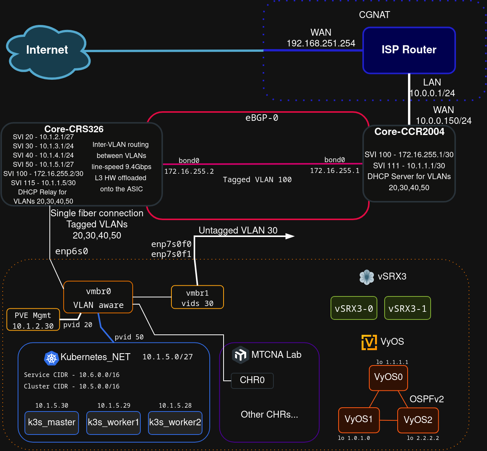

# Lab for learning

This repository serves as a documentation of infrastructure, configurations, projects etc. that take place in my lab as a way of developing skills that are neccesary in my dream field of work. I would love to work in a datacenter environment, especially in things like backbone engineering and server administration.  

## Table of Contents
1.  [Live Projects](#live-projects)
2.  [How This Repository Is Organized](#how-this-repository-is-organized)
3.  [Lab Architecture](#lab-architecture)
    *   [Network Diagram](#network-diagram)
    *   [VLAN & IP Schema](#vlan—ip-schema)
4.  [Hardware](#hardware)
5.  [Projects](#projects)
6.  [Physical Build Log](#physical-build-log)
7.  [Contact](#contact)

# Live projects

Here are listed things that I’m currently working on.

- **[IPv6](./IPv6/)** - **This is what I am most focused on.** You can check out this directory to see what I'm doing on my way to get a IPv6 routed /64 block (or maybe even /48 )

- [Enabling VLAN30 access with a Dual-Port 10GbE NIC](./projects/vlan30-access-with-nic)

- [LXC with RouterOS Wiki Local mirror](./IaC/terraform_routeros_wiki_lxc/)

## How This Repository Is Organized

This repository is structured to be a clear and useful reference. Here’s a map of the key directories:

*   **/[device-name]/** (e.g., [`./ccr2004/`](./ccr2004/), [`./r710/`](./r710/)): Contains the latest configuration files and documentation for each piece of hardware. This is the source of truth for device settings.
*   **`/IaC/`**: Holds all Infrastructure as Code projects, primarily using Terraform to automate deployments on Proxmox.
*   **`/docs/`**: Contains details about plans for improving the lab. For example a better addressation plan

## Lab Architecture

### Network Diagram

This diagram shows the physical and logical topology of the lab.

## VLAN & IP Schema

The network is segmented using VLANs. The core is built on a **MikroTik CCR2004** router and a **CRS326** switch.  

| VLAN ID | Name         | Subnet / IP Scheme | Description                        |
|:--- |:---|:---|:---|
| 10      | Management   | `10.100.10.0/28`    | Network for management interfaces for example the core router or core swicth (CPU address).                                              |
| 20      | Bare-metal   | `10.100.10.16/28`    | Network for physical servers and devices. The Proxmox VE web panel is here at `10.100.10.18` (untagged on a hybrid port). |
| 30      | Users        | `10.100.30.0/24`    | Main network for end-user devices like laptops and phones.                                                                               |
| 40      | VMs-CTs      | `10.100.40.0/24`    | Dedicated network for VMs and Containers on the Proxmox host. Traffic is tagged and carried over the hybrid SFP+ port on the core switch. |
| 50      | Active Directory | `10.100.50.0/24`    | Network dedicated for experimenting with Windows Server Active Directory technology |

## Hardware

A list of the key components in my lab. Click a device name to see its configuration files.

| Device Type      | Model                                   | Role in the Lab                                   |
|:---|:---|:---|
| **Server Rack**  | [HPE 10636 G2](./hpe-10636-g2/)         | Central mounting point for all equipment.         |
| **Server**       | [Dell PowerEdge R710](./r710/)          | Main virtualization host, running Proxmox VE.     |
| **Server**       | [Dell PowerEdge R610](./r610/)          | Currently unused, planned for a giveaway.         |
| **Core Router**  | [MikroTik CCR2004](./ccr2004/)           | Core router. Handles inter-VLAN routing and NAT.       |
| **Core Switch**  | [MikroTik CRS326](./crs326/)           | Main switch, VLAN handling, L2/L3 switching. |
| **Switch**| [Brocade FastIron LS648](./ls648/)      | A device for testing and L3 firmware experimentation.      |
| **PDU**          | [HP S1132](./hpe-s1132/)                | Enterprise-grade Power Distribution Unit.                  |

## Projects

This is where the real learning happens. Here are some of the things I’ve built or am currently working on.

### Infrastructure as Code (IaC)

*   **[Terraform RouterOS Wiki LXC](./IaC/terraform_routeros_wiki_lxc/)**: Deploys a local copy of the MikroTik Wiki in an LXC using Terraform.
*   **[Terraform First Deployment](./IaC/terraform_first_deployment/)**: My initial project for deploying a simple CentOS LXC on Proxmox.

### Guides & External Repositories

*   **[Unbound DNS Resolver (repo)](https://github.com/andreansx/unbound-homelab)**: WIP - Deployment of a recursive DNS server for the lab.
*   **[Simple VLANs on RouterOS (repo)](https://github.com/andreansx/routeros-simple-vlans)**: A guide to basic VLAN configuration on MikroTik devices.

## Physical Build Log

See how the lab was physically assembled and cabled.

*   **[Server Rack Installation](./installs/installation-rack/)**
*   **[Cabling and Keystone Jack Installation](./installs/installation-keystones/)**

—

## Contact

