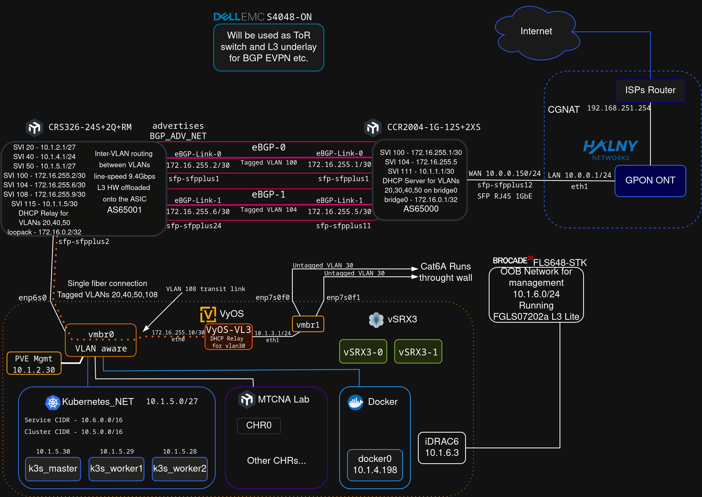

# Networking Homelab - Documentation Hub

Welcome to the documentation hub for my home lab. This repository serves as the main overview of the infrastructure, configurations, and projects I'm working on as I develop my skills towards a career in network engineering, server administration, and cloud solutions.

### Tools and Technologies

---

## Table of Contents

1.  **[Repository Guide](#repository-guide)**
2.  [Hardware](#hardware)
3.  [Lab Architecture](#lab-architecture)
    *   [Network Diagram](#network-diagram)
    *   [Logical Topology (VLAN & IP)](#logical-topology-vlan--ip)
---

## Repository Guide

This repository contains configuration files, notes, firmware, and photo documentation. A nice way of exploring this repository is depicted below:

**1.   First, you can look through configuration files and descriptions:**

-   `./ccr2004/` & `./crs326/` - **Core Router and Switch**
    -   Contain `config.rsc` files, which are configuration exports from the MikroTik devices. They can be used to restore settings.
    -   General description and overview in `readme.md` files

-   `./r710/` - **Virtualization**
    -   Proxmox Virtual Environment configuration files.
    -   `./r710/etc/network/interfaces` - The network configuration for the Proxmox VE host, defining the `vmbr0` bridge and VLAN handling.
    -   This directory also contain BIOS files and other notes.

-   `./installs/`
    -   Photographic documentation of the physical rack installation and the process of terminating copper cables and keystone jacks.

-   `./media/network.drawio`
    -   The source file for the network diagram, editable with diagrams.net (draw.io).

**2. Then, you can take a look at the diagram showing the topology of the homelab. See [Network Diagram](#network-diagram)** 

**3. Afterwards, you might want to check out some related projects. Take a look at [Related Projects](#related-projects)**

## Lab Architecture

### Network Diagram

The diagram below illustrates the overall physical and logical topology of the lab.

### Logical Topology (VLAN & IP)

The network is segmented using VLANs to isolate traffic and enhance security. The core of the network is built around a **MikroTik CCR2004** router and a **MikroTik CRS326** switch.

| VLAN ID | Name         | Subnet / IP Scheme | Description                                                                                                                              |
| :------ | :----------- | :----------------- | :--------------------------------------------------------------------------------------------------------------------------------------- |
| 10      | Management   | `10.10.10.0/24`    | Network for managing network devices such as the router and switch.                                              |
| 20      | Bare-metal   | `10.10.20.0/24`    | Network for physical servers and devices. The R710 server's management interface lives here at `10.10.20.201` (untagged on a hybrid port). |
| 30      | Users        | `10.10.30.0/24`    | Main network for end-user devices like laptops and phones.                                                                               |
| 40      | VMs-CTs      | `10.10.40.0/24`    | Dedicated network for VMs and Containers on the Proxmox host. Traffic is tagged and carried over the hybrid SFP+ port.                 |

---

## Hardware

Below is a list of the key components in the lab. Click the name to navigate to its specific documentation and configuration files.

| Device Type      | Model                                   | Role in the Lab                                   |
| :--------------- | :-------------------------------------- | :------------------------------------------------ |
| **Server Rack**  | [HPE 10636 G2](./hpe-10636-g2/)         | Central mounting point for all equipment.         |
| **Server**       | [Dell PowerEdge R710](./r710/)          | Main virtualization host, running Proxmox VE.     |
| **Server**       | [Dell PowerEdge R610](./r610/)          | Currently unused, planned for a giveaway.         |
| **Core Router**  | [MikroTik CCR2004](./ccr2004/)           | Core router. Handles inter-VLAN routing and NAT.       |
| **Core Switch**  | [MikroTik CRS326](./crs326/)           | Main switch, VLAN handling, L2/L3 switching. |
| **Switch**| [Brocade FastIron LS648](./ls648/)      | A device for testing and L3 firmware experimentation.      |
| **PDU**          | [HP S1132](./hpe-s1132/)                | Enterprise-grade Power Distribution Unit.                  |

## Related Projects

Here are links to separate repositories for specific projects built within this lab environment.

-   **[Unbound DNS Resolver](https://github.com/andreansx/unbound-homelab)** - Deployment of a recursive DNS server. WIP.
-   **[Simple VLANs on RouterOS](https://github.com/andreansx/routeros-simple-vlans)** - A guide to configuring simple VLANs on MikroTik.

## Contact

