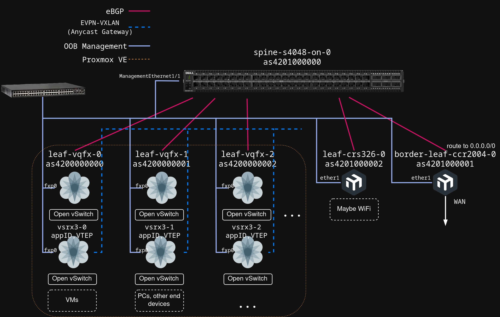
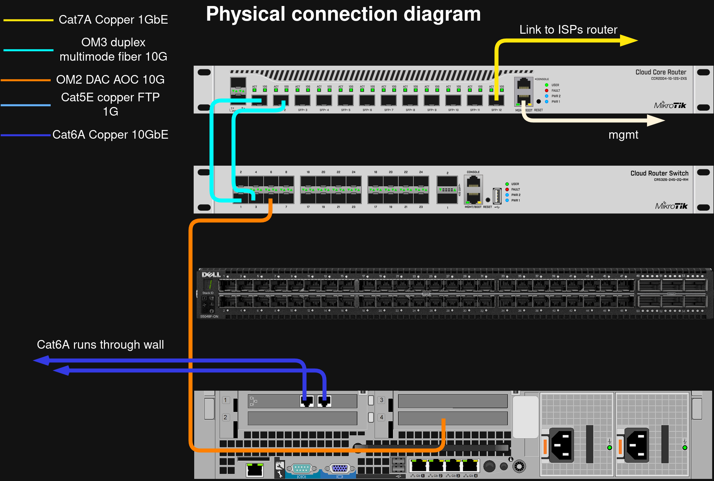
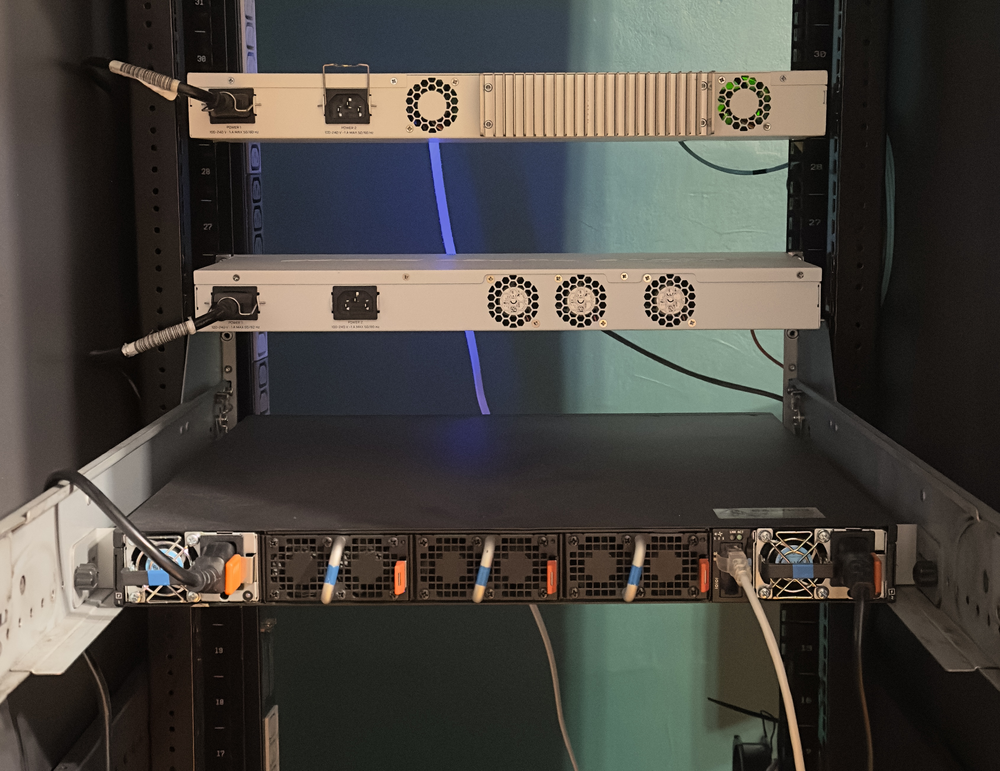

# Datacenter networking lab

Here I document everything about my networking lab which serves as a practical ground for learing modern datacenter technologies.     

Currently I'm mainly focused on turning the lab into a datacenter-styled network, particularly I want to create a ultrafast switching fabric in a Clos architecture using my Dell EMC S4048-ON as the spine switch, along with Juniper vQFXs as leaf switches, all connected with eBGP.

> [!CAUTION]
> There has been a big issue with the last network configuration especially on PVE. Contact with web GUI was completly cut off and even OSPF backbone went down. 
> All because of a massive broadcast storm and loops that occured between the CRS326 and the Proxmox VE. 
Please read [OSPF and L2 Loop troubleshooting](./projects/11-ospf-and-l2-loop) as it may be really relevant in case some other things might have stopped working. 
> I now used the correct approach to do what I intended but without the risk of a gigantic broadcast storm.  
> (It turned out that everything was caused by a L1 Loop)

## Table of Contents
1.  [Docs to read](#docs-to-read)
2.  [How This Repository Is Organized](#how-this-repository-is-organized)
3.  [Lab Architecture](#lab-architecture)
4.  [Hardware](#hardware)
5.  [Contact](#contact)

# Docs to read

Here I put things that I think are the most interesting and worth reading.   

These are projects, case studies and troubleshooting logs.    

*   **[Comparative analysis of the purchase of a Dell EMC S4048-ON for the lab instead of other devies](./projects/14-dell-s4048-on-comparative-analysis)**    

*   **[School Network fried by lightning, WiFi fixing, Cisco WLC](./projects/13-school-network/readme.md)** - Very hot topic right now, since my school does not have WiFi available for now. They basically asked me to fix their wifi. I will write here about what things I uncover since it is actually far more complicated than just WiFi.

*   **[eBGP Implementation between two AS'es](./projects/12-eBGP-implementation/readme.md)** - Plus DHCP Nightmare

*   **[Super Important OSPF and L2 Loop troubleshooting](./projects/11-ospf-and-l2-loop/readme.md)** - This is important as it makes some changes to the entire lab archtecture. 

*   **[Finally OSPF Implementation !](./projects/06-ospf-backbone)** - Area 0 between CCR2004 and CRS326   

*   **[Addressation modernization, better management](./projects/04-management-network-split)**

*   **[L3 hardware offload instead of router-on-a-stick](./projects/03-l3-hw-offload-on-core-switch)** - Super fast port-speed connection for wide bandwith between Virtual Machines !

* **[IPv6](./IPv6/)** - For now there is not much here since my ISP does not provide IPv6, and because they use CGNAT, I need to use a Tunnelbroker from Hurricane Electric. But another problem is the lack of a stable IPv4 endpoint.      

* [Enabling VLAN30 access with a Dual-Port 10GbE NIC](./projects/02-vlan30-access-without-sfp-transreceivers)     

# How This Repository Is Organized

This repository is structured to be a clear and useful reference. Here’s a map of the key directories:

*   **`/projects/`**: Probably the most interesting directory cause it's where all project documentations are.
*   **/[device-name]/** (e.g., [`./ccr2004/`](./ccr2004/), [`./r710/`](./r710/)): Contains the latest configuration files and documentation for each piece of hardware. This is the source of truth for device settings.
*   **`/IaC/`**: Holds all Infrastructure as Code projects, primarily using Terraform to automate deployments on Proxmox.
*   **`/docs/`**: Contains details about plans for improving the lab. For example a better addressation plan

# Lab Architecture

## Modernization and currently ongoing

Here is the simplified diagram which shows what I'm making my network to look like.   

## Physical connections diagram

## Logical topology

## Photos

   

# Main overview + Plans

> [!NOTE]   
> I re-wrote the overview and plans so I hope they are a bit less messy and are more understandable.   

I would like to divide the description of my network into two main parts: the up-and-running part, and the planned part.   

However, I think the term "planned" might not reflect what I actually mean so here I would like to first write what is running NOW, and by scrolling a bit lower, you can read about what is planned.   
I just want to say that the planned things are not just a "maybe sometime I will do that" thing but rather I have a lot planned out already and I'm just waiting to finish CCNA. 
It's just that even though I'm currently doing CCNA, I did not abandon the lab, and I just stopped more practical implementations and projects, but I am still learning a lot of theory about other things, right now especially TCAM memory blocks and the switching engine blocks and their limitations specifically in Broadcom's StrataXGS series chips.

For now, there are two main network devices running: the MikroTik CCR2004-1G-12S+2XS (AS65000, a.k.a. `border-leaf-ccr2004`), and a CRS326 (AS65001, a.k.a. `leaf-crs326`). 
However, as you probably already noticed, those devices actually are not in a spine-leaf topology.   
Both routers use eBGP for exchanging routing information. 
The CCR2004 advertises the default route to the internet to the CRS326.   
Basically the ccr2004 is a edge router, while the crs326 is a core router.    

~~The crs326 performs the InterVLAN Routing between the networks in a kind of a router-on-a-stick topology.~~
The CRS326 performs InterVLAN Routing between VLANs which are stretched through the PVE host, to the VMs.
I of course use L3 Hardware offloading on it, since it enables line-speed routing.   

> [!NOTE]   
> Earlier I said "Router-on-a-stick", which would be theoretically correct from the perspective of the VMs.   
> Just picture the data flow:    
> Since the SVIs are on the CRS326, the traffic from VM0 (NET20-VMS) to VM1 (NET30-KUBERNETES) first goes from VM0 to the Open vSwitch, then it gets turned into a 802.1q frame with VID 20 and is sent over the tagged link to the CRS326, then the CRS326 performs InterVLAN routing, changes the VID from 20 to 30, and the traffic is sent again through the same link but this time downstream.
> Then the VID is taken off on the Open vSwitch and the untagged 802.3 frame arrives on VM1 vNIC.   
> Looks kind of like ROAS doesn't it?
> But this messes this up a lot so just forget that I said ROAS in the first place.

I just want to mention that the "line speed routing" applies mostly only to static routes, and that in serious BGP routing it will punt all the traffic to the CPU.   
I won't get into details here, since I will write a longer document about that sometime, but I just want to say that the chip inside the CRS326 is not an L3 switch chip, even though it might look like it from the documentation.   
It's simply a L2+ chip, which is kinda like typical L2 switch chip, but with some added TCAM memory blocks so it can perform simple longest prefix match L3 lookup, but only for around 36 thousand routes.

There is also a Dell R710 which is a Proxmox Virtual Environment host.
It's running a couple of VyOS VMs, along with a Kubernetes cluster and of course sometimes other Linux VMs.   

It has an upstream connection through a 10GbE link to the CRS326.

That link is separated using VLAN tagging on the CRS326 and the Linux Bridge `vmbr0`, but I will switch to Open vSwitch.   
Thanks to the VLANs, I can create point-to-point connections between VyOS routers, and the CRS326, even though there is only a single physical link.

I think that this summarizes the operational state of the lab.

Below you can read some plans which I would like to implement. 
Sorry for the messy writing, I didn't organize all of that properly, so I will try to re-write all that.   

# Plans

## OOB Network    

This is the firs thing I would like to implement as it is actually neccessary to accomplish everthing outlined below.   

Currently the network revolves around kind of a "master" network, specifically `10.1.1.0/30`.   
Traffic outgoing from this network, which is attached to `ether1` interface on the CCR2004, is allowed to go everywhere.   

How did I even got the idea to create it like that?   

Well, I thought to myself that, I need to manage networking devices very often, and going to the rack to plug the ethernet cable from the management port to a access port didn't seem very nice.   

So I just combined that two things into a single network, which is obviously a bad practise.    

Also the management network should probably be a single subnet, however in my case it is not, which again is not a good practise.    
The CCR2004 has management interface in `10.1.1.0/30`, while the CRS326 has it in `10.1.1.4/30`.   
This makes it neccessary to use routing, when wanting to access one management interface, from the other one.

I think you can already see how messy this is, even just by reading that and not actually using it.   

The usual setup is to stretch a L2 domain through the devices in the lab.   
For example we create a network NET10-MGMT-VID10, which as you can see in the name, would use VLAN ID of 10.   
Then the process is super simple, as it only requires adding one more allowed VLAN to the tagged links between all devices, and assign an IP address from that network, for each device.   

But that does not work in datacenters, since this kind of management network, is strictly intergrated with the rest of the network, the underlay.   

So I want to completly abandon in-band management and switch to Out-of-band-only management.   
Basically there wll be a network dedicated to management and it will be completely independent of the underlay network.    

Each networking device will simply have one interface with an IP address from that network, and there will be one single simple L2 switch, which will have direct connections to every management interface in the lab.   

One thing I would like to note here is that the management interfaces on the mikrotiks, and on the Dell S4048-ON are very different.   
On my two MikroTik devices, those management ports are basically just an another port, but copper rather than SFP, and with an added "Mgmt" text.

I mean yeah on the CRS326 block diagram, you can see that the `ether1` interface is connected to the CPU rather than to the ASIC, but this is not a carrier-grade control and data plane separation.
The control and data plane would have to be separated also in the software to make any difference.
Without it, when one service glitches, the entire system can glitch, because it is a monolythic system.
That would explain why the part of the network reachable through the ASIC, is actually unaccessable from the `ether1` interface, when L3 Hardware offload is enabled on the ASIC.   

I don't know if that is a feature or a bug, but I tested it a lot of times and it just doesn't work.   

That is another reason to leave the mgmt interfaces for management.    

You may ask "but how to provide Out-of-band management for virtual routers?".   
And that is something I myself was trying to solve, and I got one idea.   

My solution for that is to just create a Linux Bridge/Open vSwitch in the PVE, for example `vmbr-oob`, and bridge one physical interface of the server to it, for example the `eno1` interface.   

Then, when creating, for example, a vQFX VM, just add the Routing Engine's first vNIC (`net0`) to the `vmbr-oob` bridge.   
This way you can have out-of-band management, from a physical switch, for a virtual router, completely indepentend on the main network.

I forgot to mention the Dell EMC S4048-ON.    

It has the best support for OOB Management of all devices in my lab.   
The management interface, which is called `managementethernet1/1`, is literally fully separated from all other interfaces, on the PCB board.   
This, combined with modular Network Operating System, allows for complete separation of data and control plane.   

Even if you exhausted the switching capability of the switch chip, the Management interface is always available and it cannot become congested from the traffic passing through the data plane. 

So the OOB Switch will be the Brocade FLS648.   
It's a piece of junk actually, but I don't need more just for the OOB network.   

The only thing I need from it is to handle a single L2 domain, even without any VLAN tagging etc.   

So the management interface of the Dell S4048-ON will be connected to the FLS648, along with all the other networking devices.   

One important thing is that the management interface should be on the physical port, not on an SVI.
So for example to allow the management of the Dell S4048-ON, I would assign an IP address on the `managementethernet1/1` interface, and that's it.   
I would **not** create an SVI, and add the `managementethernet1/1` as a untagged port for this VLAN.

The OOB Management is after all supposed to be highly available out-of-band.
Using an SVI is another thing which can break, and also it overly complicates the pretty straightforward task of allowing management of the device.   

The out-of-band management interfaces are also important for automatization like Ansible.   
Sometimes things will break and you just would not want to have your only way of accessing the switch cut off.   
If you want to be safe from that, just run Ansible through the management interface, and never let Ansible touch it.  

So only thing to add to that is proper CoPP which is nicely supported in Dell EMC OS9.

## Second thing is implementing the Dell EMC S4048-ON switch into the lab.     

> [!IMPORTANT]   
> I would like to explain why am I using one specific term here.
> I'm talking about "fabric".    
> I do realize that switching fabrics are groups of super fast switches in a Clos architecture.
> Again, **Groups** of switches, and I have only one spine switch.
> So I just want to say that I am using this term because I think that it's usage in my lab is understandable, with the goal of making it as datacenter-like as it can be.   

This is a enormous topic and there is a lot to talk about here.   

Currently the lab is in a somewhat typical collapsed-core architecture.   
I mean to be honest it's neither much this, nor spine-leaf so I don't think it complies with any particular network architecture.   
Just look at the CRS326.
It maintains eBGP sessions with CCR2004 and with VyOS virtual Routers, while also being an access switch to some occasional devices connected through SFP RJ45 transceivers.

So it serves multiple roles simultaneously.   

But because of my goal which is, among other things, to learn carrier-grade networking, I am turning the network into a Spine-Leaf fully routed architecture with the Dell EMC S4048-ON as the ultrafast switching fabric.     

I think you may enjoy reading the reasoning behind choosing specifically the Dell EMC S4048-ON for my lab, which is available [here](./projects/14-dell-s4048-on-comparative-analysis/readme.md).    

So the Dell EMC S4048-ON will be implemented into the network as the Spine switch. 
I know that it's intended to be a ToR switch, but for my network that is no issue.   

The devices will be connected with eBGP, with the CCR2004 being the border leaf router and advertising the 0.0.0.0/0 (or ::/0) route.   

You may be wondering why eBGP and not iBGP even though it's in a kind of a single AS?    

And there is a great document for that, which is the RFC7938, and it is available here on [datatracker.ietf.org](https://datatracker.ietf.org/doc/html/rfc7938)    

But basically, eBGP allows for very nice manipulation of the choosen routes thanks to it's attributes like AS_PATH etc.   
I mean BGP is still I think mostly taken as a WAN routing solution but it finds it's usage in the biggest datacenters.   

There is still the fact that there is only one spine switch here.
Some time in the future I would like to change that, by buying a QFX5100, but for now, I have the Dell EMC S4048-ON and the number of things that I can learn on it is just unimaginable.    

The PVE host will be transparent in this architecture.
It will not touch the network at all, it will only maintain the Open vSwitch so the VMs can communicate in some way with the spine.   

What about traffic to VMs?  
That is also a very cool thing I think so you can check the [Distributed firewall](##distributed-firewall) section.

But getting back to the spine switch, it will simply be the main point of the underlay network.   

I don't want to get too much in depth about it here, since there will be a separate document dedicated to the StrataXGS chips, based on the Dell EMC S4048-ON, but I just want to say that it probably will not be a VTEP.   

That brings up the topic of VXLANs, which are an absolute neccesity in datacenters.  

However, there are two main ways of deploying VXLANs and they differ by the mappings and the VTEP location.   

For example, the Dell EMC S4048-ON could be a very good VTEP. Why?     
Well, because it has a StrataXGS BCM56850 switching chip which is manufactured by Broadcom.   
And Broadcom after all is one of the co-authors of the RFC7348, and they took an active part in standarization of the VXLAN technology.   

The BCM56850 is actually not a just another switch chip, but it is one of the first which had such a good VXLAN implementation.   
Though it cannot do single-pass InterVXLAN routing, it would still be very good in the role of a VTEP.    

Those two things may sound kinda stupid together cause you normally would not use a VTEP as a point of InterVXLAN Routing.   

Note that I said it cannot, though theoretically it could but with hairpinning.   

As I said I don't want to full depth explaining that here but basically the order, in which the switching engine blocks are physically placed in the BCM56850, makes it impossible to quickly go from VXLAN decapsulation to L3 longest prefix match.     

There is not a lot of information on it from Broadcom itself, but there are very good White Papers from Juniper and Arista, since their QFX5100 and 7050X use the same exact chip.   

One document is titled [A day in the life of a packet](https://rchrist.io/blog/more-recirculation-bandwidth-arista-7050x/Arista_7050X_Switch_Architecture-X2.pdf).    

But let's get back to the VXLANs.    

The type of deployment that I depicted here uses physical switches as VTEPs, but nowadays, especially in hyperscale environments, the VTEPs are mostly on the hypervisors.   

Again, I don't want this to be so long so I won't write about how VTEPs on ESXi work etc. but just a quick deployment description.   

The Dell EMC S4048-ON won't be a VTEP since the VTEPs are gonna be on the virtual routers inside PVE.   

This is actually more like the first type of the deployment rather than the hypervisor deployment.   

The thing is that I have only one server, and it would be hard to pull off the deployment of a hyperscaler-like cloud architecture with VNI to VID mappings on the hypervisor.  

In summary, cause I want to write the next thing, the Dell S4048-ON will be just an insanely fast underlay network, without any firewalls etc.  
Just pure BGP and ECMP (When there will be a second spine switch).   
Again, if you want to read more about why I chose this particular switch, [read this document](./projects/14-dell-s4048-on-comparative-analysis/readme.md)

There is more explaination there, about the Network Operating System on that switch and it's architecture.   

So I think this summarizes how I am going to implement the Dell EMC S4048-ON in the lab.  

## Distributed firewall

This is one of the coolest topics I think.   

Basically, when designing Clos switching fabrics, there is the issue of security.   

Cause it's pretty self explainatory why those are so fast etc.   
But it's also pretty obvious that no self-respecting data center network would go without security.    

But where should the firewalls be placed?   

The spine switches are insanely expensive because of their astronomic switching chips etc. but they have low-power, less powerful CPUs cause the only thing the CPU needs to do is to handle the NOS, maintain BGP sessions and program the ASIC with FIB based on the RIB etc.   

So knowing that, can we place a firewall in a spine or leaf switch?   

Of course not cause the spine and leaf switches are powerful only in the ASICs.   
A firewall is a stateful mechanism and it is impossible to handle a stateful firewall on a switch chip.   

And there is another thing, since nowadays datacenters use Next-Generation firewalls for example the Juniper vSRX3.   

Those firewalls do not only permit/deny packets based on the SRC/DST IP, port, interface, state of the connection etc. but they use something called Deep Packet Inspection.   
And I don't know much about NGFWs but I know that those devices such as the best Juniper SRX models literally have dedicated chips for cryptography.    
They need an astronomic amount of processing power.   

But the tasks that they perform is a totally different kind than what the switch chips handle.   
DPI is not a copy-paste operation where milions of packets are super similar to each other and just need to be routed accordingly to the FIB.  
DPI is where those NGFWs look deep into the packet and scan it with lots of different engines such as Junipers AppID which can literally spot what kind of application you are using, by tracking the first packets after the TLS handshake.   

So in summary it's just that it requires an insane amount of typically x86_64 processing power.   

You can probaly see now the issue.  
Though ACLs can be handled fully by the switch chip, they are super simple and the switches physically couldn't do DPI, because of how they are built.
The data flow is not supposed to even touch the CPU.   

So here is where a pretty cool solution comes up, and that is placing a firewall inside each leaf in the Clos.   

Basically this allows to still keep 100% control over network, but the switching fabric does not have to care even a bit about security.   
Each leaf will have a vSRX NGFW, which will provide something called microsegmentation for inspecting packets.    

So i'll show how that would actually be done.    
There would be a separate bridge in the hypervisor, for example `NET20-OVS0`.   
All VMs, along with a vSRX3 would have vNICs attached to this Open vSwitch.  
The vSRX3 would have at least three vNICs in this scenario. 
The first vNIC (net0) would be attached to the `vmbr-oob` as it acts like the `fxp0.0` interface on a real SRX, which is used for management.
The second vNIX (net1) would be attached to `NET20-OVS0` as it would be the default gateway for all VMs.

And the third vNIC (net2) would be attached to `UPSTREAM-LEAF-OVS0`, since this Open vSwitch would have a physical interface `enp7s0f0` added to it, and it would provide connectivity to the leaf switch.

Notice that this does not slow down the Spine of the network.
And there is still 100% control over where traffic can and where cannot go.   

This is actually not a compromise as it allows for stopping unwanted traffic before it is even seen by the switching fabric.

There of course will be a vQFX above the vSRX3, as it will be the leaf switch and it will handle eBGP, EVPN-VXLAN etc.   

This is what I am aiming to create. 
Of course first there has to be a stable switching fabric but I think this pretty nicely outlines the architecture. 

> [!IMPORTANT]    
> I want to note one crucial thing.
> Though I use the vSRX3 and vQFX accordingly to their roles, keep in mind that for example the vQFX will reach nowhere near the backplane switching capacity of a real QFX-series datacenter switch. 
> Same for the vSRX3.
> But the JunOS is the same as on a real device, only the Packet Forwarding Engine is just a separate VM, rather than a real switching chip.   
> However, as you probably already noticed, the speed is absolutely not an issue for me, since there is pretty much no bandwidth requiring service running in my lab.

## Hardware

A list of the key components in my lab. Click a device name to see its configuration files.

| Device Type      | Model                                   | Role in the Lab                                   |
|:---|:---|:---|
| **Server Rack**  | [HPE 10636 G2](./hpe-10636-g2/)         | Central mounting point for all equipment.         |
| **PVE Server**       | [Dell PowerEdge R710](./r710/)          | Main virtualization host, running Proxmox VE.     |
| **Border Leaf Router**  | [MikroTik CCR2004](./border-leaf-ccr2004/)           | Border leaf Router, provides access to the internet, NAT, DHCP Server on loopback interface, VPNs and main firewall for North-South traffic       |
| **Leaf Router**  | [MikroTik CRS326](./leaf-crs326/)           | Leaf router. For now handles BGP, inter-VLAN routing with line-speed thanks to L3HW offload | 
| **Spine Switch**          | [Dell S4048-ON](./spine-s4048-on/)  | For now unused. However, I am learning a lot of theory about it's StrataXGS BCM56850 switching chip and it's system architecture. It will be the spine switch and will be a part of the ultra fast switching fabric. |
| **OOB Switch**| [Brocade FastIron LS648](./oob-fls648/)      | Switch for OOB Management. Handles single L2 domain.     |
| **0U PDU**          | [HP S1132](./hpe-s1132/)                | Enterprise-grade Power Distribution Unit.                  |

## Contact

