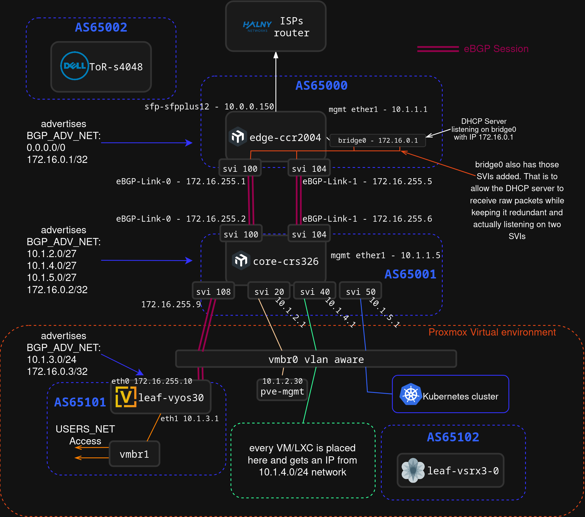

# Datacenter networking lab

Here I document everything about my networking lab which serves as a practical ground for learing modern datacenter technologies.  
My main focus is building scalable L3-only network fabrics

> [!CAUTION]
> There has been a big issue with the last network configuration especially on PVE. Contact with web GUI was completly cut off and even OSPF backbone went down. 
> All because of a massive broadcast storm and loops that occured between the CRS326 and the Proxmox VE. 
Please read [OSPF and L2 Loop troubleshooting](./projects/11-ospf-and-l2-loop) as it may be really relevant in case some other things might have stopped working. 
> I now used the correct approach to do what I intended but without the risk of a gigantic broadcast storm.  
> (It turned out that everything was caused by a L1 Loop)

## Table of Contents
1.  [Docs to read](#docs-to-read)
2.  [How This Repository Is Organized](#how-this-repository-is-organized)
3.  [Lab Architecture](#lab-architecture)
    *   [Network Diagram](#network-diagram)
    *   [VLAN & IP Schema](#vlan—ip-schema)
4.  [Hardware](#hardware)
5.  [Projects](#projects)
6.  [Physical Build Log](#physical-build-log)
7.  [Contact](#contact)

# Docs to read

Here I put things that I think are the most interesting and worth reading.   

These are projects, case studies and troubleshooting logs.    

*   **[eBGP Implementation between two AS'es](./projects/12-eBGP-implementation/readme.md)** - Plus DHCP Nightmare

*   **[Super Important OSPF and L2 Loop troubleshooting](./projects/11-ospf-and-l2-loop/readme.md)** - This is important as it makes some changes to the entire lab archtecture. 

*   **[Finally OSPF Implementation !](./projects/06-ospf-backbone)** - Area 0 between CCR2004 and CRS326   

*   **[Addressation modernization, better management](./projects/04-management-network-split)**

*   **[L3 hardware offload instead of router-on-a-stick](./projects/03-l3-hw-offload-on-core-switch)** - Super fast port-speed connection for wide bandwith between Virtual Machines !

* **[IPv6](./IPv6/)** - For now there is not much here since it's hard to get an IPv4 from my ISP.  

* [Enabling VLAN30 access with a Dual-Port 10GbE NIC](./projects/02-vlan30-access-without-sfp-transreceivers)  

## How This Repository Is Organized

This repository is structured to be a clear and useful reference. Here’s a map of the key directories:

*   **`/projects/`**: Probably the most interesting directory cause it's where all project documentations are.
*   **/[device-name]/** (e.g., [`./ccr2004/`](./ccr2004/), [`./r710/`](./r710/)): Contains the latest configuration files and documentation for each piece of hardware. This is the source of truth for device settings.
*   **`/IaC/`**: Holds all Infrastructure as Code projects, primarily using Terraform to automate deployments on Proxmox.
*   **`/docs/`**: Contains details about plans for improving the lab. For example a better addressation plan

## Lab Architecture

### Network Diagram

Here are the diagrams that show the physical and logical topology of my lab.   

#### Physical connections diagram

#### Logical topology

## Main overview + Plans

My network is oriented towards a datacenter-styled approach because that is the field that I would love to work in.    

I am actively improving things to make this lab as much as possible like a real data center Spine-Leaf Design.   

For now the Spine of my network consists of three routers, a MikroTik CCR2004-1G-12S+2XS, a CRS326-24S+2Q+RM and a VyOS vRouter.
Together, those two physical routers are connected with two eBGP sessions through two 10GbE Fiber links.
I wanted to enable ECMP between them, however, in RouterOS 7.19.4, ECMP for BGP is not supported.   

The CCR2004 has an ASN of 65000, the CRS326 has 65001 and the VyOS vRouter has a 65101 ASN.  

The CCR2004 advertises the default route (`0.0.0.0/0`) to the CRS326 which advertises Networks from it's `BGP_ADV_NET` address list.   

There is also a DHCP Server running on a loopback-like interface on the CCR2004. 
This ensures that it is reachable even when one of the links go down and removes the need for two identical DHCP Servers for two different interfaces, since it's listening on a single bridge.   

From the outside, this network might look pretty small.
However, a lot happens in Proxmox Virtual Environment which runs on my Dell PowerEdge R710.   

In the PVE I run a lot of networking appliances like VyOS and vSRX3 vRouters.   

The PVE is connected through a single DAC 10GbE cable to the CRS326.
This single cable carries a lot of tagged traffic which then gets switched by the main `vmbr0` bridge.  

This way, the inter-VLAN routing between VMs and for example Kubernetes Cluster gets handled by the CRS326 which has enabled L3 Hardware offloading.   

Even though the L3HW offload on CRS326 is fairly simple, as anything above simple routing gets handed to the CPU, it allows for line-speed (10GbE) routing between different VLANs which live on the PVE server.   

That is of course a bit of hairpinning since the traffic goes twice through the same physical cable.   

VLAN segmentation on that link between CRS326 and PVE, allows me to create different logical links without worrying about buying another SFP+ NICs.  

USERS_NET is currently reachable through the point-to-point link between the CRS326 and a VyOS vRouter which also travels through that same DAC Cable but is of course separated with VLAN tagging.   

There is also eBGP session running on the point-to-point link between the CRS326 and the VyOS router.  

USERS_NET Access is available for PCs in another room next to mine via a dual-port RJ45 10GbE NIC which has both its ports bridged onto `vmbr-users`, where also the mentioned VyOS Router has one of it's interfaces.   

This VyOS vRouter is also a DHCP Relay for all devices in USERS_NET.

### Plans

*   First thing I want to do is implement OOB-Only Management.   

For now, for management and access to the entire network I used a kind of a master-network which was available through the `ether1` interface on the CCR2004 router.  

This is of course a bad practise and I will be deprecating it.  

The reason why I got into thinking about this OOB-Only network is because I started learning more about real datacenter networking devices.   
My MikroTik routers, even though powerful for their price, are not a real datacenter grade networking appliances.   

However, my new Dell EMC S4048-ON is a real datacenter-grade device.  

The `mgmt` interface on it is not just an another ethernet port with a `mgmt` text next to it.  
Since this is a real datacenter switch, it features a physical separation of data and control plane, which means that this management port is physically connected differently than every other interface.  
It's connected directly to the CPU, while every single other port is connected to the Trident 2 ASIC.    

The same thing applies to the vSRX3 vRouters.  
They also feature a control and data plane separation.  

New approach will be to make networking devices management available only from a Out-of-band network.  
Each device will get assigned an IP from the `10.9.0.0/24` network on a physical management interface. **NOT** on an SVI.  

Accessing OOB network from anywhere other than a physical connection to the OOB switch will be impossible and vice-versa.

Proxmox Management will still be available from in-band network.  

However, one problem with this occured when I thought about the vSRX3 vRouters in the PVE. How to make their `fxp0.0` management interfaces available from the OOB Network?  

The solution to this is to first create a new bridge in the PVE, for example `vmbr-oob`.
Then to make it physically separated, it's neccessary to add a physical interface to the `vmbr-oob`, for example `eno1`.  
Then what's left is to connect the `eno1` interface to the OOB switch and add all `net0` vNICs for the vSRX3 vRouters to the `vmbr-oob`.  

The first networking device (`net0`) added to the vSRX3 vRouter is always assigned as `fxp0.0` port, which is specifically a management interface.

This way, the management interfaces for the vSRX3 appliances will be always reachable through the OOB network even when the main PVE link goes down.  

This also improves security a lot.

*   Second thing is implementing the Dell EMC S4048-ON switch into the lab

I want to use this switch as the Top-of-the-Rack switch in my lab.  

It's absolutely insane and it's a gigantic upgrade for me.  
After all, it's my first real datacenter-grade networking L3 switch.   

It will be a great L3 fabric for my network which will allow me to create super-fast links to my vSRX3 vRouters and handle VXLAN Tunnels.

*   Third thing is L3-Only network

I want to make my network more to be like a real datacenter network.   
Now, hyperscalers use a L3-Only Spine-Leaf architecture in their datacenters.   

A L3-Only network means that there is no stretching of L2 domains, no issues caused by LACP, no locked ports cause of STP and no fake load-balancing with bond interfaces.  

By making my network L3-Only, I will be able to do everything a lot more elastically, and also utilize real load-balancing using ECMP for BGP.   

Creating a stable L3-Only network fabric also makes up a great environment for a very advanced datacenter technologies like VXLAN which is currently used routinely.  

I could create a VXLAN tunnel between VMs_NET in PVE reachable through a vSRX3 vRouter, and my laptop connected to the CRS326.  
Then to make it even better and more advanced I could replace "flood-and-learn" with EVPN for BGP which is a really great technology currently used in datacenters.   

As of now, the VMs_NET and KUBERNETES_NET are directly connected to the CRS326.   
This keeps those two L2 domains that stretch beyond the PVE Server.    

I would move the link connecting the CRS326 to the PVE, to the Dell instead of the CRS326.  

The CRS326 will become a access switch with less to handle now.   

On the link between the PVE and the Dell, there will be tagged point-to-point links to the vSRX3 routers, all connected together by BGP.  

The VMs and other networks now won't be connected to the Dell.
Those networks will be reachable only throught vSRX3 vRouters inside the PVE Server.   

The Dell will keep eBGP Sessions with the vSRX3 routers and route traffic not between those networks directly but it will route traffic between the vSRXs.   

This is my miniature version of distributed routing which is used in Azure, AWS etc.  

The eBGP sessions will be between appropriate SVIs on the Dell and the vSRXs.   

This is a lot more elastic approach and it also allows me to use the vSRXs as VTEPs for VXLAN tunnels.

I will be able to enable EVPN for eBGP sessions and create VXLAN Tunnels with great efficency for example between VMS_NET or USERS_NET and my physical laptop connected to the Dell ToR.  

The insanely powerful Trident 2 ASIC allows this Dell switch to perform VXLAN encapsulation, BGP EVPN etc. with incredible line-speed bandwidth.

This is what I want to achieve for now.

## Hardware

A list of the key components in my lab. Click a device name to see its configuration files.

| Device Type      | Model                                   | Role in the Lab                                   |
|:---|:---|:---|
| **Server Rack**  | [HPE 10636 G2](./hpe-10636-g2/)         | Central mounting point for all equipment.         |
| **PVE Server**       | [Dell PowerEdge R710](./r710/)          | Main virtualization host, running Proxmox VE.     |
| **Edge Router**  | [MikroTik CCR2004](./ccr2004/)           | Edge Router, provides access to the internet, NAT, DHCP Server on loopback       |
| **Core Router**  | [MikroTik CRS326](./crs326/)           | Leaf router, handles eBGP, main routing with L3HW Offload | 
| **ToR Switch**          | [Dell S4048-ON](./s4048-on/)  | For now, unused. However it will be the ToR switch with it's astronomic Broadcom Trident 2 ASIC |
| **OOB Switch**| [Brocade FastIron LS648](./ls648/)      | Switch for OOB Management. Handles single L2 domain.     |
| **0U PDU**          | [HP S1132](./hpe-s1132/)                | Enterprise-grade Power Distribution Unit.                  |

## Contact

