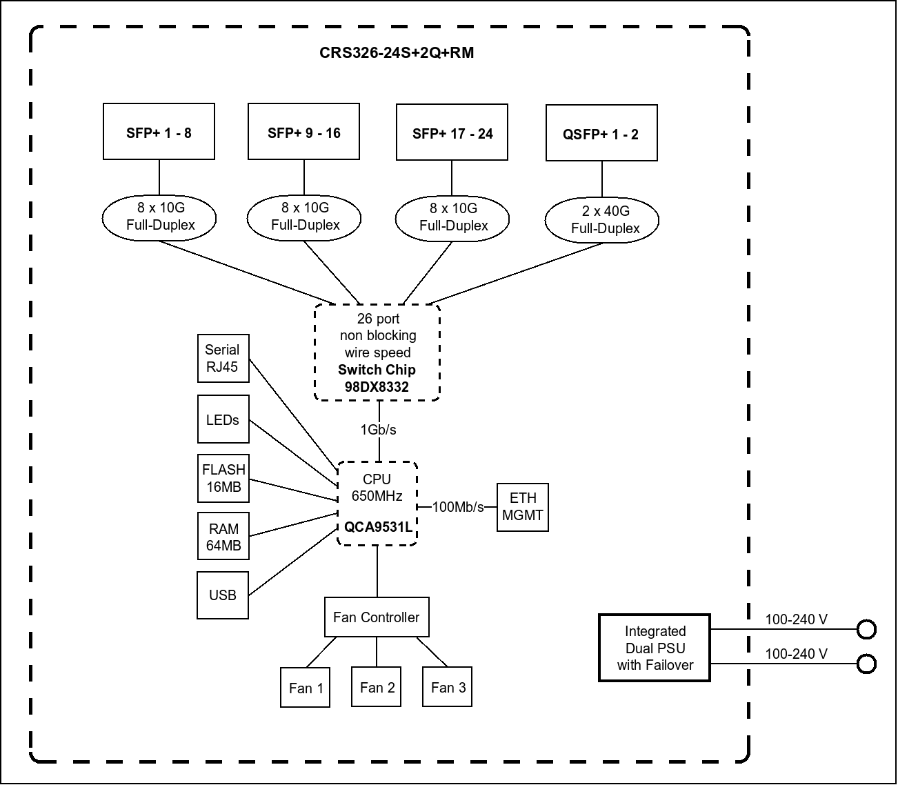

# Yet another addressation plan

10.100.0.0/16 block is a bit too long to type in to be honest.  
What I planned to use was a 10.1.0.0/16 block for addressation.  

However I won't place all management interfaces in the same network, because when, for example, Core switch (Which handles inter-VLAN routing) has a management interface on 10.100.10.2/28, and the Core Router has a management interface with 10.100.10.1 IP address, then this will become the highest priority route for all VLAN traffic accessing outside world. This of course is not a safe practise, VLANs should access internet through a inter-router link.   

But since, the management network is the highest priority route for pretty much everything, then the inter-router link becomes pointless.  

From what I read about management interfaces addressation in data centers, there shouldn't really be any big network where every management interface is placed in, because it's not good when untrusted traffic goes through a highly sensitive network. In data centers, from what I know, they use OOB Management, but I can't really do that in my lab for now.

I'm planning to split the management network for smaller ones dedicated to one particular device.  
Now both routers have IPs in 10.100.10.0/28. So I will assign a /30 network for each device. 
The CCR2004 will have a management interface on **10.1.1.1/30**, whereas the CRS326 will have it on **10.1.1.5/30**.  

This ensures that those management interfaces do not have any direct L2 connection and they won't become the highest priority route.  

However if those management interfaces are on different networks, then I won't be able to, for example, manage the CRS326 when plugged into `ether1` on the CCR2004.  

To solve that, I was thinking of simply assigning a dedicated route to enable managing CRS326 remotely, without plugging directly into `ether1` interface on it.  

I will simply create dedicated VLANs for those management networks. For example, VLAN 111 for CCR2004 management, VLAN 115 for CRS326 management etc.  

On the CCR2004, the Management IP address will be assigned on the SVI and I will add `ether1` as a untagged port to it. 
However, with the CRS326 the situation is a bit different. I cannot assign the IP address on the `ether1` on it, because the `ether1` interface is a special port. 
It is the only interface handled by a separate switch because the CRS326 has two chips.  
The CRS326 has a Marvel 98DX8332 as the powerful switching chip and it handles every SFP/QSFP port. But one port, the `ether1` interface, is handled by a separate chip, the CPU.
It's visible on the block diagram available on MikroTik's website: [https://cdn.mikrotik.com/web-assets/product_files/CRS326-24S2Q_230231.png](https://cdn.mikrotik.com/web-assets/product_files/CRS326-24S2Q_230231.png)  

   

This normally does not cause any issues. However, I have IP Switching or L3 Hardware offload enabled on the CRS326. 
As stated on RouterOS wiki, when one chip has L3 Hardware offload enabled, but another one does not, then routing between them will cause unexpected behavior.

This means, that if I tried to enable remote access to Management interface (`ether1`) on the CRS326, by routing the traffic from my laptop, through CCR2004 and then through the CRS326 switching chip, the traffic will not be able to access the `ether1` interface.   

This is why I need to assign the management IP address to the SVI, and not only on the `ether1` interface.
Of course, I can also just add the `ether1` as a untagged port for the management VLAN (ID 115). But it will not be possible to access the rest of the network through the `ether1` interface on the CRS326.
