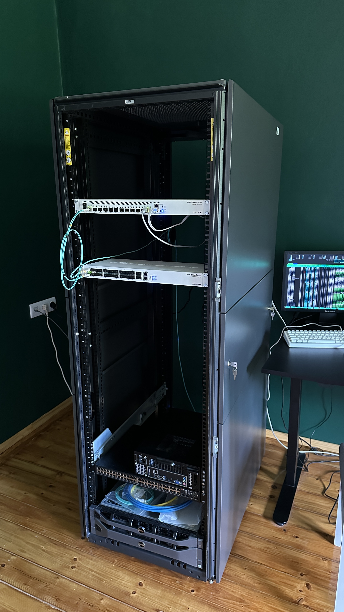
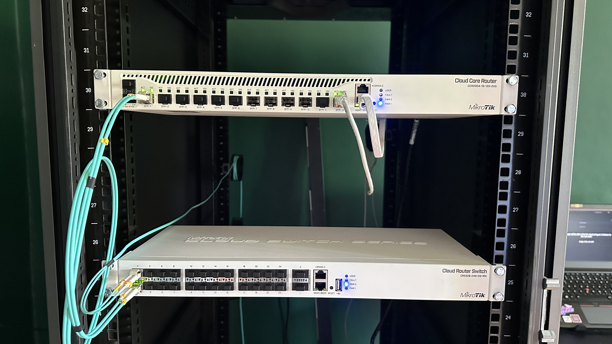

# HPE 10636 G2

This is the mounting point for every device in my lab.  

Below you can see some photos of if and how things are connected.  

**On the left side of this photo**, you can see the ethernet sockets which provide network access via a dedicated Dual-port 10GbE RJ45 NIC.  

  
