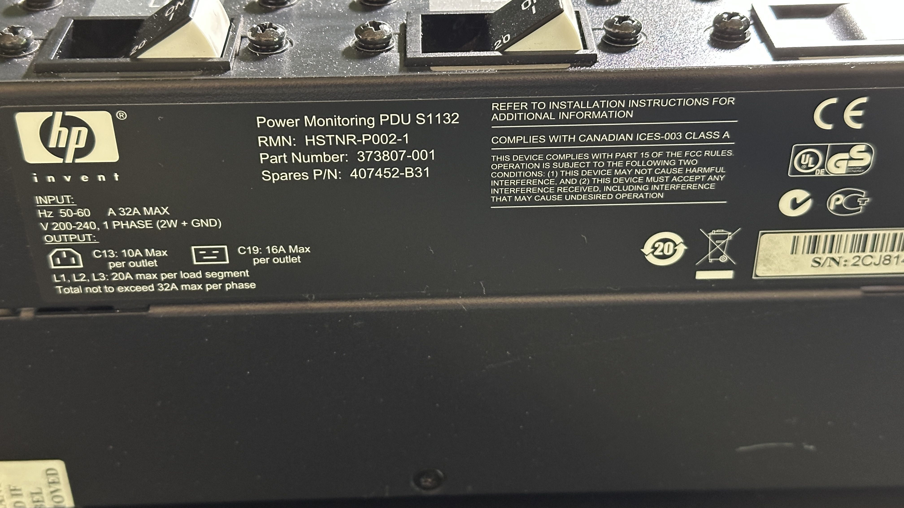
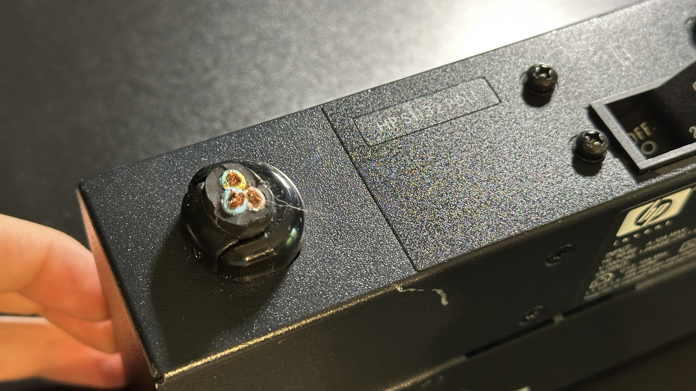
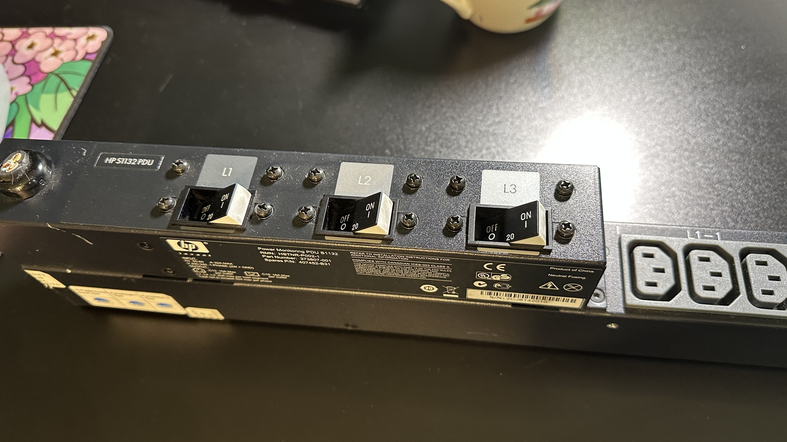

## Hewlett-Packard S1132 0U PDU

This Power Distribution Unit features 28 C13/C14 sockets and 3 C19/C20 sockets. Sockets are divided into three color-coded groups. C19/C20 sockets are capable of delivering a maximum of 16 Ampers per socket, and the C13/C14 ones can deliver a maximum of 10 Ampers per socket. Total load should not exceed 32A.  

The main power cable should be a 3x4mm^2 with a blue CEE male plug. **"Should"** because someone from where I got it probably was too lazy to correctly dismount it and just cut off the main power cable. Since I already worked with voltages like this, I thought it wouldn't matter much and I would fix it myself.  
  
The most crucial part was buying the correct cable. My house was approved for up to 24A max current. This was mostly a precaution since it is mostly not possible for my lab to take current of more than 3A.  

Below you can see the cut-off main power cable. 

Below you can see the three switches.  

