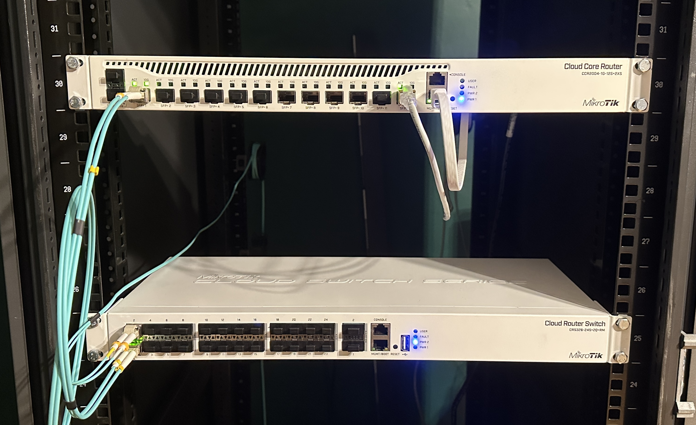

## L3 Hardware offload on Core switch

What I wanted to achieve is to enable the fastest possible network speed between VLAN 20 and VLAN 40. For now, all inter-VLAN routing was done on the CCR2004 core router with it's CPU. However that is not the perfect scenario, because the CCR2004 is not capable of full interface-speed inter-VLAN routing. That's because all traffic goes through a single SFP transceiver so it divides the overall transfer speed in half. And because the routing is done between VLANs rather than between physical interfaces, it slows down the transfer because of the tagging/untagging process.  

One of the ways to enable faster routing between those two VLANs, is to use **L3 Hardware Offloading**. The MikroTik CRS326 fully supports it.  

The idea was to just change where the routing between VLANs 20 and 40 takes place.  

> [!NOTE]
> The VLAN 30 will still be handled by the Core Router, because I need to restrict VLAN 30 more than the traffic VLAN 20 and 40. If I moved the VLAN 30 SVI onto the Core Switch, then it would put a lot of strain on the CPU which is not powerful.

> [!IMPORTANT]
> For now there seems to be an issue with accessing VLAN 20 when connected to the Management `ether1` port on the CRS326. Although when plugged into `ether1` on the CCR2004, there doesn't seem to be any issue.


## Hardware

*   **Core Router:** MikroTik CCR2004-1G-12S+2XS
*   **Core Switch:** MikroTik CRS326-24S+2Q+RM



# Changing the place of inter-VLAN routing from the Core Router to the Core Switch

First thing that I needed to do was to delete IP addresses from VLANs on the Core Router and assign them on the Core Switch, because now the switch was supposed to be the gateway for them.  

> [!IMPORTANT]
> For now, the route that will be used for communicating with VLANs is through 10.100.10.0/28, since this is the network where both devices have a IP address on the management interface. 
> Because of the fact that those devices have a direct connection through 10.100.10.0/28, adding an inter-router link is pointless, since it will have lower priotity than the direct connection route. I will split the management IP addresses so those devices will not have a direct connection on the management interface, and instead will communicate through a inter-router link.

### On the Core Router  

```rsc
ip address/
remove [find interface=vlan20-bare-metal]
remove [find interface=vlan40-vms-cts]
```

Next, I had to ensure that the Core Router will know through where to route traffic for accessing VLANs 20 and 40, since it now does not have any IP addresses on them, because the CRS326 will be the gateway for those VLAMs.  

```rsc
ip route
# This routes the traffic designated to vlan 20 and 40 through management interface of core switch
add dst-address=10.100.10.16/28 gateway=10.100.10.2
add dst-address=10.100.40.0/24 gateway=10.100.10.2
```
The routing table would look like this:
```rsc
[aether@core-ccr2004] > ip route/print
Flags: D - DYNAMIC; A - ACTIVE; c - CONNECT, s - STATIC
Columns: DST-ADDRESS, GATEWAY, ROUTING-TABLE, DISTANCE
#     DST-ADDRESS      GATEWAY                  ROUTING-TABLE  DISTANCE
0  As 0.0.0.0/0        10.0.0.1                 main                  1
  DAc 10.0.0.0/24      sfp-sfpplus12            main                  0
  DAc 10.100.10.0/28   br-mgmt                  main                  0
1  As 10.100.10.16/28  10.100.10.2              main                  1
  DAc 10.100.30.0/24   vlan30-users             main                  0
  DAc 10.100.50.0/28   vlan50-active-directory  main                  0
```

**As mentioned above,** this is not a good practise. But as I stated above, I will create a inter-router link for this traffic instead of it going through management network.  

I left the dhcp servers on the VLAN interfaces even though there is no IP address configured on either VLAN 20 or VLAN 40. However, this does not seem to cause any issue as of now.  

### On the core switch  

First I had to create gateways for the VLANs 20 and 40 on the CRS326 like this:
```rsc
/ip address
add address=10.100.10.17/28 interface=vlan20-bare-metal
add address=10.100.40.1/24 interface=vlan40-vms-cts
```

The gateway can be left as it was, for now.
```rsc
/ip route
add gateway=10.100.10.1
```
I then turned on the L3 Hardware offloading for the switch1 (ASIC)
```rsc
/interface/ethernet/switch
print
Columns: NAME, TYPE, L3-HW-OFFLOADING, QOS-HW-OFFLOADING
# NAME     TYPE              L3-HW-OFFLOADING  QOS-HW-OFFLOADING
0 switch1  Marvell-98DX8332  no                no               
1 switch2  Atheros-8227      no                no               

set 0 l3-hw-offloading=yes
```

**Marvell-98DX8332** (`switch1`) is the powerful ASIC that is capable of L3 Hardware offload. 
The Atheros-8227 CPU (`switch2`) provides around 400Mbps bandwith in inter-VLAN routing.  

By setting `l3-hw-offload=yes` for the `switch1`, it makes the routing handled by the ASIC instead of the CPU. That should increase bandwidth between VLANs 20 and 40 from ~400Mbps to port-speed (~10Gbps).  

```rsc
/interface/ethernet/switch/print
Columns: NAME, TYPE, L3-HW-OFFLOADING, QOS-HW-OFFLOADING
# NAME     TYPE              L3-HW-OFFLOADING  QOS-HW-OFFLOADING
0 switch1  Marvell-98DX8332  yes               no               
1 switch2  Atheros-8227      no                no               
```
This confirms that now the ASIC handles inter-VLAN routing.

Running `iperf3` as a server on Proxmox VE host (10.100.10.18/28) and as a client on LXC (10.100.40.11/24), shows that transmission speed is really improved.
```bash
 aether@pve ~> iperf3 -c 10.100.40.11
Connecting to host 10.100.40.11, port 5201
[  5] local 10.100.10.18 port 53104 connected to 10.100.40.11 port 5201
[ ID] Interval           Transfer     Bitrate         Retr  Cwnd
[  5]   0.00-1.00   sec  1.08 GBytes  9.24 Gbits/sec    0   1.74 MBytes
[  5]   1.00-2.00   sec  1.08 GBytes  9.26 Gbits/sec    0   1.83 MBytes
[  5]   2.00-3.00   sec  1.08 GBytes  9.27 Gbits/sec    0   1.83 MBytes
[  5]   3.00-4.00   sec  1.08 GBytes  9.26 Gbits/sec    0   1.83 MBytes
[  5]   4.00-5.00   sec  1.08 GBytes  9.27 Gbits/sec    0   1.83 MBytes
[  5]   5.00-6.00   sec  1.08 GBytes  9.25 Gbits/sec    0   1.83 MBytes
[  5]   6.00-7.00   sec  1.08 GBytes  9.26 Gbits/sec    0   1.83 MBytes
[  5]   7.00-8.00   sec  1.08 GBytes  9.27 Gbits/sec    0   1.83 MBytes
[  5]   8.00-9.00   sec  1.08 GBytes  9.30 Gbits/sec   27   1.34 MBytes
[  5]   9.00-10.00  sec  1.09 GBytes  9.35 Gbits/sec    0   1.62 MBytes
- - - - - - - - - - - - - - - - - - - - - - - - -
[ ID] Interval           Transfer     Bitrate         Retr
[  5]   0.00-10.00  sec  10.8 GBytes  9.27 Gbits/sec   27             sender
[  5]   0.00-10.00  sec  10.8 GBytes  9.27 Gbits/sec                  receiver
```

# DHCP Relay

Since the inter-VLAN routing is not handled directly on the DHCP server, I needed to create a DHCP Relay on the Core Switch.


```rsc
/ip dhcp-relay
add dhcp-server=10.100.10.1 disabled=no interface=vlan20-bare-metal local-address=10.100.10.17 name=vlan20-dhcp-relay
add dhcp-server=10.100.10.1 disabled=no interface=vlan40-vms-cts local-address=10.100.40.1 name=vlan40-dhcp-relay
```

# Result

What I achieved
*   **Higher bandwidth between VLANs 20 and 40**
*   **Less strain on the CPU of the Core Router**

# Issues

### First problem

The first problem is that the communication between the VLANs (20,30,40) and the outside network, takes place over the Management network (10.100.10.0/28) where the CRS326 and the CCR2004 have their management interfaces.  
This will be fixed.

### Second problem

Another issue that takes place is the inability to access any of the L3 Hardware offloaded VLANs when connected to the VLAN 10 through Management `ether1` interface on the Core Switch.  
The `ether1` interface on the CRS326 is assigned as untagged port to the VLAN 10. The VLAN 10 is added to the `main-bridge` interface. When pluggin into `ether1` the device gets assigned a IP address from the management VLAN, so the communication works correctly.   

However, when trying to ping VLAN 20, nothing happens.

After trying to experiment with manually adding routes with `ip route` on the core switch, I unplugged the ethernet cable connecting my laptop from `ether1` on the CRS326, and plugged it into `ether1` but on the CCR2004.   

Then I tried to ping VLAN 20, and it worked flawlessly.  

Since nothing seemed to work, I tried turning off the L3 Hardware offload on the CRS326. Then I plugged the cable into `ether1` on the CRS326 and pinging VLAN 20 worked.   

This gave me an idea that something with the L3 Hardware offloading is broken.   

I then went on the MikroTik RouterOS Wiki and I carefully went through the L3 Hardware Offloading section. What I found out from reading it, was that when a device has two switching chips, and one of them has IP Switching enabled, those two chips won't be able to talk to each other properly.   

And surely enough, the CRS326 has two chips. Only one of them is capable of IP Switching.  

It's obvious that the management port is connected directly to the CPU instead of to the ASIC as all other interfaces:
```rsc
/interface/ethernet/print
Flags: R - RUNNING; S - SLAVE
Columns: NAME, MTU, MAC-ADDRESS, ARP, SWITCH
 #    NAME            MTU  MAC-ADDRESS        ARP      SWITCH
 0  S ether1         1500  D4:01:C3:75:18:94  enabled  switch2
 1  S qsfpplus1-1    1500  D4:01:C3:75:18:8C  enabled  switch1
 2  S qsfpplus1-2    1500  D4:01:C3:75:18:8D  enabled  switch1
 ...
```
That explains why inter-VLAN routing works great but only the access from `ether1` seemed broken. It's after all not broken. It's just only routed by the CPU whereas every other port is L3 hardware offloaded onto the ASIC. The access to, for example, 10.100.10.1/28 which is the CCR2004 Management interface, works only because the CRS326 Management interface is in the same exact network (10.100.10.0/28).  

In conclusion, I will leave the management port, for management. And also I will split the management network so the two devices won't have a direct connection through it, because it bypasses the inter-router links.
