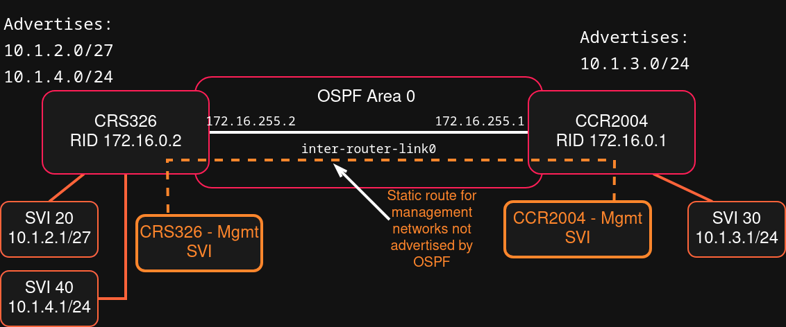

# OSPF Backbone

Here I will cover the process in which I implement OSPF Dynamic Routing Protocol on an inter-router link between my two Core Routers.

## Topology



### Hardware

*   **CCR2004-1G-12S+2XS**
    *   `loopback0` - 172.16.0.1/32
    *   `inter-router-link0` - 172.16.255.1/30
*   **CRS326-24S+2Q+RM**
    *   `loopback0` - 172.16.0.2/32
    *   `inter-router-link0` - 172.16.255.2/30

> [!NOTE]
> I will use IPs from `loopback0` interfaces as a Router ID in the OSPF Configuration.


So basically what I wanted to achieve, was to swap out static routes for Dynamic Routing using **OSPF**.  

The CRS326 will advertise VLANs 20 and 40, bacause it has SVIs in them. And the CCR2004 will advertise VLAN 30. All communication will be routed through a inter-router link with a network address of `172.16.255.0/30`.  

First thing to do was to assign a loopback IP address. Using loopbacks as Router IDs is a more failure-proof way of assigning a RID because if I were to assign a RID based on a physical interface then if that interface would go down, then the presence of this router would just disappear.  

So RID for CCR2004 will be `172.16.0.1` and RID for CRS326 will be `172.16.0.2`.  

To do this I just created a bridge without any interfaces so it won't be connected to anything and assigned it an IP address.

CCR2004:
```rsc
/interface bridge/
add name=loopback0
/ip address/
add address=172.16.0.1/32 interface=loopback0
```
CRS326:
```rsc
/interface bridge/
add name=loopback0
/ip address/
add address=172.16.0.2/32 interface=loopback0
```
Then I could get into the actual OSPF configuration.  
First I created a new instance. 

On the CCR2004:
```rsc
/routing ospf instance
add name=backbonev2 version=2 router-id=172.16.0.1
```
Then I created a new area and assigned the networks that I wanted to be advertised by OSPF. At first I added only loopbacks and the inter-router link network.
```rsc
/routing ospf area 
add instance=backbonev2 area-id=0.0.0.0 name=backbone0v2
/routing ospf interface-template
add area=backbone0v2 networks=172.16.255.0/30 passive
add area=backbone0v2 networks=172.16.0.1/32 passive
```
Then The same thing on the CRS326:
```rsc
/routing ospf instance
add name=backbonev2 router-id=172.16.0.2
/routing ospf area
add instance=backbonev2 area-id=0.0.0.0 name=backbone0v2
/routing ospf interface-template
add area=backbone0v2 networks=172.16.0.2/32 passive
add area=backbone0v2 networks=172.16.255.0/30
```

Then after a while I could check the available routes.
```rsc
/ip route print
Flags: D - DYNAMIC; A - ACTIVE; c - CONNECT, s - STATIC, o - OSPF
Columns: DST-ADDRESS, GATEWAY, ROUTING-TABLE, DISTANCE
#     DST-ADDRESS      GATEWAY                          ROUTING-TABLE  DISTANCE
0  As 0.0.0.0/0        10.0.0.1                         main                  1
  DAc 10.0.0.0/24      sfp-sfpplus12                    main                  0
  DAc 10.1.1.0/30      ccr2004-mgmt                     main                  0
1  As 10.1.1.4/30      172.16.255.2                     main                  1
2  As 10.1.2.0/27      172.16.255.2                     main                  1
  D o 10.1.2.0/27      172.16.255.2%inter-router-link0  main                110
  DAc 10.1.3.0/24      vlan30-users                     main                  0
3  As 10.1.4.0/24      172.16.255.2                     main                  1
  D o 10.1.4.0/24      172.16.255.2%inter-router-link0  main                110
  DAc 172.16.0.1/32    loopback0                        main                  0
  DAo 172.16.0.2/32    172.16.255.2%inter-router-link0  main                110
  DAc 172.16.255.0/30  inter-router-link0               main                  0
```
And as you can see there are still those static routes because I left them as a safety precaution but new routes have appeared.  

Those routes with `D o` Flags, mean that those are **D**ynamic routes, and established using **O**SPF. There is no `A` flag because those routes are not active.
And they are not active because they have a lower priotity. 
As you can see the **`110`** in the Distance column in the OSPF routes. Static routes have a higher priority so they are the ones that are active.  

Since, the OSPF Dynamic Routes are established, I can now fully remove the static routes.  

On the CCR2004:
```rsc
/ip route
remove 2,3
```
On the CRS326:
```rsc
/ip route
remove [find gateway=172.16.255.1]
```
Now on the CRS326 the routes look like this:
```rsc
/ip route print
Flags: D - DYNAMIC; A - ACTIVE; c - CONNECT, s - STATIC, o - OSPF; H - HW-OF>
Columns: DST-ADDRESS, GATEWAY, ROUTING-TABLE, DISTANCE
#      DST-ADDRESS      GATEWAY                          ROUT  DISTANCE
0  AsH 0.0.0.0/0        172.16.255.1                     main         1
  DAc  10.1.1.4/30      vlan115-crs326-mgmt              main         0
  DAcH 10.1.2.0/27      vlan20-bare-metal                main         0
  DAoH 10.1.3.0/24      172.16.255.1%inter-router-link0  main       110
  DAcH 10.1.4.0/24      vlan40-vms-cts                   main         0
  DAoH 172.16.0.1/32    172.16.255.1%inter-router-link0  main       110
  DAc  172.16.0.2/32    loopback0                        main         0
  DAcH 172.16.255.0/30  inter-router-link0               main         0
```
And that means that OSPF routes are fully active.  
Same on the CCR2004:
```rsc
/ip route print 
Flags: D - DYNAMIC; A - ACTIVE; c - CONNECT, s - STATIC, o - OSPF
Columns: DST-ADDRESS, GATEWAY, ROUTING-TABLE, DISTANCE
#     DST-ADDRESS      GATEWAY                          ROUT  DISTANCE
0  As 0.0.0.0/0        10.0.0.1                         main         1
  DAc 10.0.0.0/24      sfp-sfpplus12                    main         0
  DAc 10.1.1.0/30      ccr2004-mgmt                     main         0
1  As 10.1.1.4/30      172.16.255.2                     main         1
  DAo 10.1.2.0/27      172.16.255.2%inter-router-link0  main       110
  DAc 10.1.3.0/24      vlan30-users                     main         0
  DAo 10.1.4.0/24      172.16.255.2%inter-router-link0  main       110
  DAc 172.16.0.1/32    loopback0                        main         0
  DAo 172.16.0.2/32    172.16.255.2%inter-router-link0  main       110
  DAc 172.16.255.0/30  inter-router-link0               main         0
```
As you can see, on the CCR2004 there is still one static route.  
This route is to enable management access from CCR2004 Mgmt SVI to CRS326 Mgmt SVI.  

Normally I could advertise this Management networks just like all the other networks in OSPF.  

However since this is a sensitive network dedicated just for managing those devices, I didn't let it be advertised through OSPF and left just this one static route on the CCR2004.

You can check out the configurations in this directory:
*   **[CCR2004](./ccr2004-config.rsc)**
*   **[CRS326](./crs326-config.rsc)**


