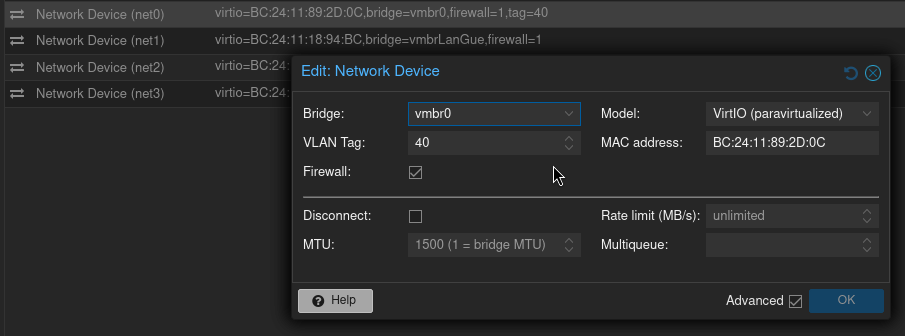
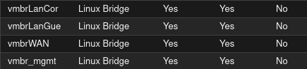
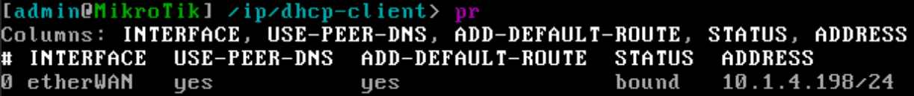
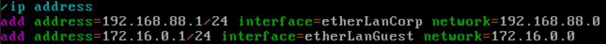
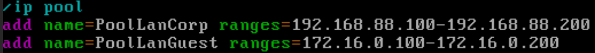
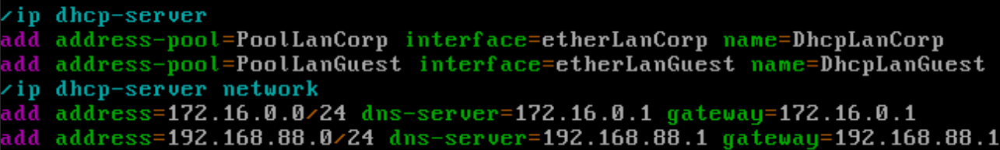
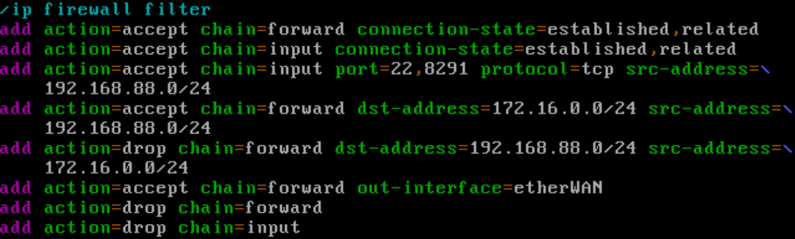
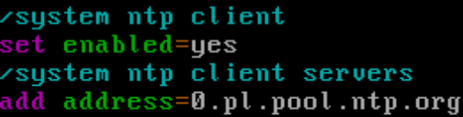

# MTCNA Lab

My first lab oriented to be like a task similar to the MTCNA exam.

## Topology

The goal here was to create a small network with a single router that would feature the things below:
*   One network for corporate devices
*   One network for guests
*   Dynamic IP address on WAN interface (rotated by ISP)
*   Security that would allow corporate devices to access guest devices but not vice-versa
*   Router Management access from Corporate network.

The first thing that I thought about, was how can I simulate a Dynamic IP Address from an ISP in my lab.  
What I figured was that I already have a DHCP Server for VMs running on my CCR2004. 
So instead of creating another `vmbr` for WAN interface, I simply added a vNIC for the CHR on the `vmbr0`. 
The CHR would get assigned an IP from my VLAN 40 without being aware about any VLAN Tagging.  

A very important thing was to add a VLAN tag to the vNIC in the VM settings. You can see that below  

Earlier I created 4 bridges:   

  

Since all vNICs and bridges are set up, I can then get into the actual configuration.  

I configured the `CHR0` through the Proxmox NoVNC Console.   

First thing to do was to add a DHCP Client on the `etherWAN` interface.

  

After a while I checked if the `etherWAN` interface got a IP address from my VMs VLAN and it worked:  

  

I won't place a screenshot of every single command since that would be a lot of copying and pasting. I will just place bigger fragments of configuration  

Then I assigned IP addresses

Then I created neccessary pools of IP addresses for DHCP  

   

Then the DHCP Servers and networks for them. I also added the CHR0 as a DNS server itself so the repeatable DNS queries would be faster.  

   

A important thing was to add NAT to masquerade all outgoing traffic as one IP address (the CHR0 WAN IP)  

   

Then of course the firewall.  
The key thing was to restrict access from LanGuest to LanCorp. I chose a deny-by-default policy. Im only allowing specific allowed traffic and then just dropping everything that didn't fit to any of the rules above.  

  

The last things was to add NTP servers and DNS servers  

   

