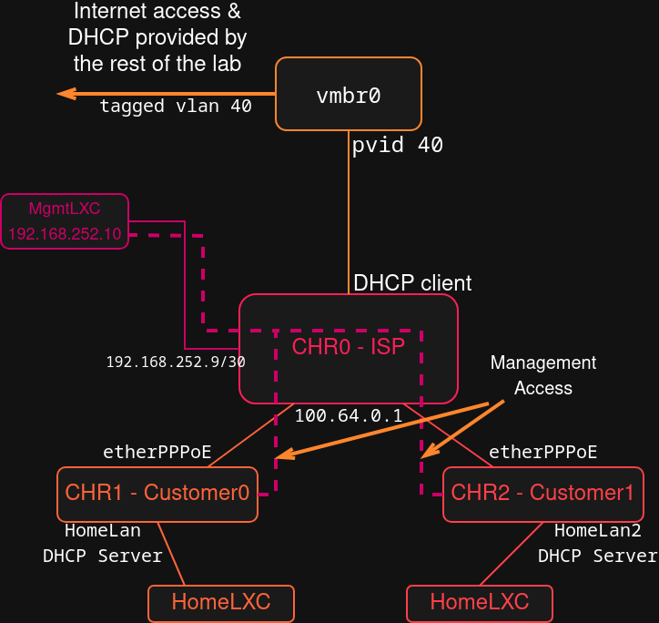

# Second MTCNA Lab

Here I wanted to create a bit more advanced topology and simulate PPPoE connection with an ISP from the Home Router.  

This project was intended to be a simulation of a small ISP network environment where subscribers have to authenticate themselves through PPPoE before being able to access the internet.  

Key things to achieve:
*   Central ISP Router as PPPoE server
*   Client authentication using name and password
*   Dynamic IP assigning from CGNAT Pool
*   Handling of multiple, fully separated clients
*   ISP Router security
*   Management access for Home Routers for ISP Administrator

# Topology



*   **CHR0** - Central ISP Router. Authenticates clients and provides internet access.
*   **CHR1** - Home router for first customer
*   **CHR2** - Home router for second customer
*   **HomeLXC / HomeLXC2** - PCs in customers' networks
*   **Proxmox bridges:**
    *   `vmbr0` - Connection to the outside world for the ISP. Has a PVID 40 on the connection to the CHR0. This way the ISP Router does not have to care about VLANs while it's traffic is still properly segregated from the perspective of the rest of my network. 
    *   `vmbr_PPPoE` - Simulates the physical connection for the clients.
    *   `vmbr_Home/vmbr_Home2` - Isolated home networks for each client.
    *   `vmbr_mgmt` - Dedicated network for ISP router management.


To make this environment scalable and elastic I specified one PPPoE profile that defines the service, IP Pool, DNS etc. and then I create separate secrets for each client.
This makes it easy to manage and for example, I can set a QoS rule for every client using one single command. 
Simply by changing the profile options that are used by all clients instead of setting something for one client at a time.   


To simulate different homes and networks I created separate bridges and added vNICs for the Home routers on an appropriate bridge. So all clients are separated on Layer 2.  

To secure the ISP Central Router I created a dedicated small management network (`192.168.252.8/30`). 
Administrative access is available only from this exact network and physical interface on the ISP Router (`etherMgmtInternal`) and only on ports 22 and 8291.  

Management access for Home Routers and ISP Central Router is only possible from dedicated ISP Management Network.  

> [!NOTE]
> Here are full configurations for the Routers. Just click on the triangle symbol to extend them.
> However if you want to see more how I did all that you can check farther below.


<details>
<summary>**CHR0 Configuration**</summary>

```rsc
# 2025-08-11 15:44:25 by RouterOS 7.19.4
# system id = Y2/9NO8HsLD
#
/interface ethernet
set [ find default-name=ether3 ] disable-running-check=no name=etherMgmtInternal
set [ find default-name=ether2 ] disable-running-check=no name=etherPPPoE
set [ find default-name=ether1 ] disable-running-check=no name=etherWAN
/ip pool
add name=PoolPPPoE ranges=100.64.0.10-100.64.0.20
/ppp profile
add dns-server=1.1.1.1,8.8.8.8 local-address=100.64.0.1 name=CustomerProfile0 remote-address=PoolPPPoE
/interface pppoe-server server
add default-profile=CustomerProfile0 disabled=no interface=etherPPPoE service-name=pppoeservice
/ip address
add address=100.64.0.1/24 interface=etherPPPoE network=100.64.0.0
add address=192.168.252.9/30 interface=etherMgmtInternal network=192.168.252.8
/ip dhcp-client
add interface=etherWAN
/ip firewall filter
add action=accept chain=input connection-state=established,related
add action=accept chain=forward connection-state=established,related
add action=accept chain=input in-interface=etherMgmtInternal protocol=icmp
add action=accept chain=input in-interface=etherMgmtInternal port=22,8291 protocol=tcp src-address=192.168.252.8/30
add action=accept chain=forward dst-address=100.64.0.0/24 dst-port=22 in-interface=etherMgmtInternal protocol=tcp src-address=192.168.252.8/30
add action=drop chain=forward connection-state=new dst-port=445 in-interface=etherWAN protocol=tcp
add action=drop chain=forward connection-state=new dst-port=445 in-interface=etherWAN protocol=udp
add action=accept chain=forward out-interface=etherWAN
add action=accept chain=input in-interface=all-ppp protocol=icmp
add action=drop chain=input
add action=drop chain=forward
/ip firewall nat
add action=masquerade chain=srcnat out-interface=etherWAN
/ppp secret
add name=customer0 profile=CustomerProfile0 service=pppoe
add name=customer1 profile=CustomerProfile0 service=pppoe
/system console screen
set line-count=40
```
</details>

<details>
<summary>**CHR1 Configuration**</summary>
```rsc
# 2025-08-11 15:49:47 by RouterOS 7.19.4
# system id = Wp+T0I1KPqD
#
/interface ethernet
set [ find default-name=ether2 ] disable-running-check=no name=HomeLan
set [ find default-name=ether1 ] disable-running-check=no name=etherPPPoE
/interface pppoe-client
add add-default-route=yes dial-on-demand=yes disabled=no interface=etherPPPoE name=pppoe-out1 service-name=pppoeservice user=customer0
/ip pool
add name=HomeLanPool ranges=192.168.0.100-192.168.0.254
/ip dhcp-server
add address-pool=HomeLanPool interface=HomeLan lease-time=4w2d name=HomeLanDHCP
/ip address
add address=192.168.0.1/24 interface=HomeLan network=192.168.0.0
/ip dhcp-server network
add address=192.168.0.0/24 dns-server=1.1.1.1,8.8.8.8 gateway=192.168.0.1
/ip firewall filter
add action=accept chain=forward connection-state=established,related
add action=accept chain=input connection-state=established,related
add action=accept chain=input dst-port=22 protocol=tcp src-address=192.168.252.8/30
add action=accept chain=input protocol=icmp
add action=accept chain=forward protocol=icmp
add action=accept chain=forward out-interface=pppoe-out1
add action=drop chain=input
add action=drop chain=forward
/ip firewall nat
add action=masquerade chain=srcnat out-interface=pppoe-out1
```
</details>

<details>
<summary>**CHR2 Configuratoin**</summary>
```rsc
# 2025-08-11 15:51:14 by RouterOS 7.19.4
# system id = gtPyFiX7hJK
#
/interface ethernet
set [ find default-name=ether2 ] disable-running-check=no name=HomeLan2
set [ find default-name=ether1 ] disable-running-check=no name=etherPPPoE
/interface pppoe-client
add add-default-route=yes dial-on-demand=yes disabled=no interface=etherPPPoE name=pppoe-out1 service-name=pppoeservice user=customer1
/ip pool
add name=HomeLanPool ranges=192.168.0.100-192.168.0.254
/ip dhcp-server
add address-pool=HomeLanPool interface=HomeLan2 lease-time=4w2d name=HomeLanDHCP
/ip address
add address=192.168.0.1/24 interface=HomeLan2 network=192.168.0.0
/ip dhcp-server network
add address=192.168.0.0/24 dns-server=1.1.1.1,8.8.8.8 gateway=192.168.0.1
/ip firewall filter
add action=accept chain=forward connection-state=established,related
add action=accept chain=input connection-state=established,related
add action=accept chain=input dst-port=22 protocol=tcp src-address=192.168.252.8/30
add action=accept chain=input protocol=icmp
add action=accept chain=forward protocol=icmp
add action=accept chain=forward out-interface=pppoe-out1
add action=drop chain=input
add action=drop chain=forward
/ip firewall nat
add action=masquerade chain=srcnat out-interface=pppoe-out1
```
</details>

