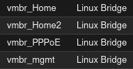

# Second MTCNA Lab

Here I wanted to create a bit more advanced topology and simulate PPPoE connection with an ISP from the Home Router.  

This project was intended to be a simulation of a small ISP network environment where subscribers have to authenticate themselves through PPPoE before being able to access the internet. It features Proxmox VE as the hypervisor and MikroTik CHRs as the Routers.

> [!NOTE]
> As much as I would like to add QoS based on the PPPoE customers profile, I cannot do that because the free version of CHR already limits all interfaces to 1Mbps.

Key things to achieve:
*   Central ISP Router as PPPoE server
*   Client authentication using name and password
*   Dynamic IP assigning from CGNAT Pool
*   Handling of multiple, fully separated clients
*   ISP Router security
*   Management access for Home Routers for ISP Administrator

# Topology


*   **CHR0** - Central ISP Router. Authenticates clients and provides internet access.
*   **CHR1** - Home router for first customer
*   **CHR2** - Home router for second customer
*   **HomeLXC / HomeLXC2** - PCs in customers' networks
*   **Proxmox bridges:**
    *   `vmbr0` - Connection to the outside world for the ISP. Has a PVID 40 on the connection to the CHR0. This way the ISP Router does not have to care about VLANs while it's traffic is still properly segregated from the perspective of the rest of my network. 
    *   `vmbr_PPPoE` - Simulates the physical connection for the clients.
    *   `vmbr_Home/vmbr_Home2` - Isolated home networks for each client.
    *   `vmbr_mgmt` - Dedicated network for ISP router management.

### Key terms

Since some terms might be not very clear, here are abbreviations of the shortened names
*   **CHR** - Cloud Hosted Router - MikroTik's implementation of RouterOS for virtual machines
*   **LXC** - Linux Container - A more lightweight alternative for VMs. It shares the kernel with the host machine.
*   **vNIC** - Virtual Network Interface Card - Simply a virtualized network adapter like `VMware vxnet3`


To make this environment scalable and elastic I specified one PPPoE profile that defines the service, IP Pool, DNS etc. and then I create separate secrets for each client.
This makes it easy to manage and for example, I can set a QoS rule for every client using one single command. 
Simply by changing the profile options that are used by all clients instead of setting something for one client at a time.   


To simulate different homes and networks I created separate bridges and added vNICs for the Home routers on an appropriate bridge. So all clients are separated on Layer 2.  

To secure the ISP Central Router I created a dedicated small management network (`192.168.252.8/30`). 
Administrative access is available only from this exact network and physical interface on the ISP Router (`etherMgmtInternal`) and only on ports 22 and 8291.  

Management access for Home Routers and ISP Central Router is only possible from dedicated ISP Management Network.  

> [!NOTE]
> Here are full configurations for the Routers. Just click on the triangle symbol to extend them.
> However if you want to see more how I did all that you can check farther below. Also, I won't place screenshots of everything since now I am able to copy and paste the commands instead of just screenshoting the NoVNC Console.


<details>
<summary><h2>CHR0 Configuration</h2></summary>

```rsc
# 2025-08-11 15:44:25 by RouterOS 7.19.4
# system id = Y2/9NO8HsLD
#
/interface ethernet
set [ find default-name=ether3 ] disable-running-check=no name=etherMgmtInternal
set [ find default-name=ether2 ] disable-running-check=no name=etherPPPoE
set [ find default-name=ether1 ] disable-running-check=no name=etherWAN
/ip pool
add name=PoolPPPoE ranges=100.64.0.10-100.64.0.20
/ppp profile
add dns-server=1.1.1.1,8.8.8.8 local-address=100.64.0.1 name=CustomerProfile0 remote-address=PoolPPPoE
/interface pppoe-server server
add default-profile=CustomerProfile0 disabled=no interface=etherPPPoE service-name=pppoeservice
/ip address
add address=100.64.0.1/24 interface=etherPPPoE network=100.64.0.0
add address=192.168.252.9/30 interface=etherMgmtInternal network=192.168.252.8
/ip dhcp-client
add interface=etherWAN
/ip firewall filter
add action=accept chain=input connection-state=established,related
add action=accept chain=forward connection-state=established,related
add action=accept chain=input in-interface=etherMgmtInternal protocol=icmp
add action=accept chain=input in-interface=etherMgmtInternal port=22,8291 protocol=tcp src-address=192.168.252.8/30
add action=accept chain=forward dst-address=100.64.0.0/24 dst-port=22 in-interface=etherMgmtInternal protocol=tcp src-address=192.168.252.8/30
add action=drop chain=forward connection-state=new dst-port=445 in-interface=etherWAN protocol=tcp
add action=drop chain=forward connection-state=new dst-port=445 in-interface=etherWAN protocol=udp
add action=accept chain=forward out-interface=etherWAN
add action=accept chain=input in-interface=all-ppp protocol=icmp
add action=drop chain=input
add action=drop chain=forward
/ip firewall nat
add action=masquerade chain=srcnat out-interface=etherWAN
/ppp secret
add name=customer0 profile=CustomerProfile0 service=pppoe
add name=customer1 profile=CustomerProfile0 service=pppoe
/system console screen
set line-count=40
```
</details>

<details>
<summary><h2>CHR1 Configuration</h2></summary>

```rsc
# 2025-08-11 15:49:47 by RouterOS 7.19.4
# system id = Wp+T0I1KPqD
#
/interface ethernet
set [ find default-name=ether2 ] disable-running-check=no name=HomeLan
set [ find default-name=ether1 ] disable-running-check=no name=etherPPPoE
/interface pppoe-client
add add-default-route=yes dial-on-demand=yes disabled=no interface=etherPPPoE name=pppoe-out1 service-name=pppoeservice user=customer0
/ip pool
add name=HomeLanPool ranges=192.168.0.100-192.168.0.254
/ip dhcp-server
add address-pool=HomeLanPool interface=HomeLan lease-time=4w2d name=HomeLanDHCP
/ip address
add address=192.168.0.1/24 interface=HomeLan network=192.168.0.0
/ip dhcp-server network
add address=192.168.0.0/24 dns-server=1.1.1.1,8.8.8.8 gateway=192.168.0.1
/ip firewall filter
add action=accept chain=forward connection-state=established,related
add action=accept chain=input connection-state=established,related
add action=accept chain=input dst-port=22 protocol=tcp src-address=192.168.252.8/30
add action=accept chain=input protocol=icmp
add action=accept chain=forward protocol=icmp
add action=accept chain=forward out-interface=pppoe-out1
add action=drop chain=input
add action=drop chain=forward
/ip firewall nat
add action=masquerade chain=srcnat out-interface=pppoe-out1
```
</details>

<details>
<summary><h2>CHR2 Configuratoin</h2></summary>

```rsc
# 2025-08-11 17:45:11 by RouterOS 7.19.4
# system id = gtPyFiX7hJK
#
/interface ethernet
set [ find default-name=ether2 ] disable-running-check=no name=HomeLan2
set [ find default-name=ether1 ] disable-running-check=no name=etherPPPoE
/interface pppoe-client
add add-default-route=yes dial-on-demand=yes disabled=no interface=etherPPPoE name=pppoe-out1 service-name=pppoeservice user=customer1
/ip pool
add name=HomeLanPool2 ranges=192.168.0.100-192.168.0.254
/ip dhcp-server
add address-pool=HomeLanPool2 interface=HomeLan2 lease-time=4w2d name=HomeLanDHCP2
/ip address
add address=192.168.0.1/24 interface=HomeLan2 network=192.168.0.0
/ip dhcp-server network
add address=192.168.0.0/24 dns-server=1.1.1.1,8.8.8.8 gateway=192.168.0.1
/ip firewall filter
add action=accept chain=forward connection-state=established,related
add action=accept chain=input connection-state=established,related
add action=accept chain=input dst-port=22 protocol=tcp src-address=192.168.252.8/30
add action=accept chain=input protocol=icmp
add action=accept chain=forward protocol=icmp
add action=accept chain=forward out-interface=pppoe-out1
add action=drop chain=input
add action=drop chain=forward
/ip firewall nat
add action=masquerade chain=srcnat out-interface=pppoe-out1
```
</details>


# Configuration

First thing to do was to set up the isolated environment for the lab.  

I created neccessary bridges:  
  

Then I added two vNICs for each Home Router and three vNICs for the Central ISP Router.  

> [!IMPORTANT]
> I don't really know why but I am not able to get more than ~3-4Gbps of bandwidth in inter-VLAN routing between a bare-metal machine and a VM using a VMware vNIC.
> **`VMware vxnet3`** should fully work since it's specifically made for virtualization. However since it doesn't provide full line-speed transfer, I switched to VirtIO vNIC. For now I think it's just that VirtIO is better accomodated with KVM.


*   **CHR0**
    *   net0 - `vmbr0`, `tag 40`
    *   net1 - `vmbr_PPPoE`
    *   net2 - `vmbr_mgmt`
*   **CHR1**
    *   net0 - `vmbr_PPPoE`
    *   net1 - `vmbr_Home`
*   **CHR2**
    *   net0 - `vmbr_PPPoE`
    *   net1 - `vmbr_Home2`

And also one vNIC for each LXC

*   **MgmtLXC**
    *   `mgmteth0` - `vmbr_mgmt`
*   **HomeLXC**
    *   `laneth0` - `vmbr_Home`
*   **HomeLXC**
    *   `laneth0` - `vmbr_Home2`

After that I could get into the CHR0 NoVNC console.

First thing I did wasto change the default names to make everything more clear.  
```rsc
/interface ethernet
set [ find default-name=ether3 ] name=etherMgmtInternal
set [ find default-name=ether2 ] name=etherPPPoE
set [ find default-name=ether1 ] name=etherWAN
```
Then I set a DHCP Client on the WAN interface. 

> [!NOTE]
> Keep in mind that this was exactly why I didn't create a separate WAN bridge and I just used the one already connected to my network. By assigning PVID 40 to the vNIC on the `vmbr0`, I ensured that the CHR0 does not have to even know about VLAN Tags. The `vmbr0` bridge takes care of all that and keeps it like so the traffic is properly segmented.

```rsc
/ip dhcp-client
add interface=etherWAN
```
Then I already set Masquerading on the WAN interface.  
```rsc
/ip firewall nat
add action=masquerade chain=srcnat out-interface=etherWAN
```
Then I defined the IP Pool for the subscribers.
```rsc
/ip pool
add name=PoolPPPoE ranges=100.64.0.10-100.64.0.20
```
Then I got into the actual PPPoE config
```rsc
/ppp profile
add dns-server=1.1.1.1,8.8.8.8 local-address=100.64.0.1 name=CustomerProfile0 remote-address=PoolPPPoE
```
"Remote-address" above is a bit weird named in my opinion cause I didn't thought that this would be simply the IP Pool dedicated to the subscribers.  

Then I created a PPPoE Server using the template made above
```rsc
/interface pppoe-server server
add default-profile=CustomerProfile0 disabled=no interface=etherPPPoE service-name=pppoeservice
```
Then I set up the accounts for the subscribers
```rsc
/ppp secret
add name=customer0 profile=CustomerProfile0 service=pppoe
add name=customer1 profile=CustomerProfile0 service=pppoe
```
The passwords are not visible here, because RouterOS understands that it's a sensitive information. 
However the setup of a account for a subscriber looks like this:
```rsc
[admin@MikroTik] /ppp/secret> add name=customer2 password=customer2 service=pppoe profile=CustomerProfile0
```
Then I had to set a IP address on the neccessary interfaces, being the one on which the subscribers are connected, and the one on which would be management access.
```rsc
/ip address
add address=100.64.0.1/24 interface=etherPPPoE network=100.64.0.0
add address=192.168.252.9/30 interface=etherMgmtInternal network=192.168.252.8
```
As you might see there is a weird IP address on the Management interface. 
This is just an idea I got because I read about "security-by-obscurity". 
So logically it's more probable that someone will try to SSH into `192.168.0.1`, instead of `192.168.252.9`  


Then a very very important part being the firewall. 
And since this is not just a small company network but oriented more to be like an ISP Network, it has to be really hardened.  

I chose the "deny-by-default" policy whilst also explicitly dropping dangerous connections, being the port used by SMB, just for safety.
```rsc
/ip firewall filter
add action=accept chain=input connection-state=established,related
add action=accept chain=forward connection-state=established,related
add action=accept chain=input in-interface=etherMgmtInternal protocol=icmp
add action=accept chain=input in-interface=etherMgmtInternal port=22,8291 protocol=tcp src-address=192.168.252.8/30
add action=accept chain=forward dst-address=100.64.0.0/24 dst-port=22 in-interface=etherMgmtInternal protocol=tcp src-address=192.168.252.8/30
add action=drop chain=forward connection-state=new dst-port=445 in-interface=etherWAN protocol=tcp
add action=drop chain=forward connection-state=new dst-port=445 in-interface=etherWAN protocol=udp
add action=accept chain=forward out-interface=etherWAN
add action=accept chain=input in-interface=all-ppp protocol=icmp
add action=drop chain=input
add action=drop chain=forward
```
This rule:
```rsc
add action=accept chain=forward dst-address=100.64.0.0/24 dst-port=22 in-interface=etherMgmtInternal protocol=tcp src-address=192.168.252.8/30
```
Is very important. 
It allows for remote management of the Home Routers from the same interface and network that the ISP CHR management is available on.  

Then the only thing thats left, is to configure and authenticate the clients on the Home Routers.

first thing I did was of course to set a more clear names for the interfaces
```rsc
/interface ethernet
set [ find default-name=ether2 ] name=HomeLan
set [ find default-name=ether1 ] name=etherPPPoE
```
Then the crucial authentication to be able to access the network
```rsc
/interface pppoe-client
add add-default-route=yes dial-on-demand=yes disabled=no interface=etherPPPoE name=pppoe-out1 service-name=pppoeservice user=customer0
```
> [!IMPORTANT]
> There are a couple of important things to note in this part:   
> `add-default-route` - This is very important as without this I would need to manually set `ip route add dst-address=0.0.0.0/0 gateway=100.64.0.1`.   
> `name=pppoe-out1` - This is also a pretty important thing as this is not just a name for the setting but this will create a interface with that name which is relevant later.   
> `dial-on-demand=yes` - At first I did not set this and I was suprised why the PPP authentication didn't work.   

Then I set the IP pool and the DHCP server and network for the Home Lan.
```rsc
/ip pool
add name=HomeLanPool ranges=192.168.0.100-192.168.0.254
/ip dhcp-server
add address-pool=HomeLanPool interface=HomeLan lease-time=30d name=HomeLanDHCP
/ip dhcp-server network
add address=192.168.0.0/24 dns-server=1.1.1.1,8.8.8.8 gateway=192.168.0.1
```
Then of course an IP on the Lan interface.
```rsc
/ip address
add address=192.168.0.1/24 interface=HomeLan
```
Then masquerading
```rsc
/ip firewall nat
add action=masquerade chain=srcnat out-interface=pppoe-out1
```
And again the super important firewall configuration. 
Of course I choose again "deny-by-default" policy.
Take a look at the third rule. I will explain it below
```rsc
/ip firewall filter
add action=accept chain=forward connection-state=established,related
add action=accept chain=input connection-state=established,related
add action=accept chain=input dst-port=22 protocol=tcp src-address=192.168.252.8/30
add action=accept chain=input protocol=icmp
add action=accept chain=forward protocol=icmp
add action=accept chain=forward out-interface=pppoe-out1
add action=drop chain=input
add action=drop chain=forward
```
> [!IMPORTANT]
> The third rule in this firewall configuration is responsible for providing management acces from and ONLY from the Management network.
> At first I set up the `src-address` to `100.64.0.0/24`, and it did not work. There is actually a clear reason why it didn't work. 
> It's because NAT is configured only on the WAN interface of the ISP Router. The process when routing is so it first checks what is the destination address, then through what interface the destination address is available, and only after that it checks if the source address should be masked or not.
> To get from the management network (`192.168.252.8/30`) to the CGNAT network (`100.64.0.0/24`), the packet does not have to go out of the WAN interface. Therefore, NAT does not take place. So the packet from the Management network, arrives at the Home Router with the same source address of `192.168.252.8/30` instead of the CGNAT network gateway (`100.64.0.1`).

> [!NOTE]
> As I earlier said, the name of the PPPoE-Client interface is relevant. See the sixth rule of the firewall. If I set `out-interface` to `etherPPPoE`, it would not work. That is because the `etherPPPoE` is only a physical interface. Therefore If a packet was sent only through it, bypassing the PPPoE interface, it couldn't be properly proccessed by the ISPs PPPoE Server.

Next comes the final step, which is ensuring that everything works.  
As you can see, the routers got properly authenticated and got assigned a IP address.  
From the Home router perspective:
```rsc
[admin@MikroTik] > ip address/print
Flags: D - DYNAMIC
Columns: ADDRESS, NETWORK, INTERFACE
#   ADDRESS         NETWORK      INTERFACE
0 D 100.64.0.20/32  100.64.0.1   pppoe-out1
1   192.168.0.1/24  192.168.0.0  HomeLan
```
> [!NOTE]
> **As I mentioned above again**, as you can see it's not the `etherPPPoE` interface that got assigned a dynamic IP. It's the virtual PPP interface. Its actually even in the name "PPPoE". **PPP**, **o**ver, **E**thernet. The PPP protocol goes over the physical ethernet connection.  

And from the ISP Router perspective
```rsc
[admin@MikroTik] > ppp active/print
Columns: NAME, SERVICE, CALLER-ID, ADDRESS, UPTIME
# NAME       SERVICE  CALLER-ID          ADDRESS      UPTIME  
0 customer0  pppoe    BC:24:11:81:B1:47  100.64.0.20  6h40m23s
1 customer1  pppoe    BC:24:11:3A:89:9D  100.64.0.19  5h47m35s
```

Also here is the output of `traceroute` from the HomeLXC.
```bash
root@HomeLXC:~# traceroute 1.1.1.1
traceroute to 1.1.1.1 (1.1.1.1), 30 hops max, 60 byte packets
 1  192.168.0.1 (192.168.0.1)  0.445 ms  0.386 ms  0.365 ms
 2  100.64.0.1 (100.64.0.1)  3.956 ms  3.942 ms  3.925 ms
 3  10.1.4.1 (10.1.4.1)  3.904 ms  3.885 ms  3.863 ms
 4  172.16.255.1 (172.16.255.1)  3.833 ms  3.801 ms  3.784 ms
 5  10.0.0.1 (10.0.0.1)  1.932 ms  1.057 ms  1.886 ms
 6  192.168.251.254 (192.168.251.254)  2.136 ms  2.572 ms  3.476 ms
 ...
```
*   The 1st hop is the Home Router gateway (CHR1)  
*   The 2nd hop is the CGNAT gateway
*   The third hop is already ouside the MTCNA Lab. Its the VLAN 40 SVI on the CRS326.
*   4th hop is the CCR2004 interface on the inter-router link where OSPF is running.
*   5th hop is the ISP-provided router LAN gateway.
*   6th hop is most likely the Gateway in my ISPs CGNAT network.


