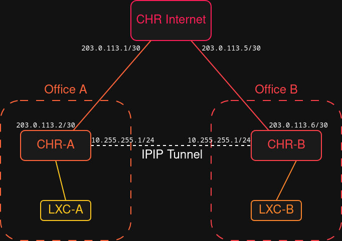

# Third MTCNA Lab - Site to Site connectivity with IPIP

The goal here was to create a connection between two remote offices of a fictional company over a public, untrusted network. 
The primary technology I used here is an IPIP Tunnel which creates a virtual Layer 3 link.   

Both offices of the company have Public IP addresses, and I wanted to connect those offices so that they could connect like they were in the same network.  

What I achieved was a Layer 3 virtual connection between those two offices and Router management from local office and also from remote office.

# Topology

So I created three CHRs and four Linux bridges.  
The main CHR simulates the global internet in a super simple way. 
The only thing it really does is route traffic between inter-router links to the two company offices.  

Below is a list of the vNICs added to the Routers and the PCs in those two offices.   

*   **CHR-Internet** - Simulates global network
    *   `net0`, `ethWAN_A` - `vmbr_WAN_A`
    *   `net1`, `ethWAN_B` - `vmbr_WAN_B`

*   **CHR-A** - Office A of the company
    *   `net0`, `ethWAN_A` - `vmbr_WAN_A`
    *   `net1`, `ethLAN_A` - `vmbr_LAN_A`

*   **CHR-B** - Office B of the company
    *   `net0`, `ethWAN_B` - `vmbr_WAN_B`
    *   `net1`, `ethLAN_B` - `vmbr_LAN_B`    

*   **LXC-A** - A PC in office A
    *   `eth0` - `vmbr_LAN_A`

*   **LXC-B** - A PC in office B
    *   `eth0` - `vmbr_LAN_B`

