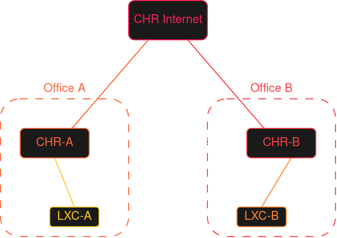

# Third MTCNA Lab - Site to Site connectivity with IPIP

The goal here was to create a connection between two remote offices of a fictional company over a public, untrusted network. 
The primary technology I used here is an IPIP Tunnel which creates a virtual Layer 3 link.   

Both offices of the company have Public IP addresses, and I wanted to connect those offices so that they could connect like they were in the same network.  

What was achieved: 
*   Layer 3 virtual connection between two offices using IPIP
*   Remote router management for both officess from one to another

# Topology




So I created three CHRs and five Linux bridges.  
The main CHR simulates the global internet in a super simple way. 
The only thing it really does is route traffic between inter-router links to the two company offices.  

Below is a list of the vNICs added to the Routers and the PCs in those two offices and also the IP addresses.   


*   **CHR-Internet** - Simulates global network
    *   `net0`, `ethWAN_A` - `vmbr_WAN_A` - `203.0.113.1/30`
    *   `net1`, `ethWAN_B` - `vmbr_WAN_B` - `203.0.113.5/30`
    *   `net2`, `ethMGMT`  - `ISP_MGMT`   - `172.30.255.9/30`

*   **CHR-A** - Office A of the company
    *   `net0`, `ethWAN_A` - `vmbr_WAN_A` - `203.0.113.2/30`
    *   `net1`, `ethLAN_A` - `vmbr_LAN_A` - `192.168.10.1/24`
    *   `ipip-to-b` - `10.255.255.1/30`

*   **CHR-B** - Office B of the company
    *   `net0`, `ethWAN_B` - `vmbr_WAN_B` - `203.0.113.6/30`
    *   `net1`, `ethLAN_B` - `vmbr_LAN_B` - `192.168.20.1/24`   
    *   `ipip-to-a` - `10.255.255.2/30`

*   **LXC-A** - A PC in office A
    *   `eth0` - `vmbr_LAN_A` - DHCP

*   **LXC-B** - A PC in office B
    *   `eth0` - `vmbr_LAN_B` - DHCP

*   **LXC-MGMT** - Administrative access for the `CHR Internet`
    *   `eth0` - `ISP_MGMT` - `172.30.255.10/30`


Here are the full configurations for the devices. 
If you want so see how I configured everything step-by-step, check below.

<details>
<summary><h2>CHR Internet</h2></summary>

```rsc
/interface ethernet
set [ find default-name=ether3 ] disable-running-check=no name=ethMGMT
set [ find default-name=ether1 ] disable-running-check=no name=ethWAN_A
set [ find default-name=ether2 ] disable-running-check=no name=ethWAN_B
/interface list
add name=NET_A
add name=NET_B
add name=NET_MGMT
/interface list member
add interface=ethWAN_A list=NET_A
add interface=ethWAN_B list=NET_B
add interface=ethMGMT list=NET_MGMT
/ip address
add address=203.0.113.1/30 interface=ethWAN_A network=203.0.113.0
add address=203.0.113.5/30 interface=ethWAN_B network=203.0.113.4
add address=172.30.255.9/30 interface=ethMGMT network=172.30.255.8
/ip firewall filter
add action=accept chain=forward in-interface-list=NET_A out-interface-list=NET_B
add action=accept chain=forward in-interface-list=NET_B out-interface-list=NET_A
add action=accept chain=input in-interface-list=NET_MGMT port=22,8291 protocol=tcp
add action=drop chain=forward
add action=drop chain=input
```

</details>


<details>
<summary><h2>CHR Office A</h2></summary>

```rsc
/interface ethernet
set [ find default-name=ether2 ] disable-running-check=no name=ethLAN_A
set [ find default-name=ether1 ] disable-running-check=no name=ethWAN_A
/interface ipip
add local-address=203.0.113.2 name=ipip-to-B remote-address=203.0.113.6
/ip pool
add name=PoolLanA ranges=192.168.10.50-192.168.10.254
/ip dhcp-server
add address-pool=PoolLanA interface=ethLAN_A lease-time=8w4d name=DHCP_A
/ip address
add address=203.0.113.2/30 interface=ethWAN_A network=203.0.113.0
add address=192.168.10.1/24 interface=ethLAN_A network=192.168.10.0
add address=10.255.255.1/30 interface=ipip-to-B network=10.255.255.0
/ip dhcp-server network
add address=192.168.10.0/24 gateway=192.168.10.1
/ip firewall filter
add action=accept chain=forward connection-state=established,related
add action=accept chain=input connection-state=established,related
add action=accept chain=forward dst-address=192.168.20.0/24 src-address=192.168.10.0/24
add action=accept chain=forward dst-address=192.168.10.0/24 src-address=192.168.20.0/24
add action=accept chain=input port=22,8291 protocol=tcp src-address=192.168.10.0/24
add action=accept chain=input port=22,8291 protocol=tcp src-address=192.168.20.0/24
add action=accept chain=forward out-interface=ipip-to-B
add action=accept chain=forward out-interface=ethWAN_A
add action=drop chain=input
add action=drop chain=forward
/ip firewall nat
add action=masquerade chain=srcnat dst-address=!192.168.20.0/24 out-interface=ethWAN_A
/ip route
add dst-address=0.0.0.0/0 gateway=203.0.113.1
add dst-address=192.168.20.0/24 gateway=10.255.255.2
```

</details>


<details>
<summary><h2>CHR Office B</h2></summary>

```rsc
/interface ethernet
set [ find default-name=ether2 ] disable-running-check=no name=ethLAN_B
set [ find default-name=ether1 ] disable-running-check=no name=ethWAN_B
/interface ipip
add local-address=203.0.113.6 name=ipip-to-A remote-address=203.0.113.2
/ip pool
add name=PoolLanB ranges=192.168.20.50-192.168.20.254
/ip dhcp-server
add address-pool=PoolLanB interface=ethLAN_B lease-time=8w4d name=DHCP_B
/ip address
add address=203.0.113.6/30 interface=ethWAN_B network=203.0.113.4
add address=192.168.20.1/24 interface=ethLAN_B network=192.168.20.0
add address=10.255.255.2/30 interface=ipip-to-A network=10.255.255.0
/ip dhcp-server network
add address=192.168.20.0/24 gateway=192.168.20.1
/ip firewall filter
add action=accept chain=forward connection-state=established,related
add action=accept chain=input connection-state=established,related
add action=accept chain=forward dst-address=192.168.20.0/24 src-address=192.168.10.0/24
add action=accept chain=forward dst-address=192.168.10.0/24 src-address=192.168.20.0/24
add action=accept chain=input port=22,8291 protocol=tcp src-address=192.168.10.0/24
add action=accept chain=input port=22,8291 protocol=tcp src-address=192.168.20.0/24
add action=accept chain=forward out-interface=ipip-to-A
add action=accept chain=forward out-interface=ethWAN_B
add action=drop chain=forward
add action=drop chain=input
/ip firewall nat
add action=masquerade chain=srcnat dst-address=!192.168.10.0/24 out-interface=ethWAN_B
/ip route
add dst-address=0.0.0.0/0 gateway=203.0.113.5
add dst-address=192.168.10.0/24 gateway=10.255.255.1
```

</details>


## Now the configuration part

First I changed the names of the interfaces on all routers.   

CHR-Internet:
```rsc
/interface ethernet
set [ find default-name=ether3 ] name=ethMGMT
set [ find default-name=ether1 ] name=ethWAN_A
set [ find default-name=ether2 ] name=ethWAN_B
```

CHR-A:
```rsc
/interface ethernet
set [ find default-name=ether2 ] name=ethLAN_A
set [ find default-name=ether1 ] name=ethWAN_A
```

CHR-B:
```rsc
/interface ethernet
set [ find default-name=ether2 ] name=ethLAN_B
set [ find default-name=ether1 ] name=ethWAN_B
```

Then I set IPs on the point-to-point links to the Offices on the CHR Internet
```rsc
/ip address
add address=203.0.113.1/30 interface=ethWAN_A
add address=203.0.113.5/30 interface=ethWAN_B
```
Then the appropriate IPs on the WAN interfaces in both offices  
Office A:  
```rsc
/ip address
add address=203.0.113.2/30 interface=ethWAN_A
```
Office B:  
```rsc
/ip address
add address=203.0.113.6/30 interface=ethWAN_B
```


