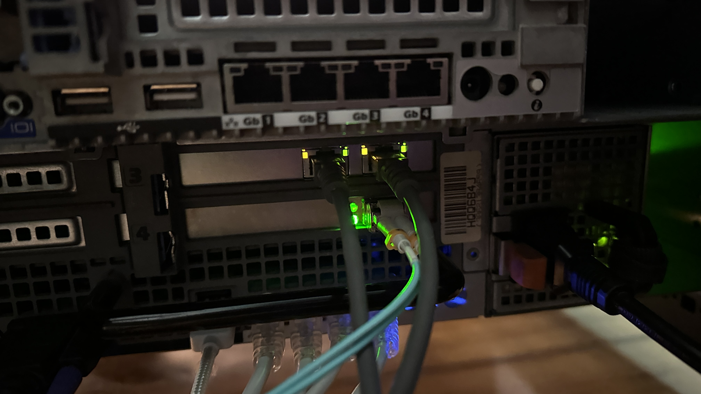

# Troubleshooting OSPF, L2 loop and PVE network configuration

In this case study I would like to talk about a massive issue that happened to me in my lab. 
It took down the entire OSPF Instance, completly disabled access from two ends of my network to each other and even made my server take almost 200% more power in idle.  

> [!NOTE]
> The solutions I did here are related to [02-vlan30-access-without-sfp-transreceivers](../02-vlan30-access-without-sfp-transreceivers) and [06-ospf-backbone](../06-ospf-backbone).
> It's not like all things in those projects are bad and here is the fix. This is more of an upgrade rather than fix.
> However, the bridge in the first project, was super fragile.

*   As much as Im trying to make everything as clear as I can, it's still pretty hard for me to write a perfect documentation, so please read everything because sometimes I forget to mention important things sooner.  

---

First I would like to state every IP address for clarity.   

*   **CCR2004**
    *   `ccr2004-mgmt`, `SVI 111` - `10.1.1.1/30` on `ether1`
    *   `inter-router-link0`, `SVI 100` - `172.16.255.1/30` 
<details>
<summary> config.rsc </summary>
    
```rsc
/interface bridge
add name=ccr2004-mgmt port-cost-mode=short
add name=loopback0
/interface vlan
add interface=sfp-sfpplus1 name=inter-router-link0 vlan-id=100
add interface=sfp-sfpplus1 name=vlan20-bare-metal vlan-id=20
add interface=sfp-sfpplus1 name=vlan30-users vlan-id=30
add interface=sfp-sfpplus1 name=vlan40-vms-cts vlan-id=40
add interface=sfp-sfpplus1 name=vlan111-ccr2004-mgmt vlan-id=111
/interface list
add name=ZONE-USERS
add name=ZONE-CCR2004-MGMT
add name=ZONE-WAN
add name=LINK-TO-CRS326
/interface lte apn
set [ find default=yes ] ip-type=ipv4 use-network-apn=no
/ip pool
add name=pool-bare-metal ranges=10.1.2.2-10.1.2.29
add name=pool-users ranges=10.1.3.50-10.1.3.200
add name=pool-vms-cts ranges=10.1.4.50-10.1.4.200
/ip dhcp-server
add address-pool=pool-users interface=vlan30-users lease-time=5d name=\
    dhcp-users
add address-pool=pool-vms-cts interface=inter-router-link0 lease-time=5d \
    name=dhcp-vlan40 relay=10.1.4.1
add address-pool=pool-bare-metal interface=inter-router-link0 lease-time=5d \
    name=dhcp-vlan20 relay=10.1.2.1
/port
set 0 name=serial0
/routing ospf instance
add disabled=no name=backbonev2 router-id=172.16.0.1
/routing ospf area
add disabled=no instance=backbonev2 name=backbone0v2
/interface bridge port
add bridge=ccr2004-mgmt comment="access for laptop" ingress-filtering=no \
    interface=ether1 internal-path-cost=10 path-cost=10
add bridge=ccr2004-mgmt interface=vlan111-ccr2004-mgmt
/interface list member
add interface=vlan30-users list=ZONE-USERS
add interface=sfp-sfpplus12 list=ZONE-WAN
add interface=ccr2004-mgmt list=ZONE-CCR2004-MGMT
add interface=inter-router-link0 list=LINK-TO-CRS326
/ip address
add address=10.0.0.150/24 comment=WAN interface=sfp-sfpplus12 network=\
    10.0.0.0
add address=10.1.3.1/24 interface=vlan30-users network=10.1.3.0
add address=10.1.1.1/30 interface=ccr2004-mgmt network=10.1.1.0
add address=172.16.255.1/30 interface=inter-router-link0 network=172.16.255.0
add address=172.16.0.1 interface=loopback0 network=172.16.0.1
/ip dhcp-server network
add address=10.1.2.0/27 dns-server=1.1.1.1 gateway=10.1.2.1
add address=10.1.3.0/24 dns-server=1.1.1.1 gateway=10.1.3.1
add address=10.1.4.0/24 dns-server=1.1.1.1 gateway=10.1.4.1
/ip dns
set servers=10.100.40.99,1.1.1.1
/ip firewall address-list
add address=10.1.1.4/30 list=CRS326-MGMT
add address=10.1.2.0/24 list=SERVERs-NET
add address=10.1.4.0/24 list=VMs/LXCs-NET
/ip firewall filter
add action=accept chain=input connection-state=established,related disabled=\
    yes
add action=accept chain=forward comment=\
    "Allowing already established connections" connection-state=\
    established,related disabled=yes
add action=accept chain=input disabled=yes in-interface-list=\
    ZONE-CCR2004-MGMT
add action=accept chain=input disabled=yes in-interface-list=LINK-TO-CRS326 \
    protocol=icmp
add action=accept chain=forward disabled=yes dst-address-list=SERVERs-NET \
    in-interface-list=ZONE-CCR2004-MGMT out-interface-list=LINK-TO-CRS326
add action=accept chain=forward disabled=yes dst-address-list=VMs/LXCs-NET \
    in-interface-list=ZONE-CCR2004-MGMT out-interface-list=LINK-TO-CRS326
add action=accept chain=forward disabled=yes in-interface-list=\
    ZONE-CCR2004-MGMT out-interface-list=ZONE-USERS
add action=accept chain=forward comment=\
    "Accept traffic between CCR2004 Management and CRS326 Management" \
    disabled=yes dst-address-list=CRS326-MGMT in-interface-list=\
    ZONE-CCR2004-MGMT out-interface-list=LINK-TO-CRS326 port=22,8291 \
    protocol=tcp
add action=drop chain=forward comment=\
    "Block traffic from users to networks behind CRS326" disabled=yes \
    in-interface-list=ZONE-USERS out-interface-list=LINK-TO-CRS326
add action=accept chain=forward disabled=yes in-interface-list=ZONE-USERS \
    out-interface-list=ZONE-WAN
add action=accept chain=forward disabled=yes in-interface-list=LINK-TO-CRS326 \
    out-interface-list=ZONE-WAN
add action=accept chain=forward disabled=yes in-interface-list=\
    ZONE-CCR2004-MGMT out-interface-list=ZONE-WAN
add action=drop chain=input disabled=yes
add action=drop chain=forward comment="Dropping all other forward traffic" \
    disabled=yes
/ip firewall nat
add action=masquerade chain=srcnat out-interface=sfp-sfpplus12
/ip route
add disabled=no dst-address=0.0.0.0/0 gateway=10.0.0.1
add dst-address=10.1.1.4/30 gateway=172.16.255.2
/ip service
set ftp disabled=yes
set telnet disabled=yes
set www disabled=yes
set api disabled=yes
/routing ospf interface-template
add area=backbone0v2 disabled=no networks=172.16.0.1/32 passive
add area=backbone0v2 disabled=no networks=172.16.255.0/30
add area=backbone0v2 disabled=no networks=10.1.3.0/24 passive
/system clock
set time-zone-name=Europe/Warsaw
/system identity
set name=core-ccr2004
/system resource irq rps
set ether1 disabled=no
```
    
</details>

*   **CRS326**
    *   `crs326-mgmt`, `SVI 115` - `10.1.1.5/30` on `ether1`
    *   `inter-router-link0`, `SVI 100` - `172.16.255.2/30`
    *   `vlan20-bare-metal`, `SVI 20` - `10.1.2.1/27` - untagged `vid 20` on `sfp-sfpplus2`
    *   `vlan40-vms-cts`, `SVI 40` - `10.1.4.1/24` - tagged `vid 40` on `sfp-sfpplus2`
<details>
<summary> config.rsc </summary>
    
```rsc
/interface bridge
add name=loopback0
add admin-mac=D4:01:C3:75:18:94 auto-mac=no comment=defconf name=main-bridge \
    vlan-filtering=yes
/interface vlan
add interface=main-bridge name=inter-router-link0 vlan-id=100
add interface=main-bridge name=vlan20-bare-metal vlan-id=20
add interface=main-bridge name=vlan40-vms-cts vlan-id=40
add interface=main-bridge name=vlan99-ospf vlan-id=99
add interface=main-bridge name=vlan115-crs326-mgmt vlan-id=115
/interface wireless security-profiles
set [ find default=yes ] supplicant-identity=MikroTik
/port
set 0 name=serial0
/routing ospf instance
add disabled=no name=backbonev2 router-id=172.16.0.2
/routing ospf area
add disabled=no instance=backbonev2 name=backbone0v2
/interface bridge port
add bridge=main-bridge interface=ether1 pvid=115 trusted=yes
add bridge=main-bridge interface=qsfpplus1-1
add bridge=main-bridge interface=qsfpplus1-2
add bridge=main-bridge interface=qsfpplus1-3
add bridge=main-bridge interface=qsfpplus1-4
add bridge=main-bridge interface=qsfpplus2-1
add bridge=main-bridge interface=qsfpplus2-2
add bridge=main-bridge interface=qsfpplus2-3
add bridge=main-bridge interface=qsfpplus2-4
add bridge=main-bridge interface=sfp-sfpplus5
add bridge=main-bridge interface=sfp-sfpplus6 pvid=30
add bridge=main-bridge interface=sfp-sfpplus7
add bridge=main-bridge interface=sfp-sfpplus8
add bridge=main-bridge interface=sfp-sfpplus9
add bridge=main-bridge interface=sfp-sfpplus10
add bridge=main-bridge interface=sfp-sfpplus11
add bridge=main-bridge interface=sfp-sfpplus12
add bridge=main-bridge interface=sfp-sfpplus13
add bridge=main-bridge interface=sfp-sfpplus14
add bridge=main-bridge interface=sfp-sfpplus15
add bridge=main-bridge interface=sfp-sfpplus16
add bridge=main-bridge interface=sfp-sfpplus17
add bridge=main-bridge interface=sfp-sfpplus18
add bridge=main-bridge interface=sfp-sfpplus19
add bridge=main-bridge interface=sfp-sfpplus20
add bridge=main-bridge interface=sfp-sfpplus21
add bridge=main-bridge interface=sfp-sfpplus22
add bridge=main-bridge interface=sfp-sfpplus23
add bridge=main-bridge interface=sfp-sfpplus2 pvid=20
add bridge=main-bridge interface=sfp-sfpplus4
add bridge=main-bridge interface=sfp-sfpplus3
add bridge=main-bridge interface=sfp-sfpplus1 trusted=yes
/interface bridge vlan
add bridge=main-bridge tagged=main-bridge,sfp-sfpplus1 untagged=sfp-sfpplus2 \
    vlan-ids=20
add bridge=main-bridge tagged=main-bridge,sfp-sfpplus1,sfp-sfpplus2 vlan-ids=\
    30
add bridge=main-bridge tagged=main-bridge,sfp-sfpplus1,sfp-sfpplus2 vlan-ids=\
    40
add bridge=main-bridge tagged=main-bridge,sfp-sfpplus1 vlan-ids=100
add bridge=main-bridge tagged=main-bridge untagged=ether1 vlan-ids=115
/interface ethernet switch
set 0 l3-hw-offloading=yes
/ip address
add address=10.1.2.1/27 interface=vlan20-bare-metal network=10.1.2.0
add address=10.1.4.1/24 interface=vlan40-vms-cts network=10.1.4.0
add address=10.1.1.5/30 interface=vlan115-crs326-mgmt network=10.1.1.4
add address=172.16.255.2/30 interface=inter-router-link0 network=172.16.255.0
add address=172.16.0.2 interface=loopback0 network=172.16.0.2
/ip dhcp-relay
add dhcp-server=172.16.255.1 disabled=no interface=vlan20-bare-metal name=\
    vlan20-dhcp-relay
add dhcp-server=172.16.255.1 disabled=no interface=vlan40-vms-cts name=\
    vlan40-dhcp-relay
/ip dns
set servers=1.1.1.1
/ip firewall address-list
add address=10.1.1.4/30 list=CRS326-MGMT
add address=10.1.4.0/24 list=VMs/LXCs
add address=10.1.2.0/27 list=SERVERs
/ip firewall filter
add action=drop chain=input disabled=yes dst-address-list=CRS326-MGMT \
    src-address-list=SERVERs,VMs/LXCs
/ip route
add gateway=172.16.255.1
/ip service
set ftp disabled=yes
set www disabled=yes
set api disabled=yes
/routing ospf interface-template
add area=backbone0v2 disabled=no networks=172.16.0.2/32 passive
add area=backbone0v2 disabled=no networks=172.16.255.0/30
add area=backbone0v2 disabled=no networks=10.1.2.0/27 passive
add area=backbone0v2 disabled=no networks=10.1.4.0/24 passive
/system clock
set time-zone-name=Europe/Warsaw
/system identity
set name=core-crs326
/system routerboard settings
set enter-setup-on=delete-key
/system swos
set address-acquisition-mode=static identity=SW_CORE_02 static-ip-address=\
    10.10.20.13
```
    
</details>

*   **thinkpad**
    *   `enp0s25` - `10.1.1.2/30`

*   **PVE**
    *   `vmbr0` - `10.1.2.30/27` - untagged `vid 20`, tagged `vid 30, 40`
<details>
<summary> etc/network/interfaces </summary>
    
```bash
auto lo
iface lo inet loopback

iface eno1 inet manual
iface eno2 inet manual
iface eno3 inet manual
iface eno4 inet manual

iface enp6s0 inet manual # 10G uplink to CRS326
iface enp7s0f0 inet manual # 10G vlan 30 access
iface enp7s0f1 inet manual # 10G vlan 30 access

auto vmbr0
iface vmbr0 inet static
address 10.1.2.30/27
gateway 10.1.2.1
bridge-ports enp6s0 enp7s0f0 enp7s0f1
bridge-stp off
bridge-fd 0
bridge-vlan-aware yes
bridge-vids 20 30 40 50
post-up ip link set dev vmbr0 type bridge vlan_filtering 1
post-up bridge vlan del enp6s0 vid 1
post-up bridge vlan del enp7s0f0 vid 1
post-up bridge vlan del enp7s0f1 vid 1
post-up bridge vlan del dev vmbr0 vid 1 self
post-up bridge vlan add dev enp6s0 vid 20 pvid untagged
post-up bridge vlan add dev enp6s0 vid 30 tagged
post-up bridge vlan add dev enp6s0 vid 40 tagged
post-up bridge vlan add dev enp6s0 vid 50 tagged
post-up bridge vlan add dev enp7s0f0 vid 30 pvid untagged
post-up bridge vlan add dev enp7s0f1 vid 30 pvid untagged
post-up bridge vlan add dev vmbr0 vid 20 pvid untagged self    
```
    
</details>


# First issue

The first thing that I noticed was dead OSPF. 
I simply restarted both routers as usual but after that the OSPF adjacency state didn't want to go past "Init" state.
The "Init" state meaned that the CRS326 got "Hello" packets from the CCR2004 but the CCR2004 didn't hear any response.  

The first thing that I thought about was the connection tracking but I didn't even reset it so I thought that it must be something different.  
Then I looked at was the firewall. 
I thought that this may be the cause of the CCR2004 being able to send Hello packets but not being able to receive them.  

Now here's the thing.  

The firewall was disabled for like two full days. 
I was fixing other issue and for diagnostic reasons I turned it off, and I just forgot to turn it back on.
I added a new rule:
```rsc
/ip firewall filter
add action=accept chain=input protocol=ospf
```
After adding this rule, the Routers immediately got into "Full" adjacency state.  

But here is the kicker.

The firewall was **disabled**.  

I thought that the reason for the OSPF instance breaking was the firewall which was blocking it.
So it's like it was working for two days when the firewall was disabled, then it broke, then I added a rule to the firewall which was completly disabled and it fixed the issue.  

I don't have any idea what kind of magic is that.   

Below is the log from adding new firewall rule, to establishing "Full" adjacency state.
```rsc
 2025-08-15 00:47:51 system,info filter rule added by ssh:aether@10.1.1.2 (*22 = /ip firewall filter add action=accept chain=input in-interface-list=LINK-TO-CRS326 protocol=ospf)
 2025-08-15 00:48:03 system,info filter rule moved by ssh:aether@10.1.1.2 ()
 2025-08-15 00:48:09 route,ospf,info backbonev2 { version: 2 router-id: 172.16.0.1 } backbone0v2 { 0.0.0.0 } interface { broadcast 172.16.255.1%inter-router-link0 } neighbor { router-id: 172.16.0.2 state: Down } state change to Init
 2025-08-15 00:48:09 route,ospf,info backbonev2 { version: 2 router-id: 172.16.0.1 } backbone0v2 { 0.0.0.0 } interface { broadcast 172.16.255.1%inter-router-link0 } neighbor { router-id: 172.16.0.2 state: Init } state change to TwoWay
 2025-08-15 00:48:09 route,ospf,info backbonev2 { version: 2 router-id: 172.16.0.1 } backbone0v2 { 0.0.0.0 } interface { broadcast 172.16.255.1%inter-router-link0 } neighbor election
 2025-08-15 00:48:09 route,ospf,info backbonev2 { version: 2 router-id: 172.16.0.1 } backbone0v2 { 0.0.0.0 } interface { broadcast 172.16.255.1%inter-router-link0 } state change to Backup DR
 2025-08-15 00:48:09 route,ospf,info backbonev2 { version: 2 router-id: 172.16.0.1 } backbone0v2 { 0.0.0.0 } interface { broadcast 172.16.255.1%inter-router-link0 } change DR: 172.16.0.2 BDR: me
 2025-08-15 00:48:09 route,ospf,info backbonev2 { version: 2 router-id: 172.16.0.1 } backbone0v2 { 0.0.0.0 } interface { broadcast 172.16.255.1%inter-router-link0 } neighbor { router-id: 172.16.0.2 state: TwoWay } state change to ExStart
 2025-08-15 00:48:09 route,ospf,info backbonev2 { version: 2 router-id: 172.16.0.1 } backbone0v2 { 0.0.0.0 } interface { broadcast 172.16.255.1%inter-router-link0 } neighbor { router-id: 172.16.0.2 state: ExStart } state change to ExStart
 2025-08-15 00:48:09 route,ospf,info backbonev2 { version: 2 router-id: 172.16.0.1 } backbone0v2 { 0.0.0.0 } interface { broadcast 172.16.255.1%inter-router-link0 } neighbor { router-id: 172.16.0.2 state: ExStart } negotiation done
 2025-08-15 00:48:09 route,ospf,info backbonev2 { version: 2 router-id: 172.16.0.1 } backbone0v2 { 0.0.0.0 } interface { broadcast 172.16.255.1%inter-router-link0 } neighbor { router-id: 172.16.0.2 state: ExStart } state change to Exchange
 2025-08-15 00:48:09 route,ospf,info backbonev2 { version: 2 router-id: 172.16.0.1 } backbone0v2 { 0.0.0.0 } interface { broadcast 172.16.255.1%inter-router-link0 } neighbor { router-id: 172.16.0.2 state: Exchange } exchange lsdb size 1
 2025-08-15 00:48:09 route,ospf,info backbonev2 { version: 2 router-id: 172.16.0.1 } backbone0v2 { 0.0.0.0 } interface { broadcast 172.16.255.1%inter-router-link0 } neighbor { router-id: 172.16.0.2 state: Exchange } exchange done
 2025-08-15 00:48:09 route,ospf,info backbonev2 { version: 2 router-id: 172.16.0.1 } backbone0v2 { 0.0.0.0 } interface { broadcast 172.16.255.1%inter-router-link0 } neighbor { router-id: 172.16.0.2 state: Exchange } state change to Loading
 2025-08-15 00:48:09 route,ospf,info backbonev2 { version: 2 router-id: 172.16.0.1 } backbone0v2 { 0.0.0.0 } interface { broadcast 172.16.255.1%inter-router-link0 } neighbor { router-id: 172.16.0.2 state: Loading } loading done
 2025-08-15 00:48:09 route,ospf,info backbonev2 { version: 2 router-id: 172.16.0.1 } backbone0v2 { 0.0.0.0 } interface { broadcast 172.16.255.1%inter-router-link0 } neighbor { router-id: 172.16.0.2 state: Loading } state change to Full
```
There is a lot there but I will break it down.  
First I added the rule allowing the OSPF. (Remember that firewall was disabled at that time)
```rsc
 2025-08-15 00:47:51 system,info filter rule added by ssh:aether@10.1.1.2 (*22 = /ip firewall filter add action=accept chain=input in-interface-list=LINK-TO-CRS326 protocol=ospf)
```
Then immediately after that, routers start going throught all adjacency states and finish at "Full" in literally a second. 


# Second issue

Another problem that was even worse was that I could not access the CRS326 through SSH.  

After some tinkering with physical connections because I thought maybe some cables were loose, I unplugged the fiber connection to the PVE Host and suddenly the CRS326 came back to life.  
I tested this a couple more times and it confirmed that after connecting the PVE host to the CRS326, the CRS326 immediately went down. 
All SSH access returned no response.
It didn't respond even to ICMP traffic.
So I looked on MikroTik forum and found some articles that suggested that things like that are usually loops on L2.  


After again unplugging the PVE host from the CRS326, I checked the logs on the CRS326.
The most important thing I saw was the looped ethernet frames:
```rsc
2025-08-15 13:33:04 interface,warning sfp-sfpplus2: bridge RX looped packet - MAC d4:01:c3:75:18:94 -> ff:ff:ff:ff:ff:ff VID 40 ETHERTYPE 0x0800 IP UDP 10.1.4.1:5678 -> 255.255.255.255:5678
 2025-08-15 13:33:09 interface,warning sfp-sfpplus2: bridge RX looped packet - MAC d4:01:c3:75:18:94 -> ff:ff:ff:ff:ff:ff VID 50 ETHERTYPE 0x0800 IP UDP 10.1.5.1:5678 -> 255.255.255.255:5678
 2025-08-15 13:33:14 interface,warning sfp-sfpplus2: bridge RX looped packet - MAC d4:01:c3:75:18:94 -> ff:ff:ff:ff:ff:ff VID 40 ETHERTYPE 0x0800 IP UDP 10.1.4.1:5678 -> 255.255.255.255:5678
 2025-08-15 13:33:18 interface,warning sfp-sfpplus2 excessive broadcasts/multicasts, probably a loop
 2025-08-15 13:33:19 interface,warning sfp-sfpplus2: bridge RX looped packet - MAC d4:01:c3:75:18:94 -> ff:ff:ff:ff:ff:ff VID 40 ETHERTYPE 0x0800 IP UDP 10.1.4.1:5678 -> 255.255.255.255:5678
 2025-08-15 13:33:24 interface,warning sfp-sfpplus2: bridge RX looped packet - MAC d4:01:c3:75:18:94 -> ff:ff:ff:ff:ff:ff VID 20 ETHERTYPE 0x0800 IP UDP 10.1.2.1:5678 -> 255.255.255.255:5678
 2025-08-15 13:33:29 interface,info sfp-sfpplus2 link down
 2025-08-15 13:33:29 interface,warning sfp-sfpplus2: bridge RX looped packet - MAC d4:01:c3:75:18:94 -> ff:ff:ff:ff:ff:ff VID 20 ETHERTYPE 0x0800 IP UDP 10.1.2.1:5678 -> 255.255.255.255:5678
```
As you can see it's clear that those looped packeds are coming from the PVE Host.   

However, I want to mention a important thing. 
For over a month it worked flawlessly. 
There weren't any loops whatsoever.

> [!IMPORTANT]
> I may have not mentioned that earlier but I feel like this is a good place for this. So recently I also found out that my server got more power-hungry.   
> "More" meaning **Almost 200% More**. It was taking in even more than 200 Watts. 

# Analyzing the logs

The logs on the CRS326 were pretty straightforward.
They stated that all that excessive broadcasts were coming from `sfp-sfpplus2`, which is the interface that the PVE host is connected through. 
This finally allowed me to put all the guilt on the server.   

What confirmed it even more was the fact that as soon as I unplugged the fiber connecting the server, the CRS326 Management came back to life as well as the OSPF instance.
Basically the broadcast storm coming from the server, was overloading the CRS326 so much that it wasn't even able to process the OSPF "Hello" packets etc. 
The source MAC address (`D4:01:C3:75:18:94`) actually belong to the `main-bridge` interface, and that seems to be common with loops.

# PVE

Naturally I went after the Proxmox config. 
The fact that when unplugging the proxmox host, the network came back to life, made it pretty clear that it was the culprit.  

The config was like that:
```bash
auto vmbr0
iface vmbr0 inet static
    address 10.1.2.30/27
    gateway 10.1.2.1
    bridge-ports enp6s0 enp7s0f0 enp7s0f1
    bridge-stp off
    bridge-fd 0
    bridge-vlan-aware yes
    bridge-vids 20 30 40 50
    post-up ip link set dev vmbr0 type bridge vlan_filtering 1
    post-up bridge vlan del enp6s0 vid 1
    post-up bridge vlan del enp7s0f0 vid 1
    post-up bridge vlan del enp7s0f1 vid 1
    post-up bridge vlan del dev vmbr0 vid 1 self
    post-up bridge vlan add dev enp6s0 vid 20 pvid untagged
    post-up bridge vlan add dev enp6s0 vid 30 tagged
    post-up bridge vlan add dev enp6s0 vid 40 tagged
    post-up bridge vlan add dev enp6s0 vid 50 tagged
    post-up bridge vlan add dev enp7s0f0 vid 30 pvid untagged
    post-up bridge vlan add dev enp7s0f1 vid 30 pvid untagged
    post-up bridge vlan add dev vmbr0 vid 20 pvid untagged self
```
This is in fact technically correct. 
But this approach is actually really fragile from what I found.  


After that, I tried a different approach.
I tried to use two separate linux bridges for the `enp6s0` and `enp7s0fX`. 
Both of those bridges would be "dumb", so they wouldn't be vlan-aware.
I wanted to leave `vmbr0` as a vlan-aware bridge, with `enp6s0` interface assigned, and without any IP interface.
Then I added a Linux VLAN `vmbr0.20` and assigned it a IP `10.1.2.30/27`. 
Next I created a new linux bridge `vmbr1` and assigned the `enp7s0f0` and `enp7s0f1` interfaces to it. 
I also added VLAN id 30 to it, since those were supposed to be access ports for VLAN 30.   

> [!IMPORTANT]However, an important thing here.
> I wasn't able to do any modifications through the web panel, beacause it was completly unreachable.
> I had to log through the console and remove the `enp7s0fX` interfaces from the bridge.
> After that, I replugged the fiber connection from the server, and I was able to log to the web panel.  


The config looked like this:
```bash
auto vmbr0
iface vmbr0 inet manual
        bridge-ports enp6s0
        bridge-stp off
        bridge-fd 0
        bridge-vlan-aware yes
        bridge-vids 20 30 40 50

auto vmbr0.20
iface vmbr0.20 inet static
        address 10.1.2.30/27
        gateway 10.1.2.1

auto vmbr0.40
iface vmbr0.40 inet manual

auto vmbr0.50
iface vmbr0.50 inet manual

auto vmbr0.30
iface vmbr0.30 inet manual

auto vmbr1
iface vmbr1 inet manual
        bridge-ports enp7s0f0 enp7s0f1
        bridge-stp off
        bridge-fd 0
        bridge-vlan-aware yes
        bridge-vids 30
```
After that I ran `systemctl restart networking` and `ifreload -a`.
And suddenly guess what. 
It cut me off again.  

However, after that, I looked at the logs on CRS326, and there weren't any loops.  
This finally isolated the issue to the proxmox host itself.
OSPF went up etc.  

After that, I again used the console to edit the `/etc/network/interfaces` file.
I tried removing a couple of different things. 
Then I removed completly `vmbr1`. 
I reloaded the interfaces and suddenly the web panel went up.  

This got me even closer to the issue since now the only thing that could have been wrong, was the `vmbr1` interface.  
Then I tried to add the `enp7s0fX` interfaces to the `vmbr0`. 
And again, network went down.  
So it seemed that the only guilty things are the `enp7s0fX` interfaces. 
However, I thought how is that possible, since I didn't even use those ports at that time.  

I added those interfaces again to `vmbr1`.  
I then looked at `dmesg` cause broadcast storms should be visible there.
What I saw was very interesting.  
```bash
[ 7402.916688] net_ratelimit: 4772010 callbacks suppressed
[ 7402.916695] ICMPv6: NA: 6c:92:bf:5e:ab:cf advertised our address fe80::6e92:bfff:fe5e:abcf on vmbr1!
[ 7402.916696] ICMPv6: NA: 6c:92:bf:5e:ab:cf advertised our address fe80::6e92:bfff:fe5e:abcf on vmbr1!
[ 7402.916702] vmbr1: received packet on enp7s0f1 with own address as source address (addr:6c:92:bf:5e:ab:cf, vlan:0)
[ 7402.916706] vmbr1: received packet on enp7s0f0 with own address as source address (addr:6c:92:bf:5e:ab:cf, vlan:0)
[ 7402.916708] ICMPv6: NA: 6c:92:bf:5e:ab:cf advertised our address fe80::6e92:bfff:fe5e:abcf on vmbr1!
[ 7402.916712] vmbr1: received packet on enp7s0f1 with own address as source address (addr:6c:92:bf:5e:ab:cf, vlan:0)
[ 7402.916713] ICMPv6: NA: 6c:92:bf:5e:ab:cf advertised our address fe80::6e92:bfff:fe5e:abcf on vmbr1!
[ 7402.916717] vmbr1: received packet on enp7s0f0 with own address as source address (addr:6c:92:bf:5e:ab:cf, vlan:0)
[ 7402.916717] ICMPv6: NA: 6c:92:bf:5e:ab:cf advertised our address fe80::6e92:bfff:fe5e:abcf on vmbr1!
[ 7402.916724] ICMPv6: NA: 6c:92:bf:5e:ab:cf advertised our address fe80::6e92:bfff:fe5e:abcf on vmbr1!
[ 7407.917528] net_ratelimit: 4748148 callbacks suppressed
[ 7407.917537] ICMPv6: NA: 6c:92:bf:5e:ab:cf advertised our address fe80::6e92:bfff:fe5e:abcf on vmbr1!
[ 7407.917544] vmbr1: received packet on enp7s0f0 with own address as source address (addr:6c:92:bf:5e:ab:cf, vlan:0)
[ 7407.917544] vmbr1: received packet on enp7s0f1 with own address as source address (addr:6c:92:bf:5e:ab:cf, vlan:0)
[ 7407.917550] ICMPv6: NA: 6c:92:bf:5e:ab:cf advertised our address fe80::6e92:bfff:fe5e:abcf on vmbr1!
[ 7407.917554] vmbr1: received packet on enp7s0f0 with own address as source address (addr:6c:92:bf:5e:ab:cf, vlan:0)
[ 7407.917555] ICMPv6: NA: 6c:92:bf:5e:ab:cf advertised our address fe80::6e92:bfff:fe5e:abcf on vmbr1!
[ 7407.917559] vmbr1: received packet on enp7s0f1 with own address as source address (addr:6c:92:bf:5e:ab:cf, vlan:0)
[ 7407.917559] ICMPv6: NA: 6c:92:bf:5e:ab:cf advertised our address fe80::6e92:bfff:fe5e:abcf on vmbr1!
[ 7407.917563] vmbr1: received packet on enp7s0f0 with own address as source address (addr:6c:92:bf:5e:ab:cf, vlan:0)
[ 7407.917564] ICMPv6: NA: 6c:92:bf:5e:ab:cf advertised our address fe80::6e92:bfff:fe5e:abcf on vmbr1!
```
This literally made my brain hurt. 
How the hell are there looping broadcast packets on interfaces, that are not even connected to anything?
The kernel was dropping almost 5 million packets in seconds. 
Those logs are very imporant and state that the problem is specifically on two `enp7s0fX` interfaces.

Running `ip a` showed that those interfaces were in the `UP` state. 
But how was that physically possible?   


Now here is the kicker.   

I went to check the physical connections. 
As I mentioned, I didn't even touch the proxmox network configuration for a month.  

I go behind the rack, to see a patchcord connecting `enp7s0f0` to `enp7s0f1`..

Both ports light up on green stating that there was a 10G link between them.  

  

To be honest I am actually so embarassed by that cause I spend almost the whole day going after some barely visible bug since every configuration seemed correct.  

It took so much lurking only to find that everything was caused by a stupid looped patchcord.
At this point Im trying to remember why the hell did I even plce it there.  

The thing that got me really wondering was that a simple loop was able to brick my OSPF instance.  

Full new configurations are available below  

> [!IMPORTANT]
> This process also required one change on the CRS326. I had to change the `sfp-sfpplus2` interface from a hybrid, to a normal trunking interface even for VLAN 20.
> The point was that until now, on `sfp-sfpplus2` traffic for VLAN 20 was untagged, and for VLANs 30, 40, 50 tagged. The proxmox host was expecting untagged traffic.
> Now the configuration is more elegant and it's expecting normal tagged VLAN 20 traffic for itself.

<details>
<summary><h3>CCR2004</h3></summary>

```rsc
/interface bridge
add name=ccr2004-mgmt port-cost-mode=short
add name=loopback0
/interface vlan
add interface=sfp-sfpplus1 name=inter-router-link0 vlan-id=100
add interface=sfp-sfpplus1 name=vlan20-bare-metal vlan-id=20
add interface=sfp-sfpplus1 name=vlan30-users vlan-id=30
add interface=sfp-sfpplus1 name=vlan40-vms-cts vlan-id=40
add interface=sfp-sfpplus1 name=vlan50-kubernetes vlan-id=50
add interface=sfp-sfpplus1 name=vlan111-ccr2004-mgmt vlan-id=111
/interface list
add name=ZONE-USERS
add name=ZONE-CCR2004-MGMT
add name=ZONE-WAN
add name=LINK-TO-CRS326
/interface lte apn
set [ find default=yes ] ip-type=ipv4 use-network-apn=no
/ip pool
add name=pool-bare-metal ranges=10.1.2.2-10.1.2.29
add name=pool-users ranges=10.1.3.50-10.1.3.200
add name=pool-vms-cts ranges=10.1.4.50-10.1.4.200
add name=pool-kubernetes ranges=10.1.5.2-10.1.5.30
/ip dhcp-server
add address-pool=pool-users interface=vlan30-users lease-time=5d name=\
    dhcp-users
add address-pool=pool-vms-cts interface=inter-router-link0 lease-time=5d \
    name=dhcp-vlan40 relay=10.1.4.1
add address-pool=pool-bare-metal interface=inter-router-link0 lease-time=5d \
    name=dhcp-vlan20 relay=10.1.2.1
add address-pool=pool-kubernetes interface=inter-router-link0 lease-time=\
    1w3d name=dhcp-kubernetes relay=10.1.5.1
/port
set 0 name=serial0
/routing ospf instance
add disabled=no name=backbonev2 router-id=172.16.0.1
/routing ospf area
add disabled=no instance=backbonev2 name=backbone0v2
/interface bridge port
add bridge=ccr2004-mgmt comment="access for laptop" ingress-filtering=no \
    interface=ether1 internal-path-cost=10 path-cost=10
add bridge=ccr2004-mgmt interface=vlan111-ccr2004-mgmt
/interface list member
add interface=vlan30-users list=ZONE-USERS
add interface=sfp-sfpplus12 list=ZONE-WAN
add interface=ccr2004-mgmt list=ZONE-CCR2004-MGMT
add interface=inter-router-link0 list=LINK-TO-CRS326
/ip address
add address=10.0.0.150/24 comment=WAN interface=sfp-sfpplus12 network=\
    10.0.0.0
add address=10.1.3.1/24 interface=vlan30-users network=10.1.3.0
add address=10.1.1.1/30 interface=ccr2004-mgmt network=10.1.1.0
add address=172.16.255.1/30 interface=inter-router-link0 network=\
    172.16.255.0
add address=172.16.0.1 interface=loopback0 network=172.16.0.1
/ip dhcp-server network
add address=10.1.2.0/27 dns-server=1.1.1.1 gateway=10.1.2.1
add address=10.1.3.0/24 dns-server=1.1.1.1 gateway=10.1.3.1
add address=10.1.4.0/24 dns-server=1.1.1.1 gateway=10.1.4.1
add address=10.1.5.0/27 dns-server=1.1.1.1,8.8.8.8 gateway=10.1.5.1
/ip dns
set servers=10.1.4.20,1.1.1.1
/ip firewall address-list
add address=10.1.1.4/30 list=CRS326-MGMT
add address=10.1.2.0/24 list=SERVERs-NET
add address=10.1.4.0/24 list=VMs/LXCs-NET
/ip firewall filter
add action=accept chain=input connection-state=established,related
add action=accept chain=forward comment=\
    "Allowing already established connections" connection-state=\
    established,related
add action=accept chain=input in-interface-list=ZONE-CCR2004-MGMT
add action=accept chain=input in-interface-list=LINK-TO-CRS326 protocol=\
    icmp
add action=accept chain=input in-interface-list=LINK-TO-CRS326 protocol=\
    ospf
add action=accept chain=forward dst-address-list=SERVERs-NET \
    in-interface-list=ZONE-CCR2004-MGMT out-interface-list=LINK-TO-CRS326
add action=accept chain=forward dst-address-list=VMs/LXCs-NET \
    in-interface-list=ZONE-CCR2004-MGMT out-interface-list=LINK-TO-CRS326
add action=accept chain=forward in-interface-list=ZONE-CCR2004-MGMT \
    out-interface-list=ZONE-USERS
add action=accept chain=forward comment=\
    "Accept traffic between CCR2004 Management and CRS326 Management" \
    dst-address-list=CRS326-MGMT in-interface-list=ZONE-CCR2004-MGMT \
    out-interface-list=LINK-TO-CRS326 port=22,8291 protocol=tcp
add action=drop chain=forward comment=\
    "Block traffic from users to networks behind CRS326" in-interface-list=\
    ZONE-USERS out-interface-list=LINK-TO-CRS326
add action=accept chain=forward in-interface-list=ZONE-USERS \
    out-interface-list=ZONE-WAN
add action=accept chain=forward in-interface-list=LINK-TO-CRS326 \
    out-interface-list=ZONE-WAN
add action=accept chain=forward in-interface-list=ZONE-CCR2004-MGMT \
    out-interface-list=ZONE-WAN
add action=drop chain=input
add action=drop chain=forward comment="Dropping all other forward traffic"
/ip firewall nat
add action=masquerade chain=srcnat out-interface=sfp-sfpplus12
/ip route
add disabled=no dst-address=0.0.0.0/0 gateway=10.0.0.1
add dst-address=10.1.1.4/30 gateway=172.16.255.2
/ip service
set ftp disabled=yes
set telnet disabled=yes
set www disabled=yes
set api disabled=yes
/routing ospf interface-template
add area=backbone0v2 disabled=no networks=172.16.0.1/32 passive
add area=backbone0v2 disabled=no networks=172.16.255.0/30
add area=backbone0v2 disabled=no networks=10.1.3.0/24 passive
/system clock
set time-zone-name=Europe/Warsaw
/system identity
set name=core-ccr2004
/system resource irq rps
set ether1 disabled=no
```

</details>


<details>
<summary><h3>CRS326</h3></summary>

```rsc
/interface bridge
add name=loopback0
add admin-mac=D4:01:C3:75:18:94 auto-mac=no comment=defconf name=\
    main-bridge vlan-filtering=yes
/interface vlan
add interface=main-bridge name=inter-router-link0 vlan-id=100
add interface=main-bridge name=vlan20-bare-metal vlan-id=20
add interface=main-bridge name=vlan40-vms-cts vlan-id=40
add interface=main-bridge name=vlan50-kubernetes vlan-id=50
add interface=main-bridge name=vlan115-crs326-mgmt vlan-id=115
/interface wireless security-profiles
set [ find default=yes ] supplicant-identity=MikroTik
/port
set 0 name=serial0
/routing ospf instance
add disabled=no name=backbonev2 router-id=172.16.0.2
/routing ospf area
add disabled=no instance=backbonev2 name=backbone0v2
/interface bridge port
add bridge=main-bridge interface=ether1 pvid=115 trusted=yes
add bridge=main-bridge interface=qsfpplus1-1
add bridge=main-bridge interface=qsfpplus1-2
add bridge=main-bridge interface=qsfpplus1-3
add bridge=main-bridge interface=qsfpplus1-4
add bridge=main-bridge interface=qsfpplus2-1
add bridge=main-bridge interface=qsfpplus2-2
add bridge=main-bridge interface=qsfpplus2-3
add bridge=main-bridge interface=qsfpplus2-4
add bridge=main-bridge interface=sfp-sfpplus5
add bridge=main-bridge interface=sfp-sfpplus6 pvid=30
add bridge=main-bridge interface=sfp-sfpplus7
add bridge=main-bridge interface=sfp-sfpplus8
add bridge=main-bridge interface=sfp-sfpplus9
add bridge=main-bridge interface=sfp-sfpplus10
add bridge=main-bridge interface=sfp-sfpplus11
add bridge=main-bridge interface=sfp-sfpplus12
add bridge=main-bridge interface=sfp-sfpplus13
add bridge=main-bridge interface=sfp-sfpplus14
add bridge=main-bridge interface=sfp-sfpplus15
add bridge=main-bridge interface=sfp-sfpplus16
add bridge=main-bridge interface=sfp-sfpplus17
add bridge=main-bridge interface=sfp-sfpplus18
add bridge=main-bridge interface=sfp-sfpplus19
add bridge=main-bridge interface=sfp-sfpplus20
add bridge=main-bridge interface=sfp-sfpplus21
add bridge=main-bridge interface=sfp-sfpplus22
add bridge=main-bridge interface=sfp-sfpplus23
add bridge=main-bridge edge=yes interface=sfp-sfpplus2
add bridge=main-bridge interface=sfp-sfpplus4
add bridge=main-bridge interface=sfp-sfpplus3
add bridge=main-bridge interface=sfp-sfpplus1 trusted=yes
/interface bridge vlan
add bridge=main-bridge tagged=main-bridge,sfp-sfpplus1,sfp-sfpplus2 \
    vlan-ids=20
add bridge=main-bridge tagged=main-bridge,sfp-sfpplus1,sfp-sfpplus2 \
    vlan-ids=30
add bridge=main-bridge tagged=main-bridge,sfp-sfpplus1,sfp-sfpplus2 \
    vlan-ids=40
add bridge=main-bridge tagged=main-bridge,sfp-sfpplus1 vlan-ids=100
add bridge=main-bridge tagged=main-bridge untagged=ether1 vlan-ids=115
add bridge=main-bridge tagged=main-bridge,sfp-sfpplus1,sfp-sfpplus2 \
    vlan-ids=50
/interface ethernet switch
set 0 l3-hw-offloading=yes
/ip address
add address=10.1.2.1/27 interface=vlan20-bare-metal network=10.1.2.0
add address=10.1.4.1/24 interface=vlan40-vms-cts network=10.1.4.0
add address=10.1.1.5/30 interface=vlan115-crs326-mgmt network=10.1.1.4
add address=172.16.255.2/30 interface=inter-router-link0 network=\
    172.16.255.0
add address=172.16.0.2 interface=loopback0 network=172.16.0.2
add address=10.1.5.1/27 interface=vlan50-kubernetes network=10.1.5.0
/ip dhcp-relay
add dhcp-server=172.16.255.1 disabled=no interface=vlan20-bare-metal name=\
    vlan20-dhcp-relay
add dhcp-server=172.16.255.1 disabled=no interface=vlan40-vms-cts name=\
    vlan40-dhcp-relay
add dhcp-server=172.16.255.1 disabled=no interface=vlan50-kubernetes name=\
    kubernetes-dhcp-relay
/ip dns
set servers=1.1.1.1
/ip firewall address-list
add address=10.1.1.4/30 list=CRS326-MGMT
add address=10.1.4.0/24 list=VMs/LXCs
add address=10.1.2.0/27 list=SERVERs
/ip firewall filter
add action=drop chain=input dst-address-list=CRS326-MGMT src-address-list=\
    SERVERs,VMs/LXCs
/ip route
add gateway=172.16.255.1
/ip service
set ftp disabled=yes
set www disabled=yes
set api disabled=yes
/routing ospf interface-template
add area=backbone0v2 disabled=no networks=172.16.0.2/32 passive
add area=backbone0v2 disabled=no networks=172.16.255.0/30
add area=backbone0v2 disabled=no networks=10.1.2.0/27 passive
add area=backbone0v2 disabled=no networks=10.1.4.0/24 passive
add area=backbone0v2 disabled=no networks=10.1.5.0/27 passive
/system clock
set time-zone-name=Europe/Warsaw
/system identity
set name=core-crs326
/system routerboard settings
set enter-setup-on=delete-key
/system swos
set address-acquisition-mode=static identity=SW_CORE_02 static-ip-address=\
    10.10.20.13
```

</details>


<details>
<summary><h3>PVE</h3></summary>

```bash

auto lo
iface lo inet loopback

iface eno1 inet manual

iface eno2 inet manual

iface eno3 inet manual

iface eno4 inet manual

iface enp6s0 inet manual

iface enp7s0f0 inet manual

iface enp7s0f1 inet manual

auto vmbr0
iface vmbr0 inet manual
        bridge-ports enp6s0
        bridge-stp off
        bridge-fd 0
        bridge-vlan-aware yes
        bridge-vids 20 30 40 50

auto vmbr_LAN
iface vmbr_LAN inet manual
        bridge-ports none
        bridge-stp off
        bridge-fd 0

auto vmbr0.20
iface vmbr0.20 inet static
        address 10.1.2.30/27
        gateway 10.1.2.1

auto vmbr0.40
iface vmbr0.40 inet manual

auto vmbr0.50
iface vmbr0.50 inet manual

auto vmbr0.30
iface vmbr0.30 inet manual

auto vmbr1
iface vmbr1 inet manual
        bridge-ports enp7s0f0 enp7s0f1
        bridge-stp off
        bridge-fd 0
        bridge-vlan-aware yes
        bridge-vids 30

source /etc/network/interfaces.d/*
```

</details>

### Lessons learned

So there a couple of things that I learned through this very very long troubleshooting process.  
First thing is that the broadcast storms are not harmless and can even take down OSPF instances.  
Second thing is definetly that I should better separate L2 domains with bridges so loop on one bridge does not take down the entire core network.  
Another thing is that when all logic fails, after all, it's a good practise to blame L1. I never thought that someting so critical could be caused by a stupid mistake on L1.


I hope you enjoyed reading my troubleshooting log and maybe found something useful for yourself.


