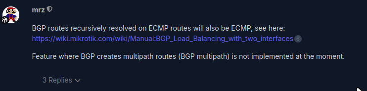
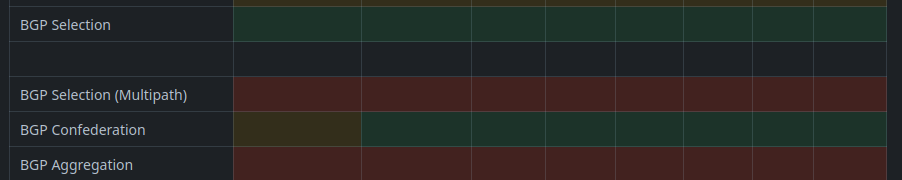
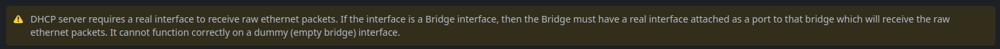

# eBGP for the core

What this document covers are the steps I took in effort to swap OSPFv2 Area 0 for eBGP session between my two core routers.

> [!IMPORTANT]
> This is gonna be a really big documentation. There is a lot to write but I will try to group the steps in some way even though in reality this was super messy. Swapping routes for BGP routes was not complex in itself but there is a lot of other things that are important.  
> I think it's best to first read a couple of documentations:  
> [OSPF and Loop troubleshooting](../11-ospf-and-l2-loop/readme.md)  
> [OSPF Backbone](../06-ospf-backbone/readme.md)   
> I think that this is the most complicated project I did. This took me more than two whole days of sitting and troubleshooting. 
> However, as you will see lower, the really long troubleshooting process wasn't directly related to BGP.
> It was however specifically related to DHCP and its implementation in RouterOS. 
> You can read about MikroTik's implementation of DHCP Server [here](https://help.mikrotik.com/docs/spaces/ROS/pages/24805500/DHCP#DHCP-DHCPServer), and about the long-standing issue with DHCP Server in RouterOS v7.X [here](https://obsluga-it.pl/mikrotik-problem-z-serwerem-dhcp/) (in Polish, translate to English if you need) and you can read [this](https://help.mikrotik.com/docs/spaces/ROS/pages/19136718/Layer2+misconfiguration#Layer2misconfiguration-VLANinabridgewithaphysicalinterface) regarding L2 Misconfiguration with VLANs with a phisical interface on a bridge.

> [!NOTE]
> If you would like to see the links to the sources, please check down below, I will provide all related links in the [Sources](#sources) section.


# Environment

> [!CAUTION]
> There is one thing which is super important so I marked this here as caution because its as I said crucial.
> All of these things in the [eBGP Creation](#ebgp-creation) section were done with firewall completely disabled on the CCR2004.
> This explains why everything regarding BGP worked even though I didn't add any rules for allowing BGP or DHCP in the firewall.  
> I am aware that leaving the firewall disabled is not a good practise. 
> However, there already were problems regarding RouterOS Conntrack which would make it very very difficult to first implement eBGP.
> So I implemented BGP and then I got into the firewall since it had it's own problems.


*   **CCR2004-1G-12S+2XS**
    *   RouterOS version: v7.19.4
    *   Connections:
        *   `sfp-sfpplus1` - link to `sfp-sfpplus1` on CRS326
        *   `sfp-sfpplus11` - link to `sfp-sfpplus24` on CRS326
        *   `ether1` - management
        *   `sfp-sfpplus12` - link to ISP Router
        *   `lo` - 172.16.0.1/32
    *   Config:

<details>
    <summary><h4>CCR2004-config.rsc</h4></summary>
    <h4>Keep in mind this is the config before the BGP!</h4>

```rsc
/interface bridge
add name=ccr2004-mgmt port-cost-mode=short
add name=loopback0
/interface bonding
add mode=802.3ad name=bond0 slaves=sfp-sfpplus1,sfp-sfpplus11 \
    transmit-hash-policy=layer-2-and-3
/interface vlan
add interface=bond0 name=inter-router-link0 vlan-id=100
add interface=bond0 name=vlan111-ccr2004-mgmt vlan-id=111
/interface list
add name=ZONE-USERS
add name=ZONE-CCR2004-MGMT
add name=ZONE-WAN
add name=LINK-TO-CRS326
/interface lte apn
set [ find default=yes ] ip-type=ipv4 use-network-apn=no
/ip pool
add name=pool-bare-metal ranges=10.1.2.2-10.1.2.29
add name=pool-users ranges=10.1.3.50-10.1.3.200
add name=pool-vms-cts ranges=10.1.4.50-10.1.4.200
add name=pool-kubernetes ranges=10.1.5.2-10.1.5.30
/ip dhcp-server
add address-pool=pool-users interface=inter-router-link0 lease-time=5d name=\
    dhcp-users relay=10.1.3.1
add address-pool=pool-vms-cts interface=inter-router-link0 lease-time=5d \
    name=dhcp-vlan40 relay=10.1.4.1
add address-pool=pool-bare-metal interface=inter-router-link0 lease-time=5d \
    name=dhcp-vlan20 relay=10.1.2.1
add address-pool=pool-kubernetes interface=inter-router-link0 lease-time=1w3d \
    name=dhcp-kubernetes relay=10.1.5.1
/port
set 0 name=serial0
/routing ospf instance
add disabled=no name=backbonev2 router-id=172.16.0.1
/routing ospf area
add disabled=no instance=backbonev2 name=backbone0v2
/interface bridge port
add bridge=ccr2004-mgmt comment="access for laptop" ingress-filtering=no \
    interface=ether1 internal-path-cost=10 path-cost=10
add bridge=ccr2004-mgmt interface=vlan111-ccr2004-mgmt
/interface list member
add interface=*14 list=ZONE-USERS
add interface=sfp-sfpplus12 list=ZONE-WAN
add interface=ccr2004-mgmt list=ZONE-CCR2004-MGMT
add interface=inter-router-link0 list=LINK-TO-CRS326
/ip address
add address=10.0.0.150/24 comment=WAN interface=sfp-sfpplus12 network=\
    10.0.0.0
add address=10.1.1.1/30 interface=ccr2004-mgmt network=10.1.1.0
add address=172.16.255.1/30 interface=inter-router-link0 network=172.16.255.0
add address=172.16.0.1 interface=loopback0 network=172.16.0.1
/ip dhcp-server lease
add address=10.1.5.30 mac-address=BC:24:11:80:55:00
add address=10.1.5.29 mac-address=BC:24:11:80:55:01
add address=10.1.5.28 mac-address=BC:24:11:80:55:02
/ip dhcp-server network
add address=10.1.2.0/27 dns-server=1.1.1.1 gateway=10.1.2.1
add address=10.1.3.0/24 dns-server=1.1.1.1 gateway=10.1.3.1
add address=10.1.4.0/24 dns-server=1.1.1.1 gateway=10.1.4.1
add address=10.1.5.0/27 dns-server=1.1.1.1,8.8.8.8 gateway=10.1.5.1
/ip dns
set servers=10.1.4.20,1.1.1.1
/ip firewall address-list
add address=10.1.1.4/30 list=CRS326-MGMT
add address=10.1.2.0/24 list=SERVERs-NET
add address=10.1.4.0/24 list=VMs/LXCs-NET
add address=10.1.5.0/27 list=Kubernetes-NET
/ip firewall filter
add action=accept chain=input connection-state=established,related
add action=accept chain=forward comment=\
    "Allowing already established connections" connection-state=\
    established,related
add action=accept chain=input in-interface-list=ZONE-CCR2004-MGMT
add action=accept chain=input in-interface-list=LINK-TO-CRS326 protocol=icmp
add action=accept chain=input in-interface-list=LINK-TO-CRS326 protocol=ospf
add action=accept chain=forward dst-address-list=SERVERs-NET \
    in-interface-list=ZONE-CCR2004-MGMT out-interface-list=LINK-TO-CRS326
add action=accept chain=forward dst-address-list=VMs/LXCs-NET \
    in-interface-list=ZONE-CCR2004-MGMT out-interface-list=LINK-TO-CRS326
add action=accept chain=forward dst-address-list=Kubernetes-NET \
    in-interface-list=ZONE-CCR2004-MGMT out-interface-list=LINK-TO-CRS326 \
    port=22 protocol=tcp
add action=accept chain=forward dst-address-list=Kubernetes-NET \
    in-interface-list=ZONE-CCR2004-MGMT out-interface-list=LINK-TO-CRS326 \
    protocol=icmp
add action=accept chain=forward dst-address-list=Kubernetes-NET \
    in-interface-list=ZONE-CCR2004-MGMT out-interface-list=LINK-TO-CRS326
add action=accept chain=forward in-interface-list=ZONE-CCR2004-MGMT \
    out-interface-list=ZONE-USERS
add action=accept chain=forward comment=\
    "Accept traffic between CCR2004 Management and CRS326 Management" \
    dst-address-list=CRS326-MGMT in-interface-list=ZONE-CCR2004-MGMT \
    out-interface-list=LINK-TO-CRS326 port=22,8291 protocol=tcp
add action=drop chain=forward comment=\
    "Block traffic from users to networks behind CRS326" in-interface-list=\
    ZONE-USERS out-interface-list=LINK-TO-CRS326
add action=accept chain=forward in-interface-list=ZONE-USERS \
    out-interface-list=ZONE-WAN
add action=accept chain=forward in-interface-list=LINK-TO-CRS326 \
    out-interface-list=ZONE-WAN
add action=accept chain=forward in-interface-list=ZONE-CCR2004-MGMT \
    out-interface-list=ZONE-WAN
add action=drop chain=input
add action=drop chain=forward comment="Dropping all other forward traffic"
/ip firewall nat
add action=masquerade chain=srcnat out-interface=sfp-sfpplus12
/ip route
add disabled=no dst-address=0.0.0.0/0 gateway=10.0.0.1
add dst-address=10.1.1.4/30 gateway=172.16.255.2
/ip service
set ftp disabled=yes
set telnet disabled=yes
set www disabled=yes
set api disabled=yes
/routing ospf interface-template
add area=backbone0v2 disabled=no networks=172.16.0.1/32 passive
add area=backbone0v2 disabled=no networks=172.16.255.0/30
/system clock
set time-zone-name=Europe/Warsaw
/system identity
set name=core-ccr2004
/system resource irq rps
set ether1 disabled=no
```

</details>

*   **CRS326-24S+2Q+RM**
    *   RouterOS version: v7.19.4
    *   Connections:
        *   `sfp-sfpplus1` - link to `sfp-sfpplus1` on CCR2004
        *   `sfp-sfpplus24` - link to `sfp-sfpplus11` on CCR2004
        *   `ether1` - management
        *   `sfp-sfpplus2` - link to PVE Host - Tagged VLANs 20,30,40,50
        *   `lo` - 172.16.0.2/32
    *   Config:

<details>
    <summary><h4>CRS326-config.rsc</h4></summary>
    <h4>Keep in mind this is the config before the BGP!</h4>

```rsc
/interface bridge
add name=loopback0
add admin-mac=D4:01:C3:75:18:94 auto-mac=no comment=defconf name=main-bridge \
    vlan-filtering=yes
/interface vlan
add interface=main-bridge name=inter-router-link0 vlan-id=100
add interface=main-bridge name=vlan20-bare-metal vlan-id=20
add interface=main-bridge name=vlan30-users vlan-id=30
add interface=main-bridge name=vlan40-vms-cts vlan-id=40
add interface=main-bridge name=vlan50-kubernetes vlan-id=50
add interface=main-bridge name=vlan115-crs326-mgmt vlan-id=115
/interface bonding
add mode=802.3ad name=bond0 slaves=sfp-sfpplus1,sfp-sfpplus24 \
    transmit-hash-policy=layer-2-and-3
/interface wireless security-profiles
set [ find default=yes ] supplicant-identity=MikroTik
/port
set 0 name=serial0
/routing ospf instance
add disabled=no name=backbonev2 router-id=172.16.0.2
/routing ospf area
add disabled=no instance=backbonev2 name=backbone0v2
/interface bridge port
add bridge=main-bridge interface=ether1 pvid=115 trusted=yes
add bridge=main-bridge interface=qsfpplus1-1
add bridge=main-bridge interface=qsfpplus1-2
add bridge=main-bridge interface=qsfpplus1-3
add bridge=main-bridge interface=qsfpplus1-4
add bridge=main-bridge interface=qsfpplus2-1
add bridge=main-bridge interface=qsfpplus2-2
add bridge=main-bridge interface=qsfpplus2-3
add bridge=main-bridge interface=qsfpplus2-4
add bridge=main-bridge interface=sfp-sfpplus5
add bridge=main-bridge interface=sfp-sfpplus6 pvid=30
add bridge=main-bridge interface=sfp-sfpplus7
add bridge=main-bridge interface=sfp-sfpplus8
add bridge=main-bridge interface=sfp-sfpplus9
add bridge=main-bridge interface=sfp-sfpplus10
add bridge=main-bridge interface=sfp-sfpplus11
add bridge=main-bridge interface=sfp-sfpplus12
add bridge=main-bridge interface=sfp-sfpplus13
add bridge=main-bridge interface=sfp-sfpplus14
add bridge=main-bridge interface=sfp-sfpplus15
add bridge=main-bridge interface=sfp-sfpplus16
add bridge=main-bridge interface=sfp-sfpplus17
add bridge=main-bridge interface=sfp-sfpplus18
add bridge=main-bridge interface=sfp-sfpplus19
add bridge=main-bridge interface=sfp-sfpplus20
add bridge=main-bridge interface=sfp-sfpplus21
add bridge=main-bridge interface=sfp-sfpplus22
add bridge=main-bridge interface=sfp-sfpplus23
add bridge=main-bridge edge=yes interface=sfp-sfpplus2
add bridge=main-bridge interface=sfp-sfpplus4
add bridge=main-bridge interface=sfp-sfpplus3
add bridge=main-bridge interface=bond0
/interface bridge vlan
add bridge=main-bridge tagged=main-bridge,sfp-sfpplus2 vlan-ids=20
add bridge=main-bridge tagged=main-bridge,sfp-sfpplus2 vlan-ids=30
add bridge=main-bridge tagged=main-bridge,sfp-sfpplus2 vlan-ids=40
add bridge=main-bridge tagged=main-bridge,bond0 vlan-ids=100
add bridge=main-bridge tagged=main-bridge untagged=ether1 vlan-ids=115
add bridge=main-bridge tagged=main-bridge,sfp-sfpplus2 vlan-ids=50
/interface ethernet switch
set 0 l3-hw-offloading=yes
/ip address
add address=10.1.2.1/27 interface=vlan20-bare-metal network=10.1.2.0
add address=10.1.4.1/24 interface=vlan40-vms-cts network=10.1.4.0
add address=10.1.1.5/30 interface=vlan115-crs326-mgmt network=10.1.1.4
add address=172.16.255.2/30 interface=inter-router-link0 network=172.16.255.0
add address=172.16.0.2 interface=loopback0 network=172.16.0.2
add address=10.1.5.1/27 interface=vlan50-kubernetes network=10.1.5.0
add address=10.1.3.1/24 interface=vlan30-users network=10.1.3.0
/ip dhcp-relay
add dhcp-server=172.16.255.1 disabled=no interface=vlan20-bare-metal name=\
    vlan20-dhcp-relay
add dhcp-server=172.16.255.1 disabled=no interface=vlan40-vms-cts name=\
    vlan40-dhcp-relay
add dhcp-server=172.16.255.1 disabled=no interface=vlan50-kubernetes name=\
    kubernetes-dhcp-relay
add dhcp-server=172.16.255.1 disabled=no interface=vlan30-users name=\
    vlan30-dhcp-relay
/ip dns
set servers=1.1.1.1
/ip firewall address-list
add address=10.1.1.4/30 list=CRS326-MGMT
add address=10.1.4.0/24 list=VMs/LXCs
add address=10.1.2.0/27 list=SERVERs
/ip firewall filter
add action=drop chain=input dst-address-list=CRS326-MGMT src-address-list=\
    SERVERs,VMs/LXCs
/ip route
add gateway=172.16.255.1
/ip service
set ftp disabled=yes
set www disabled=yes
set api disabled=yes
/routing ospf interface-template
add area=backbone0v2 disabled=no networks=172.16.0.2/32 passive
add area=backbone0v2 disabled=no networks=172.16.255.0/30
add area=backbone0v2 disabled=no networks=10.1.2.0/27 passive
add area=backbone0v2 disabled=no networks=10.1.4.0/24 passive
add area=backbone0v2 disabled=no networks=10.1.5.0/27 passive
add area=backbone0v2 disabled=no networks=10.1.3.0/24 passive
/system clock
set time-zone-name=Europe/Warsaw
/system identity
set name=core-crs326
/system routerboard settings
set enter-setup-on=delete-key
/system swos
set address-acquisition-mode=static identity=SW_CORE_02 static-ip-address=\
    10.10.20.13
```

</details>


# Why even doing this?

So first I would like to explain why actually I even wanted to swap the OSPF Area 0 for BGP.  

This had its two main reasons.  
*   First is obviously the technical side. 
It's rare for someone to have eBGP running inside their lab.
Plus, I am very interested in BGP since its the protocol that connects the entire internet.  


*   Second are the cons of LACP.
For now, the CCR2004 and CRS326 were connected through two 10GbE OM3 Multimode fiber patchcords with Brocade 10G-SR LC/UPC Duplex SFP transceivers.  


However, they were actually a single logical connection because of the LACP. 
The `bond0` interface used 802.3ad protocol to agregate the traffic between those two physical links to utilize them as a single logical interface.
But LACP has it's disadvantages. 
I actually experienced some problems with LACP. 
More specifically with the reconvergence time.
I don't really know if that's the RouterOS specifics or just it's the general con of bonding interfaces, but it was not 100% seamless when one link failed.  

All of that, plus the fact that BGP is very useful and a crucial part of work in a datacenter, brought me to think about eBGP.  

With BGP I could stop using LACP and just create two idependent links which would create a ECMP connection.  

ECMP is the best option for correct L3 Load Balancing instead of LACP L2 link aggregation.

# eBGP creation

> [!IMPORTANT]
> Here is a very important thing related to the RouterOS version that I am using.  
> On RouterOS Wiki there is a `/instance` menu in bgp routing section.  
> However it's very important to note that the instance menu doesn't exist in versions pre-7.20beta. 
> I spend some time figuring why can't I find that menu, but then I found that on 7.19.4 there is no instance menu as it's created automatically when creating a connection.

So the first thing to do was to create a BGP connection.   

> [!NOTE]
> At first I created only one connection since the `bond0` interface was still present. 
> Another eBGP connection will be added later.

Keep in mind that SVI 100 along with IPs on it (172.16.255.0/30) are already assigned.
For example on the CCR2004:
```rsc
/interface vlan
add interface=bond0 name=eBGP-Link-0 vlan-id=100
add interface=sfp-sfpplus1 name=vlan111-ccr2004-mgmt vlan-id=1111
/ip address
add address=172.16.255.1/30 interface=eBGP-Link-0 network=172.16.255.0
```


Networks behind CCR2004 along with itself would be AS 65000 and networks behind CRS326 would be AS 65001.  

First I needed IPs for RIDs on loopback addresses so they would be always `UP`.  
On the CCR2004:
```rsc
/ip address
add address=172.16.0.1/32 interface=lo
```
On the CRS326:
```rsc
/ip address
add address=172.16.0.2/32 interface=lo
```

Then the actual BGP connection.  
on the CCR2004:
```rsc
/routing bgp connection
add name=eBGP-0 local.role=ebgp remote.address=172.16.255.2 as=65000 \
output.redistribute=connected
```
On the CRS326:
```rsc
/routing bgp connection
add name=eBGP-0 local.role=ebgp remote.address=172.16.255.1 as=65001 \
output.redistribute=connected
```

This is the bare minimum for the eBGP session to establish.  
Then on the CCR2004 I could check and it looked like this:
```rsc
[aether@core-ccr2004] > /routing/bgp/session/pr
Flags: E - established 
 0 E name="eBGP-0-1" 
     remote.address=172.16.255.2 .as=65001 .id=172.16.0.2 
     .capabilities=mp,rr,gr,as4 .afi=ip .messages=246 .bytes=4722 .eor="" 
     local.address=172.16.255.1 .as=65000 .id=172.16.0.1 
     .cluster-id=172.16.0.1 .capabilities=mp,rr,gr,as4 .afi=ip 
     .messages=246 .bytes=4704 .eor="" 
     output.procid=21 
     input.procid=21 ebgp 
     hold-time=3m keepalive-time=1m uptime=4h4m44s 
     last-started=2025-08-23 02:59:02 prefix-count=5
```
However, though the session established, its not a good practise to use `output.redistribute=connected`.  
First reason is that it advertises everything, along with OOB Management networks for example, which obviously should not be advertised.  
Second reason is what happens in a real connection if one AS advertises literally every single network that is directly connected to it?  

That's why I needed to use a network list.  

I created a list `BGP_ADV_LIST` on the CRS326 and added the appropriate networks and the loopback address:  
```rsc
/ip firewall address-list
add address=10.1.2.0/27 list=BGP_ADV_NET
add address=10.1.3.0/24 list=BGP_ADV_NET
add address=10.1.4.0/24 list=BGP_ADV_NET
add address=10.1.5.0/27 list=BGP_ADV_NET
add address=172.16.0.2 list=BGP_ADV_NET
```
Then I unset the `output.redistribute` option and set `output.network` filter for the  eBGP session:
```rsc
/routing/bgp/connection
unset eBGP-0 output.redistribute
set eBGP-0 output.network=BGP_ADV_LIST
```
The session then looked like this:
```rsc
[lynx@core-crs326] /routing/bgp/connection> ../session/pr
Flags: E - established
 0 E name="eBGP-1-1"
     remote.address=172.16.255.5 .as=65000 .id=172.16.0.1
     .capabilities=mp,rr,gr,as4 .afi=ip .messages=254 .bytes=4908 .eor=""
     local.address=172.16.255.6 .as=65001 .id=172.16.0.2
     .cluster-id=172.16.0.2 .capabilities=mp,rr,gr,as4 .afi=ip
     .messages=254 .bytes=4908 .eor=""
     output.procid=20 .network=BGP_ADV_NET
     input.procid=20 ebgp
     hold-time=3m keepalive-time=1m uptime=4h11m5s50ms
     last-started=2025-08-23 02:58:50 prefix-count=1
```
As you can see, now there is a `output.network` set, which limits the advertised networks to only the ones I added to the list.    

Then I checked the available routes on the CCR2004:
```rsc
[aether@core-ccr2004] /routing/bgp> /ip ro pr
Flags: D - DYNAMIC; A - ACTIVE; c - CONNECT, s - STATIC, b - BGP, o - OSPF
Columns: DST-ADDRESS, GATEWAY, ROUTING-TABLE, DISTANCE
#     DST-ADDRESS      GATEWAY                          ROUT  DISTANCE
0  As 0.0.0.0/0        10.0.0.1                         main         1
  DAc 10.0.0.0/24      sfp-sfpplus12                    main         0
  DAc 10.1.1.0/30      ccr2004-mgmt                     main         0
1  As 10.1.1.4/30      172.16.255.2                     main         1
  D b 10.1.1.4/30      172.16.255.2                     main        20
  D o 10.1.2.0/27      172.16.255.2%inter-router-link0  main       110
  DAb 10.1.2.0/27      172.16.255.2                     main        20
  D o 10.1.3.0/24      172.16.255.2%inter-router-link0  main       110
  DAb 10.1.3.0/24      172.16.255.2                     main        20
  D o 10.1.4.0/24      172.16.255.2%inter-router-link0  main       110
  DAb 10.1.4.0/24      172.16.255.2                     main        20
  D o 10.1.5.0/27      172.16.255.2%inter-router-link0  main       110
  DAb 10.1.5.0/27      172.16.255.2                     main        20
  DAc 172.16.0.1/32    loopback0                        main         0
  D o 172.16.0.2/32    172.16.255.2%inter-router-link0  main       110
  DAb 172.16.0.2/32    172.16.255.2                     main        20
  DAc 172.16.255.0/30  inter-router-link0               main         0
```
And this is a very cool thing.
As you can see, since the BGP routes were configured properly, RouterOS started using them as the Active ones and deactivated the OSPF ones.  

That is a very nice situation where the transition of routes happened seamlessly.  

Then I could turn off the OSPF instances and Areas:
```rsc
/routing ospf area
disable [find]
/routing ospf instance
disable [find]
/routing ospf interface-template
disable [find]
```
After that the only routes available were the ones advertised through BGP:
```rsc

[aether@core-ccr2004] > ip ro pr
Flags: D - DYNAMIC; A - ACTIVE; c - CONNECT, s - STATIC, b - BGP
Columns: DST-ADDRESS, GATEWAY, ROUTING-TABLE, DISTANCE
#     DST-ADDRESS      GATEWAY        ROUTING-TABLE  DISTANCE
0  As 0.0.0.0/0        10.0.0.1       main                  1
  DAc 10.0.0.0/24      sfp-sfpplus12  main                  0
  DAc 10.1.1.0/30      ccr2004-mgmt   main                  0
1  As 10.1.1.4/30      172.16.255.2   main                  1
  DAb 10.1.2.0/27      172.16.255.2   main                 20
  DAb 10.1.3.0/24      172.16.255.2   main                 20
  DAb 10.1.4.0/24      172.16.255.2   main                 20
  DAb 10.1.5.0/27      172.16.255.2   main                 20
  DAb 172.16.0.2/32    172.16.255.2   main                 20
  Dac 172.16.255.0/30  eBGP-Link-0    main                  0
```

However the point here is that the eBGP session is still actually on the `bond0` interface, so time to change that.

> [!NOTE]
> The commands I did here were applied using serial connection, as SSH connection would break during this.

First I had to change the interface on which the SVI for VLAN 100 was configured on both CRS326 and CCR2004 and remove the `bond0`.  

on CCR2004:
```rsc
/interface bonding
remove [find]
/interface vlan
set [find vlan-id=100] interface=sfp-sfpplus1
```
on the CRS326 I first had to remove `bond0` from the bridge, then add the `sfp-sfpplus1` to the bridge, and then change the interface in `interface/vlan` menu as well as in the `/interface/bridge/vlan` since the CRS326 uses `vlan-filtering` on the `main-bridge` so I had to also change the tagged port for the vlan 100.

> [!NOTE]
> Here I added also the `sfp-sfpplus24` interface to the bridge.
> It was part of the bonding interface and will be later used as a tagged port for a new transit link, since there will be two eBGP sessions.

```rsc
/interface bonding
remove [find]
/interface bridge port
add bridge=main-bridge interface=sfp-sfpplus1
add bridge=main-bridge interface=sfp-sfpplus24
/interface vlan
set [find vlan-id=100] interface=sfp-sfpplus1
/interface bridge vlan
set [find vlan-ids=100] tagged=main-bridge,sfp-sfpplus1
```

As you can see above, on the CCR2004 i had to make one change but on the CRS326 I had to make three different changes.  
That is because of the vlan filtering on the bridge.  

The `/interface/bridge/port` is to simply allow the physical interface to have any connection to the bridge.  
The `/interface/vlan` is to tell the SVI on which physical interface it should listen   
And the `/interface/bridge/vlan` is to tell the bridge itself how it should handle tagging, eg. on which port this vlan should be tagged or untagged.  


The natural next step was to test the connectivity before going any further.  

From my laptop (`10.1.1.2`) i tried to ping my PVE host (`10.1.2.30`)

```zsh
❯ ping 10.1.2.30
PING 10.1.2.30 (10.1.2.30) 56(84) bytes of data.
64 bytes from 10.1.2.30: icmp_seq=1 ttl=62 time=0.311 ms
64 bytes from 10.1.2.30: icmp_seq=2 ttl=62 time=0.235 ms
^C
--- 10.1.2.30 ping statistics ---
2 packets transmitted, 2 received, 0% packet loss, time 1046ms
rtt min/avg/max/mdev = 0.235/0.273/0.311/0.038 ms
```
ICMP traffic seemed to go through correctly.

I also checked with `traceroute` (or `tracepath` on Arch)
```zsh
❯ tracepath 10.1.2.30
 1?: [LOCALHOST]                      pmtu 1500
 1:  _gateway                                              0.192ms
 1:  _gateway                                              0.164ms
 2:  172.16.255.2                                          0.475ms
 3:  pve.homelab                                           0.311ms reached
     Resume: pmtu 1500 hops 3 back 3
```
The route seems to be correct.  
The traffic goes to the 10.1.1.1 which is the gateway for CCR2004 OOB Mgmt network (`10.1.1.0/30`). 
Then it goes to through the inter-router link on interface `eBGP-Link-0` and arrives on `eBGP-Link-0` interface on the CRS326 with an IP of `172.16.255.2`. 
And then since the CRS326 has a direct connection to the 10.1.2.0/27 network, it sends the traffic through 10.1.2.1 which is it's SVI in that VLAN and then it goes to the `pve.homelab` (`10.1.2.30` in `/etc/hosts`).   

Since everything was working correctly, I could get to the next step.

# Second link for eBGP and L3 retundancy

Since now I had one unused link, I wanted to set a second BGP session on inter-router link on it to utilize ECMP as I mentioned in the first part of this document.  

The first thing I needed to do was to create new SVIs, assign new IP addresses on them, and on the CRS326 correctly assign tagged vlan on its side of the link.   


Here, a reminder of eBGP-Link-0:
*   CCR2004 `sfp-sfpplus1`, `172.16.255.1` <--> CRS326 `sfp-sfpplus1`, `172.16.255.2`  

New eBGP-Link-1:
*   CCR2004 `sfp-sfpplus11`, `172.16.255.5` <--> CRS326 `sfp-sfpplus24`, `172.16.255.6`

I set new SVI on the CCR2004:
```rsc
/interface vlan
add interface=sfp-sfpplus11 name=eBGP-Link-1 vlan-id=104
/ip address
add address=172.16.255.5/30 interface=eBGP-Link-1
```
then a bit more complicated again on the CRS326:
```rsc
/interface vlan
add interface=main-bridge name=eBGP-Link-1 vlan-id=104
/interface bridge vlan
add bridge=main-bridge tagged=main-bridge,sfp-sfpplus24 vlan-ids=104
/ip address
add address=172.16.255.6/30 interface=eBGP-Link-1
```
Then I could check the connectivity between those two new SVIs before going further with second BGP session.  

> [!NOTE]
> Here I also had a disabled firewall. The ping normally would not come through.

```rsc
[lynx@core-crs326] > ping 172.16.255.5
  SEQ HOST                                     SIZE TTL TIME       STATUS
    0 172.16.255.5                               56  64 428us
    1 172.16.255.5                               56  64 425us
    sent=2 received=2 packet-loss=0% min-rtt=425us avg-rtt=426us
   max-rtt=428us
```
As you can see the CRS326 can ping the new `eBGP-Link-1` SVI on the CCR2004.   

Now I do one more thing which is to add an address list for the CCR2004 to advertise through BGP. 
For example, it should advertise it's loopback IP.
```rsc
/ip firewall address-list
add address=172.16.0.1/32 list=BGP_ADV_NET
```
Now I could create the new BGP instances.   
On the CCR2004:
```rsc
/routing bgp connection
add as=65000 disabled=no local.role=ebgp name=eBGP-1 \
output.network=BGP_ADV_NET remote.address=172.16.255.6 \
router-id=172.16.0.1
```
I think it's pretty self-explainatory. 
I just changed the `remote.address` to `172.16.255.6` instead of `172.16.255.2` as this new parallel BGP connection is on the new transit network `172.16.255.4/30`.
RID is the same as it's based on the loopback and the ASN is ofcourse also the same.   

After that, I could check the routes on the CCR2004:
```rsc
[aether@core-ccr2004] > ip ro pr
Flags: D - DYNAMIC; A - ACTIVE; c - CONNECT, s - STATIC, b - BGP
Columns: DST-ADDRESS, GATEWAY, ROUTING-TABLE, DISTANCE
#     DST-ADDRESS      GATEWAY        ROUTING-TABLE  DISTANCE
0  As 0.0.0.0/0        10.0.0.1       main                  1
  DAc 10.0.0.0/24      sfp-sfpplus12  main                  0
  DAc 10.1.1.0/30      ccr2004-mgmt   main                  0
1  As 10.1.1.4/30      172.16.255.2   main                  1
  DAb 10.1.2.0/27      172.16.255.2   main                 20
  D b 10.1.2.0/27      172.16.255.6   main                 20
  DAb 10.1.3.0/24      172.16.255.2   main                 20
  D b 10.1.3.0/24      172.16.255.6   main                 20
  DAb 10.1.4.0/24      172.16.255.2   main                 20
  D b 10.1.4.0/24      172.16.255.6   main                 20
  DAb 10.1.5.0/27      172.16.255.2   main                 20
  D b 10.1.5.0/27      172.16.255.6   main                 20
  DAc 172.16.0.1/32    lo             main                  0
  DAb 172.16.0.2/32    172.16.255.2   main                 20
  D b 172.16.0.2/32    172.16.255.6   main                 20
  DAc 172.16.255.0/30  eBGP-Link-0    main                  0
  DAc 172.16.255.4/30  eBGP-Link-1    main                  0
```
As you can see above, now there are two available routes for each advertised network from `BGP_ADV_NET` on CRS326.  

Then I wanted to enable ECMP, and here is where the problems began.   

I will spare the details about how I tried to enable multihopping, some weird routing filters etc. and nothing worked.  

I was just searching a lot and honestly couldn't find a straight answer if the ECMP is possible to do in that way or not, since everything seemed correct. 
All routes had the same administrative distance and literally the same parameters etc.  

On MikroTik Forum I found a thread related [ECMP + BGP](https://forum.mikrotik.com/t/bgp-ecmp/153905). 
One of the replies stated:  



So after a lot of trying to enable ECMP for BGP paths, I finally found that ECMP is just simply not supported for BGP in RouterOS v7 for now.  

Next thing I looked [here](https://help.mikrotik.com/docs/spaces/ROS/pages/28606515/Routing+Protocol+Overview)  



Another thing that sadly confirms that I won't be able to achieve ECMP for my eBGP Routes.  

However the BGP sessions didn't waste anything.
One is active and the second one is simply waiting as a failover for activation when the currently active fails.  

I then thought that two routes would probably break RouterOS firewall Conntrack.  
But I forgot that since one route is not active, then traffic routed with BGP routes won't even go through the second point-to-point network (`172.16.255.4/30`)

[here](https://wiki.mikrotik.com/Manual:BGP_Load_Balancing_with_two_interfaces) is another thing.   

As provided by MikroTik Wiki above, ECMP technically was available but in very very old RouterOS versions.

## ECMP Conclusion

Sadly, for now, I won't be able to use ECMP since it simply isn't supported for BGP in RouterOS v7.19.4.  

However what was achieved here is a retundant BGP instance which will simply activate the second available route through the `eBGP-Link-1` if the `eBGP-Link-0` fails.  
The only thing up for question here still is the reconvergence time.
How fast will those routes switch?

Well, sadly, the time of reconvergence is equal to the `keepalive` timer of the BGP session.
And since it's currently set to 60 seconds, then the time that it will take for the routes to refresh, is a minute.  

This is of course unbeliveably long and impossible to be a proper failover.  

The solution for this can be to simply make the `keepalive` timer shorter.   

Or to integrate BFD with the BGP sessions. 
For now I don't have that set up.

# DHCP Nightmare

So here is the troubleshooting part of this project.   

After I checked that BGP sessions are working and connection to VMs is working too, I tried to run my VyOS VM with a dynamic IP address on `eth0` interface which is connected to the `vmbr0` with a PVID 40.  

After it booted I checked with `show interfaces` to see what IP did it got assigned.
And as you can expect, it didn't got any IP assigned.  

At that time, the DHCP Server was running on `eBGP-Link-0`.
So naturally I got suprised since it was working all that time and the interface it was on was stille running.  

From what I remember, cause it was a real mess, then I rebooted both routers and after rebooting the VyOS VM got an IP.
So I thought that this was just a lag that needed a reboot.   

However, after some time the DHCP stopped working again.
To be honest I do not remember what I even did after that but I just stopped trying to make it work like that and instead thought about how it actually is set up.  

Cause it was running on `eBGP-Link-0`. But what if that interface went down?  
Then the DHCP server would be completely unreachable.   

At first I thought about creating a copy of each DHCP Server for each BGP Link interface.
So for example I already had `dhcp-vlan40` and it was listening on interface `eBGP-Link-0`, so I would create `dhcp-vlan40-1` and assign it the same address pool and interface `eBGP-Link-1`.   

However, just by looking at this I can tell it would be problematic.  
Because what would also need to be doubled are the DHCP Relays on the CRS326.
That would rock it's CPU completely.   

So after some searching on RouterOS Wiki, I got an idea on how to make this single DHCP server (one for each vlan. not one as in the only one) redundant and available through both interfaces.  

What IP address is always reachable regardless of which BGP route is available? Loopback!  

In my case the `lo` loopback interface had a IP of `172.16.0.1/32` which was used as a RID for OSPF instances and of course the eBGP sessions.   

So I thought why not set the interface for all DHCP servers to `lo`?   

Since it had only one IP address, then I could set the `dhcp-server` on the DHCP Relay to `172.16.0.1`.   

The CRS326 which runs the DHCP Relay would first get a Multicast DHCPREQUEST packet from a VM in one of its VLANs.  
Then it would check on which interface it came in and would set the correct `giaddr` according to the gateway address related to the interface on which the DHCPREQUEST came in.  
Then it would send not a Multicast packet anymore but just a **Unicast** packet to `172.16.0.1`.   
It is not directly connected but is available through two BGP Routes: throught `172.16.255.1` and `172.16.255.5`.  
So it would simply send the DHCPREQUEST Unicast packet throught one of the available routes to the `lo` interface on the CCR2004, on which the DHCP server would be running.  
Then the DHCP Server would check the `giaddr` argument and basing on it, it would select from which IP Pool it should assign the IP address, and what the default gateway and DNS servers, should be.  
The route in the opposite way would be pretty straightforward.  
DHCPACK would go throught one of the BGP Routes, then it would get routed on the CRS326 according to the gateway address, and the VM would get simply assigned an IP address.   

Sound painless? Well so i thought.   
It absolutely didn't work.   

I was searching a lot to see if someone had a similar topology so I could compare if I have anything wrong etc.  

The `lo` interface on the CCR2004 with `172.16.0.1/32` IP was 100% ICMP pingable and even traceroute was correct.   

After some more looking through mikrotik forum I then re-read the entire DHCP Server section on RouterOS Wiki and I finally found the reason why my idea didn't work.   

   

*DHCP server requires a real interface to receive raw ethernet packets. If the interface is a Bridge interface, then the Bridge must have a real interface attached as a port to that bridge which will receive the raw ethernet packets. It cannot function correctly on a dummy (empty bridge) interface.*  

So this is a final answer specifically to my idea.  

I don't know how did I miss that.  

My `lo` interface doesn't have any physical interface of course, since its in it's name. 
Its supposed to not have any physical interface.  

So then I though about going back to adding a duplicate DHCP Server for the second interface. 
But I got an another idea.   

I then removed the IP address from the `lo` loopback interface and created a new bridge on the CCR2004.
```rsc
/interface bridge
add name=bridge0
```
Then I added the IP address corresponding to the RID of the CCR2004:
```rsc
/ip address
add address=172.16.0.1/32 interface=bridge0
```
Then I thought that the whole point of this, was to have a single redundant DHCP Server, listening on two interfaces, but without LACP.  

However, this was going in the direction of a dummy bridge which as i said above, wouldn't work in RouterOS.  

The DHCPREQUEST unicast packets from the CRS326 could be in fact pointed to the `172.16.0.1` IP address, but the `bridge0` interface on which this IP address was reachable, couldn't receive raw ethernet packets, which was neccessary for the MikroTik's implementation of DHCP Server in RouterOS.  

So this seemed impossible to me but here is what I did.   

Then I created a interface list. Why?  
Because I already found out that in RouterOS, interface lists work just like interfaces and can be used the same.  

So I created a list `ZONE-TO-CRS326-L2`
```rsc
/interface list
add name=ZONE-TO-CRS326-L2
```
And I added three interfaces to it:
*   The first eBGP Link
*   The second eBGP Link
*   And the bridge0 itself
```rsc
/interface list member
add interface=eBGP-Link-0 list=ZONE-TO-CRS326-L2
add interface=eBGP-Link-1 list=ZONE-TO-CRS326-L2
add interface=bridge0 list=ZONE-TO-CRS326-L2
```

This is a kind of a workaround, since the DHCP Server has to receive raw ethernet frames, then it must have some physical interface connected.

Then I created a second list, but without the `bridge0` interface:
```rsc
/interface list
add name=eBGP-LINK-CRS326
/interface list member
add interface=eBGP-Link-0 list=eBGP-LINK-CRS326
add interface=eBGP-Link-1 list=eBGP-LINK-CRS326
```
And then I added not the SVIs themselves, but the list as a interface to the `bridge0`:
```rsc
/interface bridge port
add bridge=bridge0 interface=eBGP-LINK-CRS326
```

As you can see below, by adding the list to the bridge, RouterOS automatically adds the active interfaces.  
They are marked as **D**ynamic.   

```rsc
[aether@core-ccr2004] > interface/bridge/port/pr
Flags: D - DYNAMIC
Columns: INTERFACE, BRIDGE, HW, HORIZON, TRUSTED, FAST-LEAVE, PATH-COST, INTERNAL-PATH-COST, BPDU-GUARD, EDGE, POINT-TO-POINT, PVID, FRAME-TYPES
#   INTERFACE             BRIDGE        HW   HORIZON  TRUSTED  FAST-LEAVE  PATH-COST  INTERNAL-PATH-COST  BPDU-GUARD  EDGE  POINT-TO-POINT  PVID  FRAME-TYPES
;;; Management access
0   ether1                ccr2004-mgmt  yes  none     no       no                 10                  10  no          auto  auto               1  admit-all  
1   vlan111-ccr2004-mgmt  ccr2004-mgmt       none     no       no                                         no          auto  auto               1  admit-all  
2   eBGP-LINK-CRS326      bridge0       yes  none     no       no                                         no          auto  auto               1  admit-all  
3 D eBGP-Link-0           bridge0            none     no       no                                         no          auto  auto               1  admit-all  
4 D eBGP-Link-1           bridge0            none     no       no                                         no          auto  auto               1  admit-all  
```

This makes it a lot more elastic, since if now I would want to add another link on which the DHCP server should listen, then I don't even have to change anything on the DHCP server itself.
I just simply have to add another interface to the list and RouterOS will automatically make it available.

Now time for the DHCP Server itself.  
I set the interface that the DHCP server should listen on, to `bridge0`:
```rsc
/ip dhcp-server
set [find] interface=bridge0
```
Then I set the address that the server should listen on, to the RID:
```rsc
/ip dhcp-server
set [find] server-address=172.16.0.1
```
> [!NOTE]
> At this point, the DHCP Finally worked. 
> VMs in all VLANs were able to get IPs from DHCP assigned.
> However, whats important is that this worked only because the firewall was completely disabled.
> If the firewall was enabled, then since I used "deny-by-default" policy and there was no rule that would specifically allow UDP packets on ports 67,68, then it would not work.


Now what's left is the firewall.

First the rule for allowing UDP packets on ports 67 and 68 incoming on the bridge0 interface.   

this is a important part and I messed this up a couple times since I thought that I could allow this just on the SVIs. 
As it turned out, I had to allow it also on the `bridge0` interface, since after all, thats the interface on which the `172.16.0.1` IP was, which was the IP that the DHCP server would listen on.   

And actually I don't have to allow incoming DHCPREQUEST packets on the Links themselves, since while the packets are arriving through those SVIs, they are coming into the routers CPU on the `bridge0` interface.   

This is still super confusing for me but basically those links `eBGP-Link-X` have two functions at the same time.  

For the `bridge0`, they work as simple L2 bridged physical interfaces.  

However, for the Router itself, those are normal Slave interfaces for L3 SVIs.   

So its a bit like: first the DHCPREQUEST gets routed to the `eBGP-Link-0` from the CRS326, then it arrives onto the `172.16.255.1/30` IP, which is the SVIs IP. It comes in through the `sfp-sfpplus1` physical interface and here is where it gets really confusing.   

It comes through the `172.16.255.1` address on the SVI 100 (172.16.255.0/30) and gets routed to the `172.16.0.1`. 

Now, this wouldn't work normally as I said again above, the DHCP Server in RouterOS, even when running on dummy bridge, needs to specifically have some physical interface.  

But now, the DHCP Server is in fact running, and receives routed DHCPREQUEST packets from the `eBGP-Link-X` interfaces.  

So, the packets are actually arriving at the DHCP Server.
But it won't work for already obvious reason.  

So by adding the `ZONE-TO-CRS326-L2` list to the bridge which adds dynamic SVIs, which add physical interfaces, it kind of I think tricks the DHCP server to think that it receives the raw ethernet frames.   

I created another interface list `ZONE-LOOPBACK` containing only the `bridge0` interface:
```rsc
/interfaces list
add name=ZONE-LOOPBACK
/interfaces list member
add interface=bridge0 list=ZONE-LOOPBACK
```

final rule is like this:

```rsc
/ip firewall filter
add action=accept chain=input port=67,68 protocol=udp in-interface=ZONE-LOOPBACK
```
and of course i moved this rule higher in the firewall list.  

This makes the firewall allow the DHCP packets on the `bridge0` interface. 
And since the `bridge0` has physical interfaces connected, it allows for full DHCP communication.   

I also added rules for allowing OSPF, since there weren't any:
```rsc
/ip firewall filter
add action=accept chain=input in-interface-list=ZONE-TO-CRS326-L2 protocol=ospf
```

# Sources

*   [https://wiki.mikrotik.com/Manual:BGP_Load_Balancing_with_two_interfaces](https://wiki.mikrotik.com/Manual:BGP_Load_Balancing_with_two_interfaces)
*   [https://help.mikrotik.com/docs/spaces/ROS/pages/28606515/Routing+Protocol+Overview](https://help.mikrotik.com/docs/spaces/ROS/pages/28606515/Routing+Protocol+Overview)
*   [https://forum.mikrotik.com/t/bgp-ecmp/153905](https://forum.mikrotik.com/t/bgp-ecmp/153905)
*   [https://help.mikrotik.com/docs/spaces/ROS/pages/24805500/DHCP#DHCP-DHCPServer](https://help.mikrotik.com/docs/spaces/ROS/pages/24805500/DHCP#DHCP-DHCPServer)


