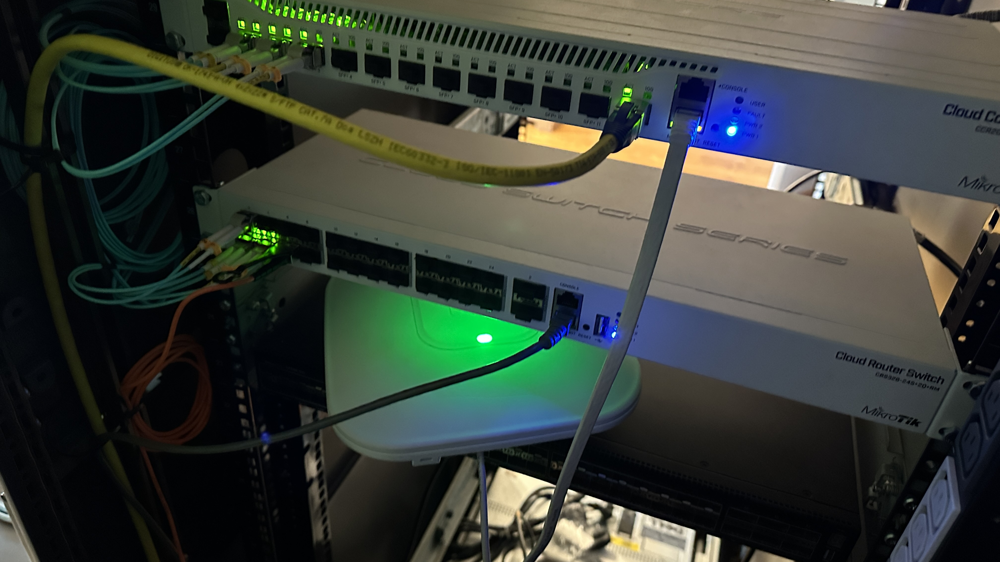
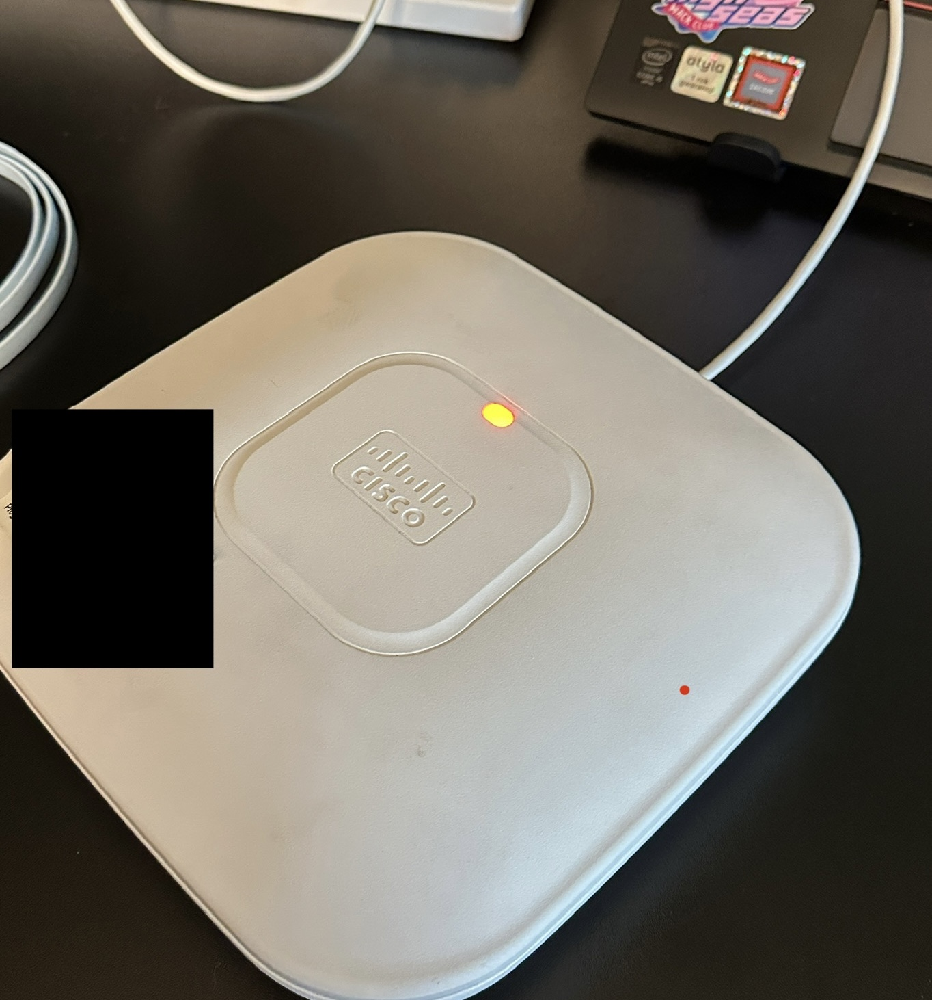
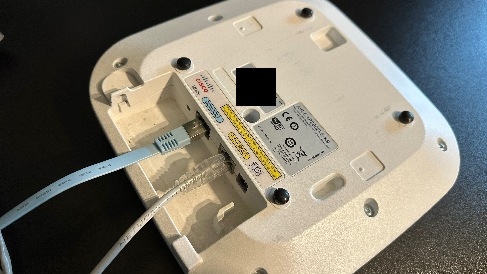

# School Network

Description of the process of fixing the school network and what I uncovered.

> [!IMPORTANT]   
> I want to make one thing very very clear. I know that this school network was configured as a **PhD project** of one of the students of a nearby university on a telecommunications profile.  
> In case that you recognized this network and you are that person, I want to you to know that I **am not hating** in any way on your work.  
> It's the last thing I want this to be perceived as.  
> I absolutely admire your work and the only thing I want to state here is that the equipment is simply old. 
> Some of the networking devices are almost 15 years old. 100Mbps bottleneck connections for five hundred students in a school just cannot be even remotely enough in todays world.   
> Just please know that this is absolutely not criticism and I don't want anyone to think that I am some kind of an arrogant person.

Basically, a couple weeks ago, my school was supposedly hit by lightning during a storm.  

It seems that the strike was pretty powerful since it fried a switch in the school network.
At the same time, wireless network went completely down since the Access Points were powered by PoE.   

I won't go into the details of problems that I had with getting into a agreement with the school and I will just document what I can stricttly about the network here.  

I want to also state here that problems with the school network began already some time ago and the lost wireless access was not the main cause. It is just another issue.


The networking equipment was founded by the European Union and I do not know if I can post photos of it here, so I will check with the IT teacher if I can do that.  
He basically knew that I am a networking enthusiast so he asked my friend to ask me if I can fix their WiFi.   

This all will be more of a flow of thoughts rather than a full documentation but I will try to make everything as clean as I can.

## How this started

Around the start of October, my friend texted me that the IT teacher wants to know if I will be able to configure 11 Cisco Access Points. 
I was kinda suprised since my networking enthusiasm actually never really found a usage in my school, since the only thing we learned about networking in school, was how subnet classes work and how to calculate available hosts number. 
I went to school the next day and I talked with the IT teacher about that. 
The first and most important thing at that point which I asked about, was the type of the Access Points, since if he bought a lightweight APs and didn't buy a WLC, then those APs would be useless without that WLC.   

I asked "are those APs autonomic, or do they need a controller?".    
He said that they are autonomic.  
Then I thought that managing 11 APs separately will be really hard when changing passwords etc.   
So I asked "When changing the password to the wifi, did you have to log into each AP, or did you change the password in one place?"   
He said that he just needed to change it in one place.   

So as you may suspect, I got really confused and I just knew that I have to find out most of the things by myself.   

## Next steps


A couple days later, I had IT class so I waited for him to come up to me and say some more information etc.  

Then he showed me the schools networking rack so I was finally able to see what I would be dealing with.   

As I stated above, I do not know if it's legal if I post a photo of European Union-issued networking gear so I won't post any photos for now.   

The topology there is actually kind of complicated.    
Complicated as in a lot of cables and devices from completely different brands, and not as in a lot of dynamic routing etc.   

One thing that really grossed me out some time ago was that the PCs in the school were in a `/23` subnet.    
That is probably the reason for long-standing constant broadcast storm.    


So back to the wifi problem, I went up on a ladder to get near the rack and I just looked at how everything is connected etc.  

Keep in mind I do not have any kind of a diagram or even an IP Addressation table provided so it takes some time to figure out everything.   

He showed me which switch was fried and into which the APs were plugged into.   

It looks to be a Cisco Catalyst 3850 24 PoE+.  

I wanted to see where the WLC was, but there was none.   
This confused me since, from what I found later, the APs (`AIR-CAP2602I-E-K9`) were a lightweight model which makes them usable only with a Wireless LAN Controller.   

However, at home I looked more into the Catalyst 3850.  
At first it seemed like a typical L3 switch with PoE.
It was sold in versions including 24 or even 48 PoE+ RJ45 ports and it had a non-blocking capacity of 146Gbps.   

I then remembered that the IT teacher said something about managing the APs from the switch.

So I checked the available firmwares for the Catalyst 3850 and surely to my suprise there really is a WLC firmware for it.   
I never saw a switch like that ever.   

So this finally explained why the APs were lightweight and there was seemingly no WLC.

This means that they not only lost just a switch but also a Controller. 

Later the IT teacher handed me one of the APs and told me to take it home and try to reset it and create a basic wifi on it.   
I told him that I do not have any devices capable of delivering PoE power so he gave me a PoE injector and I took it home.   


At home I plugged a utp cable from the PoE injector to the AP and surely enough it started blinking white for a second, then green.  

Meanwhile I had established a console connection from my laptop through a Cisco RJ45 Console cable to the AP. 
I used the simplest way of doing that, which is using the `screen` command on linux.   

First I had to check the name of the USB device to be sure on which line I should expect a serial connection.

```bash
❯ sudo dmesg | grep tty
! output ommited
[ 2549.224986] usb 1-3: FTDI USB Serial Device converter now attached to ttyUSB0
```
Then I simply run screen with 9600 baud:

```bash
screen /dev/ttyUSB0 9600
```

As I was expecting to see some boot logs, I got none.  

I tried different baud speeds but nothing seemed to work. 
From what I read in the documentation for that AP, it should display boot logs even though it's a lightweight model.

I still do not know if it is fried but I think this might be the first indicator that the lightning strike fried the AP since it was connected through PoE.  
Of course I checked the serial connection several times and also checked it on different devices and this ensured that the console cable is not faulty.  

The AP when powered on, blinks green for a solid 1-2 minutes, then goes to blinking red.    

You can see the green light on it here where I placed it in my rack:   

   

Here you can see the red light. It was blinking but I didn't take a video:   



I read the Cisco Documenation and from what I learned, the red blinking light indicates that there is a hardware problem.   
I do not have any kind of confirmation that the AP worked after the lightning strike.  

And I do not want to make such assumtions but it's just that the AP seems pretty fried to me. 
I hope that it is not, but those two things just make me really confused about wheter is it working or not.   

    


Next day I returned the AP and told the teacher that I wasn't able to do anything with it because of two reasons.   
The first one being the lightweight mode of the AP, and the second being the assumption that the AP has been damaged along with the switch.   

We went to the server room and he told me a bit more about the network.  
I basically told him that he was right about managing the APs from the switch. 
It was just a rare model which functionality I haven't heard about much.

I told him that I think that it's best if we use a separate device as a controller instead of using the controller on the switch.  
He said that he will take that fried switch and give it to someone to try and fix it and if it will be fixed, then end of story and the network will work again.   

However I just doubt that someone will bring that switch back to life since, after all, it was fried by a literal lightning strike and the APs were probably fried along with it.   

Great thing is that he told me to look up some devices that we should buy to fix the network.   

I wanted to get an used CT2504 or a CT3504. 
Those models are small, power-efficent, quiet and have enough capacity to handle a lot of users on 11 APs.  

However, the number of APs is the issue here.  
~~Cisco does not allow to configure more than 5 APs on an WLC without an additional license.~~

The CT2504 cheapest version supported only 5 APs. 
It was also sold in versions supporting 15,25,50 and 75 APs, so I would need to find an offer for a used one supporting at least 15 APs.    

The CT3504 base version supports 25 APs, and that number is expandable with licenses even to 150 APs.   

So the issue is that it's very hard to find an offer for a used one, with a power supply and with a neccessary capabilities regarding maximum number of APs.

> [!NOTE]   
> Later I will write more about what devices should be bought in my opinion.

## Presumed cons of a new network plan


I actually have some worries regarding the IT teachers plans for "modernizing" the network.   

First thing is that currently (even though wireless network does not work) the network is segmented to some extent with VLANs. 
In todays networking, VLANs are not even a good practice anymore. 
VLANs are an absolute must-have in any bigger-than-home network.  

However, he told me that he wanted to get rid of VLANs. He said that the configuration right now is too complicated.  

I told him that if someone did this as their PhD project, he probably did it correctly and that VLANs are a neccessary thing for ensuring security of the network and also to prevent big broadcast domains.  

I then did something on the school PC. I just opened PowerShell and ran `ipconfig /all` which showed me the gateway IP address.
I then typed the IP into the web browser and of course it showed the RouterOS WebFig login screen.    

> [!NOTE]   
> By the way, the ROS version on the router is v5.14, which is full of security vulnerabilities. One of them is called "Chimay Red" and applies to MikroTik devices with ROS versions below 6.34.x.
> This router should be updated a very long time ago. The 5.14 version is not even available for download.
> I just want to point out how serious this is. 
> The fact that it has not been updated since version 5.14, makes it more than **13 years** without an update.
> I am not saying this to shame anyone, but to show that a well-working network does not rely on a one-time setup.
> Please take this as an example of how (not) to maintain a networking device.   
> If you want to learn more about this vulnerability, try a google search for **"CVE-2017-20149"**.


So back to the worries regarding new plans.   
I told him that the fact that I was able to reach the login panel so easily, is not directly related to VLANs but that I wanted to show him that security is seriously important.   

He kind of shrugged it off and just asked me what someone will do if he does not have the password.   
I told him that on a supported version of RouterOS, nothing. But that the version which is currently on that router, is really unsecure and if someone took advantage of that vulnerability, he could even bypass the login screen.   

For now, there won't be anything done about that.  

So I got back to the VLANs. 
I told him, that nowadays, VLANs are so common that their usage has reached the lowest levels of Networking Operating Systems.  
I spend a lot reading about JunOS architecture, Routing Engine and Packet Forwaring Engine separation and generally about how exactly today's NOSs are built, so I said that basically, today, most things in networking are made in a way so VLANs are not an addition but they are intended to be used from the beggining.   

I know that this is probably too deep for a simple school network like this, but I just wanted to explain to him how much I want the VLANs to stay.  

The teacher also told me that he wants there to be a "single Wifi" rather than multiple ones.   

It took me some time to wrap my head around it because having a single wireless network for such a big number of devices, which consist of teachers' laptops and student's smartphones, means that the network would probably have to be a `/23` or even a `/22` subnet.   

I asked him if he is sure about what he said since that meant that there would be more than a thousand devices in one single L2 domain.  
He said that yes because "the PCs must have a way to find each other".   

And I just got confused, because I cannot think of one single reason why would the PCs need to find each other.   

We do not do any work together on network shared storage etc. So I think this is just an old thing ranging to NetBIOS in windows95.

But I won't argue anymore with that. 
It's just that I know that if we do this like that, all students will have an absolutely terrible Wireless connection to the internet.   

There will be a constant storm of ARP Request, replies and generally a lot of garbage traffic on top of which there will be no way to implement proper QoS. 
This also means that this setup will be prone to Broadcast storms caused by potential loops. Having 1000 devices on one subnet, requires stretching the L2 domain through a couple of network devices. 
Also, if we wanted to enlarge the bandwidth between two segments of the L2 domain, we would have to use Link Aggregation instead of proper ECMP, but that is not a first-priority issue.    

After going back and forth, and explaining the issues, which the `/22` subnet setup is prone to, we kind of agreed on a mix of my recommendations and the big L2 domain configuration.    

Basically, he said that he would like to allow teachers to present something on the slide projectors without being connected to the wired LAN. They are supposedto be able to simply use wireless connection.   

I saw that the teachers do not input any IP addresses while connecting to the projectors. 
Instead, they input a PIN code and that's it. 
So I think that the projectors have to be in the same L2 domain as the laptops to be able to find each other without knowing IP addresses at first.   

This makes it not possible to separate the laptops and projectors into two separate networks in a simple way.   

If connecting to the projectors, required just an IP address, then I could easily place projectors into `10.1.5.0/24` and laptops into `10.1.6.0/24` and the teachers would simply connect to the projectors using an IP address. 
For example, in classroom 26, the projector would have a static IP address of `10.1.5.26`. The teacher's laptop would get an IP assigned from the DHCP server for example `10.1.6.54` and the teacher would know that the last octet of the IP address of the projector, is relevant to the classroom number.   

However, of course I can see how more complicated that is instead of just inputting a PIN code displayed by the projector before connecting.   

And also as I said above, he wanted the teachers to be able to use not just the wired network but also a wireless connection.   

So I think the situation is clear here.   

There will be a big network which will be available through wire sockets in classrooms and wireless connection, but it will also be connected to the projectors.

However there is one big issue here. 
Without VLANs, the management network, will have to be in the same network that is stretched through a device.   

This means that if I create that big /22 network on a couple of devices, because of the need for a lot of ports, the management interfaces will be in that same network.  

So anyone connected to the wireless network, will be able to just go through a bunch of IPs and finally he will find the management interfaces for all netoworking devices used by that network.   

This would be preventable with usage of VLANs.   
Some ports on a switch would be access ports for VLAN 10 (Projectors, WiFi, wired LAN) and one port would be VLAN 99 access which could be used for management. 
This way no one would be able to even try to log into a switch.    

Another issue is that if students will be provided with the password to the wireless network, they all will be in the same network that the projectors.   

For example, there is a class right now.
The teacher turns on the projector and after a while, the projector shows the PIN code for connecting to it, and all students in the classroom can see the PIN.   

Now what exactly is stopping the students from hijacking the projector?   
Nothing. There is not any form of authentication while connecting to the projector.  
Whoever inputs the PIN into the presentation program first, gets to be the one presenting.   

Do I need to say more?    

You can easily see here how much the lack of VLANs affect the network.   

The situation where someone logs into the projector and hijacks the presented content, is insanely easily preventable with a simple use of VLANs.   
I mean more like it's preventable with network segmentation but it can also be done without VLANs, for example by using 5 APs for students WiFi and another 5 for teachers WiFi.    


## Equipment

Recently, the IT teacher asked me if I could look up some used devices that I think he should buy in order to let me fix that network.   

I told him that of course, and that I very highly recommend using a separate device as the WLC instead of cramming everything onto one switch.
He told me to just look up what devices I think are appropriate for that situation and send him the links to the offers.    

My first thought was to get a typical CT2054 or a CT3504.   
Those seemed like an appropriate choice cause those models are power-efficent, quiet etc. and have enough hardware capabilities for our needs.   

> [!NOTE]   
> Here I would like to add that the number of APs has become bigger. 
> There are now 19 APs.    

However, as I mentioned above, there are some issues with the licensing.   

As I wrote above:   

> "The CT2504 cheapest version supported only 5 APs. 
> It was also sold in versions supporting 15,25,50 and 75 APs, so I would need to find an offer for a used one supporting at least 15 APs.    
> 
> The CT3504 base version supports 25 APs, and that number is expandable with licenses even to 150 APs.   
> 
> So the issue is that it's very hard to find an offer for a used one, with a power supply and with a neccessary capabilities regarding maximum number of APs."   

So basically for now, there is no way that a CT2504 will be enough, since I could not find any offers with a higher than the base version model.   

As for the CT3504, the base version is capable of handling 25 APs, which is enough, but I cannot seem to find any offer which would include a power supply.    

There of course are refurbrished offers which include a power supply, but those are actually too expensive.   

However, I found a pretty nice offer for a CT5508 with a license allowing for configuring up to 25 APs. 
And it includes a power supply.
It's also dirt cheap.    

The only thing is that it would be neccessary to order also SFP RJ45 transceivers because the CT5508 features 8x SFP interfaces and 2x RJ45 interfaces.   

My another idea was to go back to the WLC integrated into the switch, so I looked for a Catalyst 3850 PoE used offers.   

I found one for around 100 Euros including a power supply, so I thought that this might actually be a great deal.    

However, of course there has to be an issue.   

I found that even though the 3850 is capable of running WLC firmware inside of it, it requires a very expensive IOS-XE license to even enable running that firmware.
And also an another additional license to expand the number of APs from 5 to 20.    

So this idea is a big no.

Even if the school had the funds to buy that license, they stil couldn't pull that off, since that license is not even sold by Cisco anymore.   

That's simply because the Catalyst 3850 is an **End-of-Life** model.   

After considering all options above, my final choice would be to get the CT5508.   
I mean, of course it is old, but for starters, I had to choice between used devices with a limited budget and, after all, the cost of a couple of additional SFP RJ45 transceivers is minor compared to the price of a refurbrished CT3504.    

As for the switch, I think we should get the 3850 24 PoE+ model.   
Why? Because it's still far more than neccessary bandwidth for our school and there won't be a need for rewriting the configuration (Assuming someone has a backup of the config from the fried 3850).   

146Gbps of a non-blocking switching backplane is a lot and there is no way, our school would produce that much West-East traffic and it has a big reserve of PoE power for the APs.   

So in summary, a CT5508 as a WLC, and a Catalyst 3850 as a PoE switch.   

The VLAN segmentation is, for now, still a big question mark.   

## More bout WiFi

The lack of VLANs might actually make the "modernization" harder.
"No VLANs" seems simpler and more straightforward but actually I think that it would be harder to pull off than with just a couple of VLANs.    

The reason for that is the **CAPWAP tunneling**.  

Basically when using APs with a WLC, the APs are not connected in a typical way with just tagged links to the switch.   

I put a simple ASCII diagram here:   

```
[WLC] ━ tagged vlans 10,20 ━ [Catalyst 3850] ━ tagged vlan 10 ━ [AP] ━vlan 20 wireless access→
  ┗━━━━━━━━━━━━━━━━━━CAPWAP Tunneling vlan 20━━━━━━━━━━━━━━━━━━━━━┛
```

This diagram illustrates the way that the CAPWAP tunneling works in a network with lightweight APs.   
The VLAN 20 is a example of a network for users (or students in our situation) while the VLAN 10 is the Management network or just a smaller network dedicated to the CAPWAP tunneling.   

If we wanted one more network, the differences are minor and it's super simple to add a new network:    

```
[WLC] ━ tagged vlans 10,20,30 ━ [Catalyst 3850] ━ tagged vlan 10 ━ [AP] ━vlan 20,30 wireless access→
  ┗━━━━━━━━━━━━━━━━━━━CAPWAP Tunneling vlan 20,30━━━━━━━━━━━━━━━━━━━━┛
```

As you can see, nothing changed, besides the new allowed vlan tags on a couple of the links.   

I want to make one thing clear.    
The CAPWAP tunnel **does NOT change** the VID tag.   

Let's picture how the data flows from the wireless network to the internet.    

The AP receives a raw ethernet 802.11 frame **without a VID tag**.    
Then it turns it into a 802.3 frame with a VID of 20, and then it encapsulates it into an IP packet.   
Then it sends it to the WLC, and that is why even though the AP allows access only to vlans 20,30, it needs to have a vlan 10 connection all the way to the WLC.     
When the IP Packet arrives on the WLC, it decapsulates it and now it has a raw ethernet frame, with the original VID of 20.     
Now look at the link between the WLC and the switch.    
It allows tagged VLANs 10,20 and 30.     
The WLC needs to have access to all those VLANs since it now sends the original 802.3 ethernet frame to the switch, and then the frame behaves as it normally would.     
It goes to the default gateway, and what happens after that is out of the scope for now.     

> [!NOTE]    
> I want to add here something I forgot to mention earlier.    
> It actually is not neccessary to connect the AP to the switch with a tagged link.
> The port on the switch, which the AP is plugged into, can be an access port.    

Now, see how crucial the VLANs are here?   

It's not like this is not possible without VLANs. It is, but only with a single network and in a really non-elegant way which would basically be garbage.   

I mean theoretically, it's possible to just have two switches, one for one network and the second one for another network and divide the APs between those two switches.    

**But why would we cut the WiFi signal range and strenght, by lowering the number of APs which allow accessing those networks, just to avoid VLANs?**    

To what lenghts would we go to, just to avoid the seemingly complicated VLANs?    


That is why I'm sticking to my opinion, which is to absolutely not delete VLANs.   

Deleting VLAN segmentation would simply be like taking the network back in time about 20 years.   

Even SOHO networks have VLAN segmentation.
Even the most simple self-hosted homelab probably has VLANs to some extent.   

One thing is still under a big question mark.   
Will actually students be allowed to use the school WiFi?   

Cause I do not actually know if the students will be given WiFi access.   
Maybe the WiFi will be only for the teachers.    

Doesn't matter, the WiFi will be garbage if we use a /22 subnet for it with all projectors, laptops and smartphones in it.   

## Oversubscription   

One more thing I noticed is a probable oversubscription issue which could explain the slow internet connection on PCs in IT classrooms.   

In one classroom, there are 18 PCs, all of which are connected with a 1GbE links to a Tp-link switch.    

I don't remember the exact model but I think it had around 40Gbps of non-blocking switching capability so the switch itself is not the cause of the problem.   

But the link between it and the core of the network is.   

That switch is connected to a HP ProCurve switch in the server rack.    

But it's only a 1GbE connection.
There is no LACP etc. used there.
So it seems like a 18:1 oversubscription ratio scenario.    

Of course oversubscription is completely normal and every network has it to some extent.   

But trying to cram a possible 18Gbps of traffic through a 1GbE link is just not optimal.   

I'm also not sure if the HP switch is even 1GbE-capable.
I mean I think it may be 100Mbps only since that is a very old model.   

For example, we don't have to worry about oversubscription in the connections for projectors, since the content displayed during classes, is mostly made of static images, so the required bandwidth is actually very low, even when all teachers used the projectors at the same time.    
Also, the projectors do not need a fast connection to the internet, because of course they do not use the internet at all.    

One thing that I would also write here, is that one of the routers in the school's network, is a Cisco 2921 and from what I read in the datasheet for this model, is that it's maximum throughput is around 245Mbps.    

I know that we have a symmetrical 2Gbps fiber upstream connection to the ISP.   

And as you probably can see now, there is no way we will fully utilize that bandwidth, as long as most of the devices are behind that Cisco 2921. 

As for now (14th of October 2025), I don't really have anything more to write here.   
I'm waiting for the decision regarding if we are getting the CT5508 or not etc.   

28th October 2025    

So a couple of cool updates.   
I found out more about the WAN design that the school uses.
That is important since as I mentioned somewhere above, the school has a VPN Site-To-Site tunnnel.
Actually there are two VPNs, one from OSE which tunnels traffic directly to NASK, and the other one which tunnels traffic to a nearby university.   

Both of this tunnels are physically handled by ISPs fiber connection.

And I think soon the school will order a new switch.
Specifically a Catalyst 3850-48F-S that I found.

Cause from what we checked, the main problem right now is that both the PSUs for the old C3850 are fried, even the error light doesn't light up.   

So when the new C3850 arrives, it will be possible to check if the entire old C3850 is fried or only it's PSUs are fried.   

And if it doesn't wake up, then we will still have an another working C3850 with more ports.

There is also the issue of licenses as I mentioned a couple times probably.   

If we wanted to use the new C3850 as a WLC controller, then we would need a neccessary license.  The two licenses that I think enable the functionality of the WLC on C3850 are `ipservices` and `ipbase`.
Of course, we do not have either of those, and it is not possible to buy them anymore.   

So another arugment towards my suggested approach, which is to use the new C3850 as a L3 PoE switch, and a CT5508 as the WLC.   

I also looked a bit more into the configuration of the integrated WLC on the Catalyst 3850, in case the old one turns out to be working, and honestly I hope that we will have to use the new 3850 with a separate WLC.   
The configuration of that integrated WLC is really really complicated from what I saw, since I never had my hands on such a piece of equipment.    

So I think I said that already a couple of times, but the best approach in my opinion is to use the Catalyst 3850 as a L3, PoE switch and the CT5508 as the WLC.   

The upstream connection will be a L3 link from the **C3850** to the **Cisco 2921**, which will be the gateway to the internet.   

There will also need to be a L2 connection from the **C3850** to some other switch, since there also will be network-attached projectors, which are supposed to be reachable through WiFi, and NEC's proprietary solution uses broadcast to let the user's device find the appropriate projector, without caring about IP addresses.   

The projectors will be probably plugged into one of the Tp-link switches.   

I put a simple diagram on what it would look like.   
```
                              [2921]
                                ┃ <-L3 upstream
[Tp-link] ━VLAN 20 untagged━ [C3850, InterVLAN Routing] ━━━Tagged━━━[CT5508]
    ┃                           ┃ <-VLAN 10 CAPWAP
[Projectors]                  [APs]
```

## Contact

[](https://t.me/Andrtexh)
