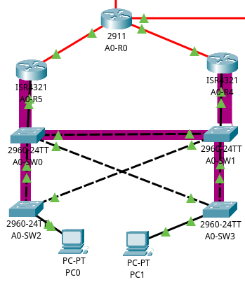

# CCNA Lab

I normally don't document my CCNA Labs from Cisco Packet Tracer here but I thought that this one is a bit more advanced so I'll write about it here.   

I'm not gonna explain how I did everything from scratch because honestly there is a lot of documentation on the internet about those things but I wanted to show just some issues I had and just a couple of more interesting things.

## Key technologies used here
* OSPF
* HSRP (+ on subinterfaces/SVIs)
* VLANs

## Topology

    

## configurations

Here are listed files with exported configurations of the devices.   

* [A0-R0](./A0-R0)
* [A0-R1](./A0-R1)
* [A0-R2](./A0-R2)
* [A0-R3](./A0-R3)
* [A0-R4](./A0-R4)
* [A0-R5](./A0-R5)
* [A0-R6](./A0-R6)
* [A0-MSW0](./A0-MSW0)

# OSPF

So I choose OSPF as the routing protocol since it's a big topic for the CCNA.   
Each router is assigned to the same Area 0 and gets it's RID from it's number so the format of RID is `172.16.255.x` and `x` corresponds to it's identificator like `A0-Rx`.   

However, there is no OSPF adjacency between `A0-R6` and `A0-MSW0`, since `A0-MSW0` is a L3 switch and there is no reason for it to handle another OSPF adjacency in this scenario.   

So there is one OSPF External Route in this network and that is the static route to 10.1.10.0/24 via `A0-R6` which is redistributed (`redistribute static subnets`) to the rest of the OSPF routers.   

# Networks

There are for now only two networks here.   

`10.1.10.0/24` - VLAN 10, SVI on `A0-MSW0`, reachable through `A0-R6`.   

`10.1.20.0/24` - VLAN 20, Virtual Gateway using HSRP on `A0-R4` and `A-R5`.

# Config snippets

So here are some more important parts of the configurations   

### A0-R6

Here is the part aobut the static route redistribution.   

The `A0-R6` and `A0-MSW0` are connected through the `172.16.1.0/30` network.   

As I said above `A0-MSW0` does not run OSPF.  
```IOS
ip classless
ip route 10.1.10.0 255.255.255.0 172.16.1.2 
```
Here is the redistribution section.   


> [!NOTE]
> The `passive-interface g0/0/1` is actually unnecessary here since that command is used when the interface IS in the OSPF Area and we want to prevent it from sending unnecessary OSPF messages.   
```IOS
router ospf 1
 log-adjacency-changes
 redistribute static subnets 
 passive-interface GigabitEthernet0/0/1
 network 172.16.255.6 0.0.0.0 area 0
 network 172.16.0.24 0.0.0.3 area 0
```

There is an important thing here.   

Notice that the `g0/0/1` interface with an IP address of `172.16.1.1/30` is not added to the OSPF process.  
That is because it would interfere with OSPF logic and it would make it impossible for the static route to enter the Routing Table.   

If the `172.16.1.0/30` network was added, the router would think that this link is a part of it's Area 0, while it is not. 

The static route to `10.1.10.0/24` would go through, what would be considered a part of Area 0, since `ip route 10.1.10.0 255.255.255.0 172.16.1.2` and `network 172.16.1.0 0.0.0.3 area 0`.   

In that case, since the `A0-R6` does not have a direct connection to `10.1.10.0/24`, it's the `A0-MSW0` which should advertise that netowrk, since it has a interface in it.  

But as I already said, it does not run OSPF.  
So what happened when I first added `172.16.1.0/30` to the OSPF process?   

The route to `10.1.10.0/24` didn't appear in the RIB no matter what I did.
So it's important to remember how the logic of OSPF redistribution works.   

Now there is no OSPF process on `A0-R6`'s interface connecting it to `A0-MSW0` and the OSPF correctly redistributes the static route.

Below you can see the part of `A0-R2`'s routing table which correctly shows the advertised OSPF External route.   

```IOS
A0-R1#sh ip ro
Codes: L - local, C - connected, S - static, R - RIP, M - mobile, B - BGP
       D - EIGRP, EX - EIGRP external, O - OSPF, IA - OSPF inter area
       N1 - OSPF NSSA external type 1, N2 - OSPF NSSA external type 2
       E1 - OSPF external type 1, E2 - OSPF external type 2, E - EGP
       i - IS-IS, L1 - IS-IS level-1, L2 - IS-IS level-2, ia - IS-IS inter area
       * - candidate default, U - per-user static route, o - ODR
       P - periodic downloaded static route

Gateway of last resort is not set

     10.0.0.0/24 is subnetted, 2 subnets
O E2    10.1.10.0/24 [110/20] via 172.16.0.26, 01:55:24, GigabitEthernet0/2/0
...
```

# HSRP

There is currently one HSRP group and it uses routers `A0-R4` and `A0-R5`.  

The `A0-R5` has a higher priority of 150 and preemtion enabled while the `A0-R4` has a priority of 50.  

Both of these routers maintain OSPF adjacencies with `A0-R0`.

The `A0-R4` has an IP address of `10.1.20.2/24` on the `g0/0/1` interface, while the `A0-R5` uses `10.1.20.3/24`.   

The virtual Gateway IP address is `10.1.20.1/24`.  

For now there is only a single subnet here but I will swap the HSRP between physical interfaces, for HSRP betwenn subinterfaces, which will allow for the usage of VLANs here.

# HSRP on subinterfaces with VLANs.   

First I removed the configurations from the physical `g0/0/1` interfaces and created two subinterfaces for VLANs 20 and 30 and assigned them appropriate IPs.   

```IOS
A0-R4(config)#int g0/0/1.20
A0-R4(config-subif)#encapsulation dot1Q 20
A0-R4(config-subif)#ip ad 10.1.20.2 255.255.255.0
A0-R4(config-subif)#int g0/0/1.30
A0-R4(config-subif)#encapsulation dot1Q 30
A0-R4(config-subif)#ip ad 10.1.30.2 255.255.255.0
```

And on the `A0-R5`:

```IOS
A0-R5(config)#int g0/0/1.20
A0-R5(config-subif)#encapsulation dot1Q 20
A0-R5(config-subif)#ip ad 10.1.20.3 255.255.255.0
A0-R5(config-subif)#int g0/0/1.30
A0-R5(config-subif)#encapsulation dot1Q 30
A0-R5(config-subif)#ip ad 10.1.30.3 255.255.255.0
```

The IPs are `.2` and `.3` for `A0-R4` and `A0-R5` as appropriate.   

Now there are going to be two HSRP groups, one for each VLAN.   

Group 2 for VLAN 20 and group 3 for VLAN 30.
The IPs of the virtual gateways will be `.1`.   

Of course it is also necessary to enable tagged traffic on the switches.  

For example on `A0-SW0`:    

```IOS
A0-SW0(config)#int g0/2
A0-SW0(config-if)#sw mo tr
A0-SW0(config-if)#sw tr al vl 20,30
A0-SW0(config-if)#int g0/1
A0-SW0(config-if)#sw mo tr
A0-SW0(config-if)#sw tr al vl 20,30
```

And as appropriate for the three other switches.   

And I also set them to be the primary root bridges for different VLANs.   

```IOS
A0-SW0(config)#spanning-tree vlan 20 root primary
A0-SW0(config)#spanning-tree vlan 30 root secondary
```

Then after restarting Packet Tracer, cause something seemed to be broken, I checked if the subinterfaces are able to ping each other.   
On `A0-R4`:   

```IOS
A0-R4#ping 10.1.20.3
Type escape sequence to abort.
Sending 5, 100-byte ICMP Echos to 10.1.20.3, timeout is 2 seconds:
!!!!!
Success rate is 100 percent
A0-R4#ping 10.1.30.3
Type escape sequence to abort.
Sending 5, 100-byte ICMP Echos to 10.1.30.3, timeout is 2 seconds:
!!!!!
Success rate is 100 percent (5/5), round-trip min/avg/max = 0/0/0 ms
```

Here is a screenshot from Packet Tracer. 
The purple segments indicate where the traffic is tagged.  
Those Crossed connections in the middle are also tagged but I don't know how to draw that in Packet Tracer.   

    

So the subinterfaces are able to reach each other which allows me to proceed with the Hot Standby Router Protocol Setup.     


## Contact

[](https://t.me/Andrtexh)
