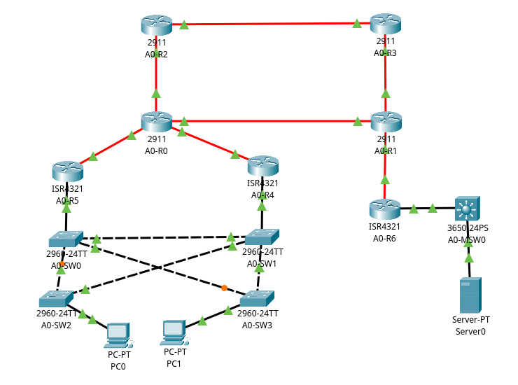

# CCNA Lab

I normally don't document my CCNA Labs from Cisco Packet Tracer here but I thought that this one is a bit more advanced so I'll write about it here.   

## Key technologies used here
* OSPF
* HSRP (+ on subinterfaces/SVIs)
* VLANs

## Topology

    

# OSPF

So I choose OSPF as the routing protocol since it's a big topic for the CCNA.   
Each router is assigned to the same Area 0 and gets it's RID from it's number so the format of RID is `172.16.255.x` and `x` corresponds to it's identificator like `A0-Rx`.   

However, there is no OSPF adjacency between `A0-R6` and `A0-MSW0`, since `A0-MSW0` is a L3 switch and there is no reason for it to handle another OSPF adjacency in this scenario.   

So there is one OSPF External Route in this network and that is the static route to 10.1.10.0/24 via `A0-R6` which is redistributed (`redistribute static subnets`) to the rest of the OSPF routers.   

# Networks

There are for now only two networks here.   

`10.1.10.0/24` - VLAN 10, SVI on `A0-MSW0`, reachable through `A0-R6`.   

`10.1.20.0/24` - VLAN 20, Virtual Gateway using HSRP on `A0-R4` and `A-R5`.

## Contact

