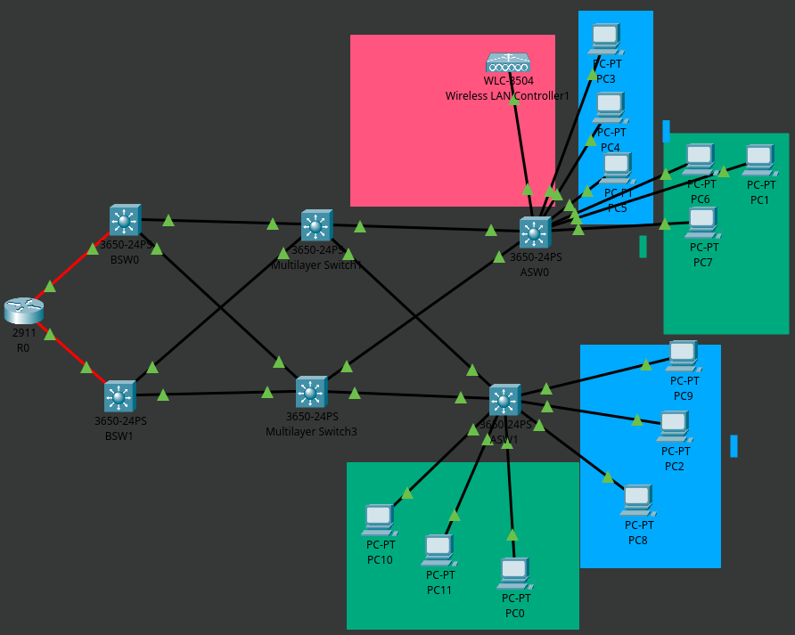

# Some practice lab for CCNA

I'm not gonna walk through everything from the beginning but I will just write and overview of the technologies used etc.   

## Topology

   

Sorry if the device names are not visible well but I just can't stand that blinding white packet tracer background.   

Don't mind that WLC.
I tried a couple of times to make a good split-MAC architecture but I failed to do that.   
However I started blaming Packet Tracer since I checked my configuration a lot of times and it's actually pretty common that Packet Tracer has some bugs.   
After all it only mimics the IOS software and doesn't run the actual IOSv.   
Besides I'm running it on Arch Linux from some weird build so I think this speaks for itself.   
For example, when I create an etherchannel with PAgP, the link lights stay Red (Down) for some reason even when the connection fully works.   

I wanted the VLANs 10 and 20 to act as a typical networks just for PCs and VLAN 30 to be the network for CAPWAP tunneling and Management of the network devices.   

All those 3650-24PS switches are configured to only accept SSH connections from `10.0.30.0/24` network with a standard ACL named `SSHACL` and to timeout on console and VTY lines after 10 minutes of inactivity.    

The DHCP Server for all VLANs is running on the `R1` Cisco 2911 router, which is connected with OSPF to BSW0 and BSW1.   

BSW0 and BSW1 both have interfaces in all VLANs, and are configured to use HSRP as a kind of a load-balancing and a backup first hop gateway.

BSW0 has IP addresses ending with `.2` while BSW1 uses `.3`.   

VIP addresses are always ending with `.1`, for example with VLAN 10:   

* BSW0 - `10.0.10.2/24`
* BSW1 - `10.0.10.3/24`
* VIP - `10.0.10.1/24`

And the same way for VLANs 20 and 30.    

Of course HSRP is synchronized with STP root bridges.   

# L2 Security

There are several Security measures on the Access layer switches (ASW0 and ASW1).   

There is DHCP Snooping enabled with `g1/0/1` and `g1/0/2` as trusted interfaces.   
DHCP rate limiting is set to 20 packets per minute.
Also I enabled port security Restrict violation mode and I enabled sticky MAC addresses as well as set the maximum number of MAC Addresses per port to a single MAC Address.   
I know that port security ensures that a sinlge MAC address is accepted per-port by default but I wanted to explicitly state that.   

# Contact

