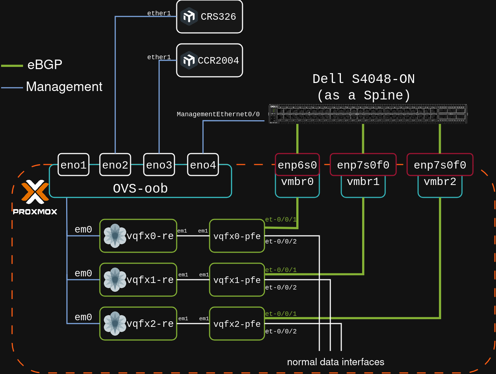

# Out-of-Band Management setup 

Kind of took a bit of a break from networking for a while after I passed CCNA but now I would like to implement real OOB Management in my network.   

~~To complete that I'm gonna use the old Brocade FLS648 switch, Open vSwitch in Proxmox and VRFs to separate the Management interfaces in my devices.~~  

Actually I have a better idea which removes the need for the FLS648. 
I'll just bridge all `eno1`-`eno4` 1GbE RJ45 ports in the Dell PowerEdge R710 to a Linux Bridge (or OVS) and use it as a switch for the OOB Mgmt network.  
I will be able to plug connect the Management interfaces directly to interfaces in the R710 server and it will act as a switch for the oob management network.

Until now, the Management setup was kind of weird and for sure unprofessional because each MikroTik router had it's own small Management network.

For example the CCR2004 had `ether1` interface in the `10.1.1.0/30` network and CRS326 had `ether1` in the `10.1.1.4/30` network.  
That kind of worked but this is nowhere near real Out-of-Band Management which is implemented in Data Centers so I'm gonna change that.  

I put together a diagram which gives an overview on how I want the OOB Management to be.  

   

The only issue that i could point out for now is that there's now a single point of failure being the availability of the R710.   
If Proxmox doesn't come up online then the OOB Mgmt doesn't work at all. 
Also, the R710 does not have a hardware acceleration for L2 switching which in short means that it doesn't work well as a switch because every frame needs to go through the CPU.   

I don't think that it's a big deal for the Management network but if I used a dedicated switch like the FLS648, there would be absolutely no problem with switching at line-speed in the management network.   

The thing is that I can actually leave the configuration which bridges all RJ45 1GbE ports in the R710 NIC and if I want to change something then I can just plug the FLS648 into one of those ports and then plug the rest of the management interfaces to the FLS648 as it has the most basic configuration possible.   

### Setting up management interfaces

I choose the 10.1.99.0/24 subnet for the management network.   

On the MikroTiks the `ether1` interfaces will be connected to the management network.   

Also I need to place the `ether1` interfaces in a separate VRF to avoid traffic going through the management  network.   

First Im doing this on the CRS326:   

The `ether1` interface is currently in the main bridge so I need to remove it from the bridge and make it routed port in a separate VRF.   

Via Serial connection first I remove the port from the bridge, the ip address on the vlan90 interface and the vlan interface itself:   
```rsc 
[admin@leaf-crs326] > interface/bridge/port/remove [find interface=ether1]
[admin@leaf-crs326] > ip address/remove [find interface=vlan90-mgmt]
[admin@leaf-crs326] > interface/vlan/remove [find interface=vlan90-mgmt]
```
Then I create a new VRF with `ether1` interface added and assign an IP address directly to the `ether1` interface.  
```rsc
[admin@leaf-crs326] > ip vrf/add name=vrf-mgmt interfaces=ether1
[admin@leaf-crs326] > ip address/add interface=ether1 address=10.1.99.5/24
```
Then I remove the old `CRS326-MGMT` address list and add a new `MGMT` address list:   
```rsc
[admin@leaf-crs326] > ip firewall/address-list/remove [find list=CRS326-MGMT]
[admin@leaf-crs326] > ip firewall/address-list/add address=10.1.99.0/24 list=MGMT
```
Then I swap the `CRS326-MGMT` list to `MGMT` in the firewall filter rules:   
```rsc
[admin@leaf-crs326] > ip firewall/filter/set [find dst-address-list=CRS326-MGMT] dst-address-list=MGMT 
```

Now I'll just plug the CRS326 `ether1` interface to the FLS648 and then I will be able to SSH into the CRS326 from the Out-of-Band network.  

I also added a default gateway for the management network. The CCR2004 will be the gateway for the OOB Management network:   

```rsc
[admin@leaf-crs326] > ip route/add dst-address=0.0.0.0/0 gateway=10.1.99.1 routing-table=vrf-mgmt 
```

Then I got into configuring the CCR2004.   

First the IP address on the `ether1` interface. I just had to change it and place it in a separate VRF as it was already a routed port:   
```rsc
[admin@border-leaf-ccr2004] > ip address/set [find interface=ether1] address=10.1.99.1/24
[admin@border-leaf-ccr2004] > ip vrf/add name=vrf-mgmt interfaces=ether1 
```

Then before getting into the firewall config (as I will completely redo it) I plugged both the CRS326 and CCR2004 into the FLS648 switch via their `ether1` interfaces:   

   


Then I tried to ping CRS326 from CCR2004 via the management network:   
```rsc
[admin@border-leaf-ccr2004] > ping 10.1.99.5 vrf=vrf-mgmt 
  SEQ HOST                                     SIZE TTL TIME       STATUS                                                                                  
    0 10.1.99.5                                  56  64 355us     
    1 10.1.99.5                                  56  64 295us     
    2 10.1.99.5                                  56  64 304us     
    sent=3 received=3 packet-loss=0% min-rtt=295us avg-rtt=318us max-rtt=355us 
```
As you can see the ping goes through.   

However I would like to allow myself to access the internet through the management network. 
I will run a DHCP Server for the management network on the CCR2004 as it is the appropriate device for this task because of it's Annapurna Labs ARM64 CPU which is definitely more powerful than the CPU on the CRS326.   

First I create an address pool and then the DHCP Server instance on the `ether1` interface.   
One thing to note here is that DHCP on RouterOS v7 is weird. There is no really globally-listening DHCP server like on Cisco IOS for example. You can check out the [DHCP Nightmare section in one of my other documents](../12-eBGP-implementation/readme.md).   

But here the CCR2004 has only one interface in the Management network so it's easier to do.   
```rsc
[admin@border-leaf-ccr2004] > ip pool/add name=mgmt-pool ranges=10.1.99.50-10.1.99.200
[admin@border-leaf-ccr2004] > ip dhcp-server/add name=dhcp-mgmt interface=ether1 address-pool=mgmt-pool lease-time=30d  
[admin@border-leaf-ccr2004] > ip dhcp-server/network/add address=10.1.99.0/24 gateway=10.1.99.1 dns-server=1.1.1.1,8.8.8.8
```

Then I plugged my laptop into the FLS648 and sent a DHCP request:   
```zsh
❯ ipauto
Pomyślnie dezaktywowano połączenie „eth0” (ścieżka aktywacji D-Bus: /org/freedesktop/NetworkManager/ActiveConnection/5)
Pomyślnie aktywowano połączenie (ścieżka aktywacji D-Bus: /org/freedesktop/NetworkManager/ActiveConnection/6)
❯ ip a
1: lo: <LOOPBACK,UP,LOWER_UP> mtu 65536 qdisc noqueue state UNKNOWN group default qlen 1000
    link/loopback 00:00:00:00:00:00 brd 00:00:00:00:00:00
    inet 127.0.0.1/8 scope host lo
       valid_lft forever preferred_lft forever
    inet6 ::1/128 scope host noprefixroute 
       valid_lft forever preferred_lft forever
2: enp0s25: <BROADCAST,MULTICAST,UP,LOWER_UP> mtu 1500 qdisc fq_codel state UP group default qlen 1000
    link/ether 68:f7:28:8d:ec:40 brd ff:ff:ff:ff:ff:ff
    altname enx68f7288dec40
    inet 10.1.99.200/24 brd 10.1.99.255 scope global dynamic noprefixroute enp0s25
       valid_lft 2591980sec preferred_lft 2591980sec
    inet6 fe80::c7ea:451d:2cd1:9b93/64 scope link noprefixroute 
       valid_lft forever preferred_lft forever
3: wlp3s0: <BROADCAST,MULTICAST> mtu 1500 qdisc noqueue state DOWN group default qlen 1000
    link/ether f2:3c:88:0d:f7:0d brd ff:ff:ff:ff:ff:ff permaddr 34:02:86:51:62:c4
    altname wlx3402865162c4
4: tailscale0: <POINTOPOINT,MULTICAST,NOARP,UP,LOWER_UP> mtu 1280 qdisc fq_codel state UNKNOWN group default qlen 500
    link/none 
    inet 100.121.66.96/32 scope global tailscale0
       valid_lft forever preferred_lft forever
    inet6 fd7a:115c:a1e0::1601:4288/128 scope global 
       valid_lft forever preferred_lft forever
    inet6 fe80::cdcd:a3a4:c7cd:b8fb/64 scope link stable-privacy proto kernel_ll 
       valid_lft forever preferred_lft forever
```

As you can see the connection went up and I successfully got assigned an address from the DHCP Mgmt pool (10.1.99.200)   

However now comes a very important step which is necessary to allow the management network to access the internet properly. 
First I need to add a new default route specifically for the `vrf-mgmt` because now the `ether1` interface is completely cut off from the rest of the entire network. 
I need to set a gateway from the main VRF as the next hop for the `vrf-mgmt` like this:   
```rsc
[admin@border-leaf-ccr2004] > ip route/add dst-address=0.0.0.0/0 gateway=10.0.0.1@main routing-table=vrf-mgmt
```
The `@` symbol is used to set from which VRF the gateway address is. 
Here I needed to make the `vrf-mgmt` use `10.0.0.1` from the `main` vrf as the `sfp-sfpplus12` (which is the one connected to `10.0.0.1`) is in a completely different VRF so the traffic does not leak between the VRFs by default.   

> [!NOTE]
> While doing all this, I have firewall filter disabled completely because I will make a new config for the firewall.

There also must be a NAT rule like this:   
```rsc
[admin@border-leaf-ccr2004] /ip/firewall/nat> add action=masquerade chain=srcnat out-interface=sfp-sfpplus12
```
This will simply perform PAT on everything going out of the WAN interface of the CCR2004.   

However this isn't enough to enable proper internet access from the management network.
As you can see below, the ping from my laptop (`10.1.99.200`) to `1.1.1.1` does not go through.   

Because now there are more than one VRFs, RouterOS does not know that the returning traffic which originating from the `vrf-mgmt`, should go to the `vrf-mgmt` and not to the `main` routing-table.   

To enable traffic marking I will use Mangle in RouterOS firewall rules.   
First I added a new rule to mark everything forwarded from `ether1` with a new connection mark `mgmt-to-wan`:
```rsc
[admin@border-leaf-ccr2004] > ip firewall/mangle/add action=mark-connection in-interface=ether1 chain=prerouting new-connection-mark=mgmt-to-wan passthrough=yes
```
Then I set a rule to put traffic, that comes back as response to traffic marked with `mgmt-to-wan`, into the `vrf-mgmt`:   
```rsc
[admin@border-leaf-ccr2004] > ip firewall/mangle/add action=mark-routing chain=prerouting connection-mark=mgmt-to-wan in-interface=sfp-sfpplus12 new-mark=vrf-mgmt passthrough=no
```
> [!IMPORTANT]
> There is a thing where I got stuck for a while. It's important to set `chain=prerouting` instead of `chain=forward`. That's because the CCR2004 needs to make a decision about marking the connection and putting the traffic into the specific VRF before routing takes place because by default the traffic will be put into the `main` VRF.

Now as you can see, the ping goes through to the internet:
```zsh
❯ ping 1.1.1.1
PING 1.1.1.1 (1.1.1.1) 56(84) bytes of data.
64 bytes from 1.1.1.1: icmp_seq=1 ttl=56 time=8.73 ms
64 bytes from 1.1.1.1: icmp_seq=2 ttl=56 time=8.19 ms
^C
--- 1.1.1.1 ping statistics ---
2 packets transmitted, 2 received, 0% packet loss, time 1002ms
rtt min/avg/max/mdev = 8.189/8.458/8.727/0.269 ms
```


