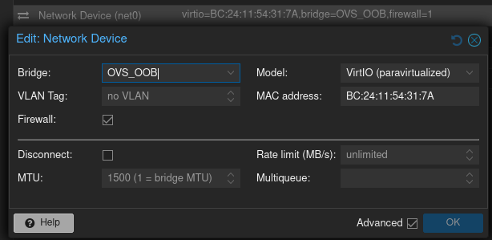

# Day0 setup on vJunos Switch 25.4R1

Wanted to write down a very basic day 0 configuration for the vJunos switch in Proxmox.   

Of course SSH access will be only possible via SSH keys so I already generated one:   
```zsh
❯ ssh-keygen -t ed25519 -f ~/.ssh/vJunosSwitch_aether_ed25519 -C "andreansx@icloud.com" -b 4096
```

So starting with the management interface first I assign a static IP on the `fxp0.0` interface.   
The `fxp0` interface in the vJunos Switch corresponds to the `net0` vNIC in the Proxmox Virtual Environment.   
I connected the `net0` vNIC to `OVS_OOB`:   

   

The normal data interfaces correspond like `net1` in PVE -> `ge-0/0/0` in vJunos Switch and so on.   

I set the management ip:   
```junos
[edit]
root# set interfaces fxp0 unit 0 family inet address 10.1.99.4/24
```

However here is an important thing. 
At first I tried to add the `fxp0.0` to the `mgmt_junos` routing instance but I always got an error while commiting the configuration change:   
```junos
[edit]
root# commit 
[edit routing-instances mgmt]
  'interface fxp0.0'
    RT Instance: Interface fxp0.0 not supported under routing-instances.
error: configuration check-out failed
```
And I was really confused because I thought it was an absolutely normal practise to put `fxp0` into a separate VRF (or routing instance in Juniper terminology).  

But actually this is correctly done with a single command:   
```junos
set system management-instance
commit
```
This is what actually creates a `mgmt_junos` routing-instance and places the `fxp0.0` interface into it supposedly on kernel-level.   
So then I just added a default route for the `mgmt_junos` routing instance:   
```junos
set routing-instances mgmt_junos routing-options static route 0.0.0.0/0 next-hop 10.1.99.1
commit
```
