# Basic Day0 config on the Dell EMC S4048-ON  

# Management VRF, SSH setup and RSA public key import via SCP, OS9 Linux Shell.

SSH RSA Pubkey Import on OS9:   
* [via SCP ](##via-scp)   
* [via USB](##via-usb)

Just wanted to show how I set up a basic config for SSH access on the Dell S4048-ON.   

First I plugged my RJ45 Serial to USB-A adapter into my laptop and into the console port on the Dell S4048-ON:   

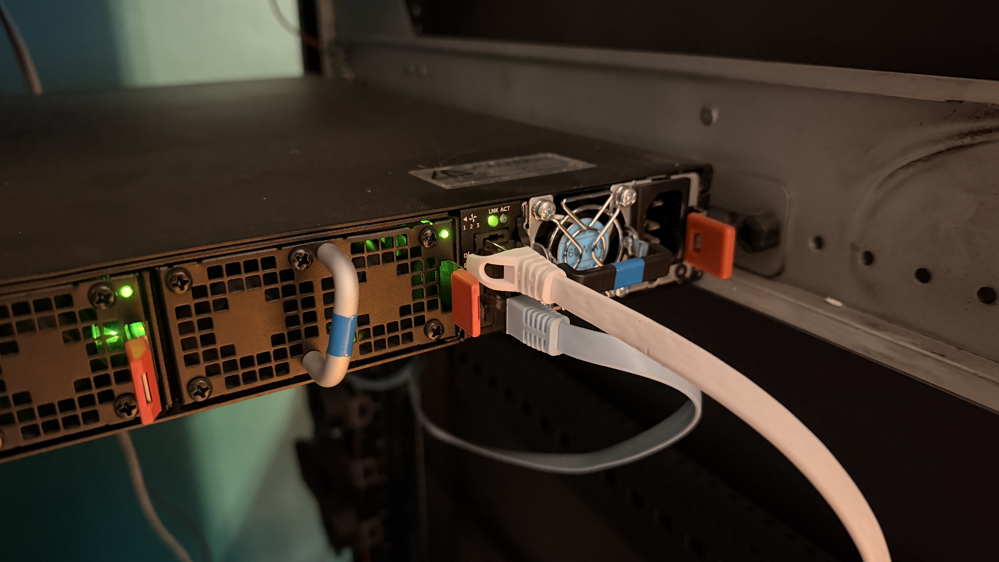   

I also already connected the Management port on the Dell S4048-ON to one of the free 1GbE ports in my Dell R710.   
Refer to the [Out-of-Band Management](../19-oob-mgmt/readme.md) Project.   

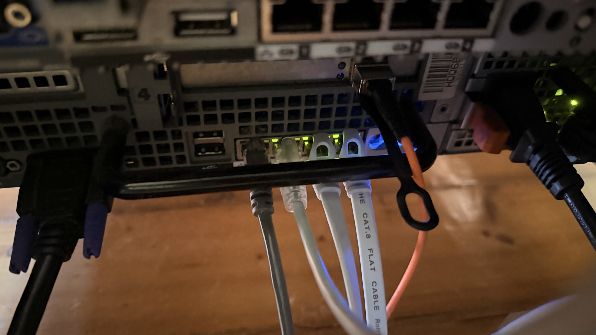   

The white cable on the rightmost of the photo is the one connecting the `OVS_OOB` to the Dell S4048-ON.   

After plugging the serial cable to my laptop i checked where the serial device was located   

   

Then I connect using `screen` and baud 115200.   

```zsh
❯ screen /dev/ttyUSB0 115200
```

If I connected via serial earlier while the switch was booting up, I would see ONIE bootloader menu as well as all the logs and finally the "DellEMC con0 now available".   
No password by default so immediately after pressing Enter I get into the EXEC mode   

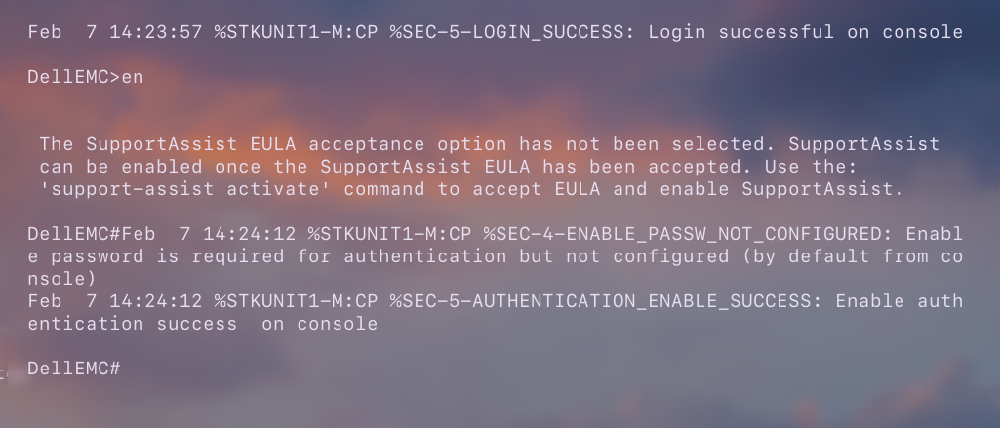   

Dell EMC OS9 is very similar to Cisco IOS mostly in the syntax so it's quite easy to navigate through it if you already have experience with Cisco devices.   

First I created a new user which I will use for SSH access.
```OS9
DellEMC#conf
DellEMC(conf)#username aether privilege 15 password ----
DellEMC(conf)#Feb  7 14:29:01 %STKUNIT1-M:CP %SEC-5-USER_ACC_CREATION_SUCCESS: User account "aether" created or modified by default from console successfully
```

I always set logging synchronous as it causes the logs to not break your commands etc.   

```OS9
DellEMC(conf)#line console 0
DellEMC(config-line-console)#logging synchronous
```

I would like to use the local user base for login authentication so I use the `aaa` commands to set `local` as the default login credentials base:   
```OS9
DellEMC(conf)#aaa authentication login default local
```
The `default` group works here very similarly to how it works on Cisco IOS.   

Then I created a standard ACL for restricting SSH access.   
```OS9
DellEMC(conf)#ip access-list standard SSHACL
DellEMC(config-std-nacl)#permit 10.1.99.0/24
```
Then I applied this ACL to the all vty lines.   
One thing that caught my attention here is that by default Cisco IOS devices have 16 VTY lines but this Dell S4048-ON running Dell EMC OS9 only has 10 VTY lines.    
```OS9
DellEMC(conf)#line vty 0 9
DellEMC(config-line-vty)#access-class SSHACL ipv4
```

There is no `transport input ssh` like on cisco IOS here.   

Then I set the VTY lines to use the `default` AAA group:   
```OS9
DellEMC(config-line-vty)#login authentication default
```
This will cause the OS9 to use the local user base as the one against which it check the supplied login credentials.   

Then to actually enable SSH I had to generate RSA keys and enable the SSH server.   
```OS9
DellEMC(conf)#crypto key generate rsa 
Enter key size <1024-2048>. Default<2048>  :
Generating 2048-bit SSHv2 RSA key.
! ! ! ! ! ! ! ! ! ! ! ! ! ! ! ! ! ! ! ! ! ! ! ! ! ! ! ! ! ! ! ! ! ! ! ! ! ! ! ! ! ! ! ! ! ! ! ! ! ! ! ! ! ! ! ! ! ! ! ! ! ! ! ! ! ! ! ! ! ! ! ! ! ! ! ! ! ! ! ! ! ! ! ! ! ! ! ! ! ! ! ! ! ! ! ! ! ! ! ! ! ! ! ! ! ! ! ! ! ! ! ! ! ! ! ! ! ! ! ! ! ! ! ! ! ! ! ! ! ! ! ! ! ! ! ! ! 
DellEMC(conf)#Feb  7 14:41:10 %STKUNIT1-M:CP %SEC-5-SSHD_KEY_GENERATED: SSH Key SHA256=p84XRd generated

DellEMC(conf)#ip ssh server version 2
DellEMC(conf)#ip ssh server enable 
```
Those commands are a bit different than the corresponding ones on classic Cisco IOS.   

Cisco IOS uses `ip ssh version 2` for example.   
And also I needed to enable the SSH server for the specific VRF:   
```OS9
DellEMC(conf)#ip ssh server vrf management
```

I also limited login retries, connection rate limit and set an idle timeout for the SSH access.

```OS9
DellEMC(conf)#ip ssh authentication-retries 2
DellEMC(conf)#ip ssh connection-rate-limit 5
```
Also (only for now) I enable SSH password auth since it's necessary to load a pubkey through SSH/scp.   
```OS9
DellEMC(conf)#ip ssh password-authentication enable
```

And as always with Management interfaces the VRF separation can make things tricky but I found a setup that works for me.   

I do these things accordingly to the ["Dell Command Line Reference Guide for the S4048–ON System 9.14.2.5"](https://dl.dell.com/topicspdf/dell-emc-os-9_users-guide20_en-us.pdf)   

Mine seems to be on 9.14(1.14) so I guess there shouldn't be much difference between the version mine runs and the 9.14.2.5 version.  
```OS9
DellEMC(conf)#do sh ver
Dell EMC Real Time Operating System Software
Dell EMC Operating System Version:  2.0
Dell EMC Application Software Version:  9.14(1.14)
Copyright (c) 1999-2018 by Dell Inc. All Rights Reserved.
Build Time: Tue Oct 25 11:01:57 2022
...
```
First I enable the vrf feature:   
```OS9
DellEMC(conf)#feature vrf
```
Then It's very important to not assign an IP address on the `ManagementEthernet1/1` interface for now.  
If you add an IP address to the `ManagementEthernet1/1` interface now, you will later get an error when trying to add the `management` interface:   
```OS9
DellEMC(conf)#ip vrf management 
DellEMC(conf-vrf)#interface management 
% Error: Port is not in default mode Invalid.
```
By running this command you automatically create a dedicated `management` vrf:   
```OS9
DellEMC(conf)#ip vrf management
```
Then inside VRF MODE I ran this and this is the command that actually adds the `ManagementEthernet1/1` interface to the `management` VRF:   
```OS9
DellEMC(conf-vrf)#interface management
```

This is actually documented in the CLI guide I mentioned earlier but I got stuck for some time because I already added an IP address to the `ManagementEthernet1/1` interface so it constantly returned an error.   

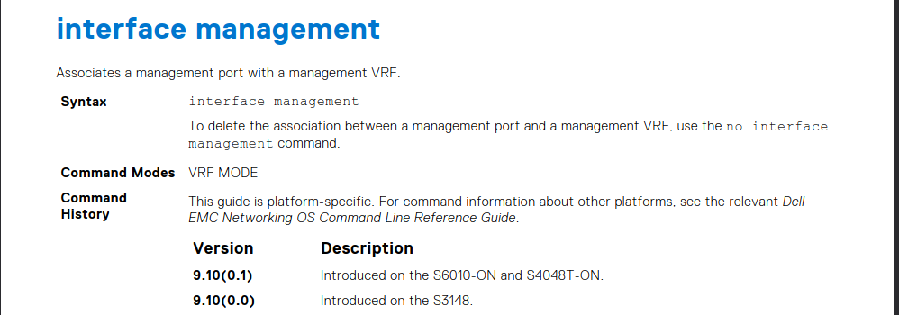   

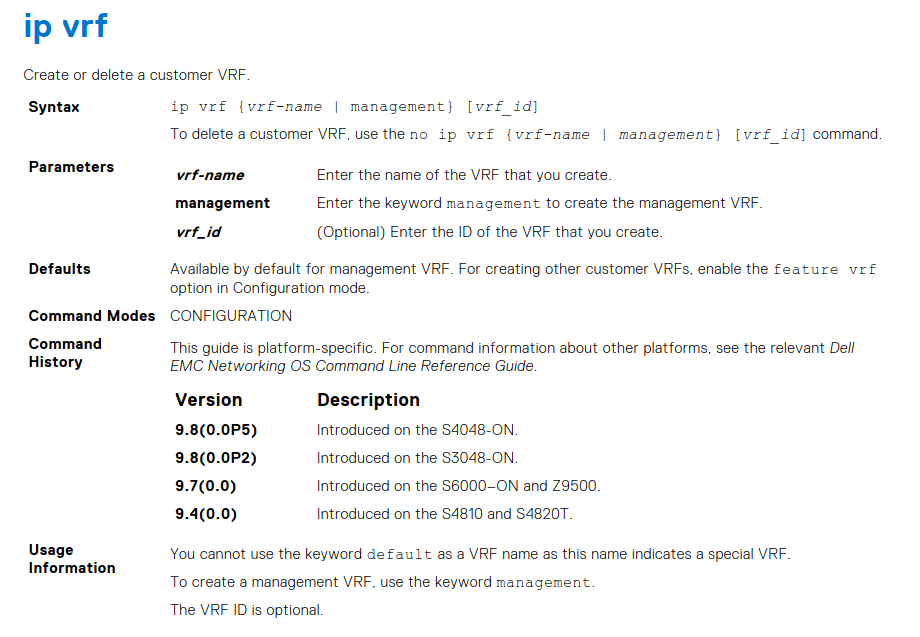

After that I could check and finally the `ManagementEthernet1/1` interface was placed in the `management` vrf:   
```OS9
DellEMC#Feb  7 15:17:02 %STKUNIT1-M:CP %SYS-5-CONFIG_I: Configured from  console
sh ip vrf
VRF-Name                         VRF-ID Interfaces
default                          0       Te 1/1-1/48,
                                          Fo 1/49,1/50,1/51,1/52,1/53,1/54,
                                          Nu 0,
                                          Vl 1
management                       512     Ma 1/1
```


Then I can finally set the IP address on the `ManagementEthernet1/1` interface.   
```OS9
DellEMC(conf)#interface managementethernet 1/1
DellEMC(conf-if-ma-1/1)#no shutdown 
Feb  7 15:28:39 %STKUNIT1-M:CP %IFMGR-5-ASTATE_UP: Changed interface Admin state to up: Ma 1/1
DellEMC(conf-if-ma-1/1)#Feb  7 15:28:42 %STKUNIT1-M:CP %IFMGR-5-OSTATE_UP: Changed interface state to up: Ma 1/1
DellEMC(conf-if-ma-1/1)#ip ad 10.1.99.7/24
```

However I would like the Management interface to be able to reach other parts of the network if for example I placed a syslog server somewhere so I needed to add a management route.  
This is another part that's tricky because the routes for the `management` vrf are added with a different command:   
```OS9
DellEMC(conf)#management route 0.0.0.0/0 10.1.99.1
```
And after that I checked the `management` VRF route table and as you can see the default route got successfully added to the `management` VRF.   

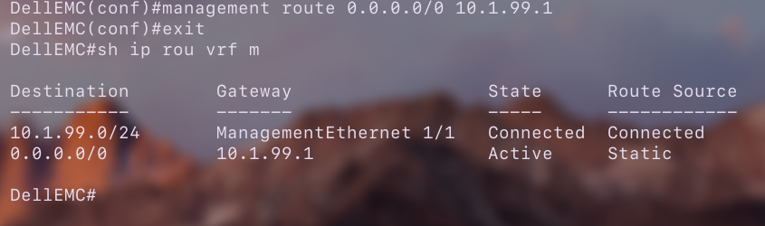   

Of course it's important to write the config to the `startup-config` file. 
I actually forgot about that cause I kind of got used to `commit` on JunOS.   

```OS9
DellEMC#write memory 
!
```

I then tried to log into the Dell S4048-ON via SSH from my laptop:   
```zsh
❯ ssh aether@10.1.99.7
The authenticity of host '10.1.99.7 (10.1.99.7)' can't be established.
RSA key fingerprint is: SHA256:p84XRdRCGEbPTbA1O58kG05LXKuSvh45TzjpzWdy0NU
This key is not known by any other names.
Are you sure you want to continue connecting (yes/no/[fingerprint])? yes
Warning: Permanently added '10.1.99.7' (RSA) to the list of known hosts.
** WARNING: connection is not using a post-quantum key exchange algorithm.
** This session may be vulnerable to "store now, decrypt later" attacks.
** The server may need to be upgraded. See https://openssh.com/pq.html
aether@10.1.99.7's password: 


 The SupportAssist EULA acceptance option has not been selected. SupportAssist
 can be enabled once the SupportAssist EULA has been accepted. Use the:
 'support-assist activate' command to accept EULA and enable SupportAssist.

DellEMC#exit
Session terminated for user aether on line vty 0 ( 10.1.99.200 )
```

I generated a RSA key pair:   
```zsh
❯ ssh-keygen -t rsa -f ~/.ssh/Dell_EMC_S4048-ON_aether_rsa -C "andreansx@icloud.com" -b 2048
```

Now I would like to import my SSH public key.   

There seem to be two ways to do this: via SSH (scp) or via a usb drive.   
I'm gonna show how to do this in both ways.   

## Via scp

My Arch Linux system tries to always use SFTP when running SCP but the OS9 doesn't really seem to accept that so I had to make SCP use the older method.   

The command that I found to work was:   
```zsh
scp -O ~/.ssh/Dell_EMC_S4048-ON_aether_rsa.pub aether@10.1.99.7:
```
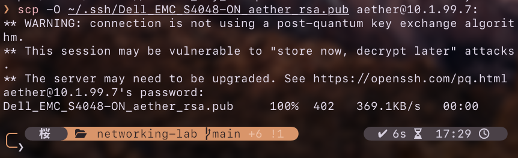   

At first I tried to point to `aether@10.1.99.7:flash://` but OS9 by default places all files copied over network to the flash location.   
By entering linux shell on OS9 I could check that the file was successfully placed in the `flash:` location:   

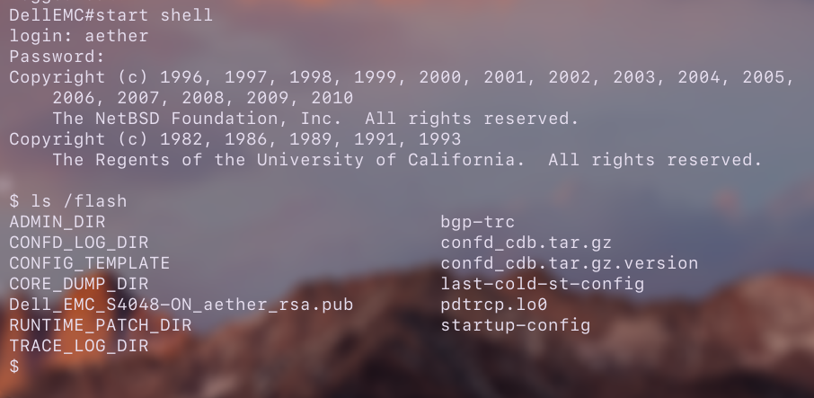    

I don't really know if I have missed something but importing the SSH RSA pubkey file on the OS9 is a nightmare.   

Tried a couple of times running those commands:   
```OS9
DellEMC(conf)#ip ssh pub-key-file Dell_EMC_S4048-ON_aether_rsa 
% Error: No valid host key(s) found
DellEMC(conf)#ip ssh pub-key-file flash:/Dell_EMC_S4048-ON_aether_rsa
% Error: No valid host key(s) found
DellEMC(conf)#ip ssh pub-key-file flash://Dell_EMC_S4048-ON_aether_rsa
% Error: No valid host key(s) found
DellEMC(conf)#ip ssh pub-key-file flash:Dell_EMC_S4048-ON_aether_rsa  
% Error: Entered file is not valid
```

> [!NOTE]
> Don't mind the missing `.pub` at the end of the file.   
> I renamed the file to the name without the `.pub` at the end because I though that maybe it would work.   
```OS9
DellEMC#start shell
login: aether
Password:
Copyright (c) 1996, 1997, 1998, 1999, 2000, 2001, 2002, 2003, 2004, 2005,
    2006, 2007, 2008, 2009, 2010 
    The NetBSD Foundation, Inc.  All rights reserved.
Copyright (c) 1982, 1986, 1989, 1991, 1993
    The Regents of the University of California.  All rights reserved. 

$ mv /flash/Dell_EMC_S4048-ON_aether_rsa.pub \
> /flash/Dell_EMC_S4048-ON_aether_rsa
```

I even ran `vi` to delete the comment at the end of the file because I thought that maybe it was causing problems for the parser:   
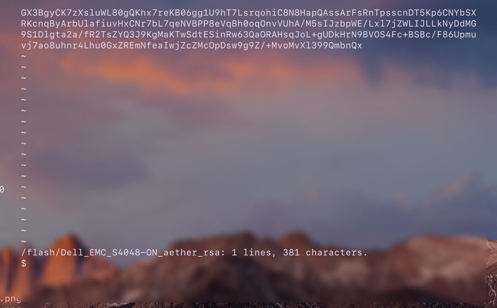

Of course it didn't work.   
I copied the copied the file via SCP once again and I checked with the CLI guide.   

What I found to finally work was this:   

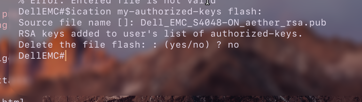    

The command was cut off because of the OS9 cli formatting on Serial connection so here is the full version:   

```OS9
DellEMC#$ip ssh rsa-authentication my-authorized-keys flash:                 
Source file name []: Dell_EMC_S4048-ON_aether_rsa.pub
RSA keys added to user's list of authorized-keys.
Delete the file flash: : (yes/no) ? no
DellEMC#
```

However when I tried to input the filename in the command itself it didn't work:   

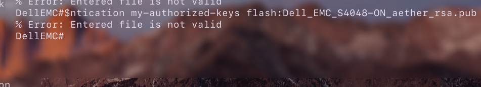   

Seems weird considering that this is the exact same filename that I entered in the method above.    

But the most important thing is that as you can see this command wasn't ran in the CONFIGURE mode.   
The `ip ssh pub-key-file` command in CONFIGURE mode seems to be used for something else while the `ip ssh rsa-authentication my-authorized-keys` command in the PRIVILEGED EXEC mode is actual one used for importing SSH public keys.   

But after all the SSH login with RSA keys seems to work:   

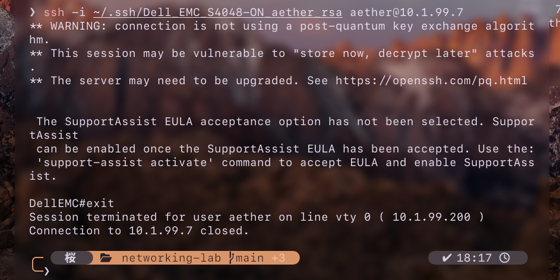    


Only thing is that sadly OS9 in this version doesn't support the elliptic curve algorithms like ed25519 so I have to use longer keys (2048 bits) when I could use ed25519 keys with a length of only 256 bits.   


I also know that I could have just used the built-in `copy` command but it would require spinning up a TFTP server or something similar and I just wanted something without a lot of setup.   
Though looking back at this it actually might have been a better idea to go with the HTTP Copy.


## via USB


First I format my pendrive to FAT32.   

[wip]

