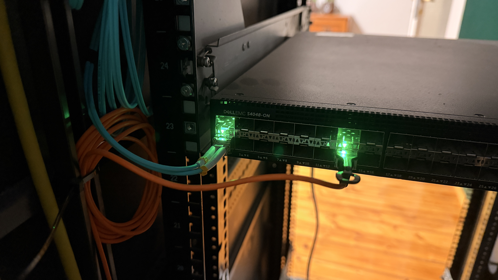

# Basic eBGP setup between Dell EMC S4048-ON and MikroTik CCR2004-1G-12S+2XS   

I will comment a bit less than usual here cause this is just a test run.
Meaning that this is a setup of only one eBGP session mostly for testing.  

eBGP between CCR2004 and S4048-ON will be between routed ports and not on SVIs.  
Generally I will make more dedicated links rather than run everything on trunking links.   

I first remove the VLAN 100 on the CCR2004:   
```rsc
[aether@border-leaf-ccr2004] /ip/address> p
Flags: S - SLAVE
Columns: ADDRESS, NETWORK, INTERFACE
#   ADDRESS          NETWORK       INTERFACE          
0   10.1.99.1/24     10.1.99.0     ether1             
1 S 172.16.255.0/31  172.16.255.0  eBGP_LINK_AS65001_0
2   172.16.0.1/32    172.16.0.1    bridge0            
3 S 172.16.255.2/31  172.16.255.2  eBGP_LINK_AS65001_1
4 S 172.16.255.4/31  172.16.255.4  eBGP_LINK_AS65001_2
5   10.0.0.2/24      10.0.0.0      sfp-sfpplus12
[aether@border-leaf-ccr2004] > ip ad rem 1
[aether@border-leaf-ccr2004] > interface/vlan/p
Flags: R - RUNNING
Columns: NAME, MTU, ARP, VLAN-ID, INTERFACE
#   NAME                  MTU  ARP      VLAN-ID  INTERFACE   
0 R eBGP_LINK_AS65001_0  1500  enabled      100  sfp-sfpplus1
1   eBGP_LINK_AS65001_1  1500  enabled      102  sfp-sfpplus2
2   eBGP_LINK_AS65001_2  1500  enabled      104  sfp-sfpplus3
[aether@border-leaf-ccr2004] > interface/vl rem 0
```

Then I set an IP address directly on the `sfp-sfpplus1` interface   
```rsc
[aether@border-leaf-ccr2004] > ip address/add address=172.16.255.0/31 interface=sfp-sfpplus1
```

I removed the old eBGP connection:   
```rsc
[aether@border-leaf-ccr2004] > routing/bgp/connection/p
Flags: D - dynamic, X - disabled, I - inactive 
 0   name="eBGP_CON_AS65001_0" 
     remote.address=172.16.255.1 .as=4201000002 
     local.default-address=172.16.255.0 .role=ebgp 
     routing-table=main router-id=172.16.0.1 as=4201000001 
     keepalive-time=20s 
     output.network=BGP_ADV_NET .default-originate=if-installed 

 1   name="eBGP_CON_AS65001_1" 
     remote.address=172.16.255.3 .as=4201000002 
     local.default-address=172.16.255.2 .role=ebgp 
     routing-table=main router-id=172.16.0.1 as=4201000001 
     keepalive-time=20s 
     output.network=BGP_ADV_NET .default-originate=if-installed 

 2   name="eBGP_CON_AS65001_2" 
     remote.address=172.16.255.5 .as=4201000002 
     local.default-address=172.16.255.4 .role=ebgp 
     routing-table=main router-id=172.16.0.1 as=4201000001 
     keepalive-time=20s 
     output.network=BGP_ADV_NET .default-originate=if-installed 
[aether@border-leaf-ccr2004] > routing/bgp/connection/rem 0
```
Then I created a new connection. 
Dell S4048-ON will be `AS4200000000` and will use router id of `172.16.0.0/32`. CCR2004 will be `AS4200000001` and router id `172.16.0.1/32`.   
```rsc
[aether@border-leaf-ccr2004] /routing/bgp/connection> add name=eBGP_CON_AS4200000000 remote.address=172.16.255.1 remote.as=4200000000 local.role=ebgp routing-table=main router-id=172.16.0.1 as=4200000001 output.network=BGP_ADV_NET output.default-originate=if-installed 
```

Now I can SSH into the S4048-ON to set up basic eBGP on the link to the CCR2004.   

First the router id. Router id is by default selected from the loopback interface.   
```OS9 
DellEMCS4048-ON(conf)#interface loopback 0
DellEMCS4048-ON(conf-if-lo-0)#ip ad 172.16.0.0/32
```

The CCR2004 and S4048-ON are connected through a 10GbE multimode fiber link with original Brocade SFP+ SR transceivers.   

    

Then I set the IP address on the `Tengigabitethernet1/2` interface on the Dell S4048-ON.   
```OS9
DellEMCS4048-ON(conf)#interface Tengigabitethernet 1/2
DellEMCS4048-ON(conf-if-te-1/2)#ip ad 172.16.255.1/31
% Warning: Use /31 mask on non point-to-point interface cautiously.
```
As you can see the ping to the CCR2004 goes through:   
```OS9
DellEMCS4048-ON#ping 172.16.255.0

Type Ctrl-C to abort.

Sending 5, 100-byte ICMP Echos to 172.16.255.0, timeout is 2 seconds:
!!!!!
Success rate is 100.0 percent (5/5), round-trip min/avg/max = 0/0/0 (ms)
```

And then the most basic eBGP configuration on the S4048-ON:   
```OS9
DellEMCS4048-ON(conf)#router bgp 4200000000
DellEMCS4048-ON(conf-router_bgp)#bgp router-id 172.16.0.0
DellEMCS4048-ON(conf-router_bgp)#neighbor 172.16.255.0 remote-as 4200000001 
DellEMCS4048-ON(conf-router_bgp)#neighbor 172.16.255.0 no shutdown
```
And I add the only network currently on the S4048-ON:   
```OS9
DellEMCS4048-ON(conf-router_bgp)#network 10.1.4.0/24
```

After a second I could check if the eBGP session appeared and it did:   
```OS9
DellEMCS4048-ON#sh ip bgp summary   
BGP router identifier 172.16.0.0, local AS number 4200000000
BGP local RIB : Routes to be Added 0, Replaced 0, Withdrawn 0 
3 network entrie(s) using 228 bytes of memory
3 paths using 324 bytes of memory
BGP-RIB over all using 327 bytes of memory
4 BGP path attribute entrie(s) using 576 bytes of memory
2 BGP AS-PATH entrie(s) using 20 bytes of memory
1 neighbor(s) using 8192 bytes of memory

Neighbor        AS            MsgRcvd  MsgSent     TblVer  InQ  OutQ Up/Down  State/Pfx
172.16.255.0    4200000001         33      119          0    0     0 00:27:48 2
```
And the default route appeared in the default routing table:   
```OS9
DellEMCS4048-ON#sh ip ro

Codes: C - connected, S - static, R - RIP,
       B - BGP, IN - internal BGP, EX - external BGP,LO - Locally Originated,
       O - OSPF, IA - OSPF inter area, N1 - OSPF NSSA external type 1,
       N2 - OSPF NSSA external type 2, E1 - OSPF external type 1,
       E2 - OSPF external type 2, i - IS-IS, L1 - IS-IS level-1,
       L2 - IS-IS level-2, IA - IS-IS inter area, * - candidate default,
       > - non-active route, + - summary route

Gateway of last resort is 172.16.255.0 to network 0.0.0.0

       Destination        Gateway                                                 Dist/Metric Last Change
       -----------        -------                                                 ----------- -----------
 *B EX 0.0.0.0/0          via 172.16.255.0                                               20/0    00:28:22
  C    10.1.4.0/24        Direct, Vl 40                                                   0/0    03:52:57
  C    172.16.0.0/32      Direct, Lo 0                                                    0/0    00:49:42
  B EX 172.16.0.1/32      via 172.16.255.0                                               20/0    00:28:22
  C    172.16.255.0/31    Direct, Te 1/2                                                  0/0    00:45:11
```
