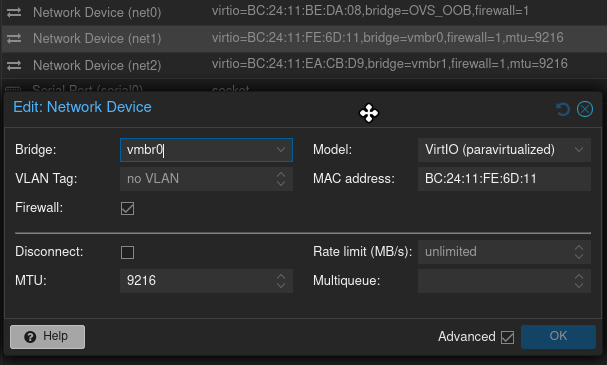
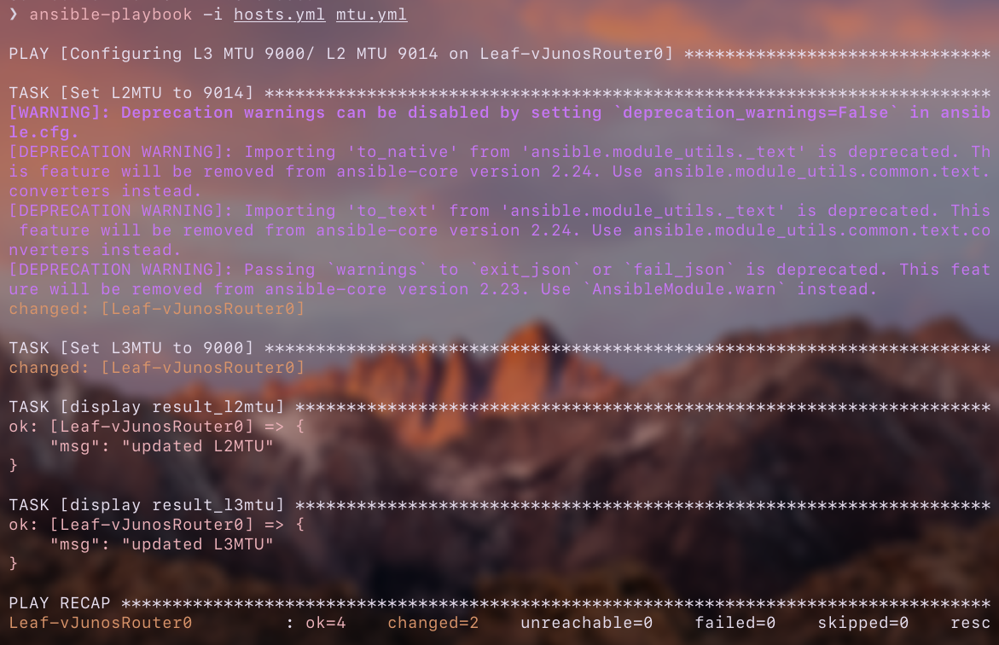

# Jumbo frames setup

I wanted to set up a vJunos Router 25.4R1 as a leaf in my network but before that I would like to make the entire network use Jumbo Frames because almost the whole network runs on 10Gbps links so it's a good practice to set up MTU 9000.   


The `vmbr0` configuration is now like this:   
```
auto enp6s0
iface enp6s0 inet manual
        mtu 9000

auto vmbr0
iface vmbr0 inet manual
        bridge-ports enp6s0
        bridge-stp off
        bridge-fd 0
        mtu 9000

```
It's not VLAN-aware and has one physical interface bridged.   

The `vmbr0` linux bridge along with `enp6s0` have MTU set to 9000 accordingly to best practices regarding 10GbE links.   

   

Actually the entire underlay has MTU 9000 set.    

For example on the Spine-DellEMCS4048-ON: (Though here I set the hardware maximum MTU here)   
```OS9 
Spine-DellEMCS4048-ON#sh interfaces Tengigabitethernet 1/1
TenGigabitEthernet 1/1 is up, line protocol is up
Hardware is DellEMCEth, address is e4:f0:04:c8:b2:3f
    Current address is e4:f0:04:c8:b2:3f
Non-qualified pluggable media present, SFP+ type is 10GBASE-SR
    Medium rate is unknown, Wavelength is 850nm
    SFP+ receive power reading is -2.3950dBm
    SFP+ transmit power reading is -2.8133dBm
Interface index is 2097156
Internet address is 172.16.255.3/31
Mode of IPv4 Address Assignment : MANUAL
DHCP Client-ID(61): e4f004c8b23f
MTU 9216 bytes, IP MTU 9198 bytes
LineSpeed 10000 Mbit
...
```
And on the border-leaf-ccr2004:   
```rsc
1 R  name="sfp-sfpplus1" default-name="sfp-sfpplus1" mtu=9000 l2mtu=9124 
      mac-address=08:55:31:A7:92:16 orig-mac-address=08:55:31:A7:92:16 arp=enabled 
      arp-timeout=auto loop-protect=default loop-protect-status=off 
      loop-protect-send-interval=5s loop-protect-disable-time=5m auto-negotiation=yes 
      advertise=10M-baseT-half,10M-baseT-full,100M-baseT-half,100M-baseT-full,1G-baseT-half,1G-
          baseT-full,1G-baseX,2.5G-baseT,2.5G-baseX,5G-baseT,10G-baseT,10G-baseSR-LR,10G-
          baseCR 
      tx-flow-control=off rx-flow-control=off bandwidth=unlimited/unlimited switch=switch1 
      sfp-rate-select=high sfp-ignore-rx-los=no sfp-shutdown-temperature=95C 
```

The MTU here is set to 9000 but the L2 MTU is set to hardware max (i think).

After booting up the Leaf-vJunosRouter0 I could see that there correctly are two interfaces in the up state:   
```Junos 
--- JUNOS 25.4R1.12 Kernel 64-bit  JNPR-15.0-20251024.861cae5_buil
aether@vJunosRouter0> show interfaces terse 
Interface               Admin Link Proto    Local                 Remote
ge-0/0/0                up    up
ge-0/0/0.0              up    up   inet    
                                   multiservice
lc-0/0/0                up    up
lc-0/0/0.32769          up    up   vpls    
pfe-0/0/0               up    up
pfe-0/0/0.16383         up    up   inet    
                                   inet6   
pfh-0/0/0               up    up
pfh-0/0/0.16383         up    up   inet    
pfh-0/0/0.16384         up    up   inet    
ge-0/0/1                up    up
ge-0/0/1.16386          up    up  
ge-0/0/2                up    down
ge-0/0/2.16386          up    down
ge-0/0/3                up    down
ge-0/0/3.16386          up    down
...
```

The `ge-0/0/0` interface corresponds to `net1` vNIC which is connected to the `enp6s0` physical interface. 
The `ge-0/0/1` interface is `net2` vNIC connected to `vmbr1`.   

I set the correct MTU on the interfaces in Leaf-vJunosRouter0:   
```Junos
[edit]
aether@vJunosRouter0# set interfaces ge-0/0/0 mtu 9014 

[edit]
aether@vJunosRouter0# set interfaces ge-0/0/0 unit 0 family inet mtu 9000 

[edit]
aether@vJunosRouter0# set interfaces ge-0/0/1 mtu 9014    

[edit]
aether@vJunosRouter0# set interfaces ge-0/0/1 unit 0 family inet mtu 9000

[edit]
aether@vJunosRouter0# commit 
commit complete
```

> [!NOTE]
> What's kind of still complicated for me are the MTUs on JunOS devices. 
> It's got to do with how these different OSs understand MTUs.
> Because each of the OSs understand MTUs kind of differently.   

I would like to explain it shortly but it's still kind of hard for me to remember everything.  

On RouterOS, `l2mtu` is the L2 maximum of how big of an ethernet frame the interface can process.  
`mtu` is the maximum size of a L3 IP Packet. This is the actual MTU   
From what I know, the `l2mtu` on RouterOS should be set to the hardware maximum.  

On Dell EMC OS9, MTU is the maximum size of a L2 Ethernet frame so I just set it to the hardware maximum as the Dell S4048-ON is just a spine switch and it's role is to be just a part of a the super fast underlay.   

Dell EMC OS9 automatically calculates the appropriate size of a L3 MTU:   
```OS9
Spine-DellEMCS4048-ON#show interfaces Tengigabitethernet 1/2 
TenGigabitEthernet 1/2 is up, line protocol is up
Hardware is DellEMCEth, address is e4:f0:04:c8:b2:3f
    Current address is e4:f0:04:c8:b2:3f
Non-qualified pluggable media present, SFP+ type is 10GBASE-SR
! ommited
MTU 9216 bytes, IP MTU 9198 bytes
LineSpeed 10000 Mbit
Flowcontrol rx off tx off
```

If I set `mtu 9000` on this switch, then a typical Jumbo frame would get fragmented.   
Thats because an IP MTU would be equal to about 8982 (9000 - 18 bytes) which is less than 9000.   

So from what I read it's good to set the MTUs to hardware max on the spine switches as it gives a lot of room for future usage of VXLANs which enlarge the header etc.   

On JunOS there are two MTUs to set. 
The first one which is the L2 one, is set using `set interfaces ge-0/0/0 mtu 9014`. 
This is the maximum size of an L2 frame.
Though I should set this to a bigger number just to make it future-proof. 
There are 14 bytes of space for a L2 header (since the L3 MTU is set to 9000) so it's just enough for a normal Ethernet frame but it's not enough for a 802.1Q frame as it would require a L2 MTU of 9018.   

The L2 header is 14 bytes long (6 bytes SRC MAC, 6 bytes DST MAC and 2 bytes for EtherType).   
The 802.1Q frame is longer than the Ethernet frame by 4 bytes. 
That's 2 bytes for TPID and 2 bytes for TCI, PCP, DEI and the 12-bit VID field itself.  

The second MTU is the L3 one and it is set using `set interfaces ge-0/0/0 unit 0 family inet mtu 9000`.   

If I didn't set this second MTU, the vJunos Router would in fact accept a 9014 byte L2 frame but the `inet` family by default is set to 1500 so it would not use the full potential of the L2 MTU.
The IP packets it would send would just be too small.   

So L2 MTU 9014 and L3 MTU 9000 is perfect for this use case because there will be a point-to-point routed link between the Spine-DellEMCS4048-ON and Leaf-vJunosRouter0.  
As I said, If I wanted to use VLAN tagging, then I would have to set the L2 MTU on Leaf-vJunosRouter0 to 9018 bytes for 802.1Q encapsulation or 9022 for QinQ but the `inet` would be still 9000 bytes. 

## Ansible implementation

   
