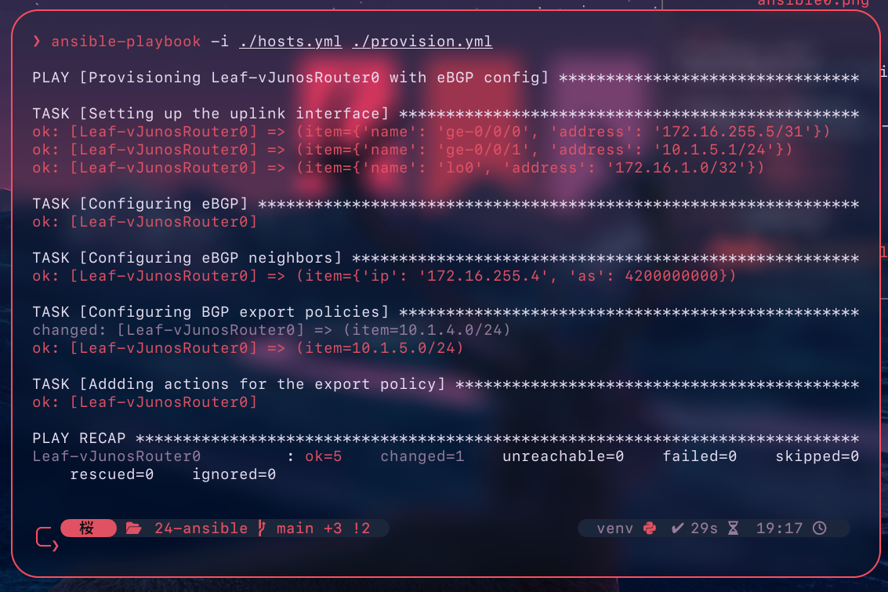
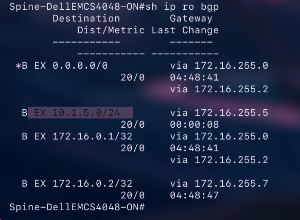
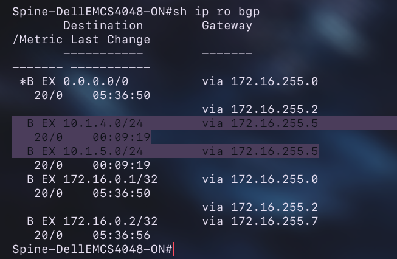
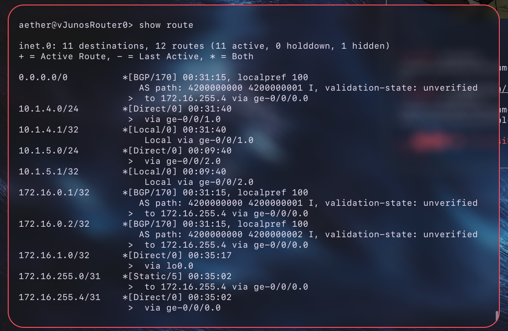
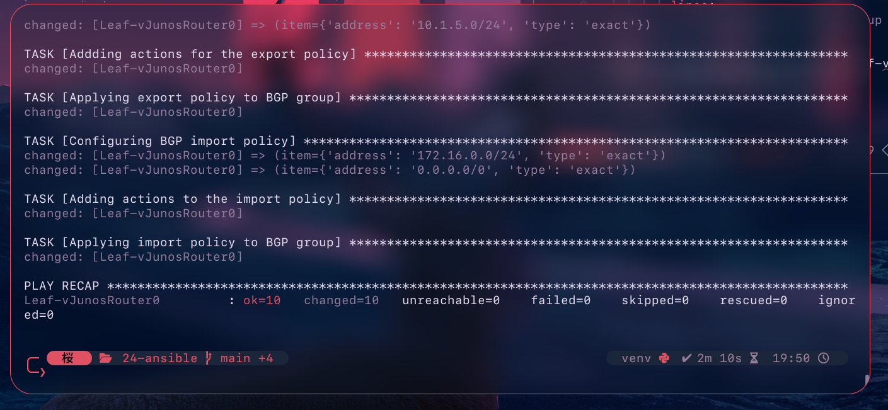
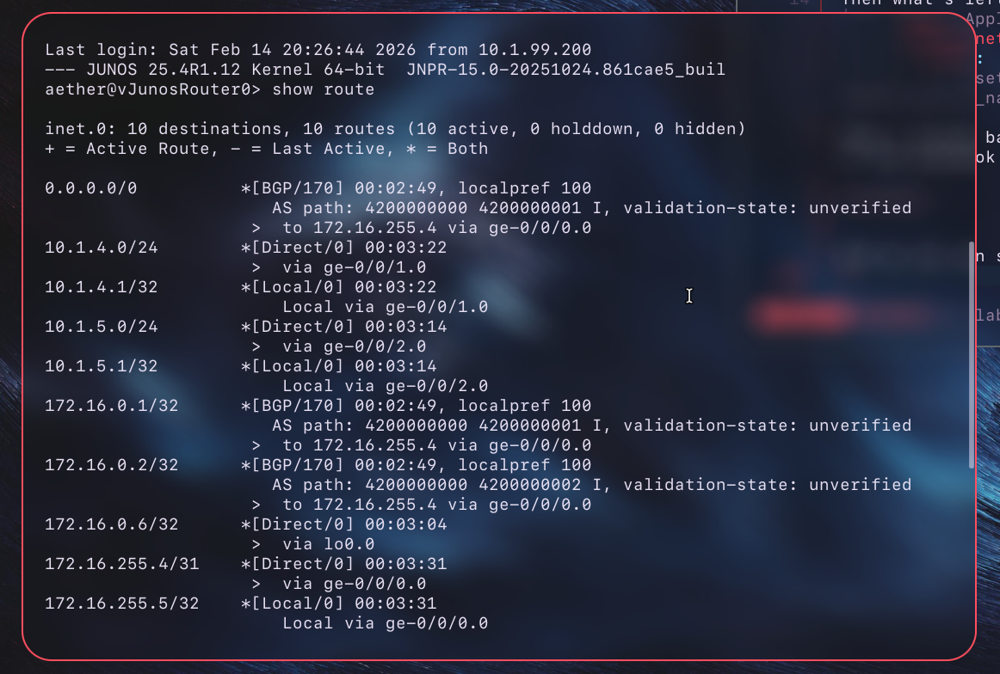

# eBGP on Leaf-vJunosRouter0 using Ansible

In the previous documentation I used Ansible for the first time in a project to set the MTUs on the interfaces.   
You can read it [here](../23-jumbo-frames/)    

I'm gonna be connecting Leaf-vJunosRouter0 to Spine-DellEMCS4048-ON0 using eBGP.   

Spine-DellEMCS4048-ON0 is AS4200000000 and Leaf-vJunosRouter0 will be AS4201000000.  

Those devices will be connected through a dedicated 10GbE link instead of how I previously used a Trunk link for a few point-to-points over a single physical cable.   

On the Spine-DellEMCS4048-ON0 side it's `172.16.255.4/31` and on the Leaf-vJunosRouter0 it's `.5`.   

Spine-DellEMCS4048-ON0 RID is `172.16.0.0` and Leaf-vJunosRouter0 is gonna be `172.16.1.0`.   

So this time I won't show how I'm entering commands in Junos one by one and instead I will show what I'm adding to the Ansible playbook.   

It's important to note that even though I'm using the `junos_config` module with the `set` commands, Ansible won't create any duplicates of the commands unlike for example with `dellemc.os9.os9_command`.  

The beginning is the same as the last time:   
```yaml
---
- name: Provisioning Leaf-vJunosRouter0 with eBGP config 
  hosts: Leaf-vJunosRouter0
  connection: netconf 
  gather_facts: no 
  collections:
    junipernetworks.junos
```

I'll also use variables instead of hardcoding everything.   
```yaml
  vars:
    bgp_interfaces:
      - name: ge-0/0/0 
        address: 172.16.255.5/31
      - name: ge-0/0/1 
        address: 10.1.5.1/24 
      - name: lo0
        address: 172.16.1.0/32
    bgp:
      groupname: EBGP-SPINE
      type: external
      rid: 172.16.1.0 
      system_as: 4201000000
      export_networks:
        - 10.1.4.0/24
        - 10.1.5.0/24
      export_policy_name: SEND-TO-SPINE
    neighbors:
      - ip: 172.16.255.4
        as: 4200000000

```

The first task is going to be setting up the uplink interface to Spine-DellEMCS4048-ON0 on the Leaf-vJunosRouter0.   

```yaml
tasks:
  - name: Setting up the uplink interface
    junipernetworks.junos.junos_config:
      lines:
        - "set interfaces {{ item.name }} unit 0 family inet address {{ item.address }}"
      comment: "Applied address {{ item.address }} to interface {{ item.name }}"
    register: result_task1
    loop: "{{ bgp_interfaces }}"

```
This is pretty similar to how I used a loop in the [last](../23-jumbo-frames/) documentation.   
The `bgp_interfaces` is a list which consists of only one interface for now but the point is that it is easily scalable.   
Each element of the `bgp_interfaces` list consists of a `name` and `address`.  
So by iterating through the elements in the `bgp_interfaces` list, I can easily apply the same command to a bunch of interfaces.   
On the first iteration of the loop through the `bgp_interfaces` list, the value of `item.name` field is equal to `ge-0/0/0` and the value of `item.address` is `172.16.255.5/31`.   

On the second iteration, `{{ item.name }}` is `ge-0/0/1` and `{{ item.address }}` is `10.1.5.1/24`, and so on for the next elements in the `bgp_interfaces` list.   


If I used only `item` then theoretically it would input both the `name` and the `address` into the `{{ item }}` field.   

The usage of `{{ item.name }}` and `{{ item.address }}` goes the same for the `comment` part.    

And of course we register the result of the task as `result_task1`.  

Then the next task is to add an ASN to the Leaf-vJunosRouter0.  
```yaml
    - name: Configuring eBGP 
      junipernetworks.junos.junos_config:
        lines:
          - "set routing-options autonomous-system {{ bgp.system_as }}"  
          - "set protocols bgp group {{ bgp.groupname }} type {{ bgp.type }}"
          - "set routing-options router-id {{ bgp.rid }}"
        comment: "Assigned an ASN of {{ bgp.system_as }}, a RID of {{ bgp.rid }} and added the {{ bgp.groupname }} BGP group with a {{ bgp.type }} type."


```

This is super simple, there isn't any loop etc.  

Next I added a task for setting adding the eBGP neighbors to the `bgp group`.   
```yaml

    - name: Configuring eBGP neighbors
      junipernetworks.junos.junos_config:
        lines:
          - "set protocols bgp group {{ bgp.groupname }} neighbor {{ item.ip }} peer-as {{ item.as }}"
        comment: "New neigbor with a {{ item.ip }} IP address and a {{ item.as }} ASN."
      loop: "{{ neighbors }}"

```
Again I used a loop. 
This time the loop iterates through the elements in the `neighbors` list.   
The value of `{{ bgp.groupname }}` does not change.
However the values of `{{ item.ip }}` and `{{ item.as }}` of course do change.   
I mean not in this exact case because I have defined only a single neighbor.   
But if I wanted to connect this Leaf-vJunosRouter0 to a second Spine switch, then the only thing I would have to do is add a new neighbor to the `neighbors` list (and config the interface of course).   

At this point I again ran the playbook to see if the code works and I actually got an error:   
```
!
failed: [Leaf-vJunosRouter0] (item={'ip': '172.16.255.4', 'as': 4200000000}) => {"ansible_loop_var": "item", "changed": false, "item": {"as": 4200000000, "ip": "172.16.255.4"}, "msg": "Task failed: b'error: Peer (172.16.255.4) may not be configured multiple times in the same instance\\nerror: configuration check-out failed'"}
!
```
This is most likely because I already configured the `172.16.255.4` neighbor in a different `bgp group` and in JunOS a neighbor can belong to only a single BGP Group at a time.   

So I SSHed into the Leaf-vJunosRouter0 and manually deleted the old BGP Group.   
```
protocols {                             
    router-advertisement {
        interface fxp0.0 {
            managed-configuration;
        }
    }
    bgp {
        group EBGP0 {
            type external;
            neighbor 172.16.255.4 {
                export ROUTE0;
                peer-as 4200000000;
            }
        }
    }
}

aether@vJunosRouter0> configure 
Entering configuration mode

[edit]
aether@vJunosRouter0# delete protocols bgp group EBGP0 

[edit]
aether@vJunosRouter0# commit   
commit complete
```
Then I run the playbook again and this time it worked:   
```
ok: [Leaf-vJunosRouter0] => (item={'name': 'ge-0/0/0', 'address': '172.16.255.5/31'})

TASK [Configuring eBGP] ******************************************************************
changed: [Leaf-vJunosRouter0]

TASK [Configuring eBGP neighbors] ********************************************************
changed: [Leaf-vJunosRouter0] => (item={'ip': '172.16.255.4', 'as': 4200000000})

PLAY RECAP *******************************************************************************
Leaf-vJunosRouter0         : ok=3    changed=2    unreachable=0    failed=0    skipped=0    rescued=0    ignored=0
```

Next I wanted to add networks to the export policy so I wrote something like this:  
```yaml
- name: Configuring BGP export policies
      junipernetworks.junos.junos_config:
        lines:
          - "set policy-options policy-statement {{ bgp.export_policy_name }} term NETWORKS from route-filter {{ item }} exact"
          - "set policy-options policy-statement {{ bgp.export_policy_name }} term NETWORKS then accept"
        comment: "Created export policy for {{ bgp.export_policy_name }}"
      loop: "{{ bgp.export_networks}}"
```

And this would theoretically work as Junos doesn't have an issue with duplicated commands but finally I split this into two different tasks.  
If I left both those lines in the loop, then Ansible would send those commands to Leaf-vJunosRouter0:   
```
    set policy-options policy-statement SEND-TO-SPINE term NETWORKS from route-filter 10.1.4.0/24 exact
    set policy-options policy-statement SEND-TO-SPINE term NETWORKS then accept
    set policy-options policy-statement SEND-TO-SPINE term NETWORKS from route-filter 10.1.5.0/24 exact
    set policy-options policy-statement SEND-TO-SPINE term NETWORKS then accept
```

So the `accept` statement is issued twice.   

In this task I left only the first command which tells the `SEND-TO-SPINE` policy to export only the values of `{{ item }}`.   

I moved the `accept` statement to another task.   
```yaml
    - name: Addding actions for the export policy
      junipernetworks.junos.junos_config:
        lines:
          - "set policy-options policy-statement {{ bgp.export_policy_name }} term NETWORKS then accept"
        comment: "Set action accept for {{ bgp.export_policy_name }}"

```
As you can see, there is no need for a loop here as this just tells junos to accept those networks entered earlier to the policy-statement.   

What's important to note is the `exact` argument.
Without it, JunOS could also export subnets but in eBGP that is often unwanted.   

With the current variables, this policy checks if the network is `10.1.4.0/24` OR `10.1.5.0/24` and if yes then it accepts it.   

> [!NOTE]
> As of now, the Leaf-vJunosRouter0 still wouldn't export the `10.1.4.0/24` network as it does not have any UP interface in that network.   

As you can see the statements seem to work correctly:   

   

However the Spine-DellEMCS4048-ON0 won't receive any routes from Leaf-vJunosRouter0 until I apply the export policy to the BGP Group.   
```yaml


    - name: Applying export policy to BGP group 
      junipernetworks.junos.junos_config:
        lines:
          - "set protocols bgp group {{ bgp.groupname }} export {{ bgp.export_policy_name }}"
        comment: "Applied {{ bgp.export_policy_name }} to {{ bgp.groupname }} BGP group"

```

This task applies the `{{ bgp.export_policy_name }}` to `{{ bgp.groupname }}` so in the current setup it applies the `SEND-TO-SPINE` policy to `EBGP-SPINE` BGP Group.   

As you can see after running the playbook, the Spine-DellEMCS4048-ON0 successfully received the routes from Leaf-vJunosRouter0.   
Of course the route to `10.1.4.0/24` didn't come up in the Spine-DellEMCS4048-ON0 RIB because as I mentioned earlier, JunOS won't advertise a network if the network isn't installed in its own RIB.   

   


I powered off the Leaf-vJunosRouter0 and added it an another vNIC in Proxmox.   
Then I could add another interface to the `bgp_interfaces` list:   
```yaml
  vars:
    bgp_interfaces:
      - name: ge-0/0/0 
        address: 172.16.255.5/31
      - name: ge-0/0/1
        address: 10.1.4.1/24
      - name: ge-0/0/2
        address: 10.1.5.1/24
      - name: lo0
        address: 172.16.1.0/32 
```
Then I deleted some things manually in the Leaf-vJunosRouter0 and then ran the playbook again:   

   

And the Spine-DellEMCS4048-ON0 successfully received routes to both `10.1.4.0/24` and `10.1.5.0/24` networks:   

   

Now I would like to set an import policy on the Leaf-vJunosRouter0.   
What's interesting is that junos behaves in a completely opposite way regarding importing received routes.   
JunOS by default accepts every route it receives.   
For example since now there is no import policy, the Leaf-vJunosRouter0 installed all received routes from Spine-DellEMCS4048-ON0 in it's RIB:   

    

But I'm going to restrict what routes it can install.  

It's important to note that immediately after you assign any import policy to a BGP group, JunOS changes its behavior and starts denying everything that doesn't fit into the import policy.   

Although in a lab it's easiest to just use `0.0.0.0/0 orlonger` argument cause then JunOS will install all subnets it receives.    

I'm gonna set up two statements for the import policy.   
I'll allow Leaf-vJunosRouter0 to install the route to `0.0.0.0/0` but only with the `exact` argument. 
This way, `0.0.0.0/0` will only be a default route to the internet and won't include every single route like with `orlonger` argument.   

The second statement will allow it to install routes to `172.16.0.0/24`.   

That's because all loopback interfaces in my lab have an IP address from the `172.16.0.0-172.16.0.255` range.   

The Leaf-vJunosRouter0 doesn't really need to know routes to every single VM network like `10.1.3.0/24` etc.   
The Leafs will be connected with VXLANs in the future so the Leafs only need to know how to reach each others loopback interfaces.   

I added new variables:   
```yaml
      import_policy_name: RECEIVE-FROM-SPINE
      import_networks:
        - address: 172.16.0.0/24
          type: orlonger
        - address: 0.0.0.0/0 
          type: exact
```
So again I will use a loop that iterates through the elements of this `import_networks` list.   

First the task to add the networks along with the appropriate argument to the route filter to the import policy.   

```yaml
    - name: Configuring BGP import policy 
      junipernetworks.junos.junos_config:
        lines:
          - "set policy-options policy-statement {{ bgp.import_policy_name }} term NETWORKS from route-filter {{ item.address }} {{ item.type }}"
        comment: "Added {{ item.address }} network with {{ item.type }} type to {{ bgp.import_policy_name }} import policy"
      loop: "{{ bgp.import_networks }}"
```

On the first iteration of this loop, the `{{ item.address }}` takes the value of `172.16.0.0/24` and the `{{ item.type }}` equals `orlonger`.   
It's pretty straightforward for the next network.   

Then a task for making the policy accept those networks if the supplied network equals any of them.   

```yaml
    - name: Adding action to the import policy
      junipernetworks.junos.junos_config:
        lines:
          - "set policy-options policy-statement {{ bgp.import_policy_name }} term NETWORKS then accept"
        comment: "Set action accept for {{ bgp.import_policy_name }} BGP import policy"

```
Then what's left is to apply the import policy to the BGP group:   
```yaml
    - name: Applying import policy to BGP group
      junipernetworks.junos.junos_config:
        lines:
          - "set protocols bgp group {{ bgp.groupname }} import {{ bgp.import_policy_name }}"
```

Then I rolled back most of the Leaf-vJunosRouter0 configuration to see if the playbook fully works.   

    


And as you can see pretty much everything seems to work.   

Leaf-vJunosRouter0 correctly install routes received from BGP in the RIB:   

   

And the Spine-DellEMCS4048-ON0 receives correct routes from Leaf-vJunosRouter0:   

    
