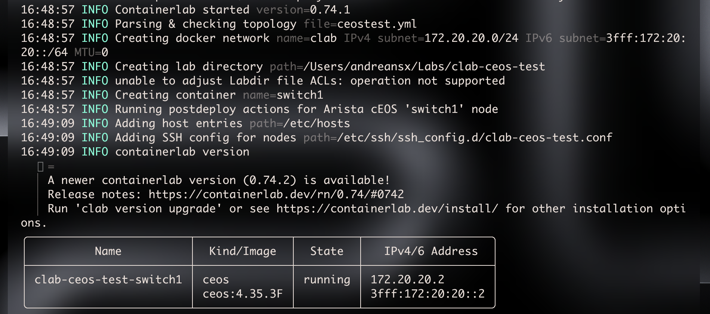

# Setting up cEOS 4.35.3F on MacOS using Containerlab and OrbStack

   

I'll be doing less in my physical lab because I've got a new piece of hardware.
Specifically a MacBook Pro M2 Max with 32GB of RAM and 1TB of SSD.  

This thing has like 10 times more computing power than every device in my rack combined and uses 60-something milliwatts when running a cEOS container inside OrbStack, Spotify, Tailscale, Telegram and some other things, all at the same time.    

Also what really makes me love this is the fact that the cEOS works insanely well and there is next to no virtualization overhead.  
That's what I absolutely love about this architecture. The M2 Max is an Apple Silicon ARM64 chip, the Ubuntu VM is running native ARM64, and then the EOS is also compiled for ARM64.  
The only level of virtualization here is between MacOS and OrbStack as OrbStack needs to run the Linux kernel which is necessary to run containerlab because it does use `veth`s which simply do not exist in MacOS Darwin kernel.   

Meanwhile the Dell R710 uses 150 Watts when doing nothing.  

Running labs in containerlab is just easier and uses up a fraction of the power used by my Dell R710.
And also I do not need a physical Arista switch, which are often a nightmare in terms of licensing.

So here I wanted to write down all my notes regarding setting up cEOS with Containerlab on Mac.  

I use OrbStack instead of Docker Desktop cause it uses a more optimized and lighter Linux kernel.  
You need an Ubuntu ARM64 VM inside OrbStack and then install docker and containerlab inside that VM.  

Then get a cEOS lab image from Arista. You cannot create an Arista account with a normal email address like @gmail or @icloud so you need to use your school email or work email or something like that.  

I got the `cEOSarm-lab-4.35.3F.tar.xz` image in `~/Downloads/` on my MacBook.  
Then I entered the Ubuntu ARM64 VM inside OrbStack and copied the cEOSarm image from the mapped MacOS home directory to Linux filesystem:   
```zsh
orb -m clab-vm 
```
```bash
andreansx@clab-vm:/Users/andreansx$ cp ./Downloads/cEOSarm-lab-4.35.3F.tar.xz /tmp/
```
The `~` MacOS folder is mapped to the VM so it is shared between the MacOS and Linux filesystem.  

At first I tried to load the image like a normal docker image but it failed a couple of times.   
The cEOS lab provided by Arista is a Docker rootfs tarball which is supposed to be imported:
```bash
xz -dc /tmp/cEOSarm-lab-4.35.3F.tar.xz | sudo docker import - ceos:4.35.3F
```
In this command I first extract the xz archive and then pipe it into docker import and assign a name `ceos` with a tag `4.35.3F`.   
I found this to cause no issues in comparison to importing the xz into docker directly so I think it's better to first extract it and then import the tar into docker.   

Then I could check that the image was successfully imported into docker:
```bash
sudo docker images
REPOSITORY   TAG       IMAGE ID       CREATED       SIZE
ceos         4.35.3F   d40086d3ca35   2 hours ago   2.72GB
```

And then I manually ran it which wasn't a good thing as it caused some issues.  
> [!IMPORTANT]
> Do not run this command or you will ruin your home directory like I did.
I ran it like this:
```bash
sudo docker run -it \
  --name ceos-test \
  --privileged \
  -e CEOS=1 \
  -e EOS_PLATFORM=ceoslab \
  -e container=docker \
  -e ETBA=1 \
  -e SKIP_ZEROTOUCH_BARRIER_IN_SYSDBINIT=1 \
  -e INTFTYPE=eth \
  ceos:4.35.3F \
  /sbin/init
```
while I was in the `~` directory in the VM.  

I would like to mention here a different issue, specifically regarding the fact that I ran it in the shared `~` directory.  
I opened a new kitty terminal window end saw an zsh error:
```zsh
zsh: locking failed for /Users/andreansx/.zsh_history: permission denied: reading anyway
 andreansx@MacBook-Pro-Andreansx  ~
```
And as you can (or cannot cause I don't know if github will display those icons correctly) see, the icon changed from a home icon to a lock icon, but of course that shouldn't happen since I am in my home directory.

This was caused by the way I ran the cEOS container.  
I ran `ls` and that's what it showed:
```zsh
 ls
afs                dotfiles.zsh       media              Pictures           sbin
backupsconf        Downloads          mnt                proc               srv
bin                etc                Movies             programik.c        sys
boot               home               Music              programik.s        tmp
cjunosevolved.yaml Labs               NZBGet             Public             usr
Desktop            lib                opt                root               var
dev                lib64              OrbStack           rootfs-aarch64
Documents          Library            persist            run
```

As you can see, the entire root filesystem for the cEOS container was created in my home directory on MacOS. 
I mean those are mostly only symlinks but you get the idea:   
```zsh
 ll
...
lrwxrwxrwx@   1 andreansx  staff       7  2 paź  2024 bin@ -> usr/bin
```
But it changed the permissions of my home directory which caused me to not have the ability to write here even though I am the owner of the directory:
```zsh
 ll
total 920
dr-xr-xr-x@  82 andreansx  staff    2624 21 mar 18:04 ./
drwxr-xr-x    5 root       admin     160 14 mar 19:57 ../
...
```
I fixed the permissions: `sudo chmod 755 ~`

So basically the entire cEOS filesystem was placed in my MacOS home directory:
```zsh
ls -la ~/bin ~/boot
lrwxrwxrwx@ 1 andreansx  staff  7  2 paź  2024 /Users/andreansx/bin -> usr/bin

/Users/andreansx/boot:
total 35328
dr-xr-xr-x@  9 andreansx  staff      288 19 mar 11:22 .
drwxr-xr-x@ 82 andreansx  staff     2624 21 mar 16:31 ..
drwxr-xr-x@ 10 andreansx  staff      320 19 mar 11:22 dts
-rw-r--r--@  1 andreansx  staff  5637453 17 mar 02:19 System.map-5.10.165.Ar-46740264.4353F
lrwxrwxrwx@  1 andreansx  staff       37 17 mar 02:19 System.map-EosKernel -> System.map-5.10.165.Ar-46740264.4353F
-rw-r--r--@  1 andreansx  staff  9512999 17 mar 02:19 vmlinuz-5.10.165.Ar-46740264.4353F
-rw-r--r--@  1 andreansx  staff  2929603 17 mar 02:19 vmlinuz-5.10.165.Ar-46740264.4353F-kdump
lrwxrwxrwx@  1 andreansx  staff       34 17 mar 02:19 vmlinuz-EosKernel -> vmlinuz-5.10.165.Ar-46740264.4353F
lrwxrwxrwx@  1 andreansx  staff       40 17 mar 02:19 vmlinuz-EosKernel-kdump -> vmlinuz-5.10.165.Ar-46740264.4353F-kdump
```

So getting back to the main topic, the thing to remember is not to run it manually via docker and with `--privileged` in the home directory as it will break a lot of things in your MacOS home directory.

The logs just hung at:
```
...
         Starting EOS Warmup Service...
         Starting Power-On Self Test...
         Starting Save and print /var/log/EosInitStage2...
========== Contents of /var/log/EosInitStage2 ==========
[  OK  ] Finished Power-On Self Test.
Starting stage 2 EOS initialization
[  OK  ] Reached target EOS regular mode.
========== End of /var/log/EosInitStage2 ==========
[  OK  ] Finished Save and print /var/log/EosInitStage2.
[  OK  ] Finished EOS or Diagnostic Mode.
```
but then I looked at earlier logs and saw this:
```
[ 1933.399864] EosInitStage[723]: modprobe: FATAL: Module tun not found in directory /lib/modules/6.17.8-orbstack-00308-g8f9c941121b1
```
That's because as I said earlier, OrbStack uses its own optimized and lightweight Linux kernel which seems to not have the tun module as the log states.
EOS 4.35.3F treats modprobe errors as critical and makes the EosInitStage not able to start.  
The way to fix this is to just run cEOS using Containerlab as it has the built-in fixes for issues like this in specific environments like OrbStack on MacOS.  

The way to not break your home directory while running cEOS is to run it via `clab deploy` and not `docker run ... --privileged` as containerlab nevers spits out the rootfs anywhere but into its own controller directory.


Then I made the most basic clab config possible just to test if the cEOSarm finally works:   
```yaml
name: ceos-test
topology:
  nodes:
    switch1:
      kind: ceos
      image: ceos:4.35.3F
```
And I placed this in `~/Labs/ceostest.yml`   

Then in the VM I deployed the clab from the file:   
```bash
 orb -m clab-vm
andreansx@clab-vm:/Users/andreansx$ cd Labs
andreansx@clab-vm:/Users/andreansx/Labs$ clab deploy -t /Users/andreansx/Labs/ceostest.yml 
16:48:57 INFO Containerlab started version=0.74.1
16:48:57 INFO Parsing & checking topology file=ceostest.yml
16:48:57 INFO Creating docker network name=clab IPv4 subnet=172.20.20.0/24 IPv6 subnet=3fff:172:20:20::/64 MTU=0
16:48:57 INFO Creating lab directory path=/Users/andreansx/Labs/clab-ceos-test
16:48:57 INFO unable to adjust Labdir file ACLs: operation not supported
16:48:57 INFO Creating container name=switch1
16:48:57 INFO Running postdeploy actions for Arista cEOS 'switch1' node
16:49:09 INFO Adding host entries path=/etc/hosts
16:49:09 INFO Adding SSH config for nodes path=/etc/ssh/ssh_config.d/clab-ceos-test.conf
16:49:09 INFO containerlab version
  🎉=
  │ A newer containerlab version (0.74.2) is available!
  │ Release notes: https://containerlab.dev/rn/0.74/#0742
  │ Run 'clab version upgrade' or see https://containerlab.dev/install/ for other installation options.
╭────────────────────────┬──────────────┬─────────┬───────────────────╮
│          Name          │  Kind/Image  │  State  │   IPv4/6 Address  │
├────────────────────────┼──────────────┼─────────┼───────────────────┤
│ clab-ceos-test-switch1 │ ceos         │ running │ 172.20.20.2       │
│                        │ ceos:4.35.3F │         │ 3fff:172:20:20::2 │
╰────────────────────────┴──────────────┴─────────┴───────────────────╯
```
And it started super quick so then I could enter its shell:
```bash
andreansx@clab-vm:/Users/andreansx/Labs$ sudo docker exec -it clab-ceos-test-switch1 sh
sh-5.1# 
```
And I had to check what kernel it was using cause I just absolutely love things like that and of course as you can see it uses OrbStack's kernel. 
```bash
sh-5.1# uname -a
Linux switch1 6.17.8-orbstack-00308-g8f9c941121b1 #1 SMP PREEMPT Thu Nov 20 09:34:02 UTC 2025 aarch64 aarch64 aarch64 GNU/Linux
```
So there is no emulation and no virtualization here (aside from OrbStack itself).   
That makes it all have next to no virtualization overhead as the entire EOS runs just as a separate process in the OrbStack kernel.  
Because this isn't KVM/QEMU where it's necessary to emulate a CPU. Here it's ARM64 code running natively on my M2 Max chip.

But back to the cEOS, then I could check the OS Release info and enter the actual EOS cli:
```
sh-5.1# cat /etc/os-release 
NAME="AlmaLinux"
VERSION="9.6 (Sage Margay)"
ID="almalinux"
ID_LIKE="rhel centos fedora"
VERSION_ID="9.6"
PLATFORM_ID="platform:el9"
PRETTY_NAME="AlmaLinux 9.6 (Sage Margay)"
ANSI_COLOR="0;34"
LOGO="fedora-logo-icon"
CPE_NAME="cpe:/o:almalinux:almalinux:9::baseos"
HOME_URL="https://almalinux.org/"
DOCUMENTATION_URL="https://wiki.almalinux.org/"
BUG_REPORT_URL="https://bugs.almalinux.org/"
ALMALINUX_MANTISBT_PROJECT="AlmaLinux-9"
ALMALINUX_MANTISBT_PROJECT_VERSION="9.6"
REDHAT_SUPPORT_PRODUCT="AlmaLinux"
REDHAT_SUPPORT_PRODUCT_VERSION="9.6"
SUPPORT_END=2032-06-01
sh-5.1# cat /etc/Eos-release 
Arista Networks EOS 4.35.3F
sh-5.1# FastCli
switch1>
```

So I think that's all. I will do more labbing with cEOS of course but I wanted to write down the things that caused issues for me when running cEOS with containerlab on MacOS for the first time.

