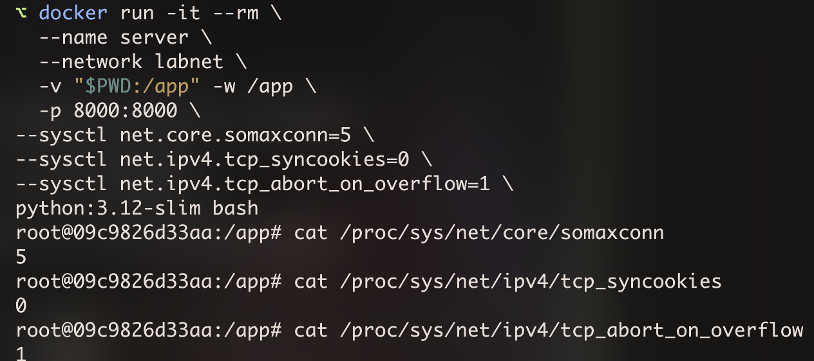

### I wanted to do some projects more oriented towards Akamai, so it's a good thing to get more familiar with edge linux servers, cause that's one of the things that Akamai uses, cause they provide CDNs after all.

### So here I wanted to do a simulation of spontaneus RSTs when connecting to a server, caused by the overflow of accept/SYN queues. That is something that could happen with CDNs as there are lot's of small requests etc.

I'll run just two linux containers in an OrbStack ARM64 VM on my Mac. One with a super simple python http server and the other one with `wrk` which will generate the traffic, and enough of it to overflow the two queues on the listening socket.

The server (`pythonserver.py`) listens on `:8080` with `backlog=5` and `time.sleep(1)` before each `accept()`, so it drains the accept queue at ~1 conn/sec and thats quickly outrun by wrk.

## Setup

### network and server

```zsh
docker network create labnet

docker run -it --rm \
  --name server \
  --network labnet \
  -v "$PWD:/app" -w /app \
  --sysctl net.core.somaxconn=5 \
  --sysctl net.ipv4.tcp_syncookies=0 \
  --sysctl net.ipv4.tcp_abort_on_overflow=1 \
  python:3.12-slim bash
```
and inside the container   
```zsh
python -u pythonserver.py
```
the `-u` makes it soe the 'accept' prints are not buffered   

The sysctls do propagate into the container as it was verified inside it   

   


### load generator

I needed to install wrk as base alpine does not have it   
```zsh 
docker run -it --rm \
  --name bench \
  --network labnet \
  alpine:3.20 sh
```
```
apk add --no-cache wrk
wrk -t4 -c200 -d15s http://server:8080/
```
