### Here i wanted to do something that will prove that my intended own AS setup is possible. Meaning I'll establish an iBGP session between an cEOS container and a VPS with BIRD. 

[AllowedIPs](#allowedips) is an interesting section along with [MTU](#mtu) (most of the talking is there)   

The iBGP connection will be established through a wireguard tunnel. Though EOS does not support Wireguard, so I will set a lightweight Alpine linux container next to cEOS and route all traffic from and out of the cEOS through the Alpine container.

Both the cEOSarm and Alpine containers will be launched with Containerlab in Orbstack on my Mac.   

Base Alpine does not have wireguard built in, so for that, there's this simple dockerfile, that allows me to make a custom alpine build, with wireguard included.   

> [!NOTE]
> The latest and correct version of this is in [./Dockerfile](./Dockerfile).
```Dockerfile
FROM alpine:3.22
RUN apk add --no-cache wireguard-tools iproute2 iptables bash tcpdump
```
And then i built it with this
```bash
sudo docker build -t alpine-wg:3.22 .
```
cause without that, i would have to do `apk add` after every launch.   

So first i wanted to set up the wg container by myself manually and only after confirming it works, set it up in clab file.   

So in the most simple way I run the container with `sudo docker run -d --name wg --cap-add NET_ADMIN alpine-wg:3.22 sleep infinity`    
`--cap-add NET_ADMIN` allows the container to create the wg0 interface and add addresses and routes.   


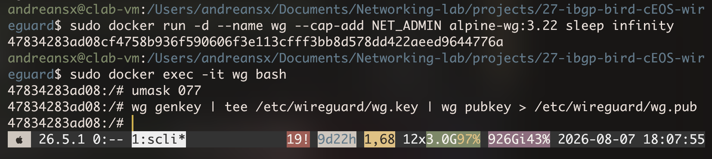   

10.0.99.0/24 is for loopbacks, 10.99.99.0/24 is for wireguard links, 10.10.99.0/24 is for veth between the cEOS and wg.

I wrote a simple config for the Alpine:
```conf
[Interface]
Privatekey = ...
Address = 10.99.99.2/30

[Peer]
Publickey = ...
AllowedIPs = 10.99.99.1/30, 10.0.99.1/32
Endpoint = ...:51820
PersistentKeepAlive = 25
```


As for the VPS, I wrote another config, also super simple:
```
[Interface]
Privatekey = ...
Address = 10.99.99.1/30
[Peer]
Publickey = ...
AllowedIPs = 10.99.99.2/32, 10.0.99.2/32, 10.10.99.1/32
```

> [!NOTE]
> This is outdated, as the BGP session will actaully be between loopbacks, so the BGP packets from cEOS will originate from 10.0.99.2. I didn't want to delete this, but keep in mind that this has changed.   


In Wireguard, the AllowedIPs is not a simple filter, as it has a meaning in the cryptography, and the BGP packets will originate not from Alpine/wg container's own wg0 interface, but rather from the cEOS' side of the veth link connecting the cEOS to wg. So the IP address, from which the packets will arrive in the tunnel, will be 10.10.99.1, not 10.99.99.1.    
So the config on the VPS has to allow the IP addresses on the veth link between the wg and cEOS.
This config allows 10.99.99.2/32 (Alpine's side of wireguard tunnel), 10.0.99.2/32 (cEOS' loopback) and 10.10.99.1/32 (cEOS' side of wg<->cEOS veth).


I set both those configs on wg and on the VPS. On the VPS i ran `sudo systemctl restart wg-quick@wg0` and on the wg i ran `wg-quick up wg0`.   
I soon noticed that there was no handshake, and running `wg show` revealed the issue.   

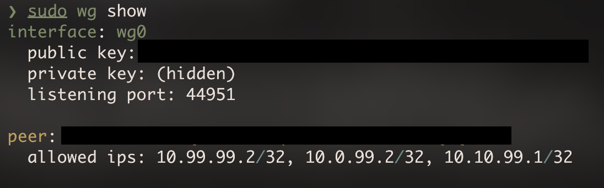

I didn't set the proper listening port so it chose a random one. After adding `ListenPort = 51820` in `[Interface]` section on VPS the handshake went through.   

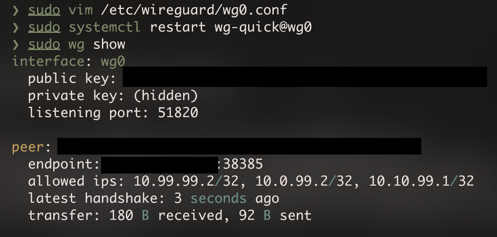   


Now I wanted to get into the actual iBGP between cEOS and BIRD on VPS.   
I wrote a simple clab file, cause it's easier to deploy cEOS with clab than with bare docker, as cEOS does require `--privileged`, `CEOS=1` and things like that. But clab does all that after I write `kind: ceos` in the clab file.   

> [!NOTE]
> This has also changed. The latest and correct version of this file is in [topology.clab.yml](./topology.clab.yml). 
```yml
name: ibgp-wg

topology:
  nodes:
    ceos:
      kind: ceos
      image: ceos:4.35.3F

    alpine:
      kind: linux
      image: alpine-wg:3.22
      cmd: sleep infinity
      binds:
        - wg-eos.conf:/etc/wireguard/wg0.conf
      sysctls:
        net.ipv4.ip_forward: 1
      exec:
        - ip link set eth1 up
        - ip addr add 10.10.99.2/30 dev eth1
        - wg-quick up wg0
        - ip route add 10.0.99.2/32 via 10.10.99.1

  links:
    - endpoints: ["ceos:eth1", "alpine:eth1"]
```

And also clab connects the two containers easier than bare docker, cause with bare Docker its necessary to manually create a veth in the two containers and that does require knowing the PIDs of the containers.   

On the VPS i had to add the loopback address that I wanted it to use 
```bash
sudo ip addr add 10.0.99.1/32 dev lo
```
Also in wg-vps.conf in section AllowedIPs, I changed `10.10.99.1/32` to `10.10.99.0/30`.  


I added `startup-config: ceos.partial.cfg` to the clab file. I then ran `clab destroy --cleanup` and `clab deploy --reconfigure`.   

`ceos.partial.cfg` instead of `ceos.startup.cfg` makes it so I don't have to keep the entire system config in that file so in there I can keep only the things that I want to explicitly configure myself. 

In the `ceos.partial.cfg` file I wrote down the simplest config for now   

> [!NOTE]
> This is the version before a fix with `no switchport`. See below.   
```cfg
interface Ethernet1
  ip address 10.10.99.2/30
interface Loopback0
  ip address 10.0.99.2/32
ip routing
ip route 10.0.99.1/32 10.10.99.1
```
I'll add the iBGP part in a while, along with iBGP on BIRD (which is on the VPS).   

Also I changed the addresses a bit, so the last octets of the IPv4 addresses are clearer. 


|where|.1|.2|
|-:|-:|:-|
|loopbacks 10.0.99.0/24|VPS|cEOS|
|wg tunnel 10.99.99.0/30|VPS|Alpine|
|veth 10.10.99.0/30|Alpine|cEOS|

I tried to ping 10.10.99.2 from cEOS but of course it didn't work, cause I forgot that interfaces are switchports by default in EOS.  

So i added `no switchport` to the Ethernet1 section.   

Ping then went through, both from cEOS to Alpine's end of veth and to VPS' loopback, with visibly longer response time.   

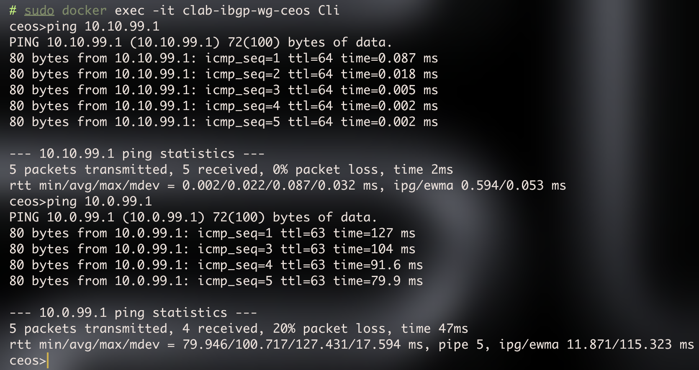   

### AllowedIPs

Now I wanted to talk about cryptokey routing, as honestly its still a bit hard for me to get a grasp on the whole AllowedIPs thing.   

I won't explain the whole way in which the AllowedIPs works, but I wanted to state why the current AllowedIPs lists on both sides are the way they are now.   

But shortly, there are two lookups, one on a leaving packet by the DST, and the second one on an arriving packet by SRC.   

On the VPS the AllowedIPs look like this
```
AllowedIPs = 10.99.99.2/32, 10.0.99.2/32, 10.10.99.0/30
```

And on the Alpine this list looks like this
```
AllowedIPs = 10.99.99.1/32, 10.0.99.1/32
```

The VPS has to allow more IPs, because behind its only peer (Alpine) there is also cEOS.  
Both sides need to allow the peer's loopback address (or the loopback behind the peer, from VPS' point of view). Alpine allows 10.0.99.1/32 and VPS allows 10.0.99.2/32. 
Both sides allow also only the peer's IP inside the wg tunnel itself. VPS allows only 10.99.99.2/32 and Alpine allows only 10.99.99.1/32.  
It would be possible to theoretically input 10.99.99.0/30, but that breaks the concept that wireguard makes possible thanks to cryptokey routing. If I wrote 10.99.99.0/30 on Alpine's side, it would allow incoming packets from the VPS which state that they are originating from the Alpine itself.   
Also we shouldn't enter the same prefix on both peers on the same interface. Meaning, we have two peers on wg0, and we shouldn't enter the same prefix in the AllowedIPs section for both those peers, as the AllowedIPs relate strictly to the cryptographic identity of the peer.  
There is no preference here, the radix trie just has a only single record for that subnet (single IP to public key relation). So basically the last write wins.    
There is basically one trie like that for a wg interface, it's the same for all peers on that interface and it works just like LPM in a FIB but the output is not a next hop but rather the cryptographic identity of a peer.   

Now a crucial thing. The iBGP session is actually loopback-to-loopback, which means, the `10.10.99.0/30` prefix is not really needed in AllowedIPs on VPS' side.   
The iBGP session would in fact establish. But for example, pings for testing the MTU, would not get back from the VPS to the cEOS. 
That is because in it's default behavior, the AllowedIPs list also makes wg-quick install the routes to those prefixes in the FIB, but Wireguard itself does never touch the FIB.   
So if I removed 10.10.99.0/30 from AllowedIPs on the VPS, a packet originating from 10.10.99.2 would arrive on Alpine, it would get encapsulated, sent to VPS, thus changing its SRC to Alpine's CGNATed public IP (cause Im behind CGNAT) and DST to VPS' public IP, then it arrives on VPS, gets decapsulated, Wireguard looks at the SRC of the decapsulated packet, sees 10.10.99.2, notices, that this is not even an allowed prefix, from the peer from which it received the packet from, and silently drops it.   
That is the first issue, but let's say that the packet somehow got through the trie, and got into the networking stack of the VPS.
The VPS then wants to send a response to the ping, it sets 10.10.99.2 as the DST, and then drops it, because it does not know any route to 10.10.99.2.   
This is of course fixable, by manually adding `ip route 10.10.99.0/30 dev wg0` on the VPS, but as I said before, the packet would not even be allowed to enter the VPS' IP stack, because it originates from an IP that is not allowed to arrive from VPS' peer (Alpine).   

So BGP itself does not need 10.10.99.0/30 included in AllowedIPs on the VPS. 
But I am in fact leaving 10.10.99.0/30 in VPS' AllowedIPs, not for BGP but for reachability and traceroute.   


### MTU


#### Why MTU before BGP 

So first of all, the MTU needs to be stated before iBGP because if I didn't check the MTU and then iBGP UPDATEs wouldn't go through, I would blame the firewalls or something, while it could be just the MTU.   
Even if the MTU wasn't set correctly, the iBGP sessions would establish, cause BGP OPENs have like 29 to 60 bytes and KEEPALIVE has 19 bytes, but UPDATEs, which carry the prefixes, are larger.   

Specifically, TCP packs the UPDATEs into segments up to 1460 bytes in size. `1460` is the size specific to this topology. This is not a standard. BGP UPDATE itself has a limit of 4096 bytes so TCP cuts that into segments anyway.   
The MSS that we state in SYN is a declaration of how big of a payload can we receive, not send. The receiver does an operation like `min(peer's advertised MSS, own MTU on the route - 40)`. 
So for example let's use the cEOS. cEOS would advertise a MSS of 1460 (1500 - 40), as it does not know that Alpine cannot pass such a big segment with 1460 bytes in size, because of the Wireguard tunnel. 
VPS advertises 1380 because 1420 (default MTU on wg0) - 40 is 1380. 
So cEOS will finally send UPDATEs packed into segments up to `min(1380, 1500 - 40)=min(1380, 1460)`, so 1380 bytes in size.  

But that's the case where the wg mtu is right. If wg0 was left on 1500 then the VPS would advertise 1460 in it's SYNs, cEOS would send 1500 byte packets, Alpine's wg would accept them and after encapsulation those packets would be 1560 in size, getting sent onto a 1500 byte underlay.
Then OPEN would go through and KEEPALIVE would be stuck behind a unconfirmed UPDATE, as they both are in the same TCP stream. So retransmissions would go on and on, peer stops getting KEEPALIVEs, hold timer expires.

In the topology here, there are links that differ in MTU size. For example, the link, through which the iBGP session will be established, is, unbeknownst to cEOS, inside a wireguard tunnel, which cuts the MTU by 60 bytes.
cEOS has no way of knowing that its traffic is passing through a wireguard tunnel, cause the tunnel terminates on Alpine, not on cEOS.   

#### default MTUs
The underlay network has a MTU of 1500. On my Mac i was able to check that:    
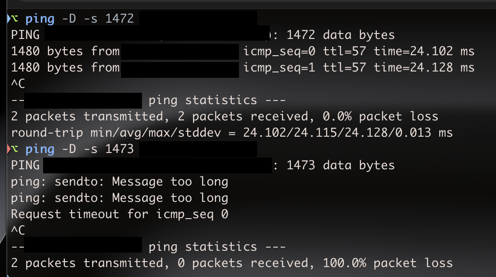    

on MacOS `-D` is the flag to set the df-bit to 1.   
That's the ping from my Mac to the Oracle VPS. This is passing through my ISP's CGNAT.    
However `sendto: Message too long` is a local denial, as its basically the limit of the Mac's interface, and not a discovered limit on the whole path to the VPS.   
One thing to note here is the difference between `-s` on Linux or MacOS, and `size` in cEOS. Tha value, that `-s` on Linux and MacOS takes, is the size of the ICMP payload itself only. `size` on cEOS however seems to be the size of the whole payload, along with ICMP's 8 bytes and IP's 20 bytes.

But generally since 1500B with DF got to the VPS and got back, the underlay MTU is 1500.   


The MTU on cEOS' side of the veth is 1500 by default:   
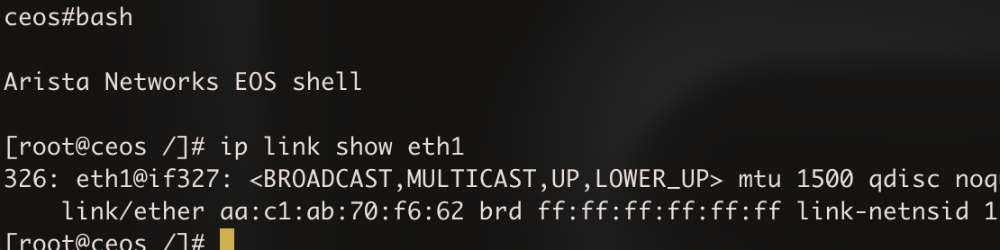   

and on Alpine's side it's 9500:   
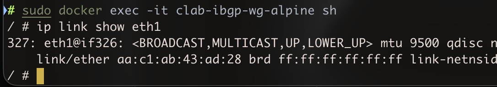   

The thing is that i couldnt get `-M do` flag to work on Alpine. The Busybox ping is relatively simple, but even after explicitly trying with `iputils-ping` added to the Dockerfile and rebuilding, the `-M` flag still was not recognized.   

For some reason `/usr/bin/ping -M do` also does not really work.   

Wireguard connection stated a MTU of 1420, and as I will show in a while, 1420 is not the most optimistic value for this topology.

Note that wg does choose 1420 by default because it's the safest option. MTU of 1420 allows for the use of outer IPv6, which is a precaution.   
Wireguard just cuts the underlay MTU first by 40 (IPv6), then by 8 (udp) and then by 32 (wg itself).
So if this topology was IPv6, then the default MTU of 1420 would actually be perfect.
```
/ # ip link show wg0
3: wg0: <POINTOPOINT,NOARP,UP,LOWER_UP> mtu 1420 qdisc noqueue state UNKNOWN mode DEFAULT group default qlen 1000
    link/none
```

The MTUs on both sides of the veth are in fact different and that's because nothing is negotiating that. Alpine could send a packet with l3mtu of 9500 to cEOS.   

#### overhead

Now about the overhead.
Underlay mtu is confirmed to be 1500 bytes and I wanted to run iBGP through Wireguard between cEOS and a VPS. 
So thats 1500 minus 20 for outer IPv4, minus 8 for UDP, minus 16 for WG's header (4 bytes for type+reserved, 4 for receiver index and 8 for the counter) and minus another 16 for Poly1305 tag. That comes out to 1440 Bytes.   
With IPv6 it comes out to 1420, because ipv6 subtracts not 20 bytes but 40.

Also there is something called padding which wireguard does do. Basically it adds the padding to the segment to make it a multiple of 16 bytes in size. With 1440, it's possible to represent this size as 90 multiples of 16 bytes, so there is no padding. With 1441, the packet would get padded to 1456 making it 1516 in its entirety.  
So MTU of the tunnel ~must always~ should be a multiple of 16 bytes. I mean a packet that is a non-multiple of 16 bytes does not break the transmission, but it wastes some bytes.   


#### ping on EOS and on Linux/MacOS

The known MTU of the underlay is 1500 bytes. If I know that, i can determine if the `-s` on MacOS is the size of the whole datagram, or the size only of the payload.   


> [!NOTE]
> Note that this measurement is meaningless without `-D` flag (or generally, without DF-bit). 
Here is the screenshot I already showed above but it is relevant here too.   
   
If the underlay mtu is 1500, and a ping with `-s 1472` goes through, but a ping with `-s 1473` does not, then it is safe to assume that `-s` is the size of the payload, not the whole datagram.   
The stock MTU on cEOS' side of the veth is 1500.   

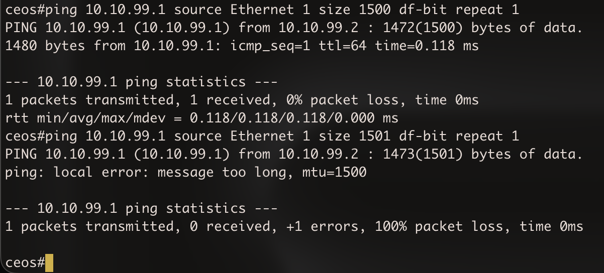    

As you can see, ping with `size 1500` goes through but the one with `size 1501` doesn't, which must mean that `size` in EOS' ping represents the size of the whole packet.   

However in EOS' bash the ping command acts the same as on Linux and MacOS.   
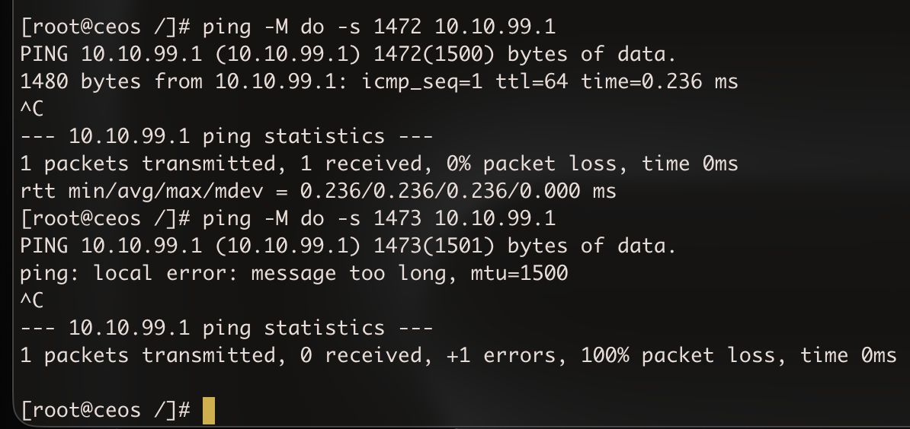   


Here with no MTU set in `Ethernet1` config on cEOS I tried to ping the VPS' Loopback with a 1441 byte packet.   
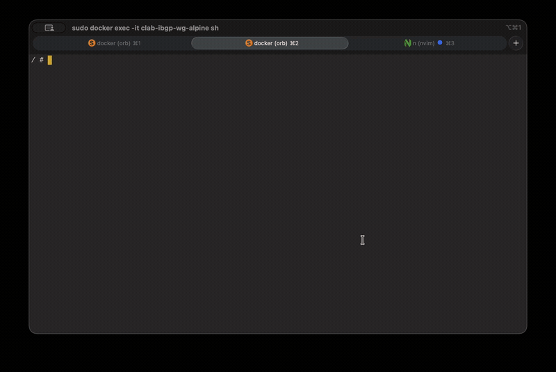    
As you can see, the packet gets to the Alpine, the cEOS is not aware of the 1440 MTU inside the WG tunnel, and Alpine responds with `frag needed`.   

After adding:
```
interface Ethernet1 
  mtu 1440
```
in ceos.partial.cfg, the denial is local and nothing even appears on tcpdump on Alpine's side, because the packet does not even reach it.   
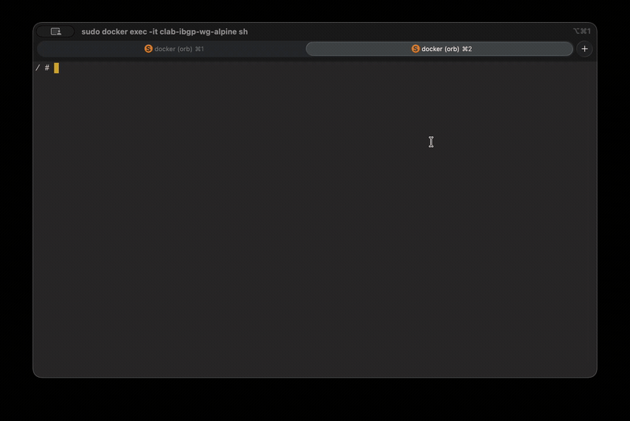    


#### why it's not good to rely on icmp messages regarding the need for fragmentation

First of all, ICMP gets filtered out sometimes. So that's a typical PMTUD black hole.   
Also in IPv6 there is no fragmentation at all. I mean there is something like Fragment Extension Header, and the source can in fact fragment something, but none of the SP routers on the path to something will fragment our packet.     
And even if PMTUD states that the MTU is smaller and fragmentation is needed, the first packet is lost anyway.   

#### final MTUs

So again, underlay is 1500 bytes, wireguard cuts the MTU by 60 bytes, cEOS does not know about the MTU inside the WG tunnel, as it is not a peer in the tunnel.   

So both sides of the veth cEOS<->Alpine do need to have a MTU of 1440. 

So `ceos.partial.cfg` looks now like this:   
```
interface Ethernet1
  no switchport
  ip address 10.10.99.2/30
  mtu 1440
interface Loopback0
  ip address 10.0.99.2/32
ip routing
ip route 10.0.99.1/32 10.10.99.1
```

And both on the VPS and Alpine in wg-alpine.conf and wg-vps.conf I set `MTU=1440` in `[Interface]`. For example on Alpine:   
```
[Interface]
Privatekey = ...
Address = 10.99.99.2/30
MTU=1440
```
And in `topology.clab.yml` file in `exec` section for node `alpine` I added `ip link set eth1 mtu 1440`.
So the whole file looks like this:   
```
name: ibgp-wg

topology:
  nodes:
    ceos:
      kind: ceos
      image: ceos:4.35.3F
      startup-config: ceos.partial.cfg

    alpine:
      kind: linux
      image: alpine-wg:3.22
      binds:
        - wg-alpine.conf:/etc/wireguard/wg0.conf
      sysctls:
        net.ipv4.ip_forward: 1
      exec:
        - ip link set eth1 up
        - ip addr add 10.10.99.1/30 dev eth1
        - ip link set eth1 mtu 1440
        - wg-quick up wg0
        - ip route add 10.0.99.2/32 via 10.10.99.2

  links:
    - endpoints: ["ceos:eth1", "alpine:eth1"]
```

#### note on IPv6

My AS will ultimately be almost entirely on IPv6 (apart from VPSes with public IPv4s), so the whole calculated MTU for traffic inside the tunnels will be different, as IPv6 has 80 bytes of overhead. 
But basically that's actually simple, and the final value is the same one as WG's default, safest and universal one, which is 1420 bytes.   

### iBGP finally 
