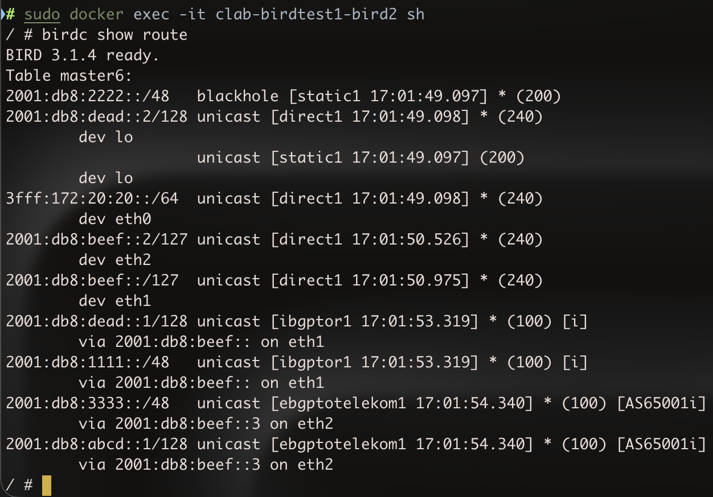
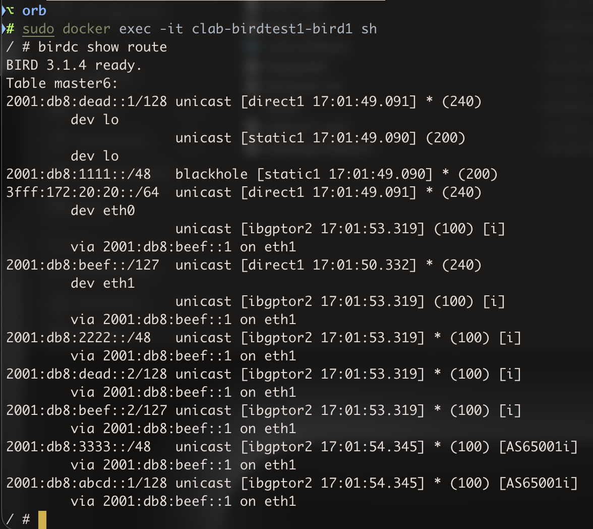
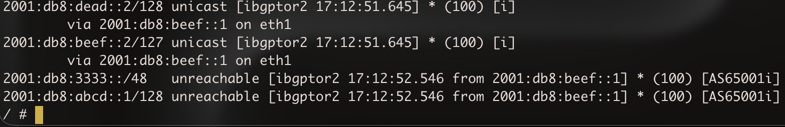
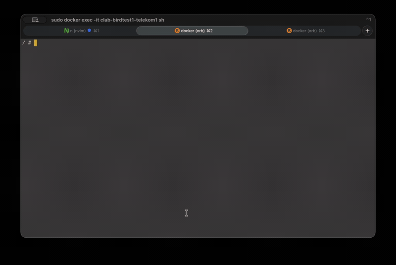
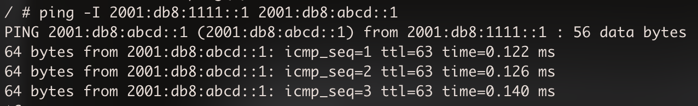
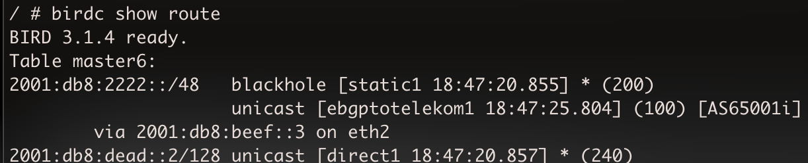
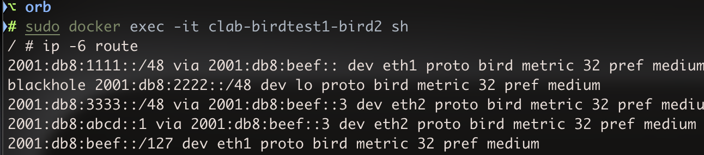
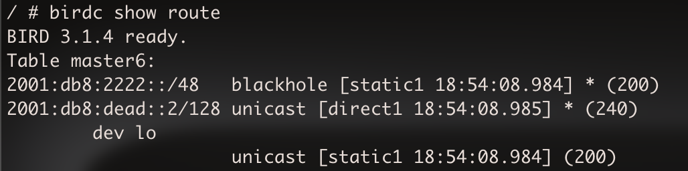

# Experimenting with filters on BIRD

Here I just wanted to run a couple of BIRD instances and mess around with how the whole `filter` and `function` blocks work.   

There are two Autonomous Systems here, AS65000 with two routers (bird1 and bird2) connected by iBGP and AS65001 with one router (telekom1), and both are connected with eBGP.   

I kind of did all that without documenting this so I will mostly just explain the specific interesting things rather than the whole entire topology.   

Point-to-point link between bird1 and bird2 uses the 2001:db8:beef::/127 network. Bird1 on eth1 has `2001:db8:beef::/127` and bird2 on eth1 has `2001:db8:beef::1/127`.   

Bird2 and telekom1 link uses `2001:db8:beef::2/127`. bird2 on eth2 has `2001:db8:beef::2/127` and telekom1 on eth1 has `2001:db8:beef::3/127`.

loopbacks are like this 
|router|lo|
|-:|-:|
|bird1|2001:db8:dead::1/128|
|bird2|2001:db8:dead::2/128|
|telekom1|2001:db8:abcd::1/128|

Advertised /48s are:
|router|prefix|
|-:|-:|
|bird1|2001:db8:1111::/48|
|bird2|2001:db8:2222::/48|
|telekom1|2001:db8:3333::/38|

So basically every router has `route PREFIX blackhole;` in `protocol static`.   

`topology.clab.yml` may look long but it is basically the same thing three times:
```yaml
name: birdtest1
topology:
  nodes:
    bird1:
      kind: linux
      image: bird1:local
      binds:
        - bird1.conf:/etc/bird.conf
      sysctls:
        net.ipv4.ip_forward: 1
        net.ipv6.conf.all.forwarding: 1
        net.ipv6.conf.all.disable_ipv6: 0
      exec:
        - ip -6 addr add 2001:db8:dead::1/128 dev lo
        - ip -6 addr add 2001:db8:beef::/127 dev eth1
        - bird -c /etc/bird.conf
    bird2:
      kind: linux
      image: bird1:local
      binds:
        - bird2.conf:/etc/bird.conf
      sysctls:
        net.ipv4.ip_forward: 1
        net.ipv6.conf.all.forwarding: 1
        net.ipv6.conf.all.disable_ipv6: 0
      exec:
        - ip -6 addr add 2001:db8:dead::2/128 dev lo
        - ip -6 addr add 2001:db8:beef::1/127 dev eth1
        - ip -6 addr add 2001:db8:beef::2/127 dev eth2
        - bird -c /etc/bird.conf
    telekom1:
      kind: linux
      image: bird1:local
      binds:
        - telekom1.conf:/etc/bird.conf
      sysctls:
        net.ipv4.ip_forward: 1
        net.ipv6.conf.all.forwarding: 1
        net.ipv6.conf.all.disable_ipv6: 0
      exec:
        - ip -6 addr add 2001:db8:abcd::1/128 dev lo
        - ip -6 addr add 2001:db8:beef::3/127 dev eth1
        - bird -c /etc/bird.conf
  links:
    - endpoints: ["bird1:eth1","bird2:eth1"]
    - endpoints: ["telekom1:eth1","bird2:eth2"]
```
The `bird1:local` image is built from this Dockerfile:
```Dockerfile
FROM alpine:3.22
RUN apk add --no-cache bird iputils iproute2
CMD ["sleep", "infinity"]
```


# bird1

bird1 does advertise its prefix (`2001:db8:1111::/48`) via iBGP to bird2 by routing it to a blackhole.   

```
define PREFIX=2001:db8:1111::/48;

protocol static {
    ipv6;
    route 2001:db8:dead::1/128 via "lo";
    route PREFIX blackhole;
  }
```

The `protocol bgp` block is fairly simple on bird1:
```
protocol bgp ibgptor2 {
    local 2001:db8:beef:: as 65000;
    neighbor 2001:db8:beef::1 as 65000;
    ipv6 {
        import all;
        export filter isMine;
      };
  }
```
Filter `isMine` is defined above `protocol bgp`:
```
filter isMine {
    if net = PREFIX then accept;
    if net = 2001:db8:dead::1/128 then accept;
    reject;
  }
```

every network that BIRD takes into consideration and whether to export it or not, passes through filter `isMine`. This filter just checks whether the advertised network is first equal to the PREFIX, if yes then it accepts it, and if not, then it checks whether the network is equal to the loopback address. If yes, it accepts it and if not the network falls into the explicit `reject;` at the end.   

# bird2
filters on bird2 are more interesting, since there is both an iBGP and an eBGP session there.   

`protocol static` looks the same as always:
```
define PREFIX=2001:db8:2222::/48

protocol static {
    ipv6;
    route PREFIX blackhole;
    route 2001:db8:dead::2/128 via "lo";
  }
```
And the ibgp session with bird1 is also simple:
```
protocol bgp ibgptor1 {
    local 2001:db8:beef::1 as 65000;
    neighbor 2001:db8:beef:: as 65000;
    ipv6 {
        next hop self;
        import all;
        export all;
      };
  }
```
Though there is no filters here, the important thing here is `next hop self`. I already talked about this in [27-ibgp-bird-cEOS-wireguard](../27-ibgp-bird-cEOS-wireguard/).
`next hop self` ensures that the routes which are received from telekom1 on bird2, and are passed along to bird1, have their NH changed to bird2's IP address on the iBGP link (not Lo, since iBGP here is on a dedicated Point-to-point network, 2001:db8:beef::/127).    
If `next hop self` was not present here, a route from telekom1 with `NEXT_HOP 2001:db8:beef::3` would be unreachable from bird1 once it got sent to it, as `2001:db8:beef::3` is reachable only from bird2.   

### eBGP to telekom1

But now the cooler part of that config which is the ebgp block. I wrote something like this:
```
protocol bgp ebgptotelekom1 {
    local 2001:db8:beef::2 as 65000;
    neighbor 2001:db8:beef::3 as 65001;
    ipv6 {
        import keep filtered on;
        import filter allowedFromUpstream;
        export filter allowedExport;
      };
  }
```
`import keep filtered on` will be explained later, cause it is not a necessary part of this config but I needed it to see something.   
As you can see here BIRD will filter both what it receives and what it sends, because on a real link to a real neighbouring AS, we obviously need to filter what we receive for a multitude of reasons.   

##### allowedExport

First `filter allowedExport` cause it is simpler 
```
filter allowedExport {
    if net ~ [2001:db8:1111::/48+, 2001:db8:2222::/48+] then accept;
    reject;
  }
```
This is good for learning BIRD's syntax and how powerful it actually is in terms of filters. It is more powerful than typical route maps but I have yet to actually touch that.   

But basically `if` is if, `net` is the network that is currently being run through the filter, `~` means the same as 'belongs in', kind of the same as `if A in B:` in Python. `[]` is a list, and `2001:db8:1111::/48` and `2001:db8:2222::/48` are the only two /48s I want bird2 to accept from telekom1. Notice the `+` in `::/48+`. The plus means that the prefix can be longer.    
If I did not add `+`, then the `allowedExport` filter would effectively discard every more specific prefix that bird2 wants to advertise or receives from bird1, for example.   

##### allowedFromUpstream

allowedFromUpstream is more interesting
```
filter allowedFromUpstream {
    if isBogon() then reject;
    accept;
  }
```
`isBogon` must be defined above `allowedFromUpstream`. That is what got me at first cause I had BIRD constantly throwing errors and I could not see what made it trip on reconfiguration. And it turned out to be the order of the filter and the functions.   

`isBogon` just returns a list containing known bogons:
```
function isBogon() {
    return net ~ [::/0, fc00::/7+, fe80::/10+, ff00::/8+];
  }
```
At first I wrote:
```
filter allowedFromUpstream {
  if isBogon then reject;
  accept;
}
filter isBogon {
  ...
}
```
But I saw that this is not a `filter` but a function. So I fixed that, since this basically didn't pass the syntax check.  

The list here is based on the same rules as the list in `MyPrefix()`. Though note the `::/0`, it does not have a `+` because if it had one, then it would basically return all IPv6 networks. I mean not return but the filter, which calls the `isBogon()` function would ALWAYS reject the network, since every /48 falls into `::/0+`. So it has to not include a plus symbol.

# telekom1

The eBGP config here is also not complicated
```
define PREFIX=2001:db8:3333::/48;

filter isMine {
    if net = PREFIX then accept;
    if net = 2001:db8:abcd::1/128 then accept;
    reject;
  }
function isBogon() {
    return net ~ [ ::/0, fc00::/7+, fe80::/10+, ff00::/8+ ];
  }
filter allowedFromPeer {
    if isBogon() then reject;
    accept;
  }
protocol bgp ebgptoas {
    local 2001:db8:beef::3 as ASN;
    neighbor 2001:db8:beef::2 as 65000;
    ipv6 {
        export filter isMine;
        import filter allowedFromPeer;
      };
  }
```
It is fairly the same as the ebgp on bird2.   

So now to verify things I could just run `orb`, `clab deploy` and then `sudo docker exec -it clab-birdtest1-bird2 sh`.   

    

Now lets go through the routes.    
`2001:db8:2222::/48   blackhole [static1 17:01:49.097] * (200)` is pretty self explanatory.   

```
2001:db8:dead::2/128 unicast [direct1 17:01:49.098] * (240)
	dev lo
                     unicast [static1 17:01:49.097] (200)
	dev lo
```
This has two routes because of whats in the `protocol direct` and `protocol static`.  

```
3fff:172:20:20::/64  unicast [direct1 17:01:49.098] * (240)
	dev eth0
```
This would not be here if not for the `interface "eth*"` part in `protocol direct`. `eth0` is basically an internal Management interface that is used for OrbStack or Docker.   

The next two routes are direct. And another two next are from iBGP:
```
2001:db8:dead::1/128 unicast [ibgptor1 17:01:53.319] * (100) [i]
	via 2001:db8:beef:: on eth1
2001:db8:1111::/48   unicast [ibgptor1 17:01:53.319] * (100) [i]
	via 2001:db8:beef:: on eth1
```

And the last two routes are from eBGP:
```
2001:db8:3333::/48   unicast [ebgptotelekom1 17:01:54.340] * (100) [AS65001i]
	via 2001:db8:beef::3 on eth2
2001:db8:abcd::1/128 unicast [ebgptotelekom1 17:01:54.340] * (100) [AS65001i]
	via 2001:db8:beef::3 on eth2
```

But I needed to also check how those two prefixes look on bird1, since it is not connected by eBGP to telekom1 and it gets the routes to telekom1 from iBGP from bird2.   

    

The most important thing here is to confirm that the two prefixes from telekom1 have reachable next hops. And as you can see, the NH for those two eBGP routes is the bird2's side of the iBGP link (since the iBGP link is on the 2001:db8:beef::/127 network and not loopback-to-loopback).   

To confirm that is thanks to `next hop self` lets remove that line from bird2's `protocol bgp ibgptor1` block and redeploy.   
So the block now looks like this:
```
protocol bgp ibgptor1 {
    local 2001:db8:beef::1 as 65000;
    neighbor 2001:db8:beef:: as 65000;
    ipv6 {
        import all;
        export all;
      };
  }
```
    

As you can see, now the routes to prefixes from telekom1 on bird1 are unreachable.   

I mean there is kind of a dumb thing here, the Loopbacks are not included in the advertised /48s, so bird1 cannot ping telekom1 by its loopback, or more specifically, it cannot get a response, as you can see below.   

    

Pings do reach telekom1 but telekom1 does not really know how to reach neither 2001:db8:dead::1/128 (bird1 loopback) nor 2001:db8:beef::/127 (bird1's side of iBGP link to bird2).   
bird1 does advertise it's own loopback, but bird2 does not send that to telekom1, because bird1's loopback gets rejected by `MyPrefix` filter on bird2. That filter does let through both bird1's and bird2's PREFIXes but as I mentioned, I did a dumb thing nd did not make the loopbacks included in their /48s.   

I changed bird1's loopback both in bird1.conf and topology.clab.yml to `2001:db8:1111::1/128` which is an address included in it's advertised prefix.   

After that pinging `2001:db8:abcd::1` (telekom1 loopback) with a source adddress of `2001:db8:1111::1` does come through.   

    

##### advertising a not owned prefix

Basically on telekom1 I can just do this:
```
define STOLENPREFIX=2001:db8:2222::/48;

protocol static {
    ipv6;
    route PREFIX blackhole;
    route STOLENPREFIX blackhole;
    route 2001:db8:abcd::1/128 via "lo";
  }
filter isMine {
    if net = PREFIX then accept;
    if net = STOLENPREFIX then accept;
    if net = 2001:db8:abcd::1/128 then accept;
    reject;
  }
```

STOLENPREFIX is the prefix owned by bird2, or AS65000 in general.    
And after redeploying this, on bird2 I could see that there in fact is a route to it's own prefix but via telekom1/AS65001.   

    

The best route is of course the first one, with the `*` symbol, the directly connected one, but the route via AS65001 is also present, though it will not be of course installed in the FIB:   

    

bird2 can counter this in a very elegant way. It already has a function which returns its prefix, so now instead of accepting networks equal to its prefix, it can reject networks that are checked whether they can be accepted from the peer.   

Simply by adding `if MyPrefix() then reject;` in `filter allowedFromUpstream`, bird2 makes it so its own prefix cannot be received from the peer. This is how this block looks like:
```
filter allowedFromUpstream {
    if MyPrefix() then reject;
    if isBogon() then reject;
    accept;
  }
```
And now bird2 does not import that route even into it's own RIB.   
    

`import keep filtered on` earlier in bird2's config was necessary to show that the route via AS65001 to bird2's own prefix, got into the RIB, but was not selected as the best route.
Without that option, the route would not show up there.
