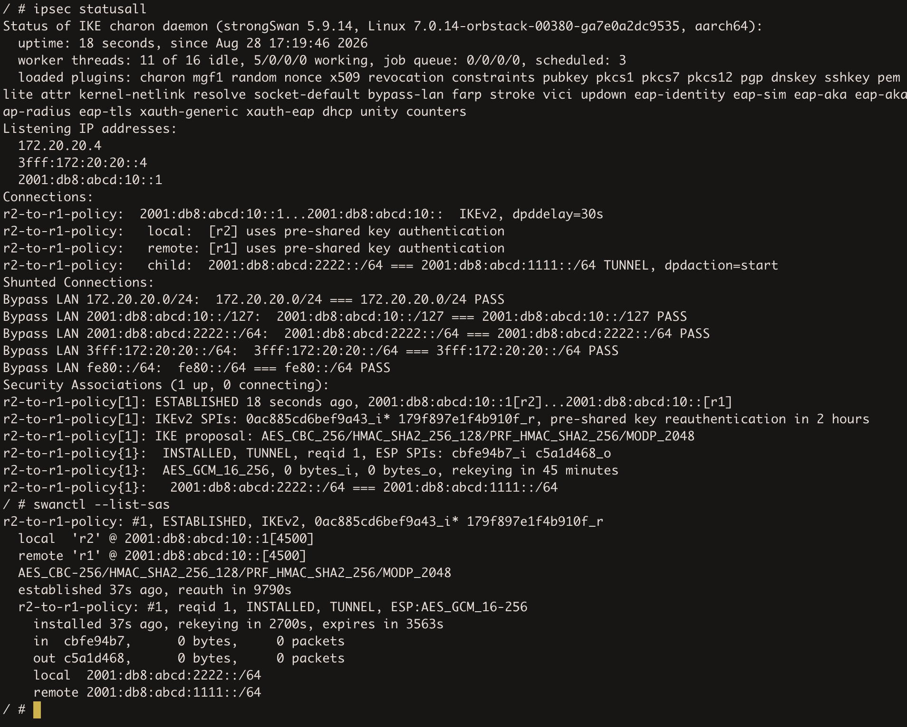
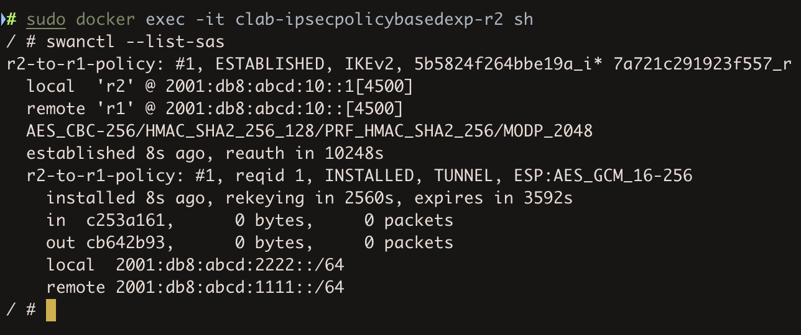
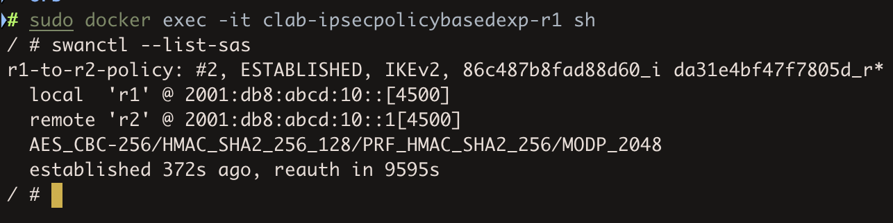
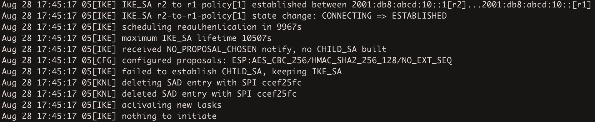
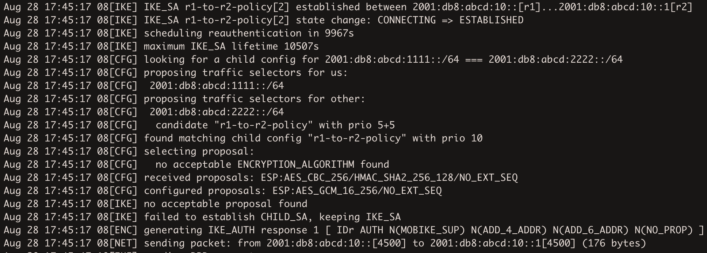
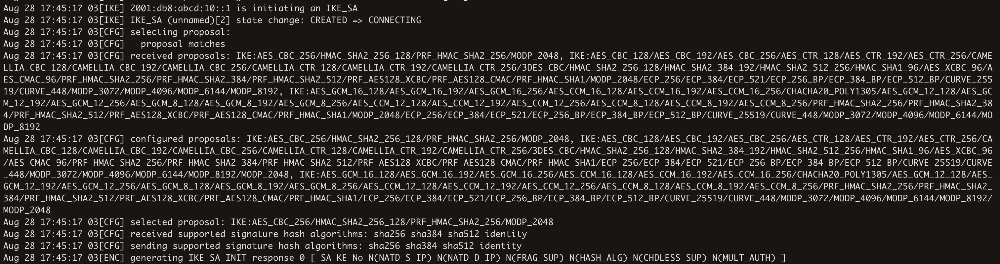

# Some experimenting with IPSec IKEv2 and its behaviour 

IPSec is honestly so damn complex and it's hard for me to get a grasp on IKEv2 now. I mean as of now I somewhat get how does IKE_SA_INIT and IKE_AUTH work a bit, but there are so many specific details, and also the MTU can change depending on the cipher and other stuff. 
In wireguard it's 60 or 80 bytes depending on the usage of IPv4 or IPv6 and that is it.  

As I said [here](../29-ipsec-PoC-bird/), it is not possible to use route-based encryption with xfrm interfaces in Alpine Linux containers in Docker in Orbstack on Apple Silicon, because the Orbstack's kernel does lack the necessary `xfrm_interface` module.   
BUT policy-based does work, and basically a lot of stuff with IKE and its behaviour can be learned there, as IPSec generally works, just not with the VTI way.   

`topology.clab.yml` is fairly simple, as always:   
```
name: ipsecpolicybasedexp
topology:
  nodes:
    r1:
      kind: linux
      image: bird1:local
      sysctls:
        net.ipv4.ip_forward: 1
        net.ipv6.conf.all.forwarding: 1
        net.ipv6.conf.all.disable_ipv6: 0
      binds:
        - r1.ipsec.conf:/etc/ipsec.conf
        - strongswan.conf:/etc/strongswan.conf
        #- clab-ipsecpolicybasedexp/authorized_keys:/root/.ssh/authorized_keys:ro
        - ipsec.secrets:/etc/ipsec.secrets
      exec:
        - ip addr add 2001:db8:abcd:10::/127 dev eth1
        - ip addr add 2001:db8:abcd:1111::1/64 dev lo
        - ipsec restart
        - /usr/sbin/sshd
    r2:
      kind: linux
      image: bird1:local
      sysctls:
        net.ipv4.ip_forward: 1
        net.ipv6.conf.all.forwarding: 1
        net.ipv6.conf.all.disable_ipv6: 0
      binds:
        - r2.ipsec.conf:/etc/ipsec.conf
        - strongswan.conf:/etc/strongswan.conf
        #- clab-ipsecpolicybasedexp/authorized_keys:/root/authorized_keys:ro
        - ipsec.secrets:/etc/ipsec.secrets
      exec:
        - ip addr add 2001:db8:abcd:10::1/127 dev eth1
        - ip addr add 2001:db8:abcd:2222::1/64 dev lo
        - ipsec restart
        - /usr/sbin/sshd
  links:
    - endpoints: ["r1:eth1","r2:eth1"]
```
The thing with `clab-ipsecpolicybasedexp/authorized_keys:/root/.ssh/authorized_keys:ro` breaks after `clab destroy --cleanup` so i commented it for now.   
I mount three files for each node.    
`r*.ipsec.conf` is the core ipsec config file. `strongswan.conf` contains this:   
```
charon {
    filelog {
        charon {
            path = /var/log/charon.log
            time_format = %b %e %T
            ike = 2
            knl = 2
            cfg = 2
            default = 1
            append = yes
            flush_line = yes
        }
        stderr {
            ike = 1
            knl = 1
        }
    }
}

include /etc/strongswan.d/*.conf
```
So it can be the same for both nodes as it contains info for charon where to log stuff.
Cause I wanted to just check journalctl but forgot that on Alpine there is no systemd, so logging should be done to a file.   
And `ipsec.secrets` contains a super secret PSK:   

```
@r1 @r2 : PSK "somesecretkeyidk"
```

### ipsec.conf

On r1 I wrote this:
```
config setup
    charondebug="ike 2, knl 2, cfg 2"
    uniqueids=no

conn r1-to-r2-policy
    keyexchange=ikev2
    authby=secret
    left=2001:db8:abcd:10::
    leftid=@r1
    leftsubnet=2001:db8:abcd:1111::/64
    right=%any
    rightid=@r2
    rightsubnet=2001:db8:abcd:2222::/64
    ike=aes256-sha256-modp2048
    esp=aes256-sha256
    auto=add
```
I mean kind of wrote, kind of copy-pasted, but i gotta start somewhere.   

`keyexchange=ikev2` means that it will use IKEv2. `authby=secret` means that it will authenticate by a Pre-Shared Key.
`left` is this router's side of the link. I wanted those routers to use `2001:db8:abcd:10::/127` for the point-to-point link. So r1 has `2001:db8:abcd:10::` on `eth1` and you can see that in `topology.clab.yml` in `exec` section.   
`leftid` is just a name that I want to use for r1. Also it is referenced in `ipsec.secrets`.  
`leftsubnet` is the subnet from which the originating traffic is supposed to be encrypted if it is going to `rightsubnet`.   
`right=%any` is used so that the r2 can be behind NAT, so r1 will accept r2's initiation from whatever IP.   

r2's config is similar to r1 but right and left are reversed:
```
config setup
    charondebug="ike 2, knl 2, cfg 2"
    uniqueids=no

conn r2-to-r1-policy
    keyexchange=ikev2
    authby=secret
    left=2001:db8:abcd:10::1
    leftid=@r2
    leftsubnet=2001:db8:abcd:2222::/64
    right=2001:db8:abcd:10::
    rightid=@r1
    rightsubnet=2001:db8:abcd:1111::/64
    ike=aes256-sha256-modp2048
    esp=aes256-sha256
    auto=start
    dpdaction=restart
    closeaction=restart
```

So a bit of explaining now.    
`ike=` specifies the cryptography used for the Internet Key Exchange protocol, so the control plane, whereas `esp=` specifies the cryptography for the data channel, which is handled by Encapsulating Security Payload protocol.  
`aes256-sha256-modp2048` states that AES 256-bit encryption should be used, sha256 is the algorithm for checksums to ensure integrity, and `modp2048` is the Diffie-Hellman key exchange.   
For the IKE Security Association channel, DH algorithm is necessary, but for Child SA, DH KEX algorithm is only necessary if we want to enable Perfect Forward Secrecy.    


As you can see, on r2's side there is `auto=start` but not on r1's side. That because if `right` on r1 is defined as `%any` then r1 does not know where to send the initiation.
R1 can only respond so `auto` is set to `add` on r1.   

IKE SA and Child SA Proposals do not allow even a partial mismatch. Out of all the accepted parts from each sides of the tunnel, there must be one that both sides can fully agree on.
If there is something that both sides can't seem to agree on, for example on the ENCR in IKE Proposal, then the initiating side gets a `NO_PROPOSAL_CHOOSEN`.
However the difference between IPSec and Wireguard is that IPSec has two completely different channels, and those channels are authenticated separately.
Basically IKE can go through, but ESP can fail.   
So I wanted to check that in practice.  

On r1 I set `esp=aes256gcm16` instead of `esp=aes256-sha256`, so I deliberately caused a mismatch of the INTEG field. I mean `aes256gcm16` makes it so there is no INTEG field, or it is set to NULL. Cause there is a difference between AEAD, which is Authenticated Encryption with Associated Data and CBC+HMAC here.
`aes256-sha256` means that AES-256-CBC is used for encryption and SHA256 used to compute the checksum. `aes256gcm16` means that AES 256 in Galois-Counter Mode is used with built-in integrity check, cause AES GCM and ChaCha20 both do include integrity in the cipher itself. `16` is the length of the ICV tag in bytes, so 128 bits.   

Then I deployed the lab   

   

And basically the tunnel came up so I got kind of confused.
The reason for that is actually described in the ipsec man page. Cmd+f and `esp` showed me the section where `esp` behaviour is mentioned. It basically goes like this:
```
esp = <cipher suites>
    [...]
    Defaults to aes128-sha256. The daemon adds its extensive default proposal to this default or the configured value. To restrict it to the configured proposal an exclamation mark (!) can be added at the end.

    Note: As a responder, the daemon defaults to selecting the first configured proposal that's also supported by the peer. This may be changed via strongswan.conf(5) to selecting the first acceptable proposal sent by the peer instead. In order to restrict a responder to only accept specific cipher suites, the strict flag (!, exclamation mark) can be used, e.g: aes256-sha512-modp4096!
```
So this explains everything. Even though i caused an intended mismatch of the INTEG field in Child SA, the daemon added the default cipher suites, so one of them had to be acceptable via both sides.   

In the same man pages, in `ike` section, there is the same thing:
```
ike = <cipher suites>
    [...]
    Defaults to aes128-sha256-modp3072. The daemon adds its extensive default proposal to this default or the configured value. To restrict it to the configured proposal an exclamation mark (!) can be added at the end.

    Note: As a responder the daemon accepts the first supported proposal received from the peer. In order to restrict a responder to only accept specific cipher suites, the strict flag (!, exclamation mark) can be used, e.g: aes256-sha512-modp4096!
```

I even checked the Security Associations for IKE and ESP:    
   
So it looks like it used the intended AES-256-CBC with HMAC SHA256 and modp2048 DH group.   
And for the ESP it agreed on AES 256 GCM with 16-byte ICV tag, which is what r1 intended.
So i assume r1 had some kind of priority here, as it wanted `aes256gcm16`, but even though r2 wanted `aes256-sha256`, they agreed on `aes256gcm16`.
Or `aes256gcm16` was just earlier in some kind of a list.   

After adding the exclamation mark on both sides and re-deploying, the ESP channel would not establish, but the IKE channel did:   

   

As you can see, there is a selected cipher for IKE but there is no ESP channel visible.   
I checked charon.log on both sides and found the exact point where ESP establishment fails on r1:   

   

and on r2:   

   

This line on r2 is crucial `received proposals: ESP:AES_CBC_256/HMAC_SHAZ_256_128/NO_EXT_SEQ`.
I saw that with the IKE proposal, there was no `NO_EXT_SEQ` on the end, and instead there was a long list of different ciphers:   

   

So this confirms that ipsec in this specific implementation by default does not really care about the mismatch of `esp=` and `ike=` lines between the endpoints, as it does send all default ENCR and INTEG fields anyway.   
But I couldn't find the exclamation mark in strongswan documentation. Since the ipsec.conf file that I used is the old config, but StrongSwan does now focus on the new config file which is swanctl.conf.   

But there is a section "Default Proposals" in StrongSwan's documentation:
```
If no explicit proposals are configured with the proposals or ah|esp_proposals settings in swanctl.conf, default proposals are used. These proposals can also be added after custom proposals via the default keyword.
```
So it seems like in the new `swanctl.conf` file, the `proposals` and `esp_proposals` sections behave in the opposite ways. 
In `ipsec.conf` the proposals do include default ones but in `swanctl.conf` they do not.   

