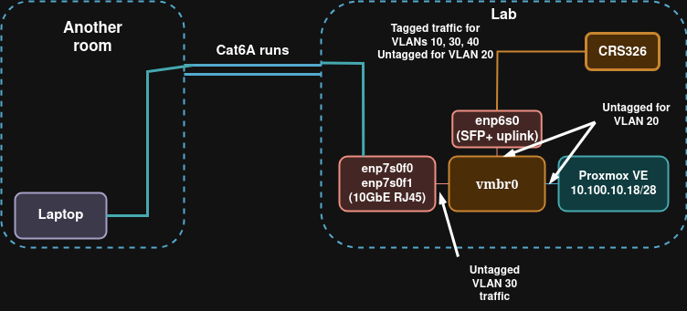
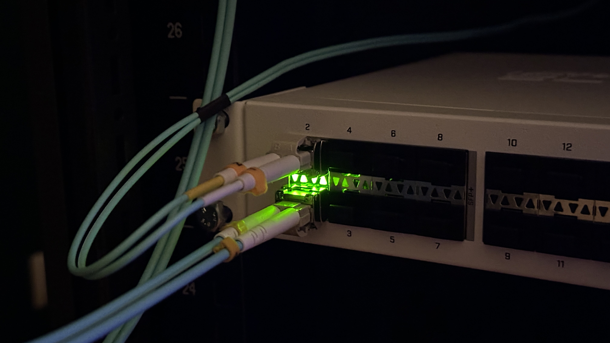
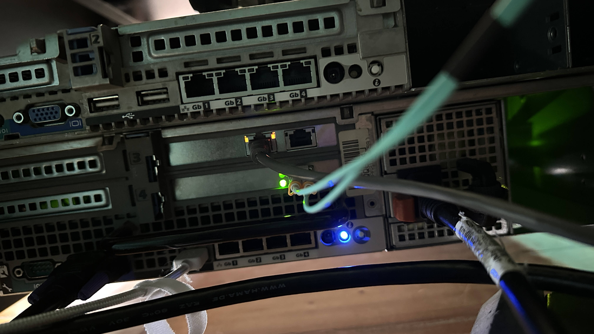

# Project: Repurposing a NIC for Cost-Effective VLAN Access Ports on Proxmox VE  


## Topology



## 1. Objective

The primary objective was to establish 10GbE network connectivity in an adjacent room by utilizing two pre-installed Cat6A ethernet runs. My first consideration was to use SFP+ 10G-RJ45 transceivers in the core Mikrotik CRS326, but this was economically impractical for just my environment.

The alternative I thought about was to repurpose a spare dual-port 10GbE RJ45 NIC and install it in the main Proxmox VE host. The technical goal was to configure these physical ports (`enp7s0f0`, `enp7s0f1`) to function as L2 access ports, automatically tagging all untagged ingress traffic into **VLAN 30**. This project demonstrates the use of the hosts underlying Linux networking stack to perform advanced layer 2 functions without depending on Proxmox-specific features.

## 2. System Environment

-   **Hypervisor Host:** Dell PowerEdge R710 running Proxmox VE
-   **Uplink NIC:** `enp6s0` (10GbE SFP+)
-   **Access NIC:** `enp7s0f0`, `enp7s0f1` (Dual-port 10GbE RJ45)
-   **Core L2/L3 Switch:** Mikrotik CRS326-24S+2Q+ (RouterOS v7.19.3)
-   **Core L3 Router/DHCP Server:** Mikrotik CCR2004-1G-12S+2XS

#### Below you can see physical connections.

`enp6s0` ( SFP+ 10G uplink ) is plugged into `sfp-sfpplus2`, which functions also as hybrid port ( PVID 20 ).  
`sfp-sfpplus1` is the trunk port to core router.   
   

The cyan cable is the fiber connection from `enp6s0` to `sfp-sfpplus2` on the core switch.   
The grey ethernet cable is the one providing VLAN 30 access from `enp7s0f1`.   
   

The grey ethernet cable from the image above, is connected to the ethernet socket, to provide Access to the network in another room. Ethernet runs are made with high-quality Cat6A Cu cable.  

## 3. Configuration & Troubleshooting Iterations

I achieved the final solution through a very long process of implementation and debugging, since I wasn't really that familiar with the Linux networking functions neccessary for this.

### 3.1. Dual-Bridge Architecture

-   **Concept:** Create two separate Linux bridges. `vmbr1` for the access ports and a virtual `vlan30` interface to tag traffic, with `vmbr0` for the uplink.
-   **Result:** Failure.
-   **Technical Analysis:** `tcpdump` analysis showed DHCP requests arriving on the ingress port but never appearing on the egress port. This configuration created two isolated L2 domains. The attempt to link them by adding the `vlan30` virtual interface as a port to `vmbr0` is not a valid method for forwarding traffic between bridges in the Linux networking stack.

### 3.2. Single-Bridge with High-Level Directives

-   **Concept:** Consolidate all physical ports into a single, VLAN-aware bridge (`vmbr0`) and attempt to use high-level directives like `bridge-pvid` directly in `/etc/network/interfaces`.
-   **Result:** Failure.
-   **Technical Analysis:** This approach failed because the version of `ifupdown2` used by Debian/Proxmox did not support the necessary advanced syntax for defining per-port PVIDs and tagged memberships directly as high-level directives. That configuration was either ignored or incorrectly applied


## 4. Final Working Configuration & Analysis

In the final working version I used `post-up` commands to use the Linux built-it network bridge functions.

### 4.1. Final `/etc/network/interfaces`

```ini
auto lo
iface lo inet loopback


iface eno1 inet manual
iface eno2 inet manual
iface eno3 inet manual
iface eno4 inet manual
iface enp6s0 inet manual # 10G SFP+ uplink to CRS326
iface enp7s0f0 inet manual # 10G VLAN 30 access
iface enp7s0f1 inet manual # 10G VLAN 30 access


auto vmbr0
iface vmbr0 inet static
        address 10.100.10.18/28
        gateway 10.100.10.17
        bridge-ports enp6s0 enp7s0f0 enp7s0f1
        bridge-stp off
        bridge-fd 0
        bridge-vlan-aware yes

        # this here enables strict VLAN filtering on the bridge.
        post-up ip link set dev vmbr0 type bridge vlan_filtering 1

        
        post-up bridge vlan del dev enp6s0 vid 1
        post-up bridge vlan del dev enp7s0f0 vid 1
        post-up bridge vlan del dev enp7s0f1 vid 1
        post-up bridge vlan del dev vmbr0 vid 1 self
        
        # configuring the SFP+ port as uplink & trunk
        post-up bridge vlan add dev enp6s0 vid 20 pvid untagged
        post-up bridge vlan add dev enp6s0 vid 30 tagged
        post-up bridge vlan add dev enp6s0 vid 40 tagged
        
        # configuring the RJ45 10GbE ports as VLAN 30 access
        post-up bridge vlan add dev enp7s0f0 vid 30 pvid untagged
        post-up bridge vlan add dev enp7s0f1 vid 30 pvid untagged
        
        # explicitly assigning the bridge own interface to VLAN 20
        post-up bridge vlan add dev vmbr0 vid 20 pvid untagged self

source /etc/network/interfaces.d/*
```

## 5. Key technologies

- **Linux Bridge as a Managed Switch:** A standard Linux bridge, when `vlan_filtering` is enabled via ip link it becomes a fully-featured, programmatically configurable 802.1Q switch operating at the kernel level.

- **Necessity of Direct Kernel Commands:** The use of `post-up` scripts with `ip` and `bridge` commands is not a matter of preference but a technical necessity in this environment. The standard high-level directives available in the interfaces file format on Debian/Proxmox are insufficient for defining the required per-port PVID and tagged/untagged VLAN memberships. Therefore, direct manipulation of the kernel's bridge forwarding database is the only viable method to achieve this configuration.

- **The self Interface:** In a VLAN-filtered bridge, the bridge's own management interface (it's referenced by the "self" keyword) is a distinct logical entity. Its VLAN membership must be explicitly configured to maintain connectivity to the host itself. Failure to do so results in all host traffic being dropped by the bridge's own filtering rules.

- **Systematic Debugging:** The use of `tcpdump` on ingress and egress interfaces was the essential diagnostic tool that allowed for precise localization of the packet loss at each stage of the troubleshooting process.

## 6. Considerations when using a software switch

Of course the first idea with two SFP+ 10GbE transreceivers would be far more efficent. It would utilize the powerful ASIC of the CRS326. However, for intended only two end devices, a software switch won't be a problem.
